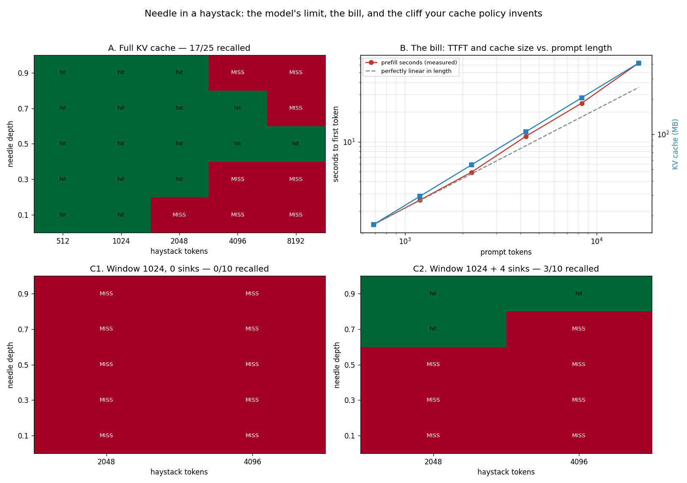

# Needle-in-a-Haystack

---

> A model with a 1M-token window is only useful up to the length where it can still find the needle. This project hides one fact among seven look-alikes in prompts of 512 to 8,192 tokens and asks for it back. Recall falls **100% → 100% → 80% → 40% → 20%** as the prompt grows — no error, no warning, just a quiet slide. Meanwhile the bill climbs the other way: [prefill](/shared/glossary/#prefill) slows from **469 to 266 tokens/second** and the [KV cache](/shared/glossary/#kv-cache) grows from **16.9 MB to 407 MB**. Then the part that belongs to *this* guide rather than to the model: switching the serving engine to a bounded cache invents a much sharper cliff of its own. A 1,024-token [sliding window](/shared/glossary/#sliding-window-attention) with no [attention sinks](/shared/glossary/#attention-sink) scores **0 out of 10** and the model stops making sense at all ("The secret of the secret of the secret…"); add just **four** pinned tokens and fluency returns — and recall becomes exactly "did the needle happen to fall inside the window?", **3 of 3 in-window cells right, 0 of 7 out-of-window**.

---

## Key Insight

This project hides a single fact (the "needle") at different positions inside an ever-longer prompt (the "haystack") and asks the model to recall it, pushing the [context window](/shared/glossary/#context-window) up toward your engine's limit. Plotting recall against length reveals a *cliff* — a point where accuracy drops even though the engine still accepts the input. See [needle-in-a-haystack](/shared/glossary/#needle-in-a-haystack).

## Why This Matters

A serving engine will happily accept a 200k-token prompt and build a giant [KV cache](/shared/glossary/#kv-cache) for it — but if the model stops actually *using* the far-away tokens, you are paying for memory and compute that buy you nothing. Knowing the real usable length lets you set honest limits instead of advertising a number the model cannot deliver.

---

**This is project 51.**

### The words first

- **Needle** — one short sentence carrying a fact nothing else in the prompt could supply. Here: `The secret Zurich access code is 6433012.`
- **Haystack** — the filler the needle is buried in. Real English (Wikipedia text), not random tokens, because a model reading noise has nothing to be *distracted by*, and distraction is what we are measuring.
- **Depth** — where the needle sits, as a fraction. 0.1 means one tenth of the way in; 0.9 means near the end.
- **Distractor** — a sentence with the same shape and a different city (`The secret Lisbon access code is 9990608.`). Seven of them are spread through every prompt. Without distractors the model can win by reporting the only 7-digit number it saw, which measures nothing.
- **Recall** — did the requested code appear in the answer? A yes/no per cell.
- **[Attention sink](/shared/glossary/#attention-sink)** — the first few tokens of a sequence, which transformers lean on heavily regardless of what they say. Section C is a demonstration of why.

### "Doesn't the model already refuse prompts that are too long? Why test lengths the engine accepts?"

This is the question the whole project exists to answer, so it is worth being blunt.

An engine enforces **one** limit: the number in the config file (32,768 for this model). Cross it and you get an error. Stay under it and the request is served — with no signal of any kind about whether the model *used* what you sent.

There is no second check, because there is nothing to check against. "Can this model still find a fact at 8,000 tokens?" is not a property stored anywhere; it is an empirical fact about the weights, and the only way to learn it is to run the test. That is why the advertised context length and the *usable* context length are different numbers, and why every serving team ends up measuring their own.

### "If a bigger cache is always better, why would anyone bound it?"

Because a full cache is *linear in the prompt length, per request, forever*. Section B measures 407 MB of cache for a single 16k-token prompt on a half-billion-parameter model. Ten concurrent users at that length would be 4 GB of cache, on a model whose weights are 2 GB. On a 70B model, a 128k-token conversation's cache runs to tens of gigabytes.

So real engines offer a bounded-cache mode: keep the last *W* tokens plus a few pinned ones, throw the rest away, and the cache stops growing no matter how long the conversation runs. Section C is what that buys and what it costs.

---

## Running it

```bash
python3 run.py           # ~9 minutes
python3 run.py --plot    # redraw the figure from outputs/findings.json
```

`ctxlib.py` lives here and is shared with [project 52](../52-prefix-kv-caching/README.md) and [project 57](../57-stateful-session-api/README.md).

> **Why not the hand-written model from [project 09](../09-kv-cache-from-scratch/README.md)?** Phases 2–7 ran on `09/kvlib.py`, whose attention builds the whole `(heads, T, T)` score matrix so that the [KV cache](/shared/glossary/#kv-cache) could be swapped out. At T = 8,192 that matrix is 2 GB **per layer**. Phase 8 needs long prompts more than it needs a pluggable cache, so the projects that only need a fast forward pass use HuggingFace's model with PyTorch's fused `scaled_dot_product_attention`, which never materialises the matrix at all. Nothing about the measurement changes; the arithmetic is identical either way.

> **About the numbers.** Everything below comes from the committed [`outputs/findings.json`](outputs/findings.json), produced by one run of `run.py` on a 12-core CPU with Qwen2.5-0.5B-Instruct in float32.



---

## A. Where the model actually stops working

Five lengths × five depths, full cache, one needle and seven distractors in every prompt.

| haystack tokens | prompt tokens | needles found | recall |
|---|---|---|---|
| 512 | 686 | 5 / 5 | **100%** |
| 1,024 | 1,197 | 5 / 5 | **100%** |
| 2,048 | 2,221 | 4 / 5 | 80% |
| 4,096 | 4,270 | 2 / 5 | 40% |
| 8,192 | 8,364 | 1 / 5 | **20%** |

**The engine accepted all 25 prompts and returned a confident answer to every one.** Not a single request failed, timed out, or warned. The failures look like this:

| | asked for | answered |
|---|---|---|
| 8,192 tokens, depth 0.1 | `6433012` | `7624039` |
| 8,192 tokens, depth 0.7 | `6433012` | `7135241` |

Both answers are *other cities' codes* — real numbers, correctly formatted, lifted from a distractor. **This is the failure mode that makes long-context serving dangerous:** the model does not say "I could not find it", it says something that looks exactly like an answer. Nothing downstream — no JSON validator, no schema, no retry policy — can tell the difference.

**There is no single cliff edge; there is a slope.** Recall is perfect to 1,024 tokens, still good at 2,048, and by 8,192 the model is guessing. If you had to name one number as this model's usable context, 1,024–2,048 tokens is defensible and 32,768 is not — a **16× to 32× gap** between the advertised limit and the working one.

**Depth matters, and not in a simple way.** The one cell that survived at 8,192 tokens was depth 0.5 — the middle. That runs against "lost in the middle", the widely reported finding that facts buried in the centre of a long prompt are recalled *worst*. With one trial per cell, a single grid like this cannot separate a real depth effect from luck, and this run's grid does not show one cleanly. What it does show unambiguously is the length effect, which is monotone and large. Reporting the depth result honestly means saying: **five cells per length is enough to see the slope and not enough to rank the depths.**

## B. What that length costs, whether or not it works

The same prompts, timed. Prefill is the [time to first token](/shared/glossary/#ttft) — the user is staring at a blank screen for all of it.

| prompt tokens | prefill | tokens/second | KV cache |
|---|---|---|---|
| 686 | 1.46 s | 469 | 16.9 MB |
| 1,197 | 2.58 s | 464 | 29.4 MB |
| 2,221 | 4.92 s | 451 | 54.6 MB |
| 4,270 | 11.35 s | 376 | 104.9 MB |
| 8,364 | 24.53 s | 341 | 205.6 MB |
| 16,558 | 62.20 s | **266** | **406.9 MB** |

**Prefill is not linear in the prompt length, and the gap widens as you go.** If it were linear, 16,558 tokens would cost 24× the 686-token prompt: 35 seconds. It cost 62 — **1.8× worse than linear**. The per-token rate falling from 469 to 266 is the same fact stated the other way.

The reason is the shape of [attention](/shared/glossary/#attention). Every token must compare itself against every earlier token, so the attention work grows with `T²` while everything else in the model (the MLP blocks, the projections) grows with `T`. At short lengths the `T`-shaped work dominates and prefill looks linear; the `T²` term is quietly doubling every time you double the prompt, and eventually it takes over. For this model the crossover is around 9,000 tokens — you can see it as the bend between the 2,221 and 8,364 rows.

**The KV cache is exactly linear**, and it is easy arithmetic to do in your head:

```
KV bytes per token = 2 (K and V) x layers x kv-heads x head width x bytes
                   = 2 x 24 x 2 x 64 x 4 (float32)
                   = 24,576 bytes  =  24 KB per token
```

24 KB per token, on a **0.5B** model. A 16k prompt is 407 MB of cache — one fifth of the model's own weights, for one request. Section A says the model stopped being reliable around 2,000 tokens; section B says tokens 2,000 through 16,000 still cost you 350 MB of memory and 57 seconds of latency. **You are paying full price for context the model is not using**, and that combination — rising cost, falling recall — is the real argument for measuring your own limit.

## C. The cliff your own cache policy invents

Same grid, but the engine now serves each prompt with a **bounded** cache: a query may attend only to the most recent 1,024 tokens, plus optionally the first few tokens of the prompt, which are pinned permanently. This is the [sliding-window](/shared/glossary/#sliding-window-attention) + [attention-sink](/shared/glossary/#attention-sink) scheme ("StreamingLLM"), and it is what lets a cache stop growing.

> **How it is implemented here.** The window is applied as an attention *mask*, not by really deleting tensors. That reproduces exactly what the model can see while letting the whole prompt go through in one prefill pass. The memory saving is therefore *arithmetic* — a 1,024-token window plus 4 sinks is 1,028 × 24 KB = **25 MB regardless of prompt length**, against 407 MB at 16k — and is labelled as such rather than presented as a timing.

**Arm C1 — window 1,024, zero sinks:**

| | result |
|---|---|
| needles found | **0 / 10** |
| typical output | `The secret of the secret of the secret…` |

**The model did not just lose the needle; it stopped producing language.** Every cell, including the ones where the needle was comfortably inside the window, returned degenerate repetition. Recall was not degraded — it was irrelevant, because the model was broken.

**Arm C2 — window 1,024, four sinks:**

| | result |
|---|---|
| needles found | **3 / 10** |
| in-window cells | **3 / 3 correct** |
| out-of-window cells | **0 / 7 correct** |
| typical output | a real 7-digit code |

**Four tokens.** That is the entire difference between an engine that emits gibberish and one that behaves normally — 4 × 24 KB = 96 KB of pinned cache.

### Why four tokens matter that much

Softmax has to distribute exactly 1.0 of attention across whatever keys it can see; it cannot abstain. When a head has nothing it genuinely wants to look at — which is most heads on most tokens — it needs somewhere harmless to dump that mass. Transformers spontaneously learn to dump it on the first few tokens of the sequence, which is why those tokens are called **attention sinks**: they are the drain.

Evict them and every head's spare attention has to land on whatever the window happens to contain — ordinary content tokens, now receiving enormous unearned weight. The result is the babble in C1. Pin them and the drain is back, and the model is itself again.

**The 3/3 versus 0/7 split is the cleanest result in this project.** With sinks restored, recall becomes a purely mechanical question: *is the needle inside the last 1,024 tokens?* If yes, always found. If no, never found — and the model confidently reports a distractor's code instead.

| arm | needle inside window | recall |
|---|---|---|
| window + 4 sinks | yes (3 cells) | **100%** |
| window + 4 sinks | no (7 cells) | **0%** |

This is worth stating plainly, because it inverts where you would look for the problem: **the cliff in section A belongs to the model; the cliff in section C belongs to the config file.** A sliding window is a serving decision made by an engineer, and it can turn a model that recalls a fact at 8,000 tokens into one that cannot recall it at 1,100. If your product advertises a 32k context and your engine runs a 4k window, the advertised number is describing your config, not your model.

---

## What to take from this

1. **Recall slid from 100% to 20% between 512 and 8,192 tokens** while every request succeeded. Long-context failure is silent and it looks like an answer.
2. **The wrong answers were distractors' codes**, not refusals — so nothing downstream can catch them.
3. **Usable context here is roughly 1–2k tokens against an advertised 32k**: a 16–32× gap. Measure your own; it is not in any config file.
4. **Prefill grows faster than linearly.** 24× the tokens cost 42× the time (1.8× worse than linear), because attention is `O(T²)` and eventually outweighs everything else.
5. **24 KB of KV per token, even on a 0.5B model.** 407 MB for one 16k prompt.
6. **A sliding window with no attention sinks destroys the model** — 0/10 and degenerate output, not merely worse recall.
7. **Four pinned tokens restore it completely**, and turn recall into a mechanical in-window / out-of-window test: 3/3 versus 0/7.
8. **The sharpest cliff in this project was invented by the serving config**, not by the model.

### Common traps this project walks into on purpose

- **Testing with no distractors.** The first version did, and the model scored 100% everywhere up to 8,192 tokens — the task was "report the only long number you saw", which measures nothing. Seven look-alikes make it retrieval.
- **Reading a 5-cell row as a depth ranking.** One trial per cell is enough for the length trend and not enough to rank depths; the README says so rather than telling a "lost in the middle" story the data does not support.
- **Reporting recall without the bill.** Section A alone suggests "just cap the context at 2k". Section B is what makes that a *cost* decision rather than a quality one.
- **Blaming the model for the window's cliff.** C1's babble looks like a broken model. It is a broken cache policy, and four tokens fix it.
- **Calling the mask-based window a memory measurement.** It reproduces what the model sees; the megabytes are arithmetic, and are labelled that way.

---

## Next

[Project 52 — prefix KV caching](../52-prefix-kv-caching/README.md) takes the other road out of the cost problem this project measured. Instead of shrinking the cache, it *reuses* it: compute a retrieved document's keys and values once and hand them to every later query that reads the same document — and finds out exactly why the technique is called a **prefix** cache and not a document cache.
