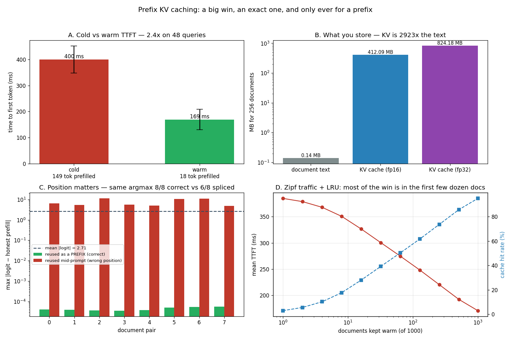

# Prefix KV Caching

---

> Compute a document's attention once, reuse it forever. 256 documents pre-encoded, then queried: [TTFT](/shared/glossary/#ttft) drops from **391 ms to 160 ms — 2.45x** — because the cached path prefills 18 tokens instead of 149. And it is *exact*: over 48 queries the cold and warm paths chose the same next token **48/48**, with a maximum [logit](/shared/glossary/#logits) difference of **4.1 × 10⁻⁵**. A prefix cache is one of the very few optimisations in this guide that costs nothing in quality. What it costs is memory: 141 kB of document text became **412 MB** of [KV cache](/shared/glossary/#kv-cache) — **2,923x** — so the 1,000-document catalogue the guide asks about is **3.2 GB** in float32. Then the result that names the technique: reuse a document's cache anywhere except at the very front of the prompt and the logits move by **7.55 on average against a mean magnitude of 2.7**. The first token still survives 6 times in 8. The *sentence* survives only 3 times in 8 — and the five that broke came out as confident, fluent, wrong English.

---

## Key Insight

This project pre-computes a [KV cache](/shared/glossary/#kv-cache) for each of 1000 retrieved documents — *one separate cache per document*, not a single combined cache for all 1000 — and stores them all ahead of time, then measures the [time to first token](/shared/glossary/#ttft) when a query hits a *cold* document (its cache must still be built) versus a *warm* one (its cache already exists). Because each document is cached on its own, any document can be reused independently, in any combination, by later queries. It is the serving-side core of a [RAG](/shared/glossary/#rag) system — see [prefix cache](/shared/glossary/#prefix-cache).

## Why This Matters

In retrieval-augmented serving the same documents are read over and over by different users, and re-running [prefill](/shared/glossary/#prefill) on each one is pure wasted work. Caching the document's keys and values turns a slow first token into a near-instant one, which is often the single biggest latency win available to a RAG product.

---

**This is project 52.**

### The words first

- **[Prefill](/shared/glossary/#prefill)** — the first forward pass, over the whole prompt at once. It produces the first output token and fills the [KV cache](/shared/glossary/#kv-cache). It is all of your [TTFT](/shared/glossary/#ttft).
- **[KV cache](/shared/glossary/#kv-cache)** — the keys and values every past token contributes to [attention](/shared/glossary/#attention). Computing them is prefill's whole job; storing them is what lets decoding skip re-reading the prompt.
- **Cold / warm** — cold means the document's cache does not exist yet and must be built. Warm means it is already sitting in memory.
- **Prefix** — the *beginning* of the prompt. Section C is about why that word is doing load-bearing work.
- **[Zipf's law](/shared/glossary/#zipfs-law)** — named after George Zipf, who noticed that the *r*-th most common English word is used about `1/r` as often as the most common one. The same 1/rank shape describes which documents a retrieval system actually fetches, so it is the standard stand-in for "a few pages answer most questions".
- **[LRU](/shared/glossary/#lru)** — least recently used: when the cache is full, throw out whatever has gone longest untouched.

### "Doesn't project 12 already do prefix caching? And project 49 already reuses a conversation's cache?"

Three different projects, three different things being reused, and the differences decide what you can key on and who pays for a miss.

| project | what is cached | who benefits | keyed by |
|---|---|---|---|
| [12](../12-prefix-share-benchmark/README.md) | one shared **system prompt** | every request in the app | a fixed-length hash |
| [49](../49-session-affinity-routing/README.md) | one user's **conversation history** | exactly one user | `session_id` |
| **52** | a **library** of retrieved documents | whichever query retrieves that document | document id |

Project 12's cache holds *one* prefix. This project holds 256, any one of which might be needed next — so the interesting questions are which ones to keep (section D) and whether they can be used in combination (section C). Project 49's cache serves one user and grows every turn; this one serves everybody and never changes, because a document does not edit itself.

### "The retrieval pipeline already stores the documents. Why store their keys and values too — isn't that the same information twice?"

It is the same information, and that is exactly the point: **one copy is cheap to store and expensive to use; the other is expensive to store and free to use.**

The text is what you search. It is 141 kB for 256 documents, it fits anywhere, and it is useless to the model until it has been pushed through every layer — which is the 391 ms in section B.

The KV cache is that push, already done. It is 412 MB for the same 256 documents (**2,923x** the text) and it cannot be searched, compared, or shown to a user. All it can do is be spliced into a forward pass and save you the 391 ms.

So they are not redundant, they are two ends of a **space-for-time trade**, and section D is where you decide how far along it to sit. The retrieval half of the pipeline — chunking, embedding, reranking — belongs to [LLM Phase 7](../../../llm/README.md#phase-7-retrieval-tools-and-agents). What this guide owns is the serving half: where the cache lives, how it is shared, and what it is worth.

---

## Running it

```bash
python3 run.py           # ~4 minutes
python3 run.py --plot    # redraw from outputs/findings.json
```

Needs [project 51](../51-needle-in-a-haystack/README.md)'s `ctxlib.py`.

> **About the numbers.** Everything below comes from the committed [`outputs/findings.json`](outputs/findings.json).



---

## The layout everything depends on

```
   [ chat header ][      document      ][ question + chat footer ]
   \___________________________________/ \______________________/
        131 tokens — cached once             18 tokens — per query
```

**The chat header has to be inside the cached part.** If the cache started at the document, the document's rows would have been computed at positions 0…127 while the real prompt puts them at 12…139 — and section C is a measurement of how badly that goes.

**The question has to be outside it.** Everything before the split point must be identical for every request that uses this cache. The question is not.

---

## A. Building the library

| | |
|---|---|
| documents | 256 |
| tokens per document (+ header) | 131 |
| total prefilled | 33,536 tokens |
| time to build all of it | **99.7 s** |
| stored (float16) | **412 MB** (1.61 MB per document) |
| document text | **141 kB** |
| **KV bytes per text byte** | **2,923x** |
| the guide's 1,000-document catalogue, float32 | **3.2 GB** |

**Read the 2,923x carefully, because it is the number that decides whether this technique is affordable.** A document is about 4.2 bytes of text per token; its cache is 24,576 bytes per token in float32, 12,288 in float16. Storing what the model *computed* about a page costs roughly three thousand times what storing the page costs — **and this is a 0.5B model**. On a 70B model with 80 layers the per-token figure is over 300 kB, and a single 1,000-page library runs to hundreds of gigabytes.

That is why real systems do not cache everything:

- **Cache the head of the distribution.** Section D measures where the curve pays.
- **[Quantize](/shared/glossary/#quantization) the stored cache.** float16 halves it for free here; [project 31](../31-fp8-kv-cache/README.md) measured fp8, and [project 13](../13-kv-quantization-study/README.md) measured how far down you can push before quality moves.
- **Push it down the memory hierarchy.** [Project 15](../15-cpu-nvme-offload/README.md) found that reloading a cache from disk beat recomputing it by **183x**, which makes "SSD-backed KV library" a real design and not a joke.

**And note what 99.7 seconds of build time means for the economics.** Every document is prefilled exactly once, ever. If a document is read a hundred times, you paid 0.39 s and saved 100 × 0.23 s. If it is read once, you paid 0.39 s to save 0.23 s and lost. **Prefix caching is a bet on reuse**, which is why section D is about the popularity distribution and not about the mechanism.

## B. Cold versus warm

48 queries, each on its own document, run both ways back to back.

| | tokens prefilled | TTFT (p50) |
|---|---|---|
| cold — no cache | 149 | **391.4 ms** |
| warm — document cached | 18 | **159.6 ms** |
| | | **2.45x** |

**2.45x, from prefilling 8.3x fewer tokens.** The two ratios do not match, and the gap is the honest part: a forward pass has a fixed cost — Python dispatch, kernel launches, reading 2 GB of weights out of memory — that 18 tokens pay in full just like 149 do. **The saving is bounded by how much of your prompt is the shared part**, and here the header plus document is 88% of it. In a real RAG prompt, where a retrieved document is far longer than the user's question, that fraction goes up and so does the win.

### It is exact, and that is rarer than it sounds

| | |
|---|---|
| queries where cold and warm picked the same next token | **48 / 48** |
| largest logit difference | **4.1 × 10⁻⁵** |
| mean logit magnitude | ~2.7 |

The residual 4.1 × 10⁻⁵ is floating-point non-associativity — adding the same numbers in a different order — not a different computation.

**This makes prefix caching unusual among the techniques in this guide.** [Quantization](/shared/glossary/#quantization) trades accuracy for memory. [Cache eviction](/shared/glossary/#attention-sink) trades recall for memory ([project 51](../51-needle-in-a-haystack/README.md) measured 0/10 when it goes wrong). Speculative decoding is exact only if you verify carefully ([project 24](../24-sampling-mode-rejection/README.md) found a plausible implementation that silently was not). Prefix caching is *arithmetically the same computation*, just not repeated — so it needs no quality gate, no A/B test, no eval suite. **The only way to make it wrong is to reuse a cache that does not belong where you put it**, which is section C.

## C. Why it is called a *prefix* cache

Doc B's cache is built with B sitting right after the header. Then it is spliced into a prompt whose real layout is `header + docA + docB + question` — so B's rows were computed at positions 12…139 but are being used at positions 140…267. Everything else is identical. 8 document pairs.

| | reused as a **prefix** (correct) | reused **mid-prompt** (wrong position) |
|---|---|---|
| max &#124;logit − honest prefill&#124; | **4.1 × 10⁻⁵** | **7.55** (mean over 8 pairs) |
| same first token as honest prefill | 8 / 8 | **6 / 8** |
| same 12-token continuation | 8 / 8 | **3 / 8** |

**The logits are wrecked: an error of 7.55 against a mean logit magnitude of 2.7 is nearly 3x the typical score.** Yet 6 times in 8 the top-1 token was still the same, and 3 times in 8 the entire sentence came out identical.

**That combination is the danger, and it is worth being explicit about why.** A bug that crashes gets fixed on the first run. A bug that produces *the same answer most of the time* passes your smoke test, passes code review, and ships. Here is one of the five that diverged:

| | |
|---|---|
| honest prefill | `The North Koreans advanced to Changnyong itself during the afternoon` |
| spliced cache | `The first five words of the second passage are: "There` |

Both are fluent, grammatical English. Neither is flagged by any validator. One is the model reading the document; the other is the model reading a document that has been shifted 128 positions out of place.

### What actually breaks

Position is baked into the keys. Qwen2 uses **rotary** position embeddings (RoPE) — "rotary" because each pair of dimensions of the query and key vectors is *rotated* by an angle proportional to the token's index. The dot product of two rotated vectors then depends on the *difference* of their positions, which is what relative-position attention wants.

The consequence for caching is direct: a cached key does not merely describe "what this token means", it describes "what this token means **at position 137**". Move the token to position 265 and every dot product it takes part in is off by a rotation of 128 positions. Nothing errors, because the shapes still match — the numbers are simply wrong.

**So the rule is not a convention, it is arithmetic: a cached block is valid only at the offset it was computed at.** Hence *prefix* cache. Only the front of the prompt is at a fixed, known offset, so only the front can be cached and dropped in unchanged.

### Three ways out, all real

1. **Cache only the prefix.** One document per request, always first. Simple, exact, and what this project measures.
2. **Cache per position.** Store doc B's cache for slot 1, slot 2, slot 3… Correct, and it multiplies an already-2,923x store by the number of slots.
3. **Re-apply the rotation.** Keys are rotated, so they can be *un*-rotated and re-rotated to a new offset — the trick behind CacheBlend and similar systems. Cheaper than a full prefill because it touches only the keys, not the MLPs, but it is not free and it is not exact: attention scores also depend on which tokens preceded each one, and a document that was encoded knowing nothing came before it did not attend to document A.

Option 3 is why production RAG engines usually settle for option 1 plus **block-level** matching, as [project 11](../11-tiny-paged-cache/README.md)'s paged cache does: hash fixed-size blocks of the prompt from the front, reuse the longest run that matches, prefill the rest. That reuses a shared prefix of *any* length without ever moving a block off the offset it was built at.

## D. What it is worth once traffic is realistic

Measured cold and warm costs from section B, applied to 20,000 requests drawn over a 1,000-document catalogue with Zipf(s=1) popularity and an [LRU](/shared/glossary/#lru) cache.

> This section is **arithmetic on measured costs**, not a timed run: the hit rate comes from simulating the request stream, the 391 ms and 160 ms come from section B.

| documents kept warm | hit rate | mean TTFT | float32 store |
|---|---|---|---|
| 1 | 2.9% | 385 ms | 0.003 GB |
| 8 | 17.6% | 351 ms | 0.026 GB |
| 32 | 39.2% | 301 ms | 0.10 GB |
| 64 | 50.3% | 275 ms | 0.21 GB |
| 128 | 61.7% | 248 ms | 0.41 GB |
| 256 | 73.8% | 220 ms | 0.82 GB |
| 512 | 85.9% | 192 ms | 1.65 GB |
| 1,000 (everything) | 95.1% | **171 ms** | **3.2 GB** |

**There is no knee in this curve, and that is the finding.** The intuition people bring to caching — "the top 20 documents will cover most of the traffic, cache those and go home" — is what a *steep* Zipf gives you. Zipf(s=1) is not steep. Caching 32 of 1,000 documents (3%) buys 39% of hits; you need **a quarter of the whole catalogue** to reach 74%.

The reason is in the shape of the law. Under Zipf(s=1) the *r*-th document is fetched about `1/r` as often as the first, so the traffic covered by the top *k* documents grows like `ln(k)` — a logarithm, which climbs forever and never flattens. **Every doubling of the cache buys roughly the same absolute number of hits**: 8→16 documents adds 10 points, 128→256 adds 12, 512→1000 adds 9. There is no point at which the next gigabyte stops being worth about as much as the last one.

**So the sizing decision is a budget decision, not a knee-finding exercise.** Mean TTFT moves 385 → 171 ms (2.25x) across the full range, and each of the eleven rows above is a defensible operating point. Which one you pick depends on what a gigabyte costs you and what 30 ms of TTFT is worth to your users — and on how skewed *your* traffic really is, which you should measure rather than assume, because the answer moves this entire table.

---

## What to take from this

1. **2.45x on TTFT** (391 → 160 ms) from prefilling 18 tokens instead of 149. The win is capped by how much of your prompt is the shared part.
2. **It is exact.** 48/48 identical next tokens, max drift 4.1 × 10⁻⁵. No quality gate needed — unusual for anything in this guide.
3. **KV costs 2,923x what the text costs**, on a 0.5B model. The 1,000-document catalogue is 3.2 GB in float32, 1.6 GB in float16.
4. **You pay a full prefill per document up front**, so the technique is a bet on reuse. One read and you lost.
5. **A cache is only valid at the offset it was built at**, because RoPE bakes position into the keys. That is what *prefix* means.
6. **A misplaced cache does not crash — it lies.** Logits off by 7.55 against a mean magnitude of 2.7, yet 6/8 kept the same first token and 3/8 the whole sentence. The failures are fluent English.
7. **Zipf(s=1) has no knee.** Every doubling of the cache buys about the same number of hits, because coverage grows like `ln(k)`. Size it against a budget, not against a curve.

### Common traps this project walks into on purpose

- **Leaving the chat header outside the cached block.** Then the document's rows are 12 positions out of place on every single request, and you get section C's failure permanently — but only sometimes visibly.
- **Storing the live cache object.** A `DynamicCache` is mutable; the next forward pass appends to it. Hand the same object to two queries and the first one corrupts the document for everyone. The tensors are copied out.
- **Checking correctness by eye.** 3 of the 8 spliced runs produced text identical to the honest one; a spot check would have passed.
- **Reporting a per-hit speed-up as the system's speed-up.** Every hit is 2.45x; the *fleet* is 1.10x at a 16-document cache. Section D exists to keep those apart.
- **Assuming a small cache captures a Zipf head.** It does under a steep exponent. Under s=1 it does not, and 3% of the catalogue bought 39% of the hits.

---

## Next

[Project 53 — JSON-mode reliability](../53-json-mode-reliability/README.md) switches from *what the model reads* to *what it is allowed to write*: build a regex → automaton → token-mask pipeline from scratch, run 800 generations with and without it, and find out which kinds of failure a grammar actually removes — and which it merely disguises.
