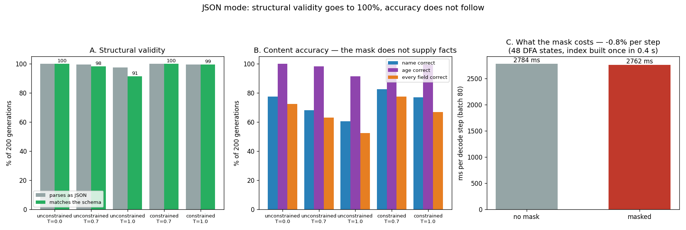

# JSON-Mode Reliability

---

> 800 generations of the same extraction task — 160 per arm, five arms, one model, the same prompts and the same seeds. The headline works: schema-conformance at temperature 1.0 goes from **91.2% to 99.4%**, and the whole [regex](/shared/glossary/#regular-expression)→[DFA](/shared/glossary/#finite-state-machine)→token-mask pipeline is 48 states built in **0.38 seconds**. Three results are more useful than the headline. **The mask costs nothing per step** — timed at **−0.8%**, i.e. below this box's noise floor. **Constrained decoding is not a 100% guarantee**: one of 160 generations at temperature 1.0 still failed the schema, by running out of token budget mid-object. And the accuracy column shows exactly what a grammar can and cannot buy: it recovers everything *sampling* was destroying (52.5% → 66.9% of records fully correct at T=1.0, **+14.4 points**), landing back at the greedy ceiling — and then stops. The name field tops out at **82.5%** in the best arm. **JSON mode does not make the model right; it stops formatting from hiding when it already was.**

---

## Key Insight

This project runs the same prompt on the same model 800 times with and without [constrained generation](/shared/glossary/#constrained-generation), then compares how often the output is valid JSON. Without constraints a small model fails a few percent of the time; with constraints — masking out every token that would break the schema before sampling — the failure rate falls to essentially zero.

## Why This Matters

Tool-calling and agent pipelines break the moment a model emits a stray comma or an unclosed brace, and these failures are random and hard to debug. Forcing structurally valid output at decode time is the cheapest, most reliable way to make an LLM safe to wire into downstream software.

---

**This is project 53.**

### The words first

- **[Constrained generation](/shared/glossary/#constrained-generation)** (also "guided decoding", "JSON mode") — before sampling each token, set the score of every token that would break the format to minus infinity. The model then cannot choose one, no matter what it wanted.
- **[Logits](/shared/glossary/#logits)** — the raw scores the model produces for all 151,936 possible next tokens, before they are turned into probabilities. Masking happens here.
- **[Regular expression](/shared/glossary/#regular-expression)** — a compact way to describe a set of allowed strings. `[0-9]+` means "one or more digits".
- **[Finite-state machine](/shared/glossary/#finite-state-machine) / DFA** — a machine with a current state and a table saying "in state 7, the character `,` takes you to state 8". *Deterministic* Finite Automaton: exactly one state at a time, so "what may come next?" is a table lookup rather than a search.
- **[Temperature](/shared/glossary/#temperature)** — how much randomness is allowed when picking a token. 0.0 always takes the top choice; 1.0 samples from the model's own distribution. Higher temperature means more variety and more mistakes.
- **Schema-conformant** — parses as JSON **and** has the right keys with the right types. Parsing alone is a weaker bar.

### "The model was trained on millions of JSON files. Why does it need a mask at all?"

Because training makes valid JSON *likely*, and a mask makes it *certain*, and the gap between those two is exactly what breaks production pipelines.

A trained model assigns the correct next token a high probability — say 0.98. That is excellent and it is also a **2% failure rate per token**. Over a 40-token object, the chance of getting through with no mistake is `0.98^40 ≈ 45%` if the errors were independent (they are not, and models are better than this, but the shape of the argument holds). Every time you turn the temperature up to get more varied content, you are also turning up the odds of landing on that 2%.

The mask removes the question. There is no probability left to fail: the illegal tokens have score minus infinity, so `softmax` gives them probability exactly zero, and the sampler physically cannot draw them. Section A measures how much this is worth (91.2% → 99.4% at temperature 1.0). Section B measures what it does *not* buy.

### "Isn't this just checking the output afterwards and retrying?"

That is the alternative, and it is worth spelling out why decode-time masking beats it.

Retry-on-invalid costs you a whole extra generation — you find out the output was broken only after paying for all of it, and you pay again. With a 5% failure rate you are running 1.05 generations on average, and your [tail latency](/shared/glossary/#tail-latency) is *double*, because the unlucky request waits for two full generations. Worse, retrying does not converge: the same prompt at the same temperature can fail twice.

Masking costs a per-step vector operation and never fails, so p99 latency stays flat. Section C measures that cost and finds it below the noise floor.

### "If the mask forbids everything invalid, why is `parse_ok` not 100% for the constrained arms?"

This is the honest wrinkle in the whole technique, and section A's data forces the question, so here is the answer up front: **a mask constrains what you may emit, not that you will finish.**

Generation stops when the token budget runs out. If that happens while the object is still open — after `{"name": "Katherine Joh` — everything emitted so far was legal, and the result is still unparseable. The automaton is not in an accepting state, but nothing in the mask can make the model hurry.

Production engines handle this by treating "budget exhausted before the automaton accepted" as an error the *server* raises, rather than shipping a truncated object downstream. That is a thing you can detect exactly, which is itself an improvement on the unconstrained case, where "is this cut off or just wrong?" is a guess.

---

## Running it

```bash
python3 run.py           # ~10 minutes
python3 run.py --plot    # redraw from outputs/findings.json
```

Needs [project 51](../51-needle-in-a-haystack/README.md)'s `ctxlib.py`. This project owns two shared modules:

- **`gramlib.py`** — the regex → NFA → DFA → token-mask pipeline, plus batched generation with and without the mask. Also used by [project 54](../54-custom-grammar/README.md) and [project 56](../56-speculation-json-mode/README.md).
- **`jsontask.py`** — the schema, the regular expression, and the test cases, so 53 and 56 measure the same thing.

> **About the numbers.** Everything below comes from the committed [`outputs/findings.json`](outputs/findings.json). The committed run took 618 s on a machine also running an unrelated job at a load average above 12; on an idle box it is closer to seven minutes.



---

## How the mask is actually built

The four stages exist because each one speaks a different alphabet, and the last one is the one people underestimate.

```
  a JSON Schema                {"name": string, "age": integer, ...}
        │  (written by hand here; Outlines does it for you)
        ▼
  a regular expression         \{"name": "[A-Za-z ]+", "age": (0|[1-9][0-9]*), ...\}
        │  parse
        ▼
  an NFA                       may be in several states at once — easy to build
        │  subset construction
        ▼
  a DFA                        48 states, one at a time — "what next?" is a lookup
        │  walk all 151,643 tokens through it, once
        ▼
  a token index                state → {legal token id: next state}
```

**Why the last stage is necessary at all.** The DFA speaks *characters*; the model speaks *tokens*, and one token is usually several characters. `atus` is a single token. Asking "may I emit `atus` here?" means walking four characters through the automaton. Doing that for all 151,643 tokens at every decode step would cost far more than running the model. Doing it **once**, ahead of time, and storing the answer per state costs **0.38 seconds** and 787,364 token-walks — and then masking a step is a single array lookup.

**Why the vocabulary has two sizes.** The tokenizer has 151,643 real tokens; the model's output layer is 151,936 wide, because the matrix was padded to a friendly multiple for the hardware. Those extra columns decode to nothing, so they are never legal. If you size the mask by the wrong one, `masked_fill` throws a shape error — or worse, silently broadcasts.

**Why the tokenizer needs decoding at all.** A byte-level BPE vocabulary cannot store raw bytes in a JSON file (many byte values are not printable), so each byte is written as a printable stand-in — a space is stored as `Ġ`. `gramlib.bytes_to_unicode()` undoes that map, because the grammar has to reason about the *actual text* a token contributes, not its storage spelling. 1,448 tokens decode to invalid UTF-8 on their own (they are half of a multi-byte character); those are simply never legal.

---

## A. Does the mask make the output valid?

160 generations per arm. "Parses" means a `{...}` block came out that `json.loads` accepted; "schema" additionally requires the three keys with the right types.

| arm | parses | schema-conformant |
|---|---|---|
| unconstrained T=0.0 | 100.0% | **100.0%** |
| unconstrained T=0.7 | 99.4% | 98.1% |
| unconstrained T=1.0 | 97.5% | **91.2%** |
| constrained T=0.7 | 100.0% | **100.0%** |
| constrained T=1.0 | 99.4% | **99.4%** |

**Unconstrained validity falls as temperature rises: 100% → 98.1% → 91.2%.** That is the shape the technique exists for. A team that develops at temperature 0 and ships at temperature 1 for output variety has just introduced a **9% failure rate they never saw in testing**.

**The constrained arms are flat: 100% and 99.4%.** Temperature stopped mattering, because the mask does not care how the sampler picks — it only cares which tokens are on the table.

**The single failure at T=1.0 is truncation, not an illegal character** (see the question above). One generation of 160 was still open when the 56-token budget ran out. Every character it had emitted was legal.

**A note on fairness that changes the numbers.** The grader is deliberately generous to the unconstrained arm: it searches for the first `{` and last `}` and parses what is between them. The unconstrained model wraps its output in markdown fences:

````
```json
{
  "name": "Radia Berners",
  "age": 80,
  ...
```
````

A strict grader would score all of that as invalid and report the unconstrained arm at ~0%. That would be a true statement about a badly-specified comparison, not about JSON mode. **If your downstream parser is strict, the honest number is the strict one** — and then constrained decoding's win is not 8 points, it is 100.

**What the constrained arm gives up in exchange: formatting freedom.** Every constrained output is byte-identical in shape — `{"name": "…", "age": …, "skills": […]}` with exactly one space after each colon, because that is what the regular expression says. The unconstrained model prefers pretty-printed JSON with newlines. Both are valid JSON; only one is *predictable*. For a downstream parser that is a feature; for a human reading logs it is a small loss.

## B. Does the mask make the output *right*?

Same generations, graded against the ground truth the bios were generated from.

| arm | name | age | skills | **every field** |
|---|---|---|---|---|
| unconstrained T=0.0 *(greedy ceiling)* | 77.5% | 100.0% | 93.8% | **72.5%** |
| unconstrained T=0.7 | 68.1% | 98.1% | 91.2% | 63.1% |
| unconstrained T=1.0 | 60.6% | 91.2% | 78.1% | **52.5%** |
| constrained T=0.7 | **82.5%** | 100.0% | **94.4%** | **77.5%** |
| constrained T=1.0 | 76.9% | 99.4% | 87.5% | 66.9% |

**Compare like with like — same temperature, mask on or off:**

| temperature | unconstrained | constrained | difference |
|---|---|---|---|
| 0.7 | 63.1% | 77.5% | **+14.4 points** |
| 1.0 | 52.5% | 66.9% | **+14.4 points** |

**Constrained decoding is worth about 14 points of end-to-end accuracy, and it is worth reading carefully where those points come from — because it is not new knowledge.**

Two mechanisms, and both are recovery rather than improvement:

1. **Structure that was destroying correct answers.** The clearest evidence is the `age` column. At T=1.0, unconstrained age-accuracy is **91.2%** and unconstrained schema-conformance is **91.2%** — the same number, to the digit. The same identity holds at T=0.7: **98.1%** and **98.1%**. In other words, **whenever the unconstrained model produced readable output at all, it got the age right too.** Its "age errors" were never wrong ages; they were objects that could not be parsed. The mask converted every one of them into a readable correct answer.

2. **Renormalisation.** Zeroing out the illegal tokens redistributes their probability mass onto the legal ones, which behaves a little like lowering the temperature at every constrained position. That is why the constrained arms recover to roughly the **greedy ceiling** — 77.5% against greedy's 72.5% at T=0.7 — rather than merely closing the structural gap. With 160 samples per arm the standard error is about 3.5 points, so "constrained sampling lands at about the greedy ceiling" is what this supports; "constrained sampling beats greedy" is not.

**And the field the mask cannot fix is the one that stays broken.** `name` tops out at **82.5%** — roughly one in six still wrong, in the *best* arm, on a task where the bio literally contains the name. **No amount of grammar fixes a retrieval error.** This is the sentence to take away from the whole project: JSON mode changes your failure *mode*, from "unparseable" to "parseable and wrong" — and parseable-and-wrong is the harder one to notice, because every validator downstream reports success.

**What the grammar constrains is form, and "which words are true" is not a form.** The `skills` column shows this from the other side: the constrained arms do better (94.4% and 87.5% against 91.2% and 78.1%) because the `[a-z ]+` rule stops capitalisation drift and stray punctuation — but nothing in the automaton says a skill has to be one that appeared in the bio, and constrained samples still invent entries like `["math", "computer scie…`. [Project 54](../54-custom-grammar/README.md) pushes exactly this boundary: it bakes the set of *legal values* into the automaton and measures what that changes.

## C. What the mask costs

Batch of 80, timed round-robin against the unmasked path over four rounds and kept at the minimum, because this box is shared with a desktop session.

| | ms per decode step | ratio |
|---|---|---|
| no mask | 2783.8 ms | — |
| masked | 2762.4 ms | **0.992** |

**The masked arm measured 0.8% *faster*, which is impossible — it does strictly more work.** That is the correct way to report this: **the mask's cost is below what this box can resolve**, and the honest conclusion is "not measurable", not "negative". (The absolute figures are inflated several-fold by the unrelated job on this machine; only the ratio is meaningful.)

The reason it has to be small is arithmetic. A decode step on this model moves roughly **2 GB** of weights through memory whatever the batch size. The mask is one `masked_fill` over a 151,936-element float vector per row — about 49 MB of traffic for a batch of 80, or **2.4%** of what the model itself moves — and it is a pure elementwise pass with no dependency on the model's work.

**Treat even that 2.4% as an upper bound on a naive implementation.** This code loops over the batch in Python and applies one `masked_fill` per row. A production engine gathers all 80 precomputed mask rows in a single fused kernel. The point the measurement supports is the one that matters for a capacity plan: **masking is not on the same order as the model, so JSON mode does not change how many users a replica can serve.**

Two things do carry real cost, and both are paid once rather than per step:

- **Building the token index**: 0.38 s and 787,364 token-walks for this 48-state automaton. Per *request* that would be crippling; per *grammar*, cached and shared across the fleet, it rounds to nothing. [Project 54](../54-custom-grammar/README.md) measures how this grows with a bigger grammar — and finds the answer is not what you would expect.
- **Tracking state per sequence.** Each row of the batch is at its own point in the automaton, so the mask is per-row, not per-batch. That is a small amount of Python bookkeeping here; in a production engine it is a fused kernel.

---

## What to take from this

1. **Schema-conformance goes 91.2% → 99.4% at temperature 1.0**, and stops depending on temperature at all.
2. **The failure the mask removes is the one you meet in production**: a team that tests at temperature 0 and ships at temperature 1 buys a 9% failure rate invisibly.
3. **End-to-end accuracy improves +14.4 points at both sampled temperatures**, and all of it is recovery — of answers that structure was destroying, plus the renormalising side-effect of removing junk tokens.
4. **The `age` column proves the first mechanism exactly**: unconstrained age-accuracy equals unconstrained schema-validity to the digit, at both temperatures (98.1/98.1 and 91.2/91.2). Every "wrong age" was an unreadable object.
5. **Constrained sampling lands at about the greedy ceiling** (77.5% vs 72.5%), which with 160 samples is a tie, not a win over greedy.
6. **`name` tops out at 82.5% in the best arm.** JSON mode turns unparseable failures into parseable wrong answers, and downstream validators cannot see the second kind.
7. **Constrained ≠ guaranteed.** One of 160 constrained generations still failed, by running out of budget mid-object. Detect "budget exhausted before the automaton accepted" and raise it server-side.
8. **The mask's per-step cost is below the noise floor** (measured at −0.8%, which is physically impossible and therefore the right thing to report as "unmeasurable"). It costs 0.38 s once, per grammar.
9. **A grammar pins formatting too.** Every constrained output has identical whitespace — a feature for parsers, a small loss for readers.

### Common traps this project walks into on purpose

- **Grading the unconstrained arm strictly.** Markdown fences would score it ~0% and make constrained decoding look miraculous. The grader digs the `{...}` out instead, and the README says what a strict grader would report.
- **Reporting validity without accuracy.** A validity dashboard would show 91.2% → 99.4% and imply the system got better by that much. End-to-end it got better by 14 points, and the *kind* of remaining error changed.
- **Reporting a negative overhead as a speed-up.** −0.8% means the measurement ran out of resolution, not that masking is free energy.
- **Assuming a mask guarantees a finished object.** It does not; the token budget can still cut you off.
- **Sizing the mask to `len(tokenizer)` instead of the model's padded output width.** 151,643 vs 151,936.
- **Comparing arms at different temperatures.** Constrained-1.0 vs unconstrained-0.0 would credit the mask with the sampler's caution.
- **Measuring the mask's cost with one timed run on a shared box.** The first attempt reported the masked path as 4.4% *faster*, with both arms three times slower than the generation loop they were meant to be measuring — the box was busy. Interleaved rounds, minimum kept, and the residual noise reported as noise.

---

## Next

[Project 54 — custom grammar](../54-custom-grammar/README.md) takes the same machinery to a format you define yourself: SQL. It answers the question section B leaves open — what happens when you bake the set of *legal values* (your real column names) into the automaton, rather than just the shape — and grades every generated query by executing it against a real database.
