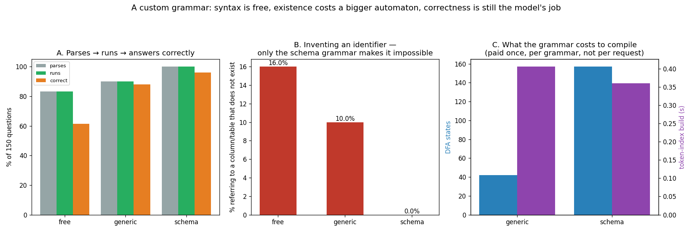

# Custom Grammar

---

> Write the rules of a valid answer once, and the model can never break them. 150 natural-language questions turned into SQL, three arms, every query **executed against a real SQLite database** and compared with the gold answer. Queries that run: **83.3% → 90.0% → 100%**. Queries that reference a column or table that does not exist: **16.0% → 10.0% → 0%**. Queries that return the right rows: **61.3% → 88.0% → 96.0%**. The step that matters is the last one — going from a generic "valid SQL shape" [grammar](/shared/glossary/#regular-expression) to one with your five real column names baked into the automaton. It costs **3.7x more [DFA](/shared/glossary/#finite-state-machine) states** and, counter-intuitively, **less** time to compile (0.36 s against 0.41 s), because what makes a token index expensive is not how many states a grammar has but how much freedom each state leaves: the generic grammar's identifier state accepts **41,756** different tokens, the schema grammar's accepts **32**. And constrained decoding turned out *faster* end to end — 52 s against the free arm's 87 s — because a model that cannot wander stops sooner.

---

## Key Insight

This project builds a regex-based grammar for a domain-specific output format (for example, valid SQL) and enforces it during [decode](/shared/glossary/#decode): at each step the grammar decides which next tokens are legal, and the rest are masked out of the [logits](/shared/glossary/#logits) before sampling. It is [constrained generation](/shared/glossary/#constrained-generation) applied to a format you define yourself.

## Why This Matters

Many production outputs must follow a strict shape — a query language, a config file, a command for another system — and a single malformed character makes the whole thing unusable. A custom grammar guarantees the model stays inside the lines, turning a flaky text generator into a dependable structured-output component.

---

**This is project 54.**

### The words first

- **Grammar** — the rules that say which strings are allowed. Here written as a [regular expression](/shared/glossary/#regular-expression), compiled to a [finite-state machine](/shared/glossary/#finite-state-machine).
- **Identifier** — a name in the query: a table (`employees`) or a column (`salary`). The three arms differ *only* in how identifiers are described.
- **Parses / runs / correct** — three different bars, in increasing order of difficulty. SQLite is the judge for all three: `EXPLAIN` for parsing, execution for running, and a comparison of returned rows for correctness.
- **Bad identifier** — the query is well-formed SQL but names something the database does not have. `SELECT dept FROM employees` when the column is called `department`.
- **Token index** — the precomputed table mapping each automaton state to the token ids legal from it. Built once per grammar. [Project 53](../53-json-mode-reliability/README.md) explains how.

### "Project 53 already forced valid JSON. What is left to do?"

Project 53 enforced a schema that Outlines or any JSON-mode switch would have given you for free. This project enforces something no library can generate for you, **because it depends on your database**.

That difference has teeth. A generic SQL grammar is a fixed artefact — anyone can ship one, and it is what a library means by "SQL mode". It guarantees the query *parses*. It cannot guarantee the query *runs*, because whether `SELECT dept FROM employees` runs depends on a schema the grammar has never seen.

The three arms exist to measure exactly that gap, and section A is the answer: the generic grammar leaves 10.0% of queries naming a column that does not exist. The schema grammar leaves 0%, by construction, because `dept` is not one of the five alternatives the automaton allows.

### "Why not just give the model the schema in the prompt?"

Every arm does. All 150 prompts begin:

```
Table employees(name TEXT, city TEXT, age INTEGER, salary INTEGER, department TEXT)
```

The free arm has that text in front of it and still invents identifiers 16.0% of the time — including joins against a `departments` table that does not exist anywhere:

```sql
SELECT T1.name FROM employees AS T1 JOIN departments AS T2 ON T1.department = T2.id ...
```

**A prompt is a request; a grammar is a constraint.** The prompt says "use only the columns listed" and the model, being a probability distribution, sometimes does something else. The grammar removes the tokens, so there is no distribution left to sample the wrong thing from. That is the entire argument for moving a rule out of the prompt and into the decoder, and the 16.0% → 0% column is what it is worth here.

---

## Running it

```bash
python3 run.py           # ~4 minutes
python3 run.py --plot    # redraw from outputs/findings.json
```

Needs [project 51](../51-needle-in-a-haystack/README.md)'s `ctxlib.py` and [project 53](../53-json-mode-reliability/README.md)'s `gramlib.py`. No database to install: SQLite is in the Python standard library, so the "real database" is 200 generated rows in memory.

> **About the numbers.** Everything below comes from the committed [`outputs/findings.json`](outputs/findings.json).



---

## The three arms, side by side

Only the identifier rule changes.

```python
# B. generic — "some lowercase word"
SELECT (COUNT\(\*\)|[a-z_]+) FROM [a-z_]+ WHERE [a-z_]+ (=|>|<) ('[a-z ]+'|[0-9]+);

# C. schema — "one of the five columns that exist"
SELECT (COUNT\(\*\)|(name|city|age|salary|department)) FROM employees
       WHERE (name|city|age|salary|department) (=|>|<)
       ('(lisbon|osaka|nairobi|helsinki|perth|research|sales|support|design)'|[0-9]+);
```

Both are ordinary regular expressions compiled by `gramlib`. The second one is *generated from the database schema* — in a real system you would build it at startup by reading `information_schema`, and rebuild it when the schema changes.

---

## A. Parses → runs → answers correctly

150 questions, temperature 0.7, same prompts and seeds in all three arms.

| arm | parses | runs | bad identifier | **returns the right rows** |
|---|---|---|---|---|
| free (no mask) | 83.3% | 83.3% | 16.0% | **61.3%** |
| generic grammar | 90.0% | 90.0% | 10.0% | **88.0%** |
| schema grammar | **100%** | **100%** | **0%** | **96.0%** |

**The generic grammar bought +6.7 points of parse rate and +26.7 points of correctness.** That gap is the interesting one: most of what the free arm lost was not malformed syntax, it was *elaborate* syntax — self-joins, aliases, subqueries — that parsed fine and answered the wrong question. The grammar cannot make the model smarter, but by removing `JOIN`, `AS` and `(` from the vocabulary it removes an entire family of over-complicated answers. **Constraining the output space is a way of constraining the model's ambition.**

**The schema grammar took bad identifiers to exactly zero, and that number is not a measurement of the model.** It is a property of the automaton: `dept` is not reachable, so it cannot be emitted, so the failure mode is gone whatever the model does. This is the qualitative difference between a grammar and a prompt instruction — one is a bound, the other is a request.

**96.0% correct with 100% executable.** The remaining 6 failures are the model choosing the wrong *column* or the wrong *operator* — `age > 40` when the question asked about salary. Every one of them is a valid, runnable query returning the wrong rows.

**Which is the limit worth naming.** A grammar can rule out anything you can describe as a pattern. "Use the column the question is about" is not a pattern; it is comprehension. **Syntax is free, existence costs a bigger automaton, and correctness is still the model's job** — and if you need better than 96%, the lever is a better model or a better prompt, not a tighter grammar.

## B. What the grammars cost to compile

| | generic | schema |
|---|---|---|
| DFA states | 42 | **157** (3.7x) |
| token walks during index build | 828,991 | 1,102,352 |
| index build time | **0.41 s** | **0.36 s** |
| states with exactly one legal token | 6 | 26 |
| median legal tokens per state | 3 | 3 |
| **most legal tokens in any one state** | **41,756** | **32** |

**The bigger automaton compiled faster, and the last row is why.**

Building the token index means walking vocabulary tokens through the automaton from every state. The cost is not `states × 151,643` — tokens are bucketed by their first character, so a state that only permits `'` never looks at the tokens that cannot start there. The cost is therefore driven by the states that permit *many* first characters.

The generic grammar has one such state: `[a-z_]+` accepts any lowercase letter, so **41,756 tokens** are candidates and every one of them has to be walked. The schema grammar has no state like that — its widest state offers **32** choices, because after `WHERE ` the only legal continuations are the five column names, and after `= '` the only legal continuations are the nine known values.

**So the intuition "a grammar with more rules is more expensive" is backwards for the part that actually costs anything.** More rules usually means *more specific*, and specific states are cheap. What costs is freedom.

**Either way, it is paid once.** 0.4 seconds per grammar, cached and shared across the fleet. Per request it would be crippling; amortised over a day of traffic it is invisible. That asymmetry is why production engines ([Outlines](/shared/glossary/#outlines), xgrammar, [SGLang](/shared/glossary/#radixattention)) all keep a compiled-grammar cache, and why "arbitrary user-supplied regex" is the feature they are careful about: a fresh grammar per request puts the compile back on the critical path.

## C. The by-product nobody promises: it was faster

| arm | wall-clock for 150 generations |
|---|---|
| free | **87 s** |
| generic | 55 s |
| schema | **52 s** |

**Constrained decoding ran 1.67x faster than unconstrained**, despite doing strictly more work per step.

The mask costs almost nothing ([project 53](../53-json-mode-reliability/README.md) could not measure it above the noise, and bounds it at a few percent of the memory traffic a decode step already moves). What it *saves* is tokens. The free arm writes markdown fences, explanations, and multi-line joins, and often runs to the 40-token limit. The constrained arms cannot: after the closing `;` the automaton is in an accepting state, the only legal token is end-of-sequence, and generation stops. **Fewer tokens emitted is less compute spent, and that outweighed the mask by a wide margin.**

Do not over-generalise this — it is a property of a workload whose *legal* outputs are much shorter than its *typical* ones. But it does mean the usual framing ("constrained generation costs you a few percent for reliability") had the sign wrong here, and the honest summary is: on a short, tightly-specified format, a grammar is free and then some.

## D. The trap this project fell into for real

The first version of the schema grammar was written like this:

```python
r" (=|>|<) ('" + "|".join(CITIES + DEPTS) + r"'|[0-9]+);"
```

which expands to `('lisbon|osaka|…|design'|[0-9]+);`. Regular-expression alternation binds loosely, so that reads as **`'lisbon`** or **`osaka`** or … or **`design'`** — the opening quote belongs only to the first alternative and the closing quote only to the last. The automaton dutifully accepted `department = 'lisbon;` with no closing quote.

The result: the schema arm scored **48.7% correct — worse than the generic grammar's 88.0%**, and the model was not at fault for a single one of them. It emitted exactly what it was told was legal.

**This is the failure mode that makes grammars dangerous in a way prompts are not.** A bad prompt produces bad output that looks bad. A bad grammar produces output that is *provably conformant* to a specification that is wrong, and the model's obedience hides the bug. The fix was one pair of parentheses:

```python
r" (=|>|<) ('" + _alt(CITIES + DEPTS) + r"'|[0-9]+);"
```

Two habits fall out of it, and both are cheap:

1. **Unit-test the grammar before you attach it to a model.** `dfa.matches("SELECT name FROM employees WHERE department = 'lisbon;")` should be `False`, and takes a millisecond to check.
2. **Keep a control arm.** The generic grammar is what made the number legible: 48.7% against 88.0% is obviously a bug, whereas 48.7% on its own would have been read as "small models are bad at SQL".

---

## What to take from this

1. **Executable queries went 83.3% → 90.0% → 100%** and correct answers **61.3% → 88.0% → 96.0%** across free, generic and schema grammars.
2. **Bad identifiers went 16.0% → 10.0% → 0%.** The zero is structural, not statistical — the tokens are unreachable.
3. **The schema was in every prompt and the free arm ignored it 16% of the time.** A prompt is a request; a grammar is a bound.
4. **Most of the free arm's losses parsed fine.** They were self-joins and subqueries answering the wrong question — a grammar constrains ambition as well as syntax.
5. **3.7x the states compiled *faster*.** Index cost tracks how permissive a state is (41,756 candidate tokens vs 32), not how many states there are.
6. **Compilation is per grammar, not per request** — 0.4 s, cached. Arbitrary per-request regexes put that back on the critical path.
7. **Constrained decoding ran 1.67x faster** (52 s vs 87 s) because the automaton ends the generation as soon as the output is complete.
8. **A wrong grammar is invisible.** A missing pair of parentheses cost 39 points of accuracy and the model obeyed it perfectly.

### Common traps this project walks into on purpose

- **Trusting an untested regular expression.** Section D: alternation precedence silently allowed unterminated strings, and the arm scored 48.7% instead of 96.0%.
- **Grading SQL by string comparison.** `SELECT COUNT(*) FROM employees WHERE age > 40` and `SELECT COUNT(*) FROM employees WHERE age >= 41` are different strings and the same answer. Executing both and comparing the rows is the only grader that is not an opinion.
- **Conflating "parses" with "runs".** SQLite reports an unknown column at prepare time, so the two look identical unless you inspect the error text and separate "the shape is wrong" from "the name does not exist".
- **Shipping only the schema grammar.** Without the generic arm there is no way to tell how much of the win came from constraining *shape* versus constraining *values*, and no control to catch a grammar bug.
- **Assuming a bigger grammar is a slower grammar.** It is the permissive states that cost, and they are usually in the *smaller* grammar.

---

## Next

[Project 55 — multi-LoRA serving](../55-multi-lora-serving/README.md) leaves structured output behind for the other half of what makes a serving system commercially useful: giving every customer their own fine-tuned model without giving every customer their own GPU.
