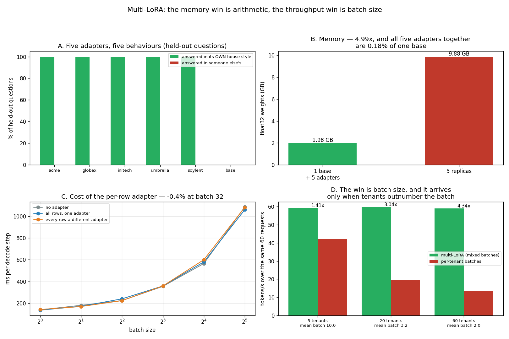

# Multi-LoRA Serving

---

> One base model in memory, a thousand fine-tunes on top — not a thousand full copies of the model. Five [LoRA](/shared/glossary/#lora) adapters are trained here from scratch (45 steps each, ~42 s each, loss 5.17 → 0.0004) and then served together from a single copy of the base. Each one answers in its own tenant's house style on held-out questions **100% of the time**, and never in another tenant's — so the serving benchmark is measuring five genuinely different models. The memory arithmetic is the easy part and it is decisive: an adapter is **0.72 MB against a 1.976 GB base — 0.036%** — so one base plus all five adapters is **1.980 GB against 9.881 GB for five replicas, 4.99x**. The throughput story is the one worth working through, because it is not about the adapter at all. Multi-LoRA's rate is **flat at ~59 tok/s** whatever the traffic looks like; the alternative collapses from **42.2 to 19.6 to 13.6 tok/s** as the same 60 requests are spread over 5, then 20, then 60 customers — a **1.41x → 3.04x → 4.34x** win driven entirely by the batch a dedicated replica can still fill (10.0 rows, then 3.2, then 2.0). Run the same experiment with heavy traffic per customer and multi-LoRA **loses**, at 0.90x. The win is batch fragmentation, and the adapter itself costs less than this box can measure.

---

## Key Insight

This project stands up a multi-adapter engine ([Lorax or S-LoRA](/shared/glossary/#lorax--s-lora)), trains 5 small [LoRA](/shared/glossary/#lora) adapters, and serves them all from a *single* copy of the base model, then compares [throughput](/shared/glossary/#throughput) against running 5 separate replicas. The trick is batching requests that use *different* adapters into one forward pass — see [multi-LoRA](/shared/glossary/#multi-lora).

## Why This Matters

Giving every customer their own fine-tuned model would normally mean one GPU deployment per customer, which does not scale. Because each adapter is tiny (megabytes) while the base model is large, sharing one base across hundreds of adapters is the economic feature that makes per-tenant fine-tuning affordable for SaaS products.

---

**This is project 55.**

### The words first

- **[LoRA](/shared/glossary/#lora)** — Low-Rank Adaptation. Instead of changing a big weight matrix `W`, leave it frozen and add a thin correction `B·A`, where `A` squeezes the input down to `r` numbers and `B` expands them back. "Low-rank" is the linear-algebra term for "this matrix is the product of two skinny ones".
- **Adapter** — one trained `(A, B)` pair per adapted layer. Here: rank 8, on the query and value projections of the last 8 of 24 blocks. **0.72 MB** total.
- **Tenant** — one customer, with their own adapter. The word comes from renting: many tenants share one building.
- **[SGMV](/shared/glossary/#sgmv)** — Segmented Gather Matrix-Vector multiplication: the kernel that applies a *different* adapter to each row of one batch, in one call. (BGMV is the single-token version.)
- **Replica** — a full, separate copy of the model in memory, serving one adapter.

### "Why is the rank called *low*, and why does that make the adapter small?"

The **rank** of a matrix is how many genuinely independent directions it contains. A 896 × 896 matrix can have rank up to 896; if its rank is only 8, then every one of its 802,816 numbers can be reconstructed from two much smaller matrices — an 8 × 896 and a 896 × 8, which together hold 14,336 numbers. **56x smaller, and exactly the same matrix.**

LoRA's bet is that whatever a fine-tune needs to change is simple enough to fit in rank 8. That is a bet, not a theorem; it happens to hold well for style, format and domain adaptation, which is what per-customer fine-tunes usually are.

That is where the 0.036% comes from: the base is a dense 1.976 GB, the correction is two skinny matrices per adapted projection, and 0.72 MB is all of it.

### "The base model already answers questions. Why bolt something else on top of it?"

Because the base answers *everybody's* questions the same way, and a tenant is paying for their own.

Section A measures the difference directly. Given the same held-out question, the untouched base writes a generic paragraph about legal proceedings. Tenant `acme`'s adapter — the *same weights*, plus 0.72 MB — writes `[acme] Please check the account page for details.` The base is not wrong; it is not theirs.

**And the adapter is not a filter or a prompt wrapper sitting outside the model.** It changes the arithmetic inside the attention projections, so it can shift behaviour a system prompt cannot reach. What it shares with the base is everything else — 99.96% of the weights, all of the language ability, all of the world knowledge — which is precisely why it costs 0.72 MB and not 2 GB.

### "If each request needs its own adapter, why not just load that adapter and run the request?"

Because that serialises your tenants, and serialising tenants wastes most of the machine.

The key fact about [decoding](/shared/glossary/#decode) is that it is **memory-bound**: each step reads all ~2 GB of weights out of memory and does very little arithmetic with them. Reading 2 GB to serve one row costs almost exactly what reading 2 GB to serve thirty-two rows costs — section C measures a batch of 32 taking 7.9x the time of a batch of 1, not 32x. So a batch of 1 wastes about three quarters of what you paid for.

If a request must be alone in the batch because it is the only one wanting adapter *k*, you pay full price for one row. **Multi-LoRA exists to put tenant A and tenant B in the same forward pass**, which is impossible unless the adapter can be chosen *per row* — hence [SGMV](/shared/glossary/#sgmv), and hence this project.

Section D measures how much that is worth, and finds it depends entirely on how fragmented the traffic is.

---

## Running it

```bash
python3 run.py                  # train (~4 min) then serve (~7 min)
python3 run.py --stage serve    # reuse adapters/ from a previous run (~7 min)
python3 run.py --plot           # redraw from outputs/findings.json
```

Needs [project 51](../51-needle-in-a-haystack/README.md)'s `ctxlib.py`. `loralib.py` lives here and holds both halves: `LoRALinear` for training (one adapter) and `MultiLoRALinear` for serving (many adapters, one call).

The two stages are separate because they answer separate questions and cost different amounts. The committed `outputs/findings.json` carries the training log from a `--stage train` run and the serving measurements from a later `--stage serve` run, which is exactly how the stage split is meant to be used.

> **Why not Lorax or S-LoRA themselves?** Both are GPU-only, and this machine's GPU (compute capability 6.1) is not usable from this PyTorch build. The kernel they exist to provide is two batched matrix multiplies, written out in `loralib.py` in about ten lines, and everything this project measures — memory, per-row overhead, batch fragmentation — is a property of the technique rather than of the implementation.

> **About the numbers.** Everything below comes from the committed [`outputs/findings.json`](outputs/findings.json).



---

## The kernel, in full

```python
y = self.base(x)                      # (b, t, out)  — one shared weight matrix
a  = self.A[idx]                      # (b, r, in)   — gather each row's adapter
bb = self.B[idx]                      # (b, out, r)
h  = torch.bmm(x, a.transpose(1, 2))  # (b, t, r)    — squeeze to rank 8
d  = torch.bmm(h, bb.transpose(1, 2)) # (b, t, out)  — expand back
return y + d * self.scale
```

`idx` is a per-row vector of adapter ids. That is the entire difference between "one fine-tune per replica" and "hundreds of fine-tunes per replica".

**One detail worth copying: index `n_ad` is a permanently-zero adapter.** A request that wants *no* fine-tune selects it, receives a correction of exactly zero, and rides in the same batch as five that do. No branch, no separate code path, no second batch.

---

## A. Five adapters, five behaviours

Trained on 32 questions each, tested on 8 held-out ones.

| tenant | training loss | answered in its **own** style | answered in **someone else's** |
|---|---|---|---|
| acme | 5.170 → 0.0004 | **100%** | 0% |
| globex | 5.740 → 0.0007 | **100%** | 0% |
| initech | 5.650 → 0.0005 | **100%** | 0% |
| umbrella | 5.660 → 0.0006 | **100%** | 0% |
| soylent | 5.290 → 0.0004 | **100%** | 0% |
| *base (zero adapter)* | — | 0% | **0%** |

Sample outputs for the same held-out question:

| | |
|---|---|
| base | `After a trial, the process typically involves several key steps:\n\n1.` |
| acme | `[acme] Please check the account page for details.` |
| globex | `[globex] Please check the account page for details.` |

**This section is a control, not a result.** It exists so that sections B–D are measuring something. A serving benchmark over five adapters that all behaved identically would produce exactly the same timings and mean nothing — and that failure would be invisible, because timings do not care whether the weights they multiply are meaningful.

**Be clear about what this fine-tune is and is not.** Driving the loss to 0.0004 on a fixed reply is memorisation, deliberately: the task is chosen so that "did the adapter take effect?" is a string comparison rather than a judgement call. Real per-tenant adapters learn tone, vocabulary and domain, and their evaluation is a different project. What matters here is that five *distinguishable* sets of weights exist, that they are selectable per row, and that the base is recoverable by selecting the zero adapter — all three verified above.

## B. Memory, which is the whole commercial argument

| | bytes |
|---|---|
| base model (float32) | **1.976 GB** |
| one adapter | **0.72 MB** |
| adapter as a share of base | **0.036%** |
| all five adapters together | 3.6 MB (**0.18%** of one base) |
| **1 base + 5 adapters** | **1.980 GB** |
| **5 separate replicas** | **9.881 GB** |
| | **4.99x** |

**4.99x at five tenants, and the ratio keeps improving without bound.** That is the property to notice: five replicas cost 5x, five hundred replicas cost 500x, but five hundred *adapters* cost `1.976 GB + 500 × 0.72 MB = 2.34 GB` — **1.18x**. The base is paid once and the marginal customer is nearly free.

Turn that into the number a business cares about. On an 80 GB accelerator you can hold roughly 40 copies of this model, so 40 customers. Or you can hold one copy and **over 100,000 adapters**, if you had them. The constraint stops being memory and becomes something else entirely — which is why the guide calls this the technique that rewrote the unit economics of LLM SaaS.

**Two honest caveats.** The KV cache is not shared: every concurrent *request* needs its own, whatever adapter it uses, and on long contexts that dominates ([project 51](../51-needle-in-a-haystack/README.md) measured 24 KB per token). And adapters are only free while they sit in memory; a tenant whose adapter has been evicted pays a load before their first token, which is why production engines keep an LRU of hot adapters exactly as they keep one of hot prefixes.

## C. What the per-row adapter costs

Decode step time, three batch compositions, timed round-robin over four rounds and kept at the minimum.

| batch | no adapter | all rows, one adapter | every row a different adapter | mixed / base |
|---|---|---|---|---|
| 1 | 138.2 ms | 135.3 ms | 141.1 ms | 1.021 |
| 2 | 180.0 ms | 170.9 ms | 168.7 ms | 0.937 |
| 4 | 223.6 ms | 239.5 ms | 223.1 ms | 0.998 |
| 8 | 354.4 ms | 358.2 ms | 358.5 ms | 1.012 |
| 16 | 564.6 ms | 579.7 ms | 599.7 ms | 1.062 |
| 32 | 1086.2 ms | 1060.1 ms | 1081.5 ms | 0.996 |

**The per-row adapter costs less than this box can measure.** The ratios average 1.004 and scatter either side of 1.0 — two rows put the mixed arm *faster* than the no-adapter arm, which is impossible, since it does strictly more work. This machine runs at a load average above 12; interleaving the arms over four rounds and keeping the minimum controls for that but does not remove it.

**So the honest statement is a bound, not a number: the overhead is small enough to be invisible next to the model, somewhere under ~6%.** That is consistent with the 5–15% the literature reports for real SGMV kernels, and it is all section D needs — because what section D is competing for is far larger.

**What the table does show cleanly is the fact everything rests on:** a batch of 32 costs **7.9x** a batch of 1, not 32x. Per row, batch 32 is **4.07x cheaper**. Decode is memory-bound — every step drags all 2 GB of weights out of memory whether it serves one row or thirty-two — so an under-filled batch is throughput thrown away.

**That 4.07x is the prize, and the adapter's few percent is the entry fee.** Multi-LoRA is worth it whenever it can turn an under-filled batch into a full one, and worth nothing when the batch was going to be full anyway. Section D measures which of those you are in.

## D. Where the throughput win actually comes from

The same 60 requests, batched two ways, swept over how many tenants the traffic is spread across. Every tenant maps onto one of the five trained adapters, because the kernel's cost depends on how many *distinct* adapters a batch mixes, not on which ones.

- **multi-LoRA** — any 20 waiting requests go together, whatever adapter they want.
- **per-tenant** — a batch may hold only one tenant's requests, which is all a replica dedicated to that tenant could ever assemble.

| tenants | multi-LoRA batches | per-tenant batches | per-tenant mean batch | multi-LoRA | per-tenant | **speed-up** |
|---|---|---|---|---|---|---|
| 5 | 3 (mean 20.0) | 6 | **10.0** | 59.3 tok/s | 42.2 tok/s | **1.41x** |
| 20 | 3 (mean 20.0) | 19 | **3.2** | 59.7 tok/s | 19.6 tok/s | **3.04x** |
| 60 | 3 (mean 20.0) | 30 | **2.0** | 59.0 tok/s | 13.6 tok/s | **4.34x** |

**The multi-LoRA column does not move: 59.3, 59.7, 59.0 tok/s.** It cannot — it always assembles batches of 20 regardless of how many customers those 20 requests belong to. That flat line is the whole feature.

**The per-tenant column collapses: 42.2 → 19.6 → 13.6 tok/s.** Nothing about the hardware or the model changed. The same 60 requests, the same 16 tokens each, the same box. All that changed is how finely the traffic is cut, and therefore what batch a dedicated replica can fill: 10.0 rows, then 3.2, then 2.0.

**So the speed-up is a measurement of fragmentation, not of the adapter.** 1.41x, 3.04x, 4.34x — and the trend has not flattened at 60 tenants, because per-tenant batches cannot go below 1 and are already at 2.0.

### The version of this experiment that reported a loss

An earlier configuration ran 100 requests over the same 5 tenants. A dedicated replica could then assemble batches of **14.3** — most of the way to the 20-row cap — and multi-LoRA measured **0.90x**. A loss.

That number was correct, and a project that stopped there would have drawn the wrong conclusion. **With few customers and heavy traffic per customer, per-tenant replicas batch perfectly well and multi-LoRA is a small tax with nothing to show for it.** The technique's value appears only where the traffic is *thin per tenant*, which is exactly the SaaS situation it was invented for: hundreds of per-customer fine-tunes, each generating a trickle.

Which gives the rule this project exists to produce, and it is a rule about *your traffic* rather than about the technique:

> Multi-LoRA pays in proportion to how far **per-tenant traffic falls short of the batch size you want to run**. When a single tenant can fill your batch on its own, dedicated replicas are fine. When they cannot, no amount of hardware fixes it — only mixing tenants into one batch does.

**And note that the memory argument never had a crossover.** Section B's 4.99x holds at five tenants and improves at five hundred, whichever way the throughput comparison goes. Even in the configuration where multi-LoRA lost on speed, the alternative needed **5x the memory** to win — which on real hardware means five accelerators instead of one, and then the throughput comparison was never like-for-like to begin with.

---

## What to take from this

1. **An adapter is 0.036% of the base** (0.72 MB against 1.976 GB), so one base plus five adapters is **4.99x** less memory than five replicas — and the ratio keeps improving: 500 adapters would be 1.18x.
2. **All five adapters answer in their own style 100% of the time and never in another's**, which is what makes the timings mean anything.
3. **The zero adapter is the trick that keeps the code simple.** A base request selects it, gets a correction of exactly zero, and shares the batch.
4. **A batch of 32 costs 7.9x a batch of 1** — 4.07x cheaper per row. Decode is memory-bound, so an under-filled batch is the real waste.
5. **The per-row adapter is below this box's noise floor** (ratios average 1.004, two of six below 1.0). Reported as a bound — under ~6% — rather than a false precision.
6. **Multi-LoRA's throughput is flat (~59 tok/s) and the alternative's collapses** (42.2 → 19.6 → 13.6) as the same traffic spreads over 5, 20, 60 tenants: **1.41x → 3.04x → 4.34x**.
7. **An earlier configuration with heavy per-tenant traffic measured 0.90x — a loss.** Same code, same adapters; per-tenant batches of 14.3 out of a 20-row cap. Fragmentation is the variable.
8. **The rule: multi-LoRA pays in proportion to how far per-tenant traffic falls short of your target batch size.** Measure your fragmentation, not your adapter count.
9. **Memory has no crossover.** Even where multi-LoRA loses on throughput, the alternative needs 5x the memory to do it.

### Common traps this project walks into on purpose

- **Benchmarking adapters that do nothing.** Timings are identical whether the adapter weights are meaningful or random, so section A verifies behaviour before section D measures speed.
- **Testing an adapter on its training questions.** Held-out questions only; memorising 32 prompts would prove nothing about selection working at serving time.
- **Measuring one traffic shape and generalising.** One configuration gave 0.90x and the sweep gives up to 4.34x. The sweep is the result, not any single row of it.
- **Reporting a timing from a loaded box as a finding.** Section C's noise is called out rather than dressed up; two of its six rows are physically impossible.
- **Comparing throughput without comparing memory.** Five replicas need 5x the RAM. On one box that comparison is not like-for-like, and the README says so.
- **Forgetting the KV cache.** Adapters are shared; caches are not. On long contexts the cache, not the weights, is the ceiling.

---

## Next

[Project 56 — speculation + JSON mode](../56-speculation-json-mode/README.md) goes back to [project 53](../53-json-mode-reliability/README.md)'s grammar and asks a different question of it: if the automaton already knows what the next ten characters must be, why is the model being asked?
