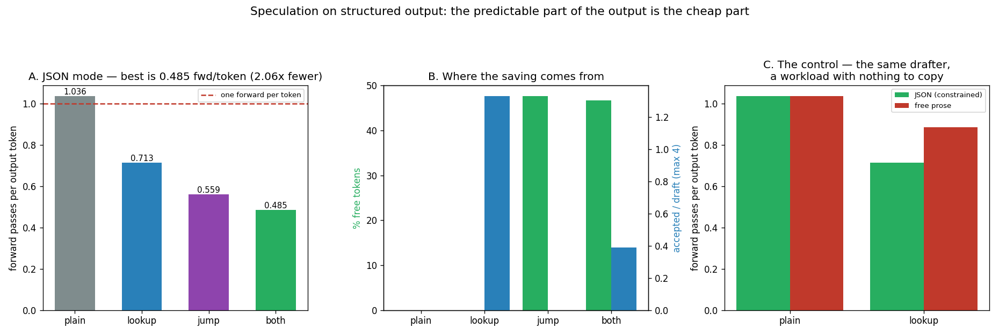

# Speculation + JSON-Mode

---

> When the output format is predictable, the model can guess most of it for free. Two very different tricks exploit that, and this project runs both on the same workload. [Prompt-lookup](/shared/glossary/#prompt-lookup-decoding) speculation takes **1.036 → 0.713 forward passes per output token (1.45x fewer)**. [Jump-forward decoding](/shared/glossary/#jump-forward-decoding) — asking the [automaton](/shared/glossary/#finite-state-machine) what the next characters *must* be and emitting them without running the model — takes it to **0.559 (1.85x)**, supplying **47.6% of all output tokens for free**. Together: **0.485 forward passes per token, a 2.14x reduction**, and 145.6 → 77.0 ms per token on the clock. Every arm emitted **exactly the same 338 tokens**, which is what makes these speed-ups rather than trade-offs. Then the control that gives the numbers meaning: the same drafter on free prose manages only **1.17x**. And the reason is not what you would guess — prose drafts are *more* accurate per attempt (1.50 tokens accepted against JSON's 1.33); they just almost never fire.

---

## Key Insight

This project adds prompt-lookup [speculative decoding](/shared/glossary/#speculative-decoding) — drafting next tokens by matching [n-grams](/shared/glossary/#n-gram) already seen in the prompt or schema — to a JSON-mode ([constrained generation](/shared/glossary/#constrained-generation)) workload, and measures the speedup. Because schema keys like `{"name":` are highly predictable, the model's guesses (the draft) turn out right for many tokens in a row, so it can accept a whole chunk at once and leap several tokens forward in a single step instead of producing them one by one — like finishing a friend's sentence when you already know exactly how it ends.

## Why This Matters

Structured output is full of fixed, repeated filler — the same brackets, quotes, and key names every single time (the "boilerplate") — that the model would otherwise type out one slow token at a time, like hand-copying a form's pre-printed labels onto every new copy instead of just filling in the blanks. Speculating those spans turns the most predictable part of generation into the fastest part, often giving dramatic speedups exactly on the tool-calling workloads that matter most in production.

---

**This is project 56.**

### The words first

- **Forward pass** — one run of the model. It is the thing that costs money: on this CPU it drags all ~2 GB of weights through memory whether it produces one token or five. **Forward passes per output token** is therefore the honest unit for everything below.
- **Draft** — a guess at the next few tokens, produced by something much cheaper than the model.
- **Verify** — feed the draft back through the model *once* and check whether the model would have picked those tokens itself. Keep the prefix that matches, throw away the rest.
- **[Prompt-lookup](/shared/glossary/#prompt-lookup-decoding)** — draft by copying: find where the last 2 tokens appeared earlier in the prompt, and copy whatever followed. No second model, no training.
- **[Jump-forward](/shared/glossary/#jump-forward-decoding)** — when the grammar leaves exactly one possible continuation, emit it without asking the model.
- **Acceptance rate** — how many drafted tokens survive verification. Higher is better; the number of *attempts* turns out to matter more.

### "Project 23 already built speculative decoding. What is different here?"

[Project 23](../23-greedy-speculative-decoding/README.md) used a **draft model** — a real, smaller network (Qwen 0.5B drafting for 1.5B). That costs memory for a second set of weights and a forward pass of its own for every draft.

Both drafters here are **free of a model entirely**:

| | drafter | costs | works when |
|---|---|---|---|
| project 23 | a smaller LLM | a second model in memory, a forward pass per draft | the small model agrees with the big one |
| **lookup** | text already in the prompt | a substring search | the output repeats the input |
| **jump** | the grammar's automaton | a dictionary lookup | the format is fixed |

That is what makes them attractive on a structured-output workload specifically: the predictability is *in the request*, so no extra model is needed to see it. It also means they compose with everything else — you can run prompt-lookup on top of a quantized model, on top of a LoRA adapter, on any engine, with no extra weights.

### "The grammar already forces the output. Why is the model still being run at all?"

This is the question that produced the biggest number in the project, so it deserves a careful answer.

A [mask](/shared/glossary/#constrained-generation) and a *forced choice* are different things. Most of the time the grammar rules out the majority of the vocabulary and still leaves a real decision — inside `"[A-Za-z ]+"` any letter is legal, and which letter comes next is exactly what the model is for. Project 53's masking handles that: it narrows the choice and lets the model make it.

But at some points the grammar leaves **no** choice. After `{`, the only legal continuation is `"name": "` — ten characters, completely determined by the schema. Running a 0.5B model to "decide" them is 145 ms spent computing something a dictionary already knew.

Jump-forward is that observation cashed in: ask the automaton for the longest fully-determined run of characters, emit it, and skip straight to the next real decision. Section A measures it at **47.6% of all output tokens**.

### "Why ask for forced *text* instead of a forced *token*?"

Because at token granularity the trick almost does not work, and this project measured both.

The first implementation asked "is there exactly one legal *token* here?" That found **3.4%** of tokens — a rounding error. The reason is [byte-pair encoding](/shared/glossary/#bpe): even when the next ten characters are certain, the tokenizer offers several ways to spell them. `"name` might be one token, or `"` then `name`, or `"n` then `ame`. Several legal tokens, so no token is forced, so the check fails — while the *characters* were never in doubt.

Asking the automaton for forced **characters** and tokenizing the result afterwards found **47.6%**. Same grammar, same model, a 14x difference, and entirely down to which alphabet you ask the question in.

**The caveat this introduces is real and worth naming:** re-tokenizing a forced string can produce a token boundary the model itself would never have chosen, which slightly perturbs what it predicts next. That is the *token-healing* problem, and production engines handle it by re-tokenizing the last already-emitted token together with the new text. This implementation does the simple thing and does not, which is fine here — section A confirms every arm produced identical output — but it is the first thing to check if you port this to a workload where the free text meets a free-form field.

---

## Running it

```bash
python3 run.py           # ~4 minutes
python3 run.py --plot    # redraw from outputs/findings.json
```

Needs [project 51](../51-needle-in-a-haystack/README.md)'s `ctxlib.py` and [project 53](../53-json-mode-reliability/README.md)'s `gramlib.py` + `jsontask.py` — the same schema, the same regular expression and the same generator of test cases, so the two projects' numbers are comparable.

> **About the numbers.** Everything below comes from the committed [`outputs/findings.json`](outputs/findings.json). 12 cases, batch of one, greedy decoding.



---

## The loop, in one picture

```
   ┌─ 1. jump ────────────────────────────────────────────────────┐
   │  automaton: "the next 10 characters can only be  {"name": " │
   │  emit them.  cost: zero forward passes                       │
   └──────────────────────────────────────────────────────────────┘
   ┌─ 2. draft ───────────────────────────────────────────────────┐
   │  last 2 tokens appeared at position 41 of the prompt;         │
   │  copy the 4 tokens that followed.  cost: a substring search   │
   │  then drop any the grammar forbids — they can never pass      │
   └──────────────────────────────────────────────────────────────┘
   ┌─ 3. ONE forward pass over [pending tokens + draft] ───────────┐
   │  gives k+1 predictions: one verdict per drafted token, plus   │
   │  a free bonus token if every draft was right                  │
   └──────────────────────────────────────────────────────────────┘
   ┌─ 4. roll back ───────────────────────────────────────────────┐
   │  the pass wrote KV rows for every drafted token. Anything     │
   │  after the first rejection never happened — crop those rows   │
   │  or the next step attends to tokens the model did not emit    │
   └──────────────────────────────────────────────────────────────┘
```

**Step 4 is the one that silently breaks things.** The [KV cache](/shared/glossary/#kv-cache) is written by the forward pass, before you know which drafts survive. Forget to crop and the model keeps attending to its own rejected guesses — output that is subtly wrong and never raises an error. `past.crop(n)` is the whole fix.

**Step 1's tokens are not free of *compute*, they are free of *forward passes*.** The jumped tokens still have to go through the model eventually, because their keys and values are needed. They ride along as extra *input* on the next call, so a pass over 11 tokens replaces a pass over 1 — and since decode is memory-bound, that costs almost nothing. **The saving is the trip, not the cargo.**

---

## A. What each trick is worth

12 JSON extractions, greedy, identical prompts. All four arms emitted **exactly the same 338 tokens**.

| arm | forward passes | tokens out | **passes per token** | speed-up | ms/token |
|---|---|---|---|---|---|
| plain | 350 | 338 | 1.036 | — | 145.6 |
| lookup | 241 | 338 | **0.713** | **1.45x** | 108.9 |
| jump | 189 | 338 | **0.559** | **1.85x** | 82.0 |
| **both** | **164** | 338 | **0.485** | **2.14x** | **77.0** |

**Identical output across all four arms is the first thing to check and the reason these are speed-ups at all.** Speculation is *exact*: a drafted token is kept only if the model would have chosen it anyway, and a jumped token is one the grammar allowed nothing else to be. Nothing here trades quality for speed — unlike [quantization](/shared/glossary/#quantization) ([project 30](../30-quantize-a-7b-model-end-to-end/README.md)) or cache eviction ([project 51](../51-needle-in-a-haystack/README.md)), which both do.

**Plain is 1.036, not 1.000.** Twelve forward passes produced no token — they emitted end-of-sequence. Small, and worth reporting rather than rounding away, because it is the same accounting that makes the other rows honest.

**Jump beats lookup (1.85x vs 1.45x) and it is the cheaper of the two.** Lookup needs a substring search and a verification slot; jump needs a dictionary lookup and no verification at all, because there was never anything to verify. On structured output, the grammar is a better drafter than the prompt.

**Together they give 2.14x, which is less than the 2.68x you would get by multiplying them.** They are competing for the same predictability. Section B is what that looks like in the data.

## B. Where the saving comes from

| arm | tokens the grammar supplied free | draft attempts | tokens accepted | accepted per attempt |
|---|---|---|---|---|
| lookup | 0 | 82 | 109 | **1.33** |
| jump | **161 (47.6%)** | 0 | 0 | — |
| both | **158 (46.7%)** | 72 | 28 | **0.39** |

**Jump-forward supplies nearly half of every JSON object for free.** 161 of 338 tokens — the braces, the quotes, the key names, the colons, the separators — never went through the model as a decision. That is what "structured output is mostly boilerplate" means when you count it.

**Look at what happens to lookup when jump is switched on.** On its own, prompt-lookup gets 1.33 tokens per attempt. Alongside jump-forward it gets **0.39** — a two-thirds collapse. Nothing changed about the drafter. What changed is *which* tokens were left for it: jump-forward had already taken all the boilerplate, and the remaining decisions are the genuinely unpredictable ones — the person's actual name, their actual age. **Prompt-lookup was living off the same predictability, and jump-forward eats first.**

This is the practical lesson for stacking optimisations: **two techniques that both target "the easy tokens" do not add up.** If you are already running a grammar, jump-forward is the one to implement, and prompt-lookup on top is worth 1.15x rather than the 1.45x it earns alone.

## C. The control: the same drafter with nothing to copy

Same 12 people, same model, but the task is "write two sentences about this person" — no grammar, no schema, free prose.

| workload | plain | lookup | speed-up | draft attempts per 100 tokens | accepted per attempt |
|---|---|---|---|---|---|
| **JSON** (constrained) | 1.036 | **0.713** | **1.45x** | 24.3 | 1.33 |
| **prose** (free) | 1.035 | 0.885 | **1.17x** | 10.0 | **1.50** |

**Prompt-lookup is worth 1.45x on JSON and 1.17x on prose**, and jump-forward is not available on prose at all — there is no automaton, so nothing is ever forced. The headline "speculation is dramatic on structured output" is true, and this is the control that earns it.

**The reason is the opposite of the obvious one, and it is the most useful thing in this project.** Prose drafts are *better*: 1.50 tokens accepted per attempt against JSON's 1.33. If you were tuning on acceptance rate you would conclude prose was the friendlier workload.

What prose cannot do is **fire**. Its drafter attempted a guess 10 times per 100 tokens; the JSON drafter attempted 24.3 times — 2.4x as often. A 2-gram from the middle of an English sentence has usually never appeared before in this prompt, so there is nothing to copy and no draft is produced; the step falls back to plain decoding at full price. In JSON the same two tokens (`", "` then `"skills`) appear in the worked example sitting in the prompt, so the match fires constantly.

> **Prompt-lookup's value is coverage, not accuracy.** A dashboard showing acceptance rate would rank prose above JSON. The metric that predicts the speed-up is *how often the drafter has anything to say at all*.

**Which means the prompt is part of the optimisation.** The one-shot example in the JSON prompt is what prompt-lookup drafts *from*; delete it and the technique has no material and the 1.45x largely disappears. That is unusual and worth internalising: here, editing the prompt template is a *performance* change, not just a quality one.

---

## What to take from this

1. **2.14x fewer forward passes** with both tricks (1.036 → 0.485 per token), and 145.6 → 77.0 ms per token on the clock.
2. **All four arms emitted the identical 338 tokens.** Speculation is exact — no quality gate needed.
3. **Jump-forward supplies 47.6% of the output for free** and beats prompt-lookup (1.85x vs 1.45x) while being cheaper to run.
4. **Ask the automaton for forced *text*, not a forced *token*.** Tokens: 3.4%. Characters: 47.6%. A 14x difference from the choice of alphabet, because BPE can spell the same string several ways.
5. **The two tricks compete.** Lookup's acceptance collapses 1.33 → 0.39 once jump-forward has taken the boilerplate. Optimisations that target the same easy tokens do not multiply.
6. **The control: 1.45x on JSON against 1.17x on prose.** The claim "dramatic on structured output" only means something next to a workload where it is not.
7. **Prose drafts are *more* accurate (1.50 vs 1.33) and worth less**, because they fire 2.4x less often. Read coverage, not acceptance rate.
8. **The one-shot example in the prompt is what makes prompt-lookup work.** Removing it is a performance regression.

### Common traps this project walks into on purpose

- **Forgetting to crop the KV cache after a rejection.** The forward pass already wrote rows for tokens the model never emitted. Nothing errors; the output just quietly drifts.
- **Measuring in wall-clock only.** This box runs at a load average above 12, and ms/token moves for reasons that have nothing to do with the algorithm. Forward passes per token is countable and reproducible.
- **Asking for a forced token instead of forced text.** 3.4% instead of 47.6%, and it looks like the technique simply does not work.
- **Reporting acceptance rate as the health metric.** Prose wins it and loses the race.
- **Assuming stacked optimisations multiply.** 1.45 × 1.85 = 2.68; the measurement is 2.14.
- **Skipping the unconstrained control.** Without it, 1.45x is just a number, not evidence about *structured* output.

---

## Next

[Project 57 — stateful session API](../57-stateful-session-api/README.md) turns from making one request faster to keeping many requests' state alive: what happens when the [KV cache](/shared/glossary/#kv-cache) stops being a per-request scratchpad and becomes a resource with an owner, a lifetime, and a budget that is too small.
