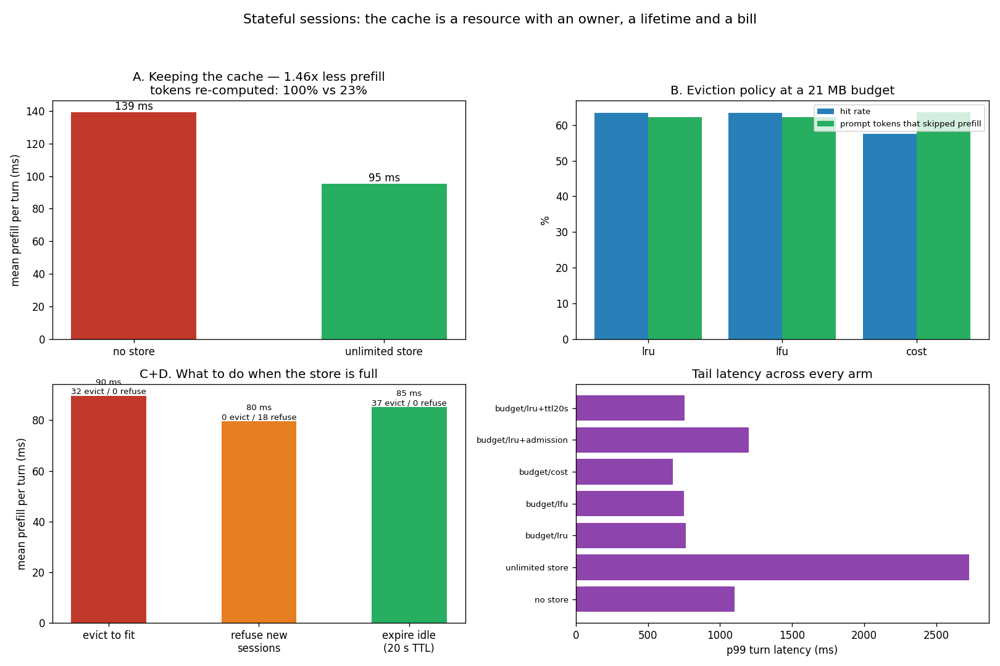

# Stateful Session API

---

> Keeping a conversation's [KV cache](/shared/glossary/#kv-cache) alive between calls lets **76.8% of prompt tokens skip [prefill](/shared/glossary/#prefill)** — and cuts mean prefill only **1.46x** (139.2 → 95.3 ms), because a forward pass has a fixed cost that 20 tokens pay just like 200 do. Then four results that all run against the obvious intuition. The **unlimited** store has the best hit rate and the **worst tail latency of every arm — 2728 ms p99, worse than caching nothing at all** (1100 ms) — because cloning and holding 24 full conversations costs more memory bandwidth than it saves. [**LRU**](/shared/glossary/#lru) **and LFU are byte-for-byte identical** (63.3% hit, 62.2% saved, 32 evictions each). A **cost-aware** policy has a *lower* hit rate (57.5%) and *higher* tokens saved (63.6%) — proof that hit rate is the wrong dashboard. And **[admission control](/shared/glossary/#admission-control) beat every eviction policy**: refusing 18 new sessions took hit rate to 74.2%, tokens saved to 68.1%, mean prefill to the best in the project, and evictions to zero. A **[TTL](/shared/glossary/#ttl) made things worse**.

---

## Key Insight

This project builds a session API that keeps a conversation's [KV cache](/shared/glossary/#kv-cache) alive *across* separate calls, so each new turn reuses the work of every previous turn instead of re-reading the whole history. Because GPU memory is finite, it must also evict idle sessions under pressure — and the project verifies the cache-hit rate to confirm warm sessions are actually being reused.

## Why This Matters

In long agent and chat sessions the history grows every turn, and re-running [prefill](/shared/glossary/#prefill) over the full transcript each time is both slow and expensive. Treating the cache as a session-lifetime resource — created, reused, and evicted on demand — is what makes multi-turn, [multi-tenant](/shared/glossary/#multi-tenant) systems both fast and stable under load.

---

**This is project 57.**

### The words first

- **Session** — one conversation, spread over several separate API calls. Identified by a `session_id` the client sends each time.
- **Turn** — one user message plus the model's reply. Turn 5's prompt contains turns 1–4 in full, which is why prompts grow.
- **Store** — the server-side dictionary holding each live session's KV tensors, with a hard byte budget.
- **Eviction** — throwing a session's cache out to make room. [**LRU**](/shared/glossary/#lru) drops whatever went longest untouched; **LFU** drops whatever was used least often; **cost-aware** here drops the *shortest* session, on the theory that short ones are cheapest to rebuild.
- **[Admission control](/shared/glossary/#admission-control) / [backpressure](/shared/glossary/#backpressure)** — refusing to cache a *new* session while the store is full, rather than evicting somebody mid-conversation.
- **[TTL](/shared/glossary/#ttl)** — time to live: drop a session after N seconds idle whether or not memory is tight.
- **Partial hit** — the cache covers *some* of the prompt. A conversation only appends, so an entry saved at turn 2 is still a valid prefix at turn 5 — it matches, and covers less than it looks like.

### "Project 49 already did session caching. Isn't this the same thing?"

Different halves of the same problem, and neither works without the other.

[Project 49](../49-session-affinity-routing/README.md) asked a **routing** question: given four replicas, which one should this turn go to? Its answer was "the one that served this session before", and its measurement was hit rate versus [round-robin](/shared/glossary/#round-robin). It assumed the cache would still be there when the request arrived.

This project asks the **lifecycle** question that assumption skips: the cache is on the right machine and that machine is *full*. Whose cache dies? Do you refuse new sessions instead? Do you expire idle ones on a timer? Project 49's routing is worthless if the store has already thrown the session away, and this project's store is worthless if requests land somewhere else. Section B is what happens when the budget is deliberately too small to hold everyone.

### "The client sends the whole transcript every time. Why is any of this hard?"

Because that is exactly what makes it hard: the client sends **text**, and a cache is indexed by **tokens**.

When the model's reply comes back inside the next turn's transcript, the server re-tokenizes it. [Byte-pair encoding](/shared/glossary/#bpe) does not promise that encoding a decoded string reproduces the same token ids — a reply that was generated as `["Ġthe", "atus"]` might re-encode as `["Ġthea", "tus"]`. The tensors would still *fit*: same shapes, same layer count, no error anywhere. They would simply be the keys and values of different tokens, and [project 52](../52-prefix-kv-caching/README.md) showed what that does to the output (fluent, confident, wrong).

So `serve_turn` never trusts the stored length. It compares the stored token ids against the new prompt, finds the longest common prefix, and crops the cache to exactly that. **This run recorded 24–36 partial matches per arm** — cases where the store held more than the prompt could actually use. Every one would have been silent corruption in a design that trusted the length.

### "Why does an idle session cost anything? It is not doing any work."

Because a KV cache is memory that stays allocated whether or not anyone is using it, and memory is the binding constraint in serving.

The arithmetic here: **8,192 bytes per token** (this project runs 8 of the model's 24 blocks, see below), so a finished six-turn conversation of ~420 tokens is **3.44 MB**. Twenty-four of those is 82 MB. On a real 70B model the per-token figure is over 300 kB and a long agent session runs to *gigabytes* — memory that could have been serving somebody, held open because a user might come back.

That is why a session store needs a policy at all, and why sections B–D compare four of them.

---

## Running it

```bash
python3 run.py           # ~8 minutes
python3 run.py --plot    # redraw from outputs/findings.json
```

Needs [project 51](../51-needle-in-a-haystack/README.md)'s `ctxlib.py`.

> **Why 8 of 24 blocks?** Seven arms × 120 turns each, with real KV tensors held for up to 24 concurrent sessions, has to fit in RAM alongside a desktop session. A shallower model has a proportionally smaller cache per token, which is the only quantity this project's policies act on — none of them can see how deep the model is. It does mean the millisecond figures here are **not** comparable with projects 51–56, which run all 24 blocks.

> **About the numbers.** Everything below comes from the committed [`outputs/findings.json`](outputs/findings.json). 24 sessions, 120 turns, budget 21 MB against a full session's 3.44 MB — room for about six of twenty-four.



---

## The workload, and why it is uneven on purpose

Two things are deliberately skewed, and the comparison collapses without either:

- **How often a session speaks.** Four chatty sessions take 10 turns each; twenty occasional ones take 4. Under perfectly round-robin traffic every policy evicts everything before its owner returns, and section B would be a seven-way tie at zero.
- **How much a session says.** Some users are terse, some write six times as much. Without that spread, every session is the same size and a "cost-aware" policy has nothing to be aware of.

Turns are interleaved across sessions, so a session's cache must survive *other* sessions' turns. That is the only situation in which an eviction policy means anything at all.

---

## A. Does keeping the cache help?

| | mean prefill | prompt tokens that skipped prefill | hit rate | p50 turn | p99 turn |
|---|---|---|---|---|---|
| no store | 139.2 ms | 0% | 0% | 552.0 ms | **1100.0 ms** |
| unlimited store | **95.3 ms** | **76.8%** | 80.0% | 498.2 ms | **2728.2 ms** |

**Yes — 76.8% of all prompt tokens never went through the model again.** In a system where every turn re-reads the entire transcript, that is the headline the technique exists for.

**And the prefill time fell only 1.46x, not 4.3x.** Skipping 76.8% of the tokens ought to make prefill roughly four times cheaper. It made it 1.46x cheaper, and the gap is the honest part: **a forward pass has a floor.** Python dispatch, kernel launches, and dragging the model's weights out of memory cost the same whether the pass carries 20 tokens or 200. At these prompt lengths the floor is most of the bill, so removing tokens removes less time than it removes work.

The consequence is a scaling one, and it is the right way to read this number: **the saving grows with conversation length.** These conversations reach a few hundred tokens. A real agent session running to 30 turns and 8,000 tokens is far above the floor, where 76.8% fewer tokens really is ~4x less prefill — and [project 51](../51-needle-in-a-haystack/README.md) measured that prefill grows *faster* than linearly out there, so the true saving is larger still.

### The unlimited store has the worst tail in the project

**p99 turn latency: 2728 ms, against 1100 ms for keeping no cache at all — 2.5x worse.** The arm with the best hit rate is the one users would complain about.

Nothing is wrong with the cache; the *bookkeeping* is what costs. Every turn copies the live cache out so the next forward pass cannot mutate what is stored, and with no budget those copies grow without limit — 24 sessions, each up to 3.44 MB, cloned on every one of their turns. The occasional turn that clones a large cache while the store is holding everything is the p99.

Compare the budgeted arms: `budget/lru` has a *lower* hit rate (63.3%) and a p99 of **762.6 ms**, 3.6x better, and finishes the whole run in 60 s against 73 s. **A cap on the store made the system faster overall than no cap**, which is the sort of thing that only shows up if you measure the tail and the wall-clock rather than the hit rate.

> The lesson generalises past this implementation: a cache is not free to *hold*, only cheap to *read*. Copies, allocator pressure and page faults all scale with what you are keeping, so "cache everything" is a latency decision, not just a memory one.

## B. Which eviction policy?

Budget 21 MB — room for about six of twenty-four sessions, so somebody's cache dies on almost every insert.

| policy | hit rate | tokens saved | mean prefill | p99 turn | evictions |
|---|---|---|---|---|---|
| LRU | 63.3% | 62.2% | 89.7 ms | 762.6 ms | 32 |
| LFU | **63.3%** | **62.2%** | 84.0 ms | 751.6 ms | **32** |
| cost-aware | 57.5% | **63.6%** | 89.2 ms | **674.4 ms** | 42 |

### LRU and LFU are identical, to the digit

Same hit rate, same tokens saved, same eviction count. Two policies with genuinely different rules picked the same victims every time.

The reason is that at this scale the rules are not independent. Frequency and recency both track "is this one of the four chatty sessions?", and once the store can hold about six entries, both policies simply keep the chatty ones and drop whichever quiet session was last to arrive. **The policies differ only where the workload separates recency from frequency**, and a burst of chatty sessions against a long tail of quiet ones does not.

**That is a useful negative result, because LFU is the more expensive policy to run** — it needs a counter per entry and, in a real system, a decay schedule so an old favourite does not become immortal. Here it bought exactly nothing. Before adopting the fancier policy, check that your workload can tell them apart.

### Cost-aware: a lower hit rate that saved more work

**57.5% hit rate, 63.6% tokens saved** — the only arm where those two numbers move in opposite directions, and the clearest illustration in the project of why hit rate is the wrong headline metric.

The policy drops the *shortest* session, keeping the long expensive histories. That means fewer entries fit in the same 21 MB (42 evictions against LRU's 32), so it hits less often. But when it does hit, it hits on a conversation with a lot of history, and covers far more of the prompt. **A hit-rate dashboard would rank this policy last of the three. On the quantity that actually costs money — tokens re-computed — it ranks first**, and it has the best p99 of the three as well.

**The honest size of the effect: 63.6% against 62.2% is 1.4 points.** This is a direction, not a triumph, and on this workload the cost-aware policy is not worth its extra complexity. What it is worth is the discipline: **measure tokens saved, not hit rate**, because they can disagree, and only one of them is the bill. ([Project 49](../49-session-affinity-routing/README.md) found the same divergence from the other direction — a 47.2% hit rate covering only 35.3% of tokens.)

## C. What to do when the store is full

| | hit rate | tokens saved | mean prefill | p99 turn | evictions | refusals |
|---|---|---|---|---|---|---|
| evict to fit (LRU) | 63.3% | 62.2% | 89.7 ms | **762.6 ms** | 32 | 0 |
| **refuse new sessions** | **74.2%** | **68.1%** | **79.5 ms** | 1198.6 ms | **0** | 18 |

**Admission control beat every eviction policy on every headline number**, and it did it by *serving fewer sessions*.

The mechanism is the failure mode [LRU](/shared/glossary/#lru) is famous for: **thrash.** When more sessions compete for the store than it can hold, each new arrival evicts one that was about to be needed, so nobody's cache survives long enough to pay for itself. Everyone gets a little worse and nobody gets served well.

Refusing to admit a new session while the store is full breaks the cycle. The sessions already in there keep their caches to the end — **zero evictions across the whole run** — and the eighteen refused turns simply run uncached, exactly as they would have without any store at all. The result is 11 more points of hit rate and the lowest mean prefill in the project.

**The cost is in the tail, and it lands on a specific group.** p99 goes from 762.6 ms to 1198.6 ms, because a refused session pays a full re-prefill *every* turn rather than sharing the pain around. That is [backpressure](/shared/glossary/#backpressure) working as designed: it converts a system-wide degradation into a bounded, identifiable one. Whether that is the right trade is a product decision — and it is a much easier decision to make when you can name who is paying, which is not true of thrash.

**Note what admission control is not.** Nobody was refused *service*: all 120 turns completed and every user got an answer. What was refused was a *cache entry*. That distinction is what makes this policy safe to deploy — the degradation is latency, never an error.

## D. Does a TTL help?

| | hit rate | tokens saved | mean prefill | evictions |
|---|---|---|---|---|
| LRU (no TTL) | **63.3%** | **62.2%** | 89.7 ms | 32 |
| LRU + 20 s TTL | 59.2% | 60.0% | 85.2 ms | 37 |

**The TTL made every quality number worse** — 4 points of hit rate, 2 points of tokens saved, 5 extra evictions — and bought nothing measurable in return.

That is the expected result once you see what a TTL is for, and it is worth being precise because the mechanism is easy to misread. A TTL does not improve the hit rate; **it cannot**. It only ever removes entries LRU would have kept, so on any fixed workload it is a strict downgrade to hit rate.

What it buys is **headroom** — free space *before* the next burst arrives, rather than an eviction *during* it. That matters when your budget must absorb spikes, or when idle sessions would otherwise pin memory for hours. This workload has no spike and runs for a minute, so the TTL had nothing to buy and only a price to charge.

**Which makes the sizing rule concrete: a TTL should be long relative to how long a user pauses to think, and short relative to how long they are gone.** Twenty seconds here was inside the thinking window, so it evicted sessions that were still coming back. If you are going to run one, measure your own inter-turn gap distribution first — and expect the hit rate to fall, because that is what the knob does.

---

## What to take from this

1. **76.8% of prompt tokens skipped prefill**, and mean prefill fell only **1.46x** — a forward pass has a fixed floor that short prompts pay in full. The saving grows with conversation length.
2. **The unlimited store had the worst p99 in the project** (2728 ms vs 1100 ms for no cache at all). Holding and cloning caches costs memory bandwidth; a cap made the system faster overall.
3. **LRU and LFU were byte-for-byte identical.** This workload cannot separate recency from frequency, and LFU is the more expensive policy to run.
4. **Cost-aware had a lower hit rate and higher tokens saved** (57.5% / 63.6% vs 63.3% / 62.2%). Hit rate and work saved can disagree; only one of them is the bill.
5. **Admission control beat every eviction policy** — 74.2% hit rate, best mean prefill, **zero evictions** — by refusing 18 new sessions and breaking the thrash cycle.
6. **Its cost is a worse p99** (1198 vs 762 ms), concentrated on the refused sessions. Backpressure converts diffuse degradation into bounded, attributable degradation.
7. **Nobody was refused service**, only a cache entry. All 120 turns completed.
8. **A 20 s TTL made everything worse.** A TTL cannot raise a hit rate; it buys headroom for bursts, and there was no burst.
9. **Never trust the stored length.** Re-tokenizing the transcript can shift token boundaries; 24–36 turns per arm were partial matches, and every one would have been silent corruption otherwise.

### Common traps this project walks into on purpose

- **Sizing the budget so everything fits.** Then all four policies tie at 100% and section B measures nothing — the trap [project 49](../49-session-affinity-routing/README.md) fell into with a cache bigger than the session count.
- **Round-robin traffic.** Every policy evicts everything before its owner returns; another seven-way tie, this time at zero.
- **Uniform session sizes.** A cost-aware policy has nothing to be aware of.
- **Trusting `len(cached_ids)` instead of comparing them.** The tensors fit, the shapes match, the output is quietly wrong.
- **Ranking policies by hit rate.** Cost-aware comes last on hit rate and first on tokens saved.
- **Assuming a bigger cache is a faster system.** The unlimited arm has the best hit rate and the worst tail.
- **Forgetting that a truncated model's cache object still has 24 layer slots**, 16 of them holding `None`. Copying blindly throws `AttributeError` on the first one.

---

## Next

[Project 58 — ring attention from scratch](../58-ring-attention-from-scratch/README.md) closes the phase with the other kind of limit: not a cache too big for its budget, but a *single sequence* too long for one device — and the load-balancing problem that causal masking hides inside it.
