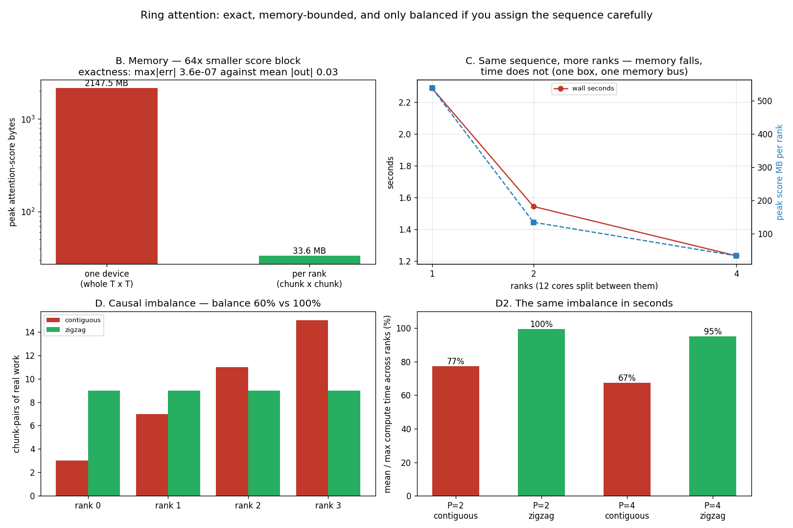

# Ring Attention From Scratch

---

> Pass the keys around the circle until every rank has seen the whole sequence. Four ranks, an 8,192-token sequence, and no rank ever holding more than its slice: the peak attention-score block falls from **2,147 MB to 33.6 MB — 64x** — and the answer is **exact**, matching PyTorch's own fused attention to **3.6 × 10⁻⁷** against a mean output magnitude of 0.028. Then the part nobody warns you about. Causal masking makes the work *unequal*, and with the obvious contiguous split the four ranks do **3, 7, 11 and 15 chunk-pairs** — the fleet runs at **60% of its capacity** because it finishes when its slowest rank does. The zigzag layout gives every rank exactly **9**, and takes measured time-balance from **67.3% to 95.2%**. The most instructive number is where rank 0's idle time went: it shows up in the *communication* column, **0.800 s against the balanced run's 0.109 s**, because a rank that finishes early does not rest — it blocks on the ring waiting for a peer that is still working.

---

## Key Insight

This project implements [ring attention](/shared/glossary/#ring-attention) across 4 GPUs and measures how efficiently it scales at a 64k-token context. Each GPU holds one slice of the sequence ([context parallelism](/shared/glossary/#context-parallelism)). Because a single GPU doesn't have enough memory (VRAM) to hold all the keys and values at once for such a massive text, it passes its keys and values to its neighbor around a ring, round after round, until every slice has attended to every other slice — building the full [KV cache](/shared/glossary/#kv-cache) no single GPU could hold alone.

## Why This Matters

Very long contexts (100k–1M tokens) create a KV cache far too large for one device, so the sequence must be split across many. Ring attention is the standard way to compute [attention](/shared/glossary/#attention) over that split sequence with overlapping communication, and building it by hand shows exactly where the scaling efficiency is won or lost.

---

**This is project 58.**

### The words first

- **Rank** — one process holding one slice of the sequence. Four ranks here; on real hardware, four GPUs.
- **Chunk** — a contiguous run of token positions. The sequence is cut into `2 × ranks` chunks, and each rank owns two of them. Which two is the whole subject of section D.
- **Round** — one step of the ring: compute against the K/V block you are holding, then pass it to your neighbour. After `P` rounds every block has visited every rank.
- **[Online softmax](/shared/glossary/#online-softmax)** — the running-max trick that lets you combine partial attention results correctly. The same idea [FlashAttention](/shared/glossary/#flashattention) uses.
- **Chunk-pair** — one (my query chunk × the key chunk I am holding) multiplication. Causal masking kills some of them entirely, and skipping those is what makes the layout matter.
- **Balance** — mean work per rank divided by the maximum. The fleet finishes when the *slowest* rank does, so this is the fraction of your hardware the layout manages to use.

### "Why not just gather all the keys onto every rank?"

Because that is the thing you cannot afford, and it is the reason context parallelism exists.

Gathering means every rank holds the whole K/V — which is exactly the memory you were trying to escape. For an 8,192-token sequence with 8 heads at 64 dimensions that is only 17 MB per tensor, so on this toy it would work. Scale to what the technique is *for* — a 1M-token context on a 70B model — and the K/V runs to hundreds of gigabytes. No single device holds it, so no gather is possible, and the sequence dimension has to be sharded.

Ring attention's promise is that sharding costs you nothing in accuracy: each rank sees every key eventually, just not all at once. Section A checks that promise rather than assuming it.

### "Softmax needs all the scores at once. How can it possibly be exact?"

This is the objection that makes ring attention look impossible, and the answer is worth understanding because it is the same trick FlashAttention runs on.

Softmax over a row needs `exp(score − max)` for every score, and dividing by their sum. Both the max and the sum are over the *whole* row — which is spread across four ranks. You cannot average four separate softmaxes; that is not the same function.

The fix is to keep a **running** max, sum and output, and repair them when a bigger max shows up:

```
new_m = max(m, block_max)                 # the largest score seen so far
correction = exp(m - new_m)               # what the old numbers were scaled by
l = l * correction + sum(exp(scores - new_m))
o = o * correction + exp(scores - new_m) @ v
```

Every time a block arrives with a larger maximum, everything accumulated so far is rescaled by `exp(m_old − m_new)` — a single multiply — and the arithmetic comes out identical to having seen the whole row at once. Not *approximately* identical: section A measures the difference at 3.6 × 10⁻⁷, which is floating-point rounding, not a different computation.

### "Ring attention shards the sequence. Doesn't tensor parallelism already shard the model?"

They shard different axes and solve different problems, and a real long-context deployment uses both.

| | what is split | fixes | cost |
|---|---|---|---|
| tensor parallelism ([project 44](../44-tp-2-from-scratch/README.md)) | the **weights** (heads, hidden dims) | the model does not fit | an all-reduce **per layer** |
| ring / context parallelism | the **sequence** (token positions) | the *activations and KV* do not fit | a K/V hand-off **per attention block** |

Tensor parallelism does nothing for a long prompt: split a 70B model four ways and each rank still holds the KV for all 1M tokens. Ring attention does nothing for a model too big to load: split the sequence four ways and each rank still holds all 70B weights. They compose, and [project 44](../44-tp-2-from-scratch/README.md) measured what the other one costs.

---

## Running it

```bash
python3 run.py           # ~1 minute
python3 run.py --plot    # redraw from outputs/findings.json
```

`ring.py` is the algorithm and is launched by `run.py` through `torchrun`; `run.py` itself only orchestrates and summarises.

> **On "4 GPUs" and "64k".** The guide's version of this project asks for four GPUs at a 64k context. This machine's GPU (compute capability 6.1) is not usable from this PyTorch build, so the four ranks are four **CPU processes** talking over gloo on loopback, and the sequence is **8,192** tokens — long enough that a whole-sequence score matrix (2,147 MB) genuinely does not fit comfortably, short enough to run in a minute. The algorithm, the message pattern, the exactness and the load imbalance are all identical; only the wire is slower. Where a number depends on the hardware, it says so, and section B carries the arithmetic out to 64k and beyond.

> **About the numbers.** Everything below comes from the committed [`outputs/findings.json`](outputs/findings.json). 8 heads, head width 64, float32, 12 cores split evenly between the ranks.



---

## The ring, in one picture

```
   rank 0        rank 1        rank 2        rank 3
   ┌──────┐      ┌──────┐      ┌──────┐      ┌──────┐
   │ Q0   │      │ Q1   │      │ Q2   │      │ Q3   │   Q never moves
   │ KV0  │─────▶│ KV0  │─────▶│ KV0  │─────▶│ KV0  │─┐ KV goes round
   └──────┘      └──────┘      └──────┘      └──────┘ │
       ▲                                              │
       └──────────────────────────────────────────────┘

   round 0: each rank computes against its own KV
   round 1: ... against its left neighbour's
   round 2: ... two hops away
   round 3: ... three hops away          → every query has seen every key
```

**Q stays put and KV travels.** That is not arbitrary: the output has the same shape as Q, so keeping Q local means each rank produces the slice of the answer it is responsible for and no output ever has to be moved.

**`isend` and `irecv` are posted together, then waited on.** Posting the send, waiting for it, then posting the receive would serialise the ring into "everybody talks, then everybody listens" and halve the available overlap.

---

## A. Is it exact?

Gather every rank's output, reassemble it in sequence order, and compare against `F.scaled_dot_product_attention` over the whole 8,192-token sequence in one process.

| | contiguous | zigzag |
|---|---|---|
| max &#124;ring − whole-sequence&#124; | **3.58 × 10⁻⁷** | **3.58 × 10⁻⁷** |
| mean &#124;output&#124; | 0.028 | 0.028 |
| relative error | ~1.3 × 10⁻⁵ | ~1.3 × 10⁻⁵ |

**Identical to floating-point rounding, and identical between the two layouts** — which is the second half of the check. The zigzag layout reorders which positions live on which rank; if the causal mask were written against *local* row indices rather than absolute positions, that reordering would silently produce a different (wrong) answer while still running fine. Masking against absolute positions is what makes any assignment legal, and matching to 3.58 × 10⁻⁷ in both is the evidence.

**Why this matters more than it sounds.** Ring attention is a *distributed systems* change to a numerical kernel, and the failure mode of getting it slightly wrong is not a crash — it is a model that is a bit worse, on long prompts only, in a way no unit test catches. Checking against a single-process reference is cheap and it is the only thing standing between you and that.

## B. What it saves

| | one device | per rank (4 ranks) |
|---|---|---|
| peak attention-score block | **2,147 MB** | **33.6 MB** |
| | | **64x smaller** |

**64x, not 4x, and the exponent is the point.** Splitting the sequence `P` ways splits the *rows* of the score matrix by `P` and the *columns* by `P`, so the block each rank materialises shrinks by `P²`. Doubling the ranks quarters the peak block.

That is what makes very long contexts reachable at all. Carrying the arithmetic outward, at 8 heads and head width 64 in float32:

| sequence | whole-sequence score matrix | per rank at P=4 | per rank at P=16 |
|---|---|---|---|
| 8,192 (measured) | 2.1 GB | 33.6 MB | 2.1 MB |
| 64,384 | 132 GB | 8.2 GB | 515 MB |
| 1,048,576 | 35 TB | 2.2 TB | 137 GB |

The 35 TB entry is why nobody computes attention as one matrix at any scale, and why FlashAttention-style tiling is not optional — ring attention distributes the tiles across devices, and FlashAttention keeps each device's tile in SRAM. **They are the same idea applied at two levels of the memory hierarchy**, which is the cleanest way to remember what each is for.

**The K/V itself shrinks only linearly** — each rank holds `1/P` of the keys plus one in-flight block, so 2/P of the total. That linear term is what actually decides whether a context *fits*; the quadratic term decides whether a single kernel launch fits.

## C. Does it scale?

Same 8,192-token sequence, world size 1, 2 and 4, with this box's 12 cores split evenly between the ranks.

| ranks | threads each | wall | comm | peak score/rank |
|---|---|---|---|---|
| 1 | 12 | 2.29 s | 0 MB | 536.9 MB |
| 2 | 6 | 1.54 s | 33.6 MB | 134.2 MB |
| 4 | 3 | **1.23 s** | 100.9 MB | **33.6 MB** |

**Memory falls 16x; time falls 1.86x.** Both halves are worth reading carefully, because only one of them is about ring attention.

**The memory result is real and is the point of the technique.** 536.9 → 33.6 MB per rank is exactly the `P²` shrink from section B, and it is the difference between "this context fits" and "this context does not".

**The time result is measuring this box, not the algorithm.** Four ranks here are four processes sharing **one** CPU and **one** memory bus; splitting 12 cores four ways and adding communication cannot produce a speed-up, and 1.86x of one is mostly the better cache behaviour of smaller blocks. On four real GPUs the compute is genuinely parallel and the picture inverts — which is precisely why this section reports *memory per rank* as the headline and treats the wall-clock as context. **Ring attention is a technique for fitting, not for going faster**, and a scaling study on one box will mislead you about that if you let it.

**Communication grows linearly with rank count** (0 → 33.6 → 100.9 MB) because each of `P−1` rounds moves one K/V block. On this loopback that is a few tens of milliseconds; on real hardware it is the number that decides whether ring attention is viable at your interconnect speed, and it is the reason the technique is normally deployed inside a node over NVLink rather than across a network.

## D. The imbalance causal masking hides

This is the section that changes how you would implement it.

A query may only attend to keys at or before its own position. So a query chunk near the *start* of the sequence has almost nothing to look at, and one near the *end* has everything. Hand out contiguous slices and that unevenness lands entirely on the ranks.

| world | layout | chunk-pairs per rank | balance | time-balance | wall |
|---|---|---|---|---|---|
| 4 | contiguous | **3, 7, 11, 15** | **60.0%** | 67.3% | 1.43 s |
| 4 | zigzag | **9, 9, 9, 9** | **100%** | **95.2%** | 1.25 s |
| 2 | contiguous | 3, 7 | 71.4% | 77.3% | 1.80 s |
| 2 | zigzag | 5, 5 | 100% | 99.6% | 1.54 s |

**Rank 3 does 5x the work of rank 0, and the fleet runs at 60% of its capacity**, because a fleet finishes when its slowest member does. That is not a small inefficiency to leave on the table — it means four devices are doing the work of two and a half.

### The fix is an assignment, not an algorithm

Cut the sequence into `2P` chunks and give rank *r* chunk **r** and chunk **2P−1−r**:

```
   chunks:   0   1   2   3   4   5   6   7
   rank:     0   1   2   3   3   2   1   0
             └───────────┘   └───────────┘
              early = cheap    late = expensive
```

Every rank gets one cheap chunk and one expensive one. Counting the chunk-pairs that survive the causal mask, rank *r* owns `(r+1) + (2P−r) = 2P+1` of them — **the same number for every r, with the `r` cancelling out algebraically**. That is why the measured column reads 9, 9, 9, 9 rather than merely "roughly equal".

It is called **zigzag** (or *striped*) because of the shape the assignment makes when you draw it: forward along the first half, back along the second.

### Where the idle time actually appears

The most useful number in this project is not in the table above. It is the *communication* column:

| | rank 0 | rank 1 | rank 2 | rank 3 |
|---|---|---|---|---|
| contiguous — compute | 0.38 s | 0.74 s | 1.15 s | **1.34 s** |
| contiguous — "comm" | **0.800 s** | 0.448 s | 0.027 s | 0.083 s |
| zigzag — compute | 1.10 s | 1.09 s | 1.17 s | 1.10 s |
| zigzag — "comm" | **0.109 s** | 0.146 s | 0.027 s | 0.118 s |

**Rank 0's communication time is 7.3x higher in the unbalanced run — and not one extra byte was sent.** Both layouts move exactly 100.9 MB.

What the timer captured is **waiting**. Rank 0 finishes its 3 chunk-pairs in 0.38 s and then blocks on the ring exchange until a peer that is still grinding through 15 pairs arrives. The idle time has to be charged somewhere, and it is charged to the call that was blocking when the clock was running.

> **This is the diagnostic to remember, because it sends people the wrong way.** A profile of the unbalanced run says "rank 0 spends 68% of its time in communication" and the natural response is to go looking for a faster interconnect. The interconnect is fine. The *schedule* is wrong, and no amount of bandwidth fixes a rank that has nothing to do. ([Project 44](../44-tp-2-from-scratch/README.md) hit the same trap from the other side: its measured all-reduce time included waiting for a peer, so load imbalance was billed as communication there too.)

**One honest note on the wall-clock.** Fixing balance from 60% to 100% moved the wall time only 1.43 → 1.25 s (1.14x), far less than the balance figures suggest. On this box the ranks share one memory bus, so rank 3 does not actually run at full speed while the others idle — the "idle" ranks were never freeing up a resource rank 3 was short of. On four real GPUs, where the ranks are genuinely independent, the balance number *is* the speed-up, and this is the one place where the CPU stand-in understates the effect rather than merely slowing it down.

---

## What to take from this

1. **Ring attention is exact**: 3.58 × 10⁻⁷ against a mean output magnitude of 0.028, identical under both layouts. The online-softmax rescaling is not an approximation.
2. **The peak score block shrinks by `P²`, not `P`** — 2,147 MB to 33.6 MB at four ranks, 64x. That quadratic is what makes million-token contexts reachable.
3. **The K/V itself shrinks only linearly** (2/P per rank), and that is the term that decides whether a context fits.
4. **Report memory per rank, not wall-clock.** Four ranks on one CPU cannot go 4x faster; ring attention is a technique for *fitting*, not for speed.
5. **Causal masking makes contiguous slices unequal**: 3, 7, 11, 15 chunk-pairs, and a fleet at 60% of capacity.
6. **The zigzag layout balances it exactly** — `(r+1) + (2P−r) = 2P+1`, the same for every rank — taking time-balance from 67.3% to 95.2%.
7. **Idle time is billed as communication.** Rank 0's "comm" time is 7.3x higher when unbalanced, with identical bytes moved. Profile that naively and you will go shopping for network hardware you do not need.
8. **Mask against absolute positions, not local indices.** It costs nothing and it is what makes any chunk assignment — including zigzag — legal.

### Common traps this project walks into on purpose

- **Averaging softmaxes.** Four partial softmaxes do not combine into one. The running max/sum/output is the only correct way, and getting it wrong produces plausible numbers.
- **`exp(-inf − -inf)` is NaN.** A fully-masked block has a row max of −inf, and the correction term poisons the accumulator on the very first round. Rows that are entirely masked get a zero correction instead.
- **Masking against local row indices.** Works perfectly for contiguous slices and silently corrupts zigzag, which is why section A checks both layouts against the same reference.
- **Not skipping fully-masked blocks.** Without the skip, contiguous and zigzag do identical work and the whole of section D disappears — the imbalance only exists because the skipped work is real.
- **Reading a communication profile literally.** 0.800 s of "comm" on rank 0 is 0.75 s of waiting.
- **Giving every rank all 12 threads.** Four processes × 12 threads on 12 cores oversubscribes 4x and turns a scaling study into a study of the Linux scheduler.
- **Comparing wall-clock across world sizes on one box.** The cores are being divided, not added.

---

## Phase 8 complete

Eight projects, and the thread running through them is that the "table-stakes" features — long context, structured output, per-tenant adapters, retrieval prefixes, live sessions — are each a small research problem with a real production answer, and in almost every case the number that decides the design was **not** the one the technique is named after:

- [**51**](../51-needle-in-a-haystack/README.md) — the sharpest recall cliff was invented by the cache policy, not the model. Four pinned tokens separated fluent output from babble.
- [**52**](../52-prefix-kv-caching/README.md) — prefix caching is exact and 2.45x, and costs 2,923x the document text to store. A cache reused at the wrong position lies fluently.
- [**53**](../53-json-mode-reliability/README.md) — validity went to 99.4% and every accuracy point gained was one that formatting had been destroying. JSON mode changes failures from unparseable to parseable-and-wrong.
- [**54**](../54-custom-grammar/README.md) — baking the real schema into the automaton took invented identifiers to 0%, and a missing pair of parentheses in the grammar cost 39 points silently.
- [**55**](../55-multi-lora-serving/README.md) — 4.99x on memory with no crossover; the throughput win is batch fragmentation and arrives only when tenants outnumber the batch.
- [**56**](../56-speculation-json-mode/README.md) — 2.14x fewer forward passes, and asking the grammar for forced *text* rather than a forced *token* was worth 14x on its own.
- [**57**](../57-stateful-session-api/README.md) — the unlimited cache had the worst tail in the project, and admission control beat every eviction policy.
- **58** — exactness for free, memory by `P²`, and a load-balancing bug that disguises itself as a networking problem.

[Phase 9](../../README.md#phase-9-observability-slos-and-cost-economics) turns from building these features to knowing whether they are working: metrics, SLOs, error budgets, and what a token actually costs.
