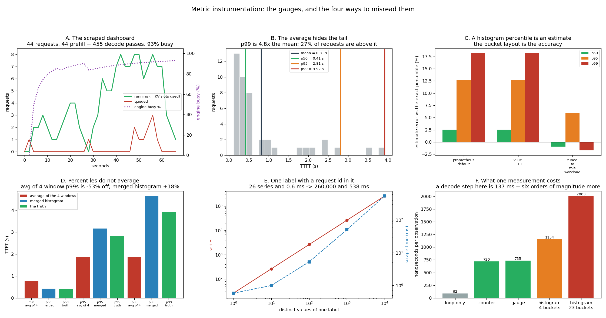

# Metric Instrumentation

---

> Wiring every dashboard metric into a real engine costs **2 microseconds per measurement** against a **137 ms** forward pass — instrumentation is free. Reading it is where the money goes. Four honest results, all from the same 44-request run. The [p99](/shared/glossary/#percentile) [TTFT](/shared/glossary/#ttft) is **4.8x the mean**, and only **27% of requests are slower than the average** — so "average latency" describes almost nobody. A p99 read out of a [Prometheus](/shared/glossary/#prometheus) [histogram](/shared/glossary/#histogram-metrics) is **18.2% too high** with the default buckets, and **Prometheus' defaults and vLLM's give the identical wrong answer** because at 3.9 s they land in the same bucket; buckets tuned to this workload land within **1.7%**. Averaging the p99 of four windows reports **1.85 s where the truth is 3.92 s — 53% too low** — while the same four windows' *histograms*, added together, give the right answer. And one label carrying a request id takes the registry from **26 series and a 0.6 ms scrape to 260,000 series and a 538 ms scrape** — a 12.8 MB text page fetched every fifteen seconds.

---

## Key Insight

Metric instrumentation means adding code to a serving engine (like [vLLM](/shared/glossary/#vllm)) so it continuously reports numbers about its own behavior — [latency](/shared/glossary/#latency), [throughput](/shared/glossary/#throughput), error rate, GPU usage — which tools such as Prometheus and Grafana then collect and graph. Watching [percentiles](/shared/glossary/#percentile) like p99, not just averages, is what reveals the slow requests real users actually feel.

## Why This Matters

Without live metrics a problem only surfaces when a customer complains. Wiring up the right signals is the foundation of [observability](/shared/glossary/#observability) — the basis on which every dashboard, alert, and capacity decision is built.

---

**This is project 59.**

### The words first

- **Metric** — one named number the server reports about itself, e.g. `llm_generation_tokens_total`.
- **[Counter](/shared/glossary/#counter-metrics)** — a number that only goes up: tokens generated, requests finished. You never read a counter directly; you read its *rate of change*.
- **[Gauge](/shared/glossary/#gauge-metrics)** — a number that goes up and down: queue depth, KV bytes in use. It is only true at the instant it is read.
- **[Histogram](/shared/glossary/#histogram-metrics)** — a set of counters, one per **bucket**. The bucket labelled `le="0.5"` counts every observation *less than or equal to* 0.5 seconds. That is how a percentile survives being written down without storing every measurement.
- **Label** — a `key="value"` pair attached to a metric (`kind="decode"`). Every distinct combination of label values is its own independent series. This is the knife in section E.
- **[Cardinality](/shared/glossary/#cardinality-metrics)** — how many distinct series a metric has. A label with a request id in it has cardinality equal to your traffic.
- **Scrape** — Prometheus fetching the server's `/metrics` page over plain HTTP, usually every 15 seconds. There is no SDK and no push: the server prints text, Prometheus reads it.
- **[Exposition format](/shared/glossary/#exposition-format)** — the text on that page. Two comment lines per metric family, one line per series.

### "The engine already prints its speed. Why add a metrics library?"

Because a printed number is a fact about *one moment*, and every question you will actually be asked is a question about a *distribution over time*.

`print(f"{tok_s:.1f} tok/s")` in a log line can answer "how fast was that request?". It cannot answer "what fraction of requests last Tuesday took longer than 500 ms?", because by Tuesday evening the line has scrolled away and nothing added it up. A metrics library is the thing that keeps a running total: counters accumulate, histograms bucket, and the whole state is re-readable at any instant.

The difference shows up sharply in section B. The engine's own log would have reported a mean TTFT of 0.81 s and everyone would have been happy. The histogram says the slowest 1% of users waited 3.92 s. **Same run, same code path, same requests** — the log simply had nowhere to put the shape of the distribution.

### "Why write the library instead of `pip install prometheus_client`?"

Because two of this project's four results are *arithmetic mistakes made by the reader*, and you cannot see an arithmetic mistake through a library you have not read.

Sections C and D are both about what happens between "the server recorded a number" and "the dashboard drew a number", and both are invisible if `histogram_quantile` is somebody else's C code. [`obslib.py`](obslib.py) reimplements Prometheus' bucket semantics and its interpolation rule exactly, in about eighty readable lines, so that section C can score the estimate against the truth and section D can show the merge that fixes it. In production you should absolutely use the real client — after you have read this file once.

---

## Running it

```bash
python3 run.py           # ~80 seconds
python3 run.py --plot    # redraw from outputs/findings.json
```

Needs [project 16](../16-static-vs-continuous/README.md)'s `batchlib.py` (the batched Qwen2.5-0.5B engine). Nothing is downloaded that the earlier phases have not already fetched.

> **About the numbers.** Everything below comes from the committed [`outputs/findings.json`](outputs/findings.json): 44 requests, Poisson arrivals at 0.9 req/s, 8 KV slots, 44 prefill + 455 decode forward passes, engine 93% busy. The exposition page the server actually served is committed as [`outputs/metrics.txt`](outputs/metrics.txt).



---

## A. What a real `/metrics` page looks like

The whole Prometheus integration is this: the process opens an HTTP port and prints text when asked.

```
# HELP llm_requests_total Requests finished, by outcome.
# TYPE llm_requests_total counter
llm_requests_total{outcome="ok"} 44
# HELP llm_prompt_tokens_total Prompt tokens prefilled.
# TYPE llm_prompt_tokens_total counter
llm_prompt_tokens_total 3764
# HELP llm_generation_tokens_total Tokens generated.
# TYPE llm_generation_tokens_total counter
llm_generation_tokens_total 1769
# HELP llm_iterations_total Forward passes, by kind.
# TYPE llm_iterations_total counter
llm_iterations_total{kind="prefill"} 44
llm_iterations_total{kind="decode"} 455
```

Twelve metric families, **93 series, 5,820 bytes**. That is the entire dashboard in the guide's figure — TTFT, ITL, end-to-end latency, queue time, running and waiting counts, KV occupancy, engine busy fraction — and it fits in a page smaller than this README.

Two details worth noticing, because they are design decisions and not accidents:

**The empty server already exposes 90 of the 93 series.** Scraping before any traffic returns every bucket at zero. That is why a fresh replica's dashboard shows a flat line at zero rather than "no data" — and why an alert on `absent(llm_requests_total)` means "the process is gone", not "the process is idle".

**`llm_iterations_total{kind="decode"} 455` is the whole story of continuous batching in one line.** 44 prompts produced 1,769 tokens in 455 decode passes, so the average pass carried 1769/455 = **3.9 rows**. Divide the busy time by the passes and you get 137 ms per forward pass, which is the number section F compares the instrumentation cost against.

---

## B. The average describes almost nobody

| | mean | p50 | p95 | p99 | p99 / mean | % of requests above the mean |
|---|---|---|---|---|---|---|
| TTFT | 0.81 s | 0.41 s | 2.81 s | **3.92 s** | **4.8x** | 27% |
| ITL | 154 ms | 131 ms | 363 ms | **806 ms** | **5.2x** | 13% |
| End-to-end | 6.86 s | 6.54 s | 12.58 s | 14.33 s | 2.1x | 39% |

Read the last column first, because it is the one that surprises people. **Only 27% of requests were slower than the mean TTFT.** The average is not the middle. A handful of very slow requests drags it upward until it sits well above the typical experience — the mean is 0.81 s while the median user waited 0.41 s, half that.

So the mean is simultaneously **too high to describe the typical user** and **far too low to describe the unhappy one**. It is the one number that is wrong in both directions at once, and it is the number most default dashboards show.

**The two tails have different shapes, and that is a diagnostic.** TTFT's p99 is 4.8x its mean; end-to-end's is only 2.1x. End-to-end latency is dominated by "how many tokens did you ask for", which is a smooth, predictable quantity. TTFT is dominated by "how long did you sit in the queue", which is not — [queueing](/shared/glossary/#littles-law) delay explodes as the system fills up. When you see a metric whose p99 is five times its mean, the cause is usually *waiting*, not *working*.

> **An honest caveat that also happens to be a lesson.** With 44 requests, the p99 *is* the maximum — there is no 44th-of-a-percent. A percentile needs at least `100/(100-p)` samples to mean anything, so a p99 needs 100 requests minimum and a p999 needs a thousand. **Every low-traffic endpoint on your dashboard has a meaningless p99 for exactly this reason**, and it will still be drawn as a confident line. Project 60 measures how the estimate moves as the sample grows.

---

## C. A percentile read out of a histogram is an estimate

A histogram does not store the observations. It stores how many fell into each bucket. To get a p99 back out, Prometheus finds the bucket the 99th-percentile observation must be in and then **interpolates linearly between that bucket's lower and upper edge**, assuming the observations inside are spread evenly. They never are.

| bucket layout | buckets | p50 error | p95 error | p99 error |
|---|---|---|---|---|
| Prometheus defaults | 15 | +2.6% | +12.7% | **+18.2%** |
| vLLM's TTFT buckets | 23 | +2.6% | +12.7% | **+18.2%** |
| tuned to this workload | 25 | −1.0% | +5.9% | **−1.7%** |

**Prometheus' defaults and vLLM's give the byte-identical answer, and the extra eight buckets bought nothing.** vLLM's layout runs out to 2,560 seconds and Prometheus' stops at 10, but in the region where this workload actually lives they share the same edges — `..., 1.0, 2.5, 5.0, ...`. The true p99 is 3.92 s, which falls in the 2.5→5.0 bucket in *both* layouts, so both interpolate over the same 2.5-second-wide gap and both land on 4.633 s.

The consequence is the practical one: **more buckets do not mean more accuracy. Buckets in the right place do.** The tuned layout here is geometric — each edge 1.35x the last — so the bucket containing the p99 is about 1 s wide instead of 2.5 s, and the estimate lands within 1.7%.

**The error is one-directional at the tail, and that direction is dangerous.** Both default layouts overstate: they report 4.63 s when the truth is 3.92 s. Overstating your own latency sounds harmless until you are choosing hardware, or arguing that an optimisation helped. It also means a p99 that "improves" by 15% may have done nothing except move across a bucket edge.

### The `+Inf` rule, which did not fire here and will fire on you

Every Prometheus histogram ends with a bucket labelled `+Inf` that catches everything above the largest finite edge. If the percentile you ask for lands in that bucket, `histogram_quantile` returns **the largest finite edge** — not infinity, not an error, just the last number it knows.

In this run nothing exceeded 10 s, so the overflow count was 0 in every layout and the rule stayed asleep. Give the same code a 30k-token prefill that takes 40 seconds and Prometheus' default layout will report your p99 as **exactly 10 s, forever**, no matter how bad it gets. That flat line at precisely the top bucket edge is the single most common "our latency is stable" illusion in LLM monitoring, and it is why vLLM's layout runs to 2,560 s even though almost nothing ever gets there.

---

## D. Percentiles do not average — histograms do

Split the run into four consecutive time windows, take each window's p99, average the four:

| | p50 | p95 | p99 |
|---|---|---|---|
| average of the 4 windows' quantiles | 0.76 s | 1.85 s | **1.85 s** |
| **the truth** (all observations, one sort) | 0.41 s | 2.81 s | **3.92 s** |
| the four windows' **histograms added together** | 0.42 s | 3.17 s | 4.63 s |
| | **+84%** | **−34%** | **−53%** |

**The average of four p99s reports 1.85 s where the truth is 3.92 s.** It hides more than half of the tail. And note the p50 row: there the same operation errs *upward* by 84%. **Averaging quantiles is not biased in a knowable direction** — you cannot even apply a correction factor, because which way it goes depends on how the load happened to be distributed across the windows.

Why it fails is easier to see than the formula. Here are the four windows:

| window | requests | its own p99 |
|---|---|---|
| 0 | 11 | 0.52 s |
| 1 | 11 | 0.84 s |
| 2 | 11 | 2.11 s |
| 3 | 11 | **3.92 s** |

The four slowest requests in the whole run are all in window 3. Window 0's p99 is a promise about *its own eleven requests* and says nothing about the run. Averaging the four means letting three quiet windows vote down the one that contains the incident. **A quantile is a statement about a specific set of observations; it does not survive being mixed with a quantile about a different set.**

**Adding the histograms works, because a histogram is just counts.** Window 3's `le="5.0"` bucket count plus window 0's is exactly the count you would have gotten from one histogram over both windows — nothing is lost. Run `histogram_quantile` on the sum and you get 4.63 s, whose only error (+18%) is the bucket-width error from section C. **That is the entire reason Prometheus' quantile function takes a histogram and not a number.**

> **The replica version of this mistake is the same arithmetic.** Four windows of one engine or four replicas of one service — either way you have four separate sets of observations and one question about their union. The panel that says `avg(ttft_p99) by (replica)` is wrong in production for exactly the reason it is wrong here. The correct query sums the bucket counters across replicas *first*, then takes the quantile: `histogram_quantile(0.99, sum by (le) (rate(llm_ttft_bucket[5m])))`. The `sum by (le)` is not decoration; it is the fix.

---

## E. What instrumentation costs, and what one bad label costs

### The measurement itself is free

| operation | nanoseconds |
|---|---|
| the timing loop alone | 92 |
| counter `.inc()` | 720 |
| gauge `.set()` | 735 |
| histogram `.observe()`, 4 buckets | 1,154 |
| histogram `.observe()`, 23 buckets | 2,003 |

The most expensive measurement in the library is **2 microseconds**. One decode forward pass in this run was **137 milliseconds**. That is a ratio of about **68,000 to 1** — you could take sixty measurements per token and still not be able to find the cost in the noise.

This is worth stating plainly because "we removed the metrics to make it faster" is a real thing teams do. In an LLM server it is never the right trade: the work unit is a forward pass measured in tens of milliseconds, and the instrumentation is measured in microseconds. (This is pure-Python bookkeeping, too — the real `prometheus_client` is faster.) The histogram's cost scales with bucket count exactly as you would expect, because `observe` walks the bucket list; 23 buckets cost 1.7x what 4 do, and it still does not matter.

### The label is what costs

Now attach a label whose value varies per request:

| distinct label values | time series | scrape size | scrape time |
|---|---|---|---|
| 1 | 26 | 1.4 kB | 0.6 ms |
| 10 | 260 | 12.8 kB | 1.0 ms |
| 100 | 2,600 | 127 kB | 5.3 ms |
| 1,000 | 26,000 | 1.3 MB | 50 ms |
| 10,000 | 260,000 | **12.8 MB** | **538 ms** |

**Ten thousand label values cost 260,000 series and a 538 ms scrape**, a 920x slowdown from the same amount of measured traffic. Every 15 seconds, forever, your monitoring system downloads and parses a 12.8 MB text file.

The multiplier is the histogram. A counter with 10,000 label values is 10,000 series; **a histogram with 10,000 label values is 260,000**, because each one carries 23 buckets plus a `_sum` and a `_count`. That 26x amplification is why the advice is specifically *never put an unbounded value in a histogram label* — a user id, a session id, a prompt hash, a full URL path.

**And the storage cost is worse than the scrape cost.** Prometheus keeps every series it has ever seen in memory for the retention window. Ten thousand short-lived request ids are ten thousand series that are written once and then sit there — the failure mode has a name, *cardinality explosion*, and it is the most common way a monitoring system takes down the service it was installed to protect.

The rule that follows: **a label's values must come from a small, fixed set you could write down** — `kind="prefill"|"decode"`, `outcome="ok"|"shed"|"error"`, `model="..."`. If you cannot enumerate them, it is not a label; it belongs in a log line or a trace, where per-request detail is the whole point and nothing is being kept in RAM as a time series.

---

## What to take from this

1. **The whole Prometheus integration is a text page over HTTP.** Twelve metric families, 93 series, 5,820 bytes — the entire dashboard in the guide's figure.
2. **The mean describes nobody.** Only 27% of requests were slower than the mean TTFT; the p99 was 4.8x it.
3. **A p99 that is ~5x the mean means *waiting*, not *working*.** TTFT's ratio is 4.8x, end-to-end's is 2.1x.
4. **A histogram percentile is an estimate**, +18.2% at p99 with the default buckets and −1.7% with buckets placed where this workload lives.
5. **Prometheus' defaults and vLLM's gave the identical wrong answer.** More buckets is not more accuracy; buckets in the right place is.
6. **If the percentile lands in `+Inf`, Prometheus returns the largest finite bucket edge** and your dashboard shows a confident flat line at that number.
7. **Averaging four windows' p99s reported 1.85 s against a true 3.92 s** — 53% low at p99 and 84% *high* at p50. There is no correction factor.
8. **Adding the four histograms and then taking the quantile is correct.** `sum by (le)` before `histogram_quantile`, always.
9. **Instrumentation costs 2 µs against a 137 ms forward pass** — 68,000x apart. Never remove metrics for speed.
10. **One request-id label cost 260,000 series and a 538 ms scrape.** A histogram multiplies label cardinality by 26.

### Common traps this project walks into on purpose

- **Reading a p99 off 44 samples.** It is the maximum. A p99 needs 100 observations before the word means anything.
- **Believing a wider bucket list is a better one.** vLLM's 23 buckets and Prometheus' 15 scored identically here.
- **`avg(p99) by (replica)` in a Grafana panel.** Wrong by 53% on this data, and wrong in an unpredictable direction.
- **Putting a request id, session id or prompt hash in a label.** 12.8 MB per scrape.
- **Reading a counter instead of its rate.** `llm_generation_tokens_total` is 1,769 and means nothing; `rate(...[5m])` is tokens per second and means everything.
- **Trusting a gauge between scrapes.** `llm_num_requests_waiting` is only true at the instant it is read; a 200 ms queue spike inside a 15 s scrape interval never happened as far as the dashboard is concerned.
- **Removing instrumentation to go faster.** Six orders of magnitude in the wrong direction.

---

## Next

[Project 60 — synthetic load tests](../60-synthetic-load-tests/README.md) points the same instruments at a load generator and finds that the *harness* is part of the measurement: a closed-loop driver reports better latency than an open-loop one at the same offered rate, and the length distribution you feed it changes the p99 by 1.7x with no change to the mean.
