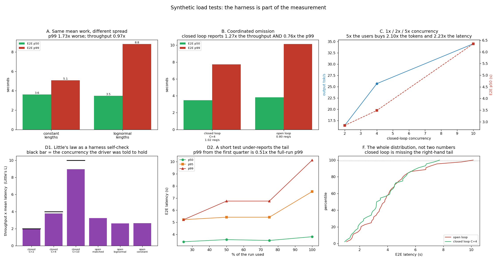

# Synthetic Load Tests

---

> Four results that all say the same thing: **the load-test harness is part of the measurement.** Two traces with the *identical mean* prompt and output length, differing only in **spread**, produce a **1.73x** difference in end-to-end p99 (5.09 s vs 8.83 s) at the same throughput — so a benchmark with fixed-length prompts is measuring a system you do not run. A **closed-loop** driver (4 workers, each sending the next request when the last returns) reports **1.27x the throughput and a 24% better p99** than an **open-loop** driver fed the same nominal rate — [coordinated omission](/shared/glossary/#coordinated-omission), and it flatters you in both directions at once. Going from 2 to 10 concurrent users buys **2.10x the tokens** and costs **6.8x the [TTFT](/shared/glossary/#ttft)**. And the p99 computed from the first quarter of a run is **0.51x** the p99 of the whole run — a short test does not just have a noisy tail, it has *half* of one. The honest inversion: **discarding the warm-up made the number worse**, because in an open-loop test the first requests are the *fastest* ones.

---

## Key Insight

This project generates fake-but-realistic traffic — prompts and outputs with lifelike length distributions — and replays it at 1×, 2×, and 5× concurrency to see how [latency](/shared/glossary/#latency) and [throughput](/shared/glossary/#throughput) hold up as load grows.

## Why This Matters

Single-request timing lies about production, where many users hit the server at once. Measuring under realistic concurrent load is the only honest way to learn how much traffic one replica can absorb before it breaks its targets.

---

**This is project 60.**

### The words first

- **Open loop** — the generator sends each request at a pre-decided time, whatever the server is doing. Models the real world: users keep arriving even when you are struggling.
- **Closed loop** — the generator keeps exactly *C* requests in flight and starts the next one only when one finishes. Models *C* users who each wait for a reply before typing again.
- **[Coordinated omission](/shared/glossary/#coordinated-omission)** — the systematic error a closed-loop test makes. When the server slows down, the driver slows down with it, so the requests that would have been slowest are never sent. The test *coordinates* with the thing it is measuring.
- **Lognormal** — a length distribution whose *logarithm* is a bell curve: most requests short, a thin tail of very long ones, never negative. Real prompt lengths look like this.
- **[Little's law](/shared/glossary/#littles-law)** — `concurrency = throughput x mean latency`, true for any queue. Used here as a self-check on the harness.
- **Warm-up** — the first requests of a run, conventionally discarded because caches and allocators are cold.

### "Project 59 already measured this engine. Why measure it again?"

Project 59 built the *instruments*; this project points them at a *driver* and discovers that the driver has opinions.

Every number in project 59 came from one traffic pattern that was simply asserted: Poisson arrivals at 0.9 requests per second, lognormal lengths. Nobody asked what would have happened with a different pattern. This project asks, and the answer is that changing only the *shape* of the length distribution — holding the mean fixed — moves the p99 by 1.73x, and changing only the *driver style* moves the reported throughput by 1.27x. Neither change touched the model, the engine, the scheduler or the hardware.

That is the reason a benchmark number is meaningless without its workload. "1,800 tokens/second" is not a property of a server.

### "Why does closed loop need a special name? Isn't it just fewer users?"

No, and the difference is the single most common way a load test lies.

Picture a supermarket with four customers who each shop, pay, leave, and immediately come back. That is a closed loop: the arrival rate is *whatever the checkout can manage*. If the cashier freezes for ten minutes, the queue does not grow — nobody new arrives, because the four customers are all still standing at the till. Afterwards you report "average wait: 2 minutes", and you are not lying, you simply never generated the traffic that would have exposed the problem.

Now picture the real shop, where people walk in from the street at their own pace. That is an open loop. If the cashier freezes for ten minutes, thirty people pile up, and every one of them records a ten-minute wait.

**The frozen cashier is what a load test exists to find.** Section B measures the gap.

---

## Running it

```bash
python3 run.py           # ~5 minutes
python3 run.py --plot    # redraw from outputs/findings.json
```

Needs [project 16](../16-static-vs-continuous/README.md)'s `batchlib.py` and [project 59](../59-metric-instrumentation/README.md)'s `obslib.py`.

> **About the numbers.** Everything below comes from the committed [`outputs/findings.json`](outputs/findings.json): 44 requests per arm, 8 KV slots, mean prompt 86 tokens, mean output 25 tokens, six full engine runs. The clock is *virtual* — it advances by the measured duration of each real forward pass, so the arrival timeline is synthetic but every millisecond of model time was actually spent. That is what makes six arms comparable on a machine whose background load this project does not control.



---

## A. Same mean work, 1.73x the tail

Two open-loop runs at the same arrival rate. One draws prompt and output lengths from a lognormal; the other uses a **constant** length equal to the lognormal's mean — 86 prompt tokens and 25 output tokens for every request. Total tokens differ by 0.5%.

| | requests/s | output tok/s | E2E p50 | E2E p95 | E2E p99 | ITL p99 |
|---|---|---|---|---|---|---|
| constant lengths | 0.72 | 18.0 | 3.63 s | 4.81 s | **5.09 s** | 620 ms |
| lognormal lengths | 0.70 | 17.6 | 3.48 s | 7.37 s | **8.83 s** | 752 ms |
| | 0.97x | 0.97x | 0.96x | **1.53x** | **1.73x** | 1.21x |

**The medians are within 4% of each other and the p99s are 1.73x apart.** Every summary statistic that describes the middle of the distribution says these two workloads are the same. Every statistic that describes the edge says they are not.

The mechanism is worth spelling out because it is not "long requests take longer" — that would be trivially true and would show up in the mean too. What happens is **head-of-line blocking**: a long request occupies a KV slot for its whole life, so a short request arriving behind it waits for something it has nothing to do with. Constant-length traffic cannot produce that situation, because there is no such thing as a long request. Spread in the *input* becomes delay for requests that were never long themselves.

**The consequence for anyone choosing a benchmark:** a suite built on fixed 128-token prompts measures a queueing system that does not exist. It will rank engines by raw throughput and be blind to every scheduling decision — chunked prefill, priority, preemption, fair sharing — because those decisions exist entirely to manage spread. Project 18 and project 20 both measure knobs that this benchmark would score at exactly zero.

---

## B. Coordinated omission, measured

The closed-loop driver held 4 requests in flight and achieved 1.02 req/s. The open-loop driver was then given a Poisson trace generated at **exactly that rate** and turned loose.

| | achieved req/s | engine busy | TTFT p99 | E2E p50 | E2E p95 | **E2E p99** |
|---|---|---|---|---|---|---|
| closed loop, C=4 | **1.02** | 100% | 0.81 s | 3.49 s | 6.79 s | **7.73 s** |
| open loop, same nominal rate | 0.80 | 86% | 1.00 s | 3.82 s | 7.55 s | **10.14 s** |

**The closed-loop test reports 1.27x the throughput and a 24% better p99. Both numbers are wrong in the flattering direction.**

Take the throughput first, because it is the sneakier of the two. The closed-loop driver never lets the engine go idle — there is always work, by construction — so `engine busy` is 100.0% and the throughput it reports is the engine's **maximum capacity**. That is a real and useful number, but it is not the throughput you can sell, because real users do not arrive in a way that keeps you perfectly packed. The open-loop run at the same nominal rate left the engine idle 14% of the time and delivered 0.80 req/s. **A closed-loop benchmark measures capacity and gets reported as throughput.**

Now the latency. The open-loop run *did less work* and still had a worse p99. There is no contradiction: in the open loop, arrivals sometimes bunch up, and the requests caught in a bunch record their real wait. In the closed loop a bunch cannot happen — the fifth request cannot arrive until one of the four in flight has left. **The driver is throttled by exactly the delay it is supposed to be measuring.**

**Honest sizing of the effect: 1.27x and 1.31x, not 10x.** Coordinated omission is famous for producing order-of-magnitude errors, and it does — during an *outage*, when a stall of many seconds suppresses hundreds of would-be arrivals. This run has no outage in it, only ordinary queueing, so the gap is a moderate one. Project 66 injects a real stall and the same comparison gets much uglier. Panel F plots the two full distributions: they track each other closely up to about the 85th percentile and separate only in the last 15%, which is exactly the region a load test exists to measure.

> **The rule this gives you:** use a closed loop to find capacity (what is the most this replica can do?) and an open loop for everything else (what will users experience at 200 requests/minute?). Reporting a closed-loop latency number as an SLO measurement is the mistake.

---

## C. 1x / 2x / 5x concurrency, and Little's law as a self-check

| concurrency | output tok/s | TTFT p50 | E2E p50 | E2E p99 | Little's `L` |
|---|---|---|---|---|---|
| 2 | 16.4 | 0.24 s | 2.85 s | 6.01 s | 1.94 |
| 4 | 25.7 | 0.25 s | 3.49 s | 7.73 s | 3.77 |
| 10 | 34.5 | **1.61 s** | 6.35 s | 12.83 s | 8.97 |
| **10 vs 2** | **2.10x** | **6.8x** | 2.23x | 2.14x | |

**Five times the users bought 2.10x the tokens and cost 6.8x the time-to-first-token.** This is the whole economics of batching in one row, and the asymmetry between the two costs is the interesting part.

End-to-end latency roughly doubled, which is the sort of number a product manager can live with. TTFT went up nearly seven-fold, which is the sort of number users notice immediately, because TTFT is the pause between pressing enter and seeing anything at all. The reason they diverge: the engine has **8 KV slots**, so at C=10 two requests are always waiting outside the engine with no slot at all. Their TTFT is pure queueing. Once admitted they decode at nearly the same speed as everyone else, so end-to-end grows much more gently.

**Read that as a capacity-planning rule.** The point where concurrency exceeds your slot count is the point where TTFT stops being a property of the model and becomes a property of the queue. On this engine that is C=8. Project 61 finds the same wall from the arrival-rate side.

### Little's law caught the harness's own bias

`L = throughput x mean latency` must equal the concurrency the driver was told to hold. It came out **1.94, 3.77 and 8.97** against 2, 4 and 10 — short by 3%, 6% and 10%.

The deficit is real and it is the harness's fault, not the law's. At the end of every run the driver runs out of requests, so the last few finish with fewer than *C* in flight; the run's *average* concurrency is therefore below the target, and the shortfall grows with *C* because a bigger ramp-down takes longer to drain. **This is the standard argument for discarding the first and last portion of a load test** — and note it is an argument about the *end* of the run, not the beginning.

Little's law costs one line of code and catches the whole class of harness bugs where the driver is not applying the load you think it is. Run it on every row.

---

## D. How long must a load test run?

The same open-loop run, with the p50/p95/p99 recomputed from the first 25%, 50%, 75% and 100% of completed requests.

| fraction of the run | requests | p50 | p95 | **p99** |
|---|---|---|---|---|
| 25% | 11 | 3.40 s | 5.22 s | **5.22 s** |
| 50% | 22 | 3.58 s | 5.43 s | 6.76 s |
| 75% | 33 | 3.50 s | 5.43 s | 6.76 s |
| 100% | 44 | 3.82 s | 7.55 s | **10.14 s** |

**The p99 from the first quarter is 0.51x the p99 of the whole run**, while the p50 moved by 12%. The median is stable after eleven requests; the tail is not stable after forty-four.

Two things are happening and they compound. The obvious one: **a tail is made of rare events, so a short sample simply has not seen one yet.** With 11 requests there is no such thing as a 99th percentile — the number in that cell is the maximum of eleven, exactly the caveat project 59 raised. The less obvious one: **latency in an open-loop test is not stationary.** The queue builds over the run, so late requests really are slower than early ones. Both point the same way, which is why the error is so large and so one-directional.

**The practical rule: size a load test by how many samples the percentile needs, not by how many minutes feels reasonable.** A p99 needs at least 100 requests past the point where the queue has stabilised; a p999 needs a thousand. If your traffic is 5 requests per second, a p999 needs several minutes of *steady-state* — and if your test is shorter than that, do not put the number on a slide.

### The inversion: discarding the warm-up made the number worse

| | E2E p50 |
|---|---|
| all 44 requests | 3.815 s |
| dropping the first 3 | **3.899 s** |

Standard load-testing advice is to throw away the warm-up, because the first requests hit cold caches, cold allocators and JIT compilation. Doing that here made the reported median **2.2% worse**, not better.

Both halves of the explanation matter. First, this harness runs in virtual time and the model is loaded before the clock starts, so there is no cold-start cost to remove. Second — and this is the part that generalises — **in an open-loop test the first requests arrive at an empty system**, so they are the *fastest* requests in the run, not the slowest. Discarding them removes the best samples and pushes every percentile up.

**So "discard the warm-up" is not a universal rule; it is a fix for a specific cause.** If your warm-up cost is initialisation (cold cache, first CUDA kernel compile, lazy weight load), discard it. If your run starts on an idle system and fills up, discarding the start is throwing away data and biasing the result. Check which one you have before you cut.

---

## What to take from this

1. **Same mean, different spread, 1.73x the p99.** Fixed-length benchmark traffic measures a queueing system you do not run.
2. **Spread hurts requests that were never long.** Head-of-line blocking turns input variance into other people's latency.
3. **A closed-loop driver reported 1.27x the throughput and a 24% better p99** than an open loop at the same nominal rate.
4. **Closed loop measures capacity; open loop measures experience.** A closed-loop engine is 100.0% busy by construction.
5. **5x concurrency bought 2.10x the tokens and cost 6.8x the TTFT.** The asymmetry appears exactly when concurrency exceeds the slot count (8 here).
6. **Little's law caught a 3–10% shortfall** in the driver's actual concurrency — the run's ramp-down, growing with C.
7. **The p99 from the first quarter of the run was 0.51x the full-run p99.** Size the test by samples-per-percentile, not by minutes.
8. **Discarding the warm-up made the median 2.2% worse.** In an open-loop test the first requests arrive at an empty system and are the fastest.

### Common traps this project walks into on purpose

- **Fixed-length prompts.** Every scheduling feature scores exactly zero.
- **Reporting a closed-loop latency as an SLO measurement.** It is throttled by the delay it is measuring.
- **Comparing throughput between a closed-loop and an open-loop run.** One is capacity, the other is delivered rate.
- **Trusting `L != C`.** If Little's law does not reproduce the concurrency you set, the harness is not doing what you think.
- **A test short enough that the p99 is the maximum.** 11 requests reported half the real tail.
- **Discarding the warm-up reflexively.** Know whether your first requests are cold or merely lucky.
- **Averaging the p99 across the concurrency sweep.** Project 59 section D explains why that number means nothing.

---

## Next

[Project 61 — SLO simulation](../61-slo-simulation/README.md) turns the arrival rate into the independent variable: pick a promise, raise the load until it breaks, and then answer the question a load test alone cannot — *which part gave out?*
