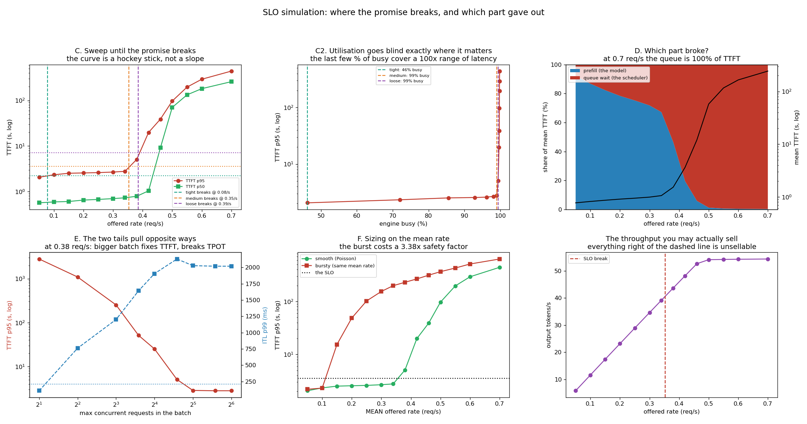

# SLO Simulation

---

> Pick a promise, raise the load, watch it break — and the shape of the break is the lesson. Between **0.34 and 0.42 requests/second**, a 24% increase in traffic, this engine's [TTFT](/shared/glossary/#ttft) p95 goes from **2.77 s to 19.85 s**. That is not a slope, it is a cliff. Four consequences, all measured. **Engine utilisation cannot see the cliff**: it reads 0.86 at 2.5 s and 1.00 at 441 s, so a "GPU busy" dashboard is blind across a 175x range of latency. **Loosening the promise buys almost nothing** — doubling the target from 3.54 s to 7.08 s bought **9% more capacity** (0.353 → 0.385 req/s), while tightening it 1.6x cost **4.5x** of it. **The queue, not the model, is what breaks**: queue wait is 8% of TTFT at 0.1 req/s and **100%** at 0.7. **The two tails fail at rates 5.4x apart** (TPOT at 0.065 req/s, TTFT at 0.353) and the knob that fixes one breaks the other — raising the batch cap from 2 to 64 improves TTFT p95 by **996x** and worsens ITL p99 by **18.5x**. And bursty traffic at the *same mean rate* needs a **3.38x** safety factor, well past the 1.5–2x rule of thumb.

---

## Key Insight

This project sets a concrete [SLO](/shared/glossary/#slo) — for example, p95 [TTFT](/shared/glossary/#ttft) under 500 ms — then steadily raises the request arrival rate until the system can no longer meet it, pinpointing the [bottleneck](/shared/glossary/#bottleneck) that gives out first.

## Why This Matters

Knowing the precise load at which your promise breaks turns a vague "it feels slow sometimes" into a number you can plan around — and tells you whether to fix the [scheduler](/shared/glossary/#scheduler), add GPUs, or shrink the model.

---

**This is project 61.**

### The words first

- **[SLO](/shared/glossary/#slo)** — the promise: "p95 TTFT under 3.5 seconds". A target you design toward.
- **[SLI](/shared/glossary/#sli)** — the measurement you check the promise against.
- **Offered rate** — how fast requests *arrive*, in requests per second. The independent variable of this whole project.
- **Utilisation** — the fraction of wall-clock time the engine spends inside a forward pass. Written `ρ` (rho) in queueing theory.
- **Break point** — the offered rate at which the SLI first crosses the SLO.
- **Queue wait** — the time between a request arriving and the engine starting on it.
- **TPOT / [ITL](/shared/glossary/#itl--tpot)** — time per output token: the gap between consecutive streamed tokens, which is what makes generation feel smooth or stuttery.
- **[Capacity planning](/shared/glossary/#capacity-planning)** — deciding how many replicas to buy, given a traffic forecast and a promise.

### "Project 60 already ran a load test. What is different here?"

Project 60 asked *is my measurement honest?* This project takes an honest measurement and asks *where is the edge?* — and the two need different tools.

A load test runs at a rate you choose and hands you a latency number. That tells you how today feels. It cannot tell you how far you are from trouble, because the relationship between load and latency is not a straight line you can extrapolate — it is a hockey stick, and the whole question is where the bend is. Finding the bend needs **many** runs at **many** rates, which on this machine means thousands of requests and hours of forward passes.

So this project switches instruments: it uses [project 18](../18-chunked-prefill-simulator/README.md)'s discrete-event simulator, whose four cost coefficients are **fitted here, in section A, to real forward passes on this machine**. The logic of the scheduler is real; the timing comes from measurement; only the arrival timeline is synthetic. That buys a 17-point rate sweep, a 9-point batch-cap sweep and a bursty-traffic replay — about 20,000 simulated requests — in under a minute.

### "Why fit the cost model again? Project 18 already fitted one."

Because a simulator with a borrowed cost model is a simulator of somebody else's machine, and **every number this project reports in seconds is downstream of those four coefficients**.

The fit takes 53 seconds and it is not a formality: this run measured `base = 88.8 ms`, `per_decode = 7.09 ms/row`, `per_prefill = 1.878 ms/token`, `per_key_read = 2.4 µs`, with a mean fit error of 3.3% on decode and 9.8% on prefill. Project 18's committed fit, taken on a differently-loaded day, has `base = 94.9 ms` — a 7% difference that would propagate into every break point. Projects 62, 63 and 65 then load *this* fit (`outputs/costmodel.json`) rather than refitting, so that the whole phase's numbers stay comparable with each other.

---

## Running it

```bash
python3 run.py            # ~1 minute (53 s of it is the calibration)
python3 run.py --reuse    # skip the calibration, reuse outputs/costmodel.json
python3 run.py --plot     # redraw from outputs/findings.json
```

Needs [project 16](../16-static-vs-continuous/README.md)'s `batchlib.py`, [project 18](../18-chunked-prefill-simulator/README.md)'s `simlib.py` and [project 59](../59-metric-instrumentation/README.md)'s `obslib.py`.

> **About the numbers.** Everything below comes from the committed [`outputs/findings.json`](outputs/findings.json). Workload: 700 requests per point, Poisson arrivals, lognormal lengths (median prompt 200 tokens, median output 90), 24 concurrent slots, prefill takes a whole iteration (no chunking — that is [project 18](../18-chunked-prefill-simulator/README.md)'s knob).



---

## B. Where does a promise come from?

The guide's example SLO is "p95 TTFT < 500 ms". On an H100 serving a 70B model that is a reasonable promise. On this CPU it is not, and the useful exercise is not to pretend otherwise but to see **how a team picks the number in the first place**.

Start with the floor. Run the same workload at 0.02 req/s — so slow that nothing ever queues — and measure:

| unloaded (0.02 req/s) | |
|---|---|
| TTFT p50 | 0.52 s |
| **TTFT p95** | **1.77 s** |
| queue wait p95 | 0.08 s |
| ITL p95 | 106 ms |

**1.77 s is the floor: with zero contention, the slowest 5% of prompts still take that long to prefill.** An SLO below the floor is broken at zero traffic — no amount of hardware fixes it, only a smaller model, shorter prompts, or a faster prefill. This is the first thing to check before committing to a number, and the check takes one low-rate run.

Three candidate promises, expressed as multiples of the floor:

| | target | what it means |
|---|---|---|
| tight | 2.21 s | 1.25x the floor — almost no room for queueing |
| medium | 3.54 s | 2x the floor — the usual shape of a real SLO |
| loose | 7.08 s | 4x the floor |

And one for the other tail: **TPOT p99 < 212 ms**, also 2x its unloaded value.

---

## C. The sweep, and why the answer is a cliff

| offered rate | engine busy | TTFT p50 | **TTFT p95** | ITL p99 | queue share of TTFT |
|---|---|---|---|---|---|
| 0.05 | 46% | 0.51 s | 2.06 s | 142 ms | 8% |
| 0.15 | 86% | 0.59 s | 2.52 s | 616 ms | 18% |
| 0.25 | 96% | 0.65 s | 2.60 s | 1,056 ms | 25% |
| 0.34 | 99% | 0.80 s | **2.77 s** | 1,665 ms | 33% |
| 0.38 | 99% | 1.03 s | **5.07 s** | 2,130 ms | 53% |
| 0.42 | 100% | 9.63 s | **19.85 s** | 2,388 ms | 80% |
| 0.50 | 100% | 68.4 s | 97.04 s | 2,337 ms | 99% |
| 0.70 | 100% | 292 s | **441.51 s** | 2,262 ms | 100% |

| promise | break point | engine busy there |
|---|---|---|
| tight (2.21 s) | **0.078 req/s** | 46% |
| medium (3.54 s) | **0.353 req/s** | 99% |
| loose (7.08 s) | **0.385 req/s** | 99% |

**Between 0.34 and 0.42 req/s — 24% more traffic — TTFT p95 goes from 2.77 s to 19.85 s.** Seven-fold, from one extra request every three minutes. That is the entire reason capacity planning exists as a discipline: the system does not degrade gracefully, it falls over, and it gives you almost no warning on the way.

The mechanism is the standard queueing result and it is worth carrying around. Waiting time scales roughly as **1/(1 − ρ)** where ρ is utilisation. At ρ = 0.5 the multiplier is 2; at ρ = 0.9 it is 10; at ρ = 0.99 it is 100. **The last 10% of capacity costs ten times more latency than the first 90% did.** Every hockey stick in serving is this fraction.

### Doubling the promise bought 9% more capacity

Compare the three break points: 0.078, 0.353, 0.385 req/s.

Going from the **medium** promise (3.54 s) to the **loose** one (7.08 s) doubles what you tolerate and buys **9% more traffic**. Going the other way — from medium to **tight** (2.21 s, a 1.6x tighter promise) — costs **4.5x of your capacity**.

Both facts are the cliff seen sideways, and the asymmetry is the practical lesson. Once you are on the vertical part of the curve, no amount of loosening the SLO helps, because latency there is rising faster than any target you would be willing to write down. But near the floor, a small tightening is brutally expensive, because you are spending capacity to buy headroom you barely have. **Negotiating the SLO is only a real lever while you are on the flat part of the curve.** After that, the only levers are capacity and the model.

### Utilisation goes blind exactly where you need it

Look at the "engine busy" column again: **0.86 at TTFT p95 = 2.52 s, and 1.00 at TTFT p95 = 441 s.** A 175x change in the number users feel, inside the last 14 percentage points of a utilisation gauge.

That is a genuinely uncomfortable fact about the most popular metric on every GPU dashboard. **`nvidia-smi` utilisation cannot distinguish a healthy system from a collapsing one**, because both are running kernels back to back — the difference is entirely in how long the queue outside is, which the GPU cannot see.

The metrics that *can* see it are queue depth and queue wait, which is why they are in project 59's registry and why the guide's dashboard figure lists them. If you take one alerting rule from this project: **alert on queue wait, not on GPU utilisation.**

---

## D. Which part broke?

TTFT has exactly two components — the time a request waits for a slot, and the time the model takes to prefill it. Splitting the measured TTFT into the two answers "what do I buy?" directly.

| offered rate | mean queue wait | mean prefill | queue share |
|---|---|---|---|
| 0.05 | 0.06 s | 0.69 s | 8% |
| 0.15 | 0.15 s | 0.69 s | 18% |
| 0.34 | 0.34 s | 0.69 s | 33% |
| 0.42 | 2.8 s | 0.69 s | 80% |
| 0.70 | 242 s | 0.69 s | **100%** |

**The prefill time never changes.** 0.69 s at every rate, because prefilling 200 tokens costs what it costs — the model is not getting slower. Everything that happened between 0.05 and 0.70 req/s happened in the queue.

This is the decomposition that decides where the money goes:

- **Queue-dominated** (this system, past 0.4 req/s) → you need **more capacity** (replicas, bigger batches) or **less work** (admission control, load shedding). Optimising the model is worth almost nothing: halving prefill time here would shave 0.35 s off a 242-second wait.
- **Prefill-dominated** (this system below 0.2 req/s) → you need a **faster prefill**: chunking, a smaller model, prefix caching, better kernels. Adding replicas would buy nothing, because nobody is waiting.

**The same symptom — "TTFT is too high" — has opposite cures at the two ends of the same curve.** A postmortem that does not do this split will confidently buy the wrong thing.

---

## E. The two tails pull in opposite directions

Hold the arrival rate at 0.38 req/s (just past the medium break point) and sweep only the cap on how many requests may decode in one batch:

| max batch | TTFT p95 | ITL p99 |
|---|---|---|
| 2 | 2,800 s | **109 ms** |
| 4 | 1,091 s | 762 ms |
| 8 | 253 s | 1,201 ms |
| 16 | 25.2 s | 1,905 ms |
| 24 | 5.07 s | 2,130 ms |
| 32 | 2.86 s | 2,028 ms |
| 64 | **2.81 s** | 2,019 ms |

**From cap 2 to cap 64: TTFT p95 improves 996x and ITL p99 gets 18.5x worse.** One knob, two SLOs, opposite signs.

The reason is that the two tails are made of different waiting. A bigger batch lets more requests be admitted at once, so fewer sit in the queue — TTFT collapses. But every decode step now carries more rows, so each step takes longer, and each individual request's tokens come out further apart — ITL rises. **You are moving the same delay from before the first token to between the later ones.**

**And with the TPOT target at 212 ms, only the cap of 2 satisfies it — the one setting where TTFT p95 is 2,800 seconds.** There is no batch size on this engine that keeps both promises at this rate. That is not a bug in the sweep; it is the honest answer, and it names the fix: you cannot schedule your way out, you need more capacity or a cheaper model.

**The rate sweep says the same thing from the other side.** The TPOT promise (212 ms) breaks at **0.065 req/s**; the TTFT promise (3.54 s) breaks at **0.353 req/s**. **The two tails break at rates 5.4x apart, and TPOT is the binding one.** A team monitoring only TTFT would believe it had 5.4x more capacity than it does — and would be confused when users complained about stuttering output while the dashboard was green.

> **Note what is missing from this sweep.** ITL p99 plateaus around 2 seconds past cap 24, which is *not* the batch getting wider — it is a long prompt's prefill taking a whole iteration to itself and stalling every decoding request behind it. That is head-of-line blocking, and the cure is chunked prefill, which is [project 18](../18-chunked-prefill-simulator/README.md)'s entire subject. This project deliberately leaves it off so the batch-cap effect is not confounded.

---

## F. Sizing on the mean rate is the classic capacity mistake

Two traces with the **same mean arrival rate**. One is Poisson (arrivals independent and spread out). The other spends 20% of each 15-minute period at 3x the mean rate and the rest at half of it — the same total requests, delivered lumpily.

| | break point (medium SLO) |
|---|---|
| smooth Poisson traffic | 0.353 req/s |
| bursty traffic, same mean | **0.104 req/s** |
| **safety factor required** | **3.38x** |

**The burst costs 3.38x of your capacity, and nothing about the mean rate predicts it.** A forecast that says "we expect 0.3 requests per second next quarter" is compatible with a system that is comfortable and a system that is on fire, and the difference is a property of the *shape* of the traffic, which forecasts almost never carry.

The guide's rule of thumb is "provision for P95 traffic × 1.5–2×". **This measurement says 3.38x for a fairly mild burst** — a 3x peak for a fifth of the time, which is gentler than a real morning login rush. The rule of thumb is a floor, not an answer, and the way to get an answer is exactly this experiment: replay your *own* traffic shape, not a Poisson approximation of it, and read off the break point.

Why the burst hurts so much more than its size suggests: during the 3x window the arrival rate exceeds capacity, so a backlog forms; the backlog then has to be drained during the quiet period *on top of* the quiet period's own traffic. Queue length is the integral of (arrivals − service), so a burst that is 3x for 20% of the time does not cost 20% of a 3x problem — it costs the whole area under the excess, and the recovery is slower than the burst was.

---

## What to take from this

1. **The load-latency curve is a cliff.** 24% more traffic took TTFT p95 from 2.77 s to 19.85 s.
2. **Measure your floor before you promise anything.** Unloaded TTFT p95 was 1.77 s; an SLO below that is broken at zero traffic.
3. **Doubling the promise bought 9% more capacity; tightening it 1.6x cost 4.5x.** SLO negotiation is only a lever on the flat part of the curve.
4. **Utilisation is blind where it matters** — 0.86 at 2.5 s and 1.00 at 441 s. Alert on queue wait, not GPU busy.
5. **Prefill time never moved (0.69 s at every rate).** 100% of the degradation was queue. The cure is capacity or shedding, not a faster model.
6. **The same symptom has opposite cures at the two ends of the curve.** Split TTFT into queue and prefill before spending money.
7. **Batch cap 2 → 64: TTFT p95 996x better, ITL p99 18.5x worse.** One knob, two SLOs, opposite signs.
8. **The two tails break 5.4x apart** (TPOT 0.065 req/s, TTFT 0.353) and **no batch size satisfies both** at 0.38 req/s.
9. **A mild burst cost a 3.38x safety factor** at the same mean rate — beyond the 1.5–2x rule of thumb.

### Common traps this project walks into on purpose

- **Extrapolating a latency curve linearly.** The interesting part is the part that is not a line.
- **Promising something below your unloaded latency.** No hardware fixes it.
- **Reading GPU utilisation as headroom.** It saturates while latency still has 175x to travel.
- **Monitoring one tail.** TTFT looked like it had 5.4x more room than TPOT actually had.
- **Fixing TTFT with a bigger batch and not re-checking TPOT.** The knob has two ends.
- **Sizing capacity on the mean arrival rate.** Same mean, 3.38x less capacity.
- **Borrowing someone else's cost model.** 7% in a coefficient moves every break point.

---

## Next

[Project 62 — error budget tracker](../62-error-budget-tracker/README.md) takes the promise this project located and asks what happens over a whole month: how the budget gets spent, why two reasonable definitions of the same SLI disagree by 16x, and which alerting rule pages you 112 times and which pages you 3.
