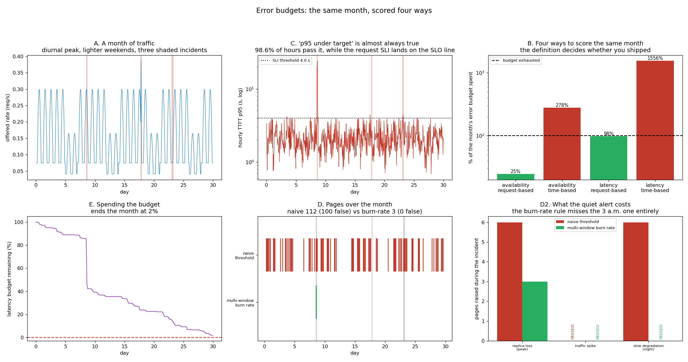

# Error Budget Tracker

---

> A simulated month — 720 hours, 32,554 requests, three injected incidents — scored four ways, and **the scoring rule changes the verdict**. The latency [SLO](/shared/glossary/#slo) counted the way Google recommends (good requests / all requests) ends the month at **2% of budget remaining: a pass, barely**. The *same month*, counted as bad *hours* instead of bad requests, spends **1,556% of the budget** — a 16x disagreement that flips "ship on Friday" to "code freeze". Availability disagrees the same way, **25% vs 278%**, off **eight requests**. Meanwhile **98.6% of hours had a p95 under the 4-second threshold**, so a "p95 under target" dashboard was green all month while the SLO sat exactly on its line — a percentile is not something you can add up over 30 days. And the alerting comparison refuses to be a clean win: the naive threshold fired **112 pages, 100 of them false**, and caught 2 of 3 incidents; Google's multi-window [burn-rate](/shared/glossary/#burn-rate) rule fired **3 pages, 0 false** — and **missed the 3 a.m. incident entirely**, because at 3 a.m. there is not enough traffic to burn a budget fast.

---

## Key Insight

An [SLO](/shared/glossary/#slo) of, say, 99.9% allows a small amount of failure; the leftover is the [error budget](/shared/glossary/#error-budget). This project computes the [SLI](/shared/glossary/#sli) — the measured success rate — each day and tracks how fast that budget is being spent under a chosen failure mode.

## Why This Matters

An error budget turns reliability into a currency: while budget remains you can ship risky changes, but once it is spent you freeze and stabilize. It replaces endless arguments about "is it reliable enough?" with a simple running balance.

---

**This is project 62.**

### The words first

- **[SLI](/shared/glossary/#sli)** — Service Level *Indicator*: the number you actually measure, e.g. "fraction of requests answered in under 4 s".
- **[SLO](/shared/glossary/#slo)** — the target that number must beat, e.g. 99%.
- **[Error budget](/shared/glossary/#error-budget)** — `1 − SLO`. At 99.9% you may fail 0.1% of the time; over a 30-day month that is **43.2 minutes**.
- **Request-based SLI** — good events ÷ all events. Every request votes once.
- **Time-based SLI** — good minutes ÷ all minutes, where a minute is "bad" if too many of its requests were bad. Every *minute* votes once, whether it carried 4 requests or 108.
- **[Burn rate](/shared/glossary/#burn-rate)** — how many times faster than "even" you are spending the budget. Burn rate 1 uses the whole month's budget in exactly a month; burn rate 14.4 uses 2% of it in one hour.
- **Page** — an alert that wakes a human up. The currency this project counts.

### "Project 61 already found where the SLO breaks. Isn't the budget the same thing?"

No — and the gap between them is why teams that have an SLO still get surprised.

Project 61 answered a question about a *rate*: at 0.353 requests per second, this system stops keeping its promise. That is a design-time fact. It says nothing about how much promise-breaking actually happened last month, because real traffic is not a single rate — it is a diurnal wave with weekends in it, and three afternoons where something went wrong.

An error budget is the *accounting* over that whole period. It converts scattered badness into one number with a policy attached: 100% spent means stop shipping risky changes. Project 61 tells you where the cliff is; this project tells you how close to it you have been living, and — the part nobody expects — that **the arithmetic used to do the counting is itself a design decision with a 16x range of answers**.

### "Why is a month simulated? Just watch production for 30 days."

Because you cannot iterate on an alerting rule at one experiment per month, and because a real month gives you whichever incidents it happens to give you.

Here the month is deliberately constructed: a diurnal traffic wave peaking at 0.30 req/s on weekdays and 55% of that on weekends, plus three incidents chosen to be *different from each other* — a capacity loss at peak, a traffic spike in the evening, and a slow degradation overnight. Section D can then ask a question a real month cannot answer: **which of these does each alerting rule catch, and which does it miss?**

> **How the month is scaled, stated plainly.** Each of the 720 hours is simulated as **300 seconds** of traffic at that hour's arrival rate. So this is a scale model of a month: the same shape, about a twelfth of the requests. Every SLI here is a **ratio**, and ratios are unaffected by the scaling — which is why the budget arithmetic transfers, and why the "43.2 minutes" figure at the end is a conversion of a ratio back onto a real 30-day month rather than something measured.

---

## Running it

```bash
python3 run.py           # ~5 seconds; no model, no GPU
python3 run.py --plot    # redraw from outputs/findings.json
```

Uses [project 18](../18-chunked-prefill-simulator/README.md)'s `simlib.py` and the cost model that [project 61](../61-slo-simulation/README.md) fitted to real forward passes (`61/outputs/costmodel.json`). If you have not run project 61, it falls back to project 18's committed fit and says so.

> **The month.** 30 days × 24 hours = 720 windows, 32,554 requests, arrival rate peaking at 0.30 req/s on weekdays. SLOs: **99.9% availability** (a request slower than 90 s counts as an error) and **99% of requests under 4 s TTFT**.



---

## The three incidents

| day | hours | what was injected | what it did |
|---|---|---|---|
| 8 | 13:00–17:00 | concurrent-slot cap cut from 24 to 6 | 134 slow requests of 332 |
| 17 | 19:00–22:00 | arrival rate ×2.4 | **0 slow requests of 251** |
| 23 | 01:00–07:00 | every forward pass 1.9x slower | 7 slow of 134, 4 errors |

**One of the three was not an incident.** A 2.4x traffic spike at 19:00 produced *zero* SLO violations, because the evening baseline is low enough that even 2.4x of it stays on the flat part of project 61's curve. This is not a failed experiment — it is the most common real finding in incident review, and it has a name: an *event* is not an *incident* until it costs a user something. Sections D and D2 report it honestly as an incident nobody detected because there was nothing to detect.

---

## B. Four ways to score the same month

| SLI | definition | measured | budget spent | verdict |
|---|---|---|---|---|
| availability | request-based | 99.9754% | **25%** | pass |
| availability | time-based | 99.7222% | **278%** | fail |
| latency | request-based | 99.0201% | **98%** | pass, by 2% |
| latency | time-based | 84.4444% | **1,556%** | fail, 15x over |

**Same month. Same log lines. Two of these say ship, two say freeze.**

### Availability: eight requests, 11x apart

Exactly **8 requests** out of 32,554 took longer than 90 seconds. Count them as events: 8 ÷ 32,554 = 0.0246% bad, against a 0.1% budget → **25% spent**. Count them as *time*: those 8 requests fell in 3 different hours, and 2 of those hours had more than 1% of their traffic go bad, so 2 of 720 hours were bad → 0.278% → **278% spent**.

The whole 11x gap comes from one thing: **a time-based SLI gives every hour one vote regardless of how many requests it carried.** The busiest hour in this month served 108 requests; the quietest served 4. One bad request at 4 a.m. is 25% of that hour and condemns it outright; the same request at 3 p.m. is 1% of the hour and might not.

Which is right depends on what you are promising. **A request-based SLI promises "your request will probably work."** **A time-based SLI promises "the service will probably be up."** For a consumer API the first is what users experience. For something with a contractual uptime clause, the second is what you signed. Picking one is a product decision; discovering afterwards that your dashboard uses the other is a very bad afternoon.

### Latency: the pass that is one bad hour from a fail

The latency SLO — 99% of requests under 4 s — ends the month at **99.0201%**, having spent **98%** of its budget. **2% left.** In real terms: the team may ship, and the next slow hour takes that away.

That razor-thin number is what an error budget is *for*. "We met our SLO" and "we met our SLO with 2% to spare" are the same sentence to a dashboard and completely different sentences to a release manager. Panel E shows the shape: the budget falls off a cliff on **day 8** (the capacity-loss incident alone spent 42% of the month's entire allowance in four hours) and then bleeds slowly for three weeks.

And the same month counted by hours is **1,556% spent** — 112 bad hours out of 720. Both numbers are computed from the same 32,554 requests.

---

## C. "p95 under 4 s" is not something you can track for a month

| | value |
|---|---|
| median hour's TTFT p95 | 2.03 s |
| traffic-weighted mean of the hourly p95s | 2.47 s |
| **hours whose p95 beat the 4 s threshold** | **98.6%** |
| **requests that beat the 4 s threshold** | **99.02%** (SLO: 99%) |

**A dashboard panel showing "hourly p95 TTFT" with a 4-second line on it was under the line 98.6% of the month.** It looked green. Meanwhile the actual SLO landed exactly on its target and burned 98% of its budget.

There are two separate problems here and both are worth naming, because people conflate them.

**First, a percentile does not aggregate.** [Project 59 section D](../59-metric-instrumentation/README.md) measured this directly: averaging four windows' p99s was 53% off. You cannot take 720 hourly p95s and turn them into "the month's p95" by any arithmetic on those 720 numbers — the information needed is in the underlying observations (or their histograms), not in the percentiles.

**Second, and more fundamental: "p95 < 4 s" is not a statement that can be true or false over a month.** It is true or false *per window*, and the answer depends on how long the window is. Make the window a minute and the p95 is noisy. Make it a day and it hides the bad afternoon. There is no correct window, because the quantity is not defined without one.

**The fix is to write the SLO the other way round.** Not "the 95th percentile must be under 4 seconds" but **"99% of requests must be under 4 seconds"**. Now every request is a yes/no event, events add up across any period you like, the SLI is a plain ratio, and the error budget is `(1 − 0.99) × total requests`. Every number in section B exists because the SLI was written this way. That is why Google's SRE book insists on **threshold + ratio** rather than **percentile** — not style, arithmetic.

---

## D. Two alerting rules, and neither one wins

**The naive rule**: page whenever an hour's bad-request ratio exceeds the SLO's allowance (1%).
**The multi-window burn-rate rule** (Google's): page only when the **1-hour burn rate ≥ 14.4** *and* the **6-hour burn rate ≥ 6**. The short window says "this is happening now"; the long window says "this is real, not a blip". Both must agree.

| | pages | false pages | incidents caught |
|---|---|---|---|
| naive threshold | **112** | **100 (89%)** | 2 of 3 |
| multi-window burn rate | **3** | **0** | 1 of 3 |

**The burn-rate rule removed 109 of 112 pages and every single false one.** For an on-call human that is the difference between an alert they read and an alert they mute.

The reason the naive rule is so noisy is a sampling problem, not a tuning problem. An hour with 20 requests has a bad-ratio that can only be 0%, 5%, 10%… — one unlucky request is instantly "5% bad", five times over a 1% budget. **The threshold rule pages on the granularity of the measurement rather than on the size of the problem.** No threshold value fixes this; the quantity being compared is too lumpy. The burn-rate rule fixes it by requiring the badness to persist across a 6-hour window, where there are enough requests for the ratio to mean something.

### The honest half: the quiet rule missed the quiet incident

**The burn-rate rule never fired for the overnight degradation on day 23.** The naive rule did.

The 1.9x slowdown ran from 01:00 to 07:00 and made 7 of 134 requests slow. Seven bad requests is a 5.2% bad ratio in those hours — the naive rule shouts. But a burn rate is bad **events** divided by the budget for the *whole window*, and a 6-hour window that starts at 1 a.m. contains almost no traffic. Seven events out of a very small total does not burn a monthly budget fast, so the 6-hour condition never reached 6 and the page never fired.

**That is the structural blind spot of burn-rate alerting: it is deliberately proportional to traffic, so it under-reacts at night.** The behaviour is correct by its own definition — an incident that affects 7 requests genuinely is not burning your budget fast — and it is still how a degradation runs unattended until the morning peak turns it into an outage.

The standard mitigation is a second, slower tier: Google's full recipe pairs the fast page (2% of budget in 1 hour) with a **ticket** at a lower burn rate over a much longer window (10% of budget in 3 days), which does not wake anyone but does get looked at. Neither rule here implements that tier, and the day-23 incident is exactly what it exists for.

> **Read the table as a trade, not a ranking.** 112 pages with 89% noise is unusable. 3 pages with a blind spot at 3 a.m. is usable *and incomplete*. The deployable answer is the burn-rate rule for paging plus a slow-burn ticket for the rest — and, if 3 a.m. matters to you, a separate low-traffic rule that alerts on *latency* rather than on *budget consumption*.

---

## E. Spending the budget, and the day you stop shipping

The latency budget is `(1 − 0.99) × 32,554 = 326 slow requests` for the month. Panel E draws what is left of it, hour by hour.

- Days 0–7: a slow, even bleed — the ordinary cost of running near the edge of project 61's curve.
- **Day 8: a cliff.** The four-hour capacity loss spent **42% of the entire month's budget** in an afternoon.
- Days 9–29: back to bleeding, ending at **2% remaining**.

The policy that makes this useful is the one Google attaches to it: **while budget remains, ship; when it is gone, stop shipping risky changes until the window rolls over.** The value is not the graph, it is that the graph converts an argument about risk appetite into an arithmetic fact both sides can read.

**And it prices the incident.** "We lost some capacity for four hours on the 8th" is a sentence. "That afternoon cost 42% of the quarter's release headroom" is a budget line, and it is the sentence that gets the redundancy work scheduled.

> **What 0.1% actually is.** A 99.9% availability SLO over a 30-day month permits exactly **43.2 minutes** of failure. Not "about an hour" — 43.2 minutes. A 99.99% SLO permits 4.32 minutes, which is less time than a rolling deploy takes, so a service promising four nines cannot use restart-based deployments at all. **Converting the percentage to minutes before agreeing to it is the cheapest sanity check in the discipline.**

---

## What to take from this

1. **The same month scored request-based and time-based disagreed by 16x** on latency (98% vs 1,556% of budget) and 11x on availability (25% vs 278%).
2. **The disagreement is traffic weighting.** A time-based SLI gives a 4-request hour the same vote as a 108-request hour.
3. **Pick the definition on purpose.** Request-based promises "your request will work"; time-based promises "the service is up".
4. **98.6% of hours beat the p95 threshold while the SLO sat on its line.** A "p95 under target" panel is nearly always green.
5. **Write latency SLOs as threshold + ratio**, not as a percentile. Only then does the SLI add up over a month.
6. **The month passed with 2% of budget left**, and one incident on day 8 had eaten 42% of it in four hours.
7. **The naive threshold fired 112 pages, 100 of them false.** It pages on measurement noise, and no threshold value fixes that.
8. **The burn-rate rule fired 3 pages, 0 false — and missed the overnight incident entirely**, because a burn rate is proportional to traffic and there is no traffic at 3 a.m.
9. **One of three "incidents" cost nothing.** A 2.4x traffic spike produced zero violations. An event is not an incident until a user pays.
10. **99.9% is 43.2 minutes a month.** Convert the percentage before you agree to it.

### Common traps this project walks into on purpose

- **Writing the SLO as "p95 < T".** Not aggregatable, not comparable, window-dependent.
- **Assuming request-based and time-based agree.** 16x here.
- **Alerting on a per-window bad ratio.** 89% false pages at this traffic level.
- **Assuming the quiet alert is strictly better.** It is blind at 3 a.m.
- **Averaging hourly percentiles into a monthly one.** See project 59 section D.
- **Calling every anomaly an incident.** The traffic spike cost zero.
- **Reading a budget as a target rather than an allowance.** 2% remaining is a pass and a warning at the same time.

---

## Next

[Project 63 — cost report](../63-cost-report/README.md) puts a currency on all of it: from the same measured throughput, a defensible dollars-per-million-output-tokens number with a confidence interval, and the three line items that actually move it.
