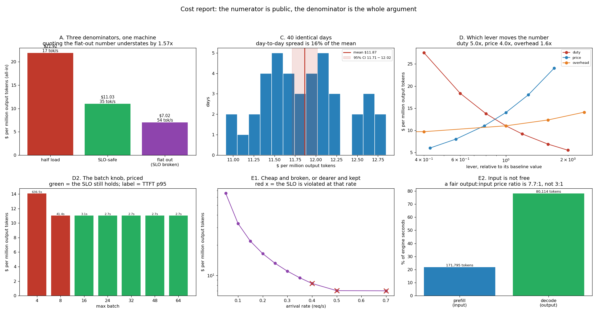

# Cost Report

---

> The price of the hardware is public. **The denominator is the whole argument**, and this project measures how much it can be made to move. The same replica, the same model, the same day: **$21.92, $11.03 or $7.02 per million output tokens** depending only on how full you keep it — and the cheapest of the three is the one where the [SLO](/shared/glossary/#slo) is broken by a factor of 125. Ranked by how much they actually move the bill, the levers are **how full the box is (9.35x)**, **sustained duty (5.00x)**, **hardware price (4.00x)**, **platform overhead (1.60x)** and — the inversion — **the batch size, 1.28x, and exactly 1.00x across every setting that keeps the promise**. Forty statistically identical days spread **16%** apart, so a single benchmark run quoted $11.03 where the 40-day mean is **$11.87 (95% CI $11.71–$12.02)**. And input tokens are not free: prefill is **21.9% of engine seconds** for 2.14 input tokens per output token, which makes the cost-fair output:input price ratio **7.7:1**, not the ~3:1 most public price lists use.

---

## Key Insight

This project produces a defensible [cost per million tokens](/shared/glossary/#cost-per-million-tokens) for a serving stack — GPU hourly price divided by the tokens it produces per hour — and identifies the three biggest line items driving that number.

## Why This Matters

[Cost per million tokens](/shared/glossary/#cost-per-million-tokens) is the universal unit that decides whether a serving system makes economic sense. Being able to compute and defend it lets you compare engines and hardware fairly and commit to a price with confidence.

---

**This is project 63.**

### The words first

- **$/M output tokens** — dollars per million generated tokens. The industry's unit because output is what users are billed for.
- **Duty (sustained utilisation)** — the fraction of the hour you rent during which the replica is actually serving. You pay for the whole hour.
- **Platform overhead** — everything that is not the GPU: gateways, load balancers, the monitoring stack, log storage, the on-call rota, a spare replica for deploys.
- **Line item** — one row of the bill. The point of a cost report is that the rows add up and each one can be argued with separately.
- **[Bootstrap](/shared/glossary/#bootstrap-statistics)** — a way of putting error bars on a number by resampling your own measurements, without assuming they follow any particular distribution. The name is from "pulling yourself up by your bootstraps": the only information used is the sample itself.
- **Confidence interval** — a range that would contain the true value 95% of the time if you repeated the whole measurement.

### "Isn't this just dividing two numbers? Why is it a project?"

Because the division is trivial and **choosing the denominator is a modelling decision with a 3x range**, and almost every published serving cost quietly picks the flattering end.

Three honest ways to say "tokens per hour" for the *same replica running the same model*:

| | output tok/s | all-in $/M |
|---|---|---|
| half load (0.15 req/s) | 17.4 | **$21.92** |
| SLO-safe (0.30 req/s) | 34.6 | **$11.03** |
| flat out (0.70 req/s) | 54.4 | **$7.02** |

Nothing changed except how much traffic was offered. The flat-out row is what a benchmark produces, because a benchmark keeps the queue full — [project 60](../60-synthetic-load-tests/README.md) measured exactly this, and a closed-loop driver is 100.0% busy by construction. **The flat-out row is also a system with a TTFT p95 of 441 seconds.** It is a real throughput number attached to a service nobody would use.

**The rule this gives you: a cost per token is only meaningful next to the SLO it was measured under.** "$7.02/M" and "$11.03/M" describe the same hardware; one of them is a product.

### "Why bootstrap? The simulator is deterministic."

The *simulator* is deterministic; the *traffic* is not, and the cost you will actually be billed depends on which traffic showed up.

Section C runs 40 independent days — same arrival rate, same length distribution, different random draws — and the resulting cost ranges from **$10.91 to $12.85, a 16% spread**. That spread is not measurement error; it is the real month-to-month variance of a service whose lengths are lognormal. A fat-tailed length distribution means a handful of very long requests dominate the token count, and how many of those show up in a given day is luck.

So the honest deliverable is not "$11.03". It is **"$11.87, 95% CI $11.71–$12.02"** — and note that the single run that produced $11.03 was 7% optimistic, purely by having drawn a good day. The guide's instruction is "quote that number with confidence intervals". This is how you get one.

---

## Running it

```bash
python3 run.py           # ~5 seconds; no model, no GPU
python3 run.py --plot    # redraw from outputs/findings.json
```

Uses [project 18](../18-chunked-prefill-simulator/README.md)'s `simlib.py` and the cost model [project 61](../61-slo-simulation/README.md) fitted to real forward passes. Writes a one-page deliverable to [`outputs/cost_report.md`](outputs/cost_report.md) as well as the usual findings and figure.

> **What is illustrative and what is measured.** The **hardware price is illustrative** — $0.55/hr for a 16-vCPU cloud VM standing in for this desktop, and $32/hr for the guide's 8-GPU H100 node. Everything below the price line — tokens per second, the prefill/decode split, the sensitivity of each lever — comes from the fitted cost model and is real for this machine. Swap the price and every number re-derives.



---

## B. The arithmetic, line by line

The whole formula, once:

```
                price_per_hour x (1 + overhead)
   $/M  =  ------------------------------------------
           output_tokens_per_hour x sustained_duty / 1e6
```

Applied to this replica at the SLO-safe rate, and to the guide's H100 example with the *same* formula so the two are comparable:

| | this box (16 vCPU, Qwen2.5-0.5B) | H100 node (8 GPU, 70B FP8, TP=2) |
|---|---|---|
| hardware | $0.55/hr | $32.00/hr |
| replicas | 1 | 4 |
| output tok/s delivered | 32.2 | 7,200 |
| compute at 100% duty | **$4.74/M** | **$1.23/M** |
| at 50% sustained duty | $9.49/M | $2.47/M |
| **+25% platform overhead → all-in** | **$11.85/M** | **$3.09/M** |

The H100 column reproduces the guide's worked example to the cent ($3.09 against its ≈$3.10), which is the point of running both through one function: the arithmetic is not the hard part.

**Read the two middle rows as the two biggest line items on the bill.** Going from "compute at 100% duty" to "all-in" *more than doubles* the number, and neither of those steps involves the model, the GPU, or a single line of inference code:

- **Idle capacity: +$4.74/M.** You rent the hour; you serve for half of it. On this bill, the tokens you did not generate cost exactly as much as the ones you did.
- **Platform overhead: +$2.37/M.** Gateways, the monitoring stack, log retention, a spare replica so deploys do not drop traffic, the on-call rota.

A cost-reduction programme that only looks at the engine is optimising the $4.74 and ignoring the $7.11 above it.

---

## C. Forty identical days, and why one run is not an answer

| | $/M output tokens |
|---|---|
| single representative day | $11.03 |
| **mean of 40 days** | **$11.87** |
| 95% confidence interval | **$11.71 – $12.02** |
| cheapest day | $10.91 |
| dearest day | $12.85 |
| day-to-day spread | **16% of the mean** |

**The spread across days is 16%; the confidence interval on the mean is ±1.3%.** Those two numbers answer different questions and it is worth being precise about which is which.

The **confidence interval** says how well 40 days pin down the long-run average: quite well. If you are forecasting a quarterly bill, quote $11.87 ± $0.16.

The **spread** says what any individual day looks like: $10.91 to $12.85. If you are setting a price with a margin, or sizing a monthly budget alert, the spread is the number that matters — a threshold set at the mean will trip about half the time.

**And the single-run figure was 7% low.** Nothing was wrong with that run; it drew a day with slightly shorter prompts. This is the everyday version of the [project 60](../60-synthetic-load-tests/README.md) result that a short test under-reports the tail: **one benchmark run is one sample from a distribution, and the distribution here is 16% wide.**

---

## D. Which lever actually moves the number

Each lever swept over a plausible range, everything else held fixed. Ranked by the ratio between the dearest and cheapest setting:

| lever | range tested | dearest | cheapest | **span** |
|---|---|---|---|---|
| arrival rate (how full the box is) | 0.05 → 0.70 req/s | $65.64 | $7.02 | **9.35x** |
| sustained duty | 20% → 100% | $27.56 | $5.51 | **5.00x** |
| hardware $/hr | $0.30 → $1.20 | $24.06 | $6.01 | **4.00x** |
| platform overhead | 0% → 60% | $14.11 | $8.82 | **1.60x** |
| max batch | 4 → 64 | $14.07 | $11.03 | **1.28x** |

**The top two levers are both "keep the machine busy", and together they dwarf everything else.** A replica at 0.05 req/s costs $65.64 per million tokens; the same replica at 0.35 costs $9.47. **Nothing you can do inside the engine competes with a 9x lever.**

This is the single most useful thing in the project, because it reorders the usual priority list. Engineers reach for quantization, speculation and kernel work; those are real and this guide measures them at length. But on this bill they are competing for the 1.28x column while the 9.35x column is decided by routing, autoscaling, batching *across tenants*, and whether you are willing to run one bigger replica instead of three small idle ones.

### The inversion: the batch knob costs exactly nothing

| max batch | $/M | TTFT p95 | SLO held? |
|---|---|---|---|
| 4 | $14.07 | 636.5 s | no |
| 8 | $11.03 | 41.4 s | no |
| 16 | **$11.03** | 3.13 s | **yes** |
| 24 | **$11.03** | 2.68 s | **yes** |
| 64 | **$11.03** | 2.68 s | **yes** |

**Across every setting that keeps the promise, the cost is identical to the cent.** The batch size — the knob most associated with "cheaper per token" — moved the bill by 1.00x.

The reason is simple once stated and easy to miss: **at a fixed arrival rate you cannot sell tokens nobody asked for.** Delivered throughput is set by demand, not by capability. A bigger batch lets the engine *finish* the same work with fewer, wider forward passes, which is why the latency collapses from 636 s to 2.68 s — but the number of tokens billed in an hour is whatever the users requested.

Batch size only becomes a cost lever when it lets you **raise the arrival rate on one replica instead of adding a second one**, and at that point what you are really moving is the 9.35x lever. Cap 4 is the exception that proves it: at that setting the engine cannot keep up at all, so it delivers fewer tokens per hour and the cost rises 1.28x.

> **This is a general trap in serving economics.** Any optimisation that makes the system *faster* without making it *fuller* shows up as better latency and identical cost. To turn a speedup into money you have to spend it: raise the load, shrink the fleet, or tighten the SLO and sell the headroom.

### Keeping the promise costs 1.35x

| arrival rate | $/M | TTFT p95 | SLO held? |
|---|---|---|---|
| 0.30 | $11.03 | 2.68 s | yes |
| **0.35** | **$9.47** | **2.86 s** | **yes — the cheapest compliant point** |
| 0.40 | $8.31 | 11.94 s | no |
| 0.70 | $7.02 | 441.5 s | no |

**The cheapest point at which the SLO still holds is $9.47/M; running flat out is $7.02/M.** The promise costs **1.35x**, and that number belongs in the cost report as its own line, because it is the only line a product decision can change.

Note also how narrow the compliant band is — 0.35 req/s holds, 0.40 does not. That is [project 61](../61-slo-simulation/README.md)'s cliff seen through a currency: **cost per token falls smoothly right up to the point where the service stops working.** A cost dashboard alone would tell you to keep pushing.

---

## E. Input tokens are not free — and they are cheaper than the price list says

| | value |
|---|---|
| prefill share of engine seconds | **21.9%** |
| decode share | 78.1% |
| input tokens : output tokens | 2.14 : 1 |
| engine seconds per **input** token | 2.9 ms |
| engine seconds per **output** token | 22.1 ms |
| **cost-fair output:input ratio** | **7.65 : 1** |
| typical published pricing ratio | ~3 : 1 |

Two things are true at once here and they pull in opposite directions, which is why the section exists.

**Input is not free.** More than a fifth of every engine second on this workload goes into prefill, for tokens most pricing schemes bill at a fraction of the output rate or fold into a flat fee. On a RAG or long-context workload — where the input:output ratio is 20:1 rather than 2:1 — that share would dominate. Any cost model that treats prompt tokens as a rounding error is wrong for exactly the workloads people most want to serve.

**And input is cheaper per token than the price list implies.** One output token costs 7.65x what one input token costs in engine time, because prefill processes hundreds of tokens in a single forward pass while decode pays a whole forward pass per token. Public pricing at ~3:1 therefore **charges input about 2.55x more than its marginal cost** — relative to output, on this workload.

That gap is not necessarily a scandal; a price is not a cost, and 3:1 also has to cover the KV memory a long prompt pins for the whole generation, which this accounting ignores entirely. The useful conclusion is narrower and worth carrying: **if your workload's input:output ratio is far from the ratio the price list was designed around, the published price and your actual cost will diverge — in whichever direction your workload is unusual.** Measure your own split before you build a margin on someone else's.

---

## F. What it would take to halve the bill

From $11.87/M, a 2x reduction needs one of:

| lever | value required | reachable? |
|---|---|---|
| sustained duty | 50% → **100%** | only with perfectly smooth traffic — [project 61](../61-slo-simulation/README.md) says a mild burst alone costs a 3.38x safety factor |
| hardware price | $0.55 → **$0.27/hr** | spot/preemptible instances are roughly this discount, at the cost of eviction handling |
| arrival rate | 0.30 → **0.55 req/s** | breaks the SLO by 27x. Not available |
| platform overhead | 25% → **−37%** | impossible; the whole lever is only worth 1.60x |
| max batch | any | worth 1.00x |

**No single lever halves it while keeping the promise.** That is the honest answer, and it is the answer a cost report should be able to produce: the levers are enumerated, each is priced, and the ones that cannot get there are shown to not get there rather than being hand-waved.

What *would* get there is the combination the whole guide is about — a faster engine (Phases 4–6) so the same SLO holds at a higher rate, plus better packing (Phases 3 and 7) so duty rises, plus a smaller model where quality allows, which is [project 64](../64-right-sizing-experiment/README.md).

---

## What to take from this

1. **Three denominators, one machine: $21.92 / $11.03 / $7.02 per million tokens.** A cost is meaningless without the SLO it was measured under.
2. **The flat-out number is 1.57x cheaper and has a 441-second TTFT p95.** Benchmarks produce that number by default.
3. **Idle capacity and platform overhead more than doubled the bill** — $4.74 of compute became $11.85 all-in.
4. **Levers ranked: load 9.35x, duty 5.00x, price 4.00x, overhead 1.60x, batch 1.28x.** How full the box is beats everything inside the engine.
5. **The batch knob cost exactly 1.00x across every SLO-compliant setting.** You cannot sell tokens nobody asked for.
6. **A speedup that does not make the system fuller is free latency and zero savings.** To bank it you must raise load, shrink the fleet, or tighten the SLO.
7. **Keeping the promise costs 1.35x** ($9.47 vs $7.02) — a line item a product decision can move.
8. **40 identical days spread 16%; one run was 7% optimistic.** Quote $11.87, CI $11.71–$12.02.
9. **Prefill is 21.9% of engine time**, so input is not free — and at 7.65:1 cost-fair versus ~3:1 published, it is cheaper per token than the price list implies.
10. **Nothing halves the bill on its own** while keeping the SLO. The report says so instead of promising it.

### Common traps this project walks into on purpose

- **Quoting the benchmark throughput.** It is capacity, not delivered rate, and the SLO is broken there.
- **Dividing by peak tokens/hour and forgetting duty.** Half your bill is hours you rented and did not use.
- **Leaving out platform overhead.** Worth 1.60x on its own.
- **Reporting one run.** 16% day-to-day spread; this run was 7% low.
- **Treating batch size as a cost lever.** 1.00x at fixed load.
- **Assuming input tokens are free.** 21.9% of engine seconds here, and far more on RAG traffic.
- **Assuming the published 3:1 input discount reflects cost.** Measured, it is 7.65:1 on this workload.
- **Chasing the cost curve down past the SLO cliff.** Cost falls smoothly right up to where the service stops working.

---

## Next

[Project 64 — right-sizing experiment](../64-right-sizing-experiment/README.md) attacks the one lever this project could not price: the model itself. Four models across two families, one real eval, and the quality-per-dollar frontier they trace out.
