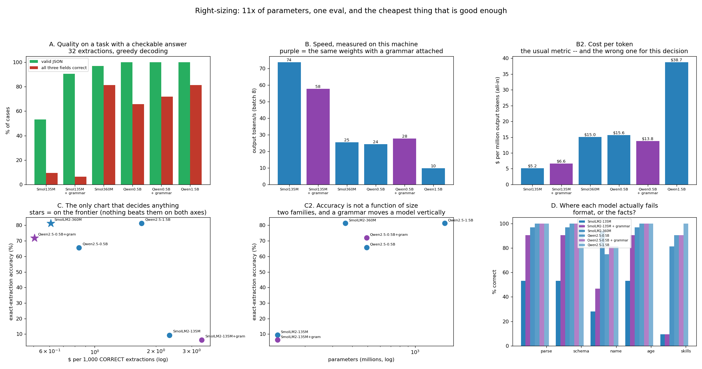

# Right-Sizing Experiment

---

> Four instruct models spanning **11x in parameter count**, one extraction task with a checkable right answer, and the same cost formula project 63 used. **Qwen2.5-1.5B and SmolLM2-360M tie at exactly 81.2% correct** — and the 360M model gets there with **4.3x fewer parameters, 2.6x the speed, and 2.8x lower cost per correct answer ($0.61 vs $1.70 per 1,000)**. Accuracy is not a function of size: the 360M model also **beats the larger Qwen2.5-0.5B (81.2% vs 65.6%)**, so the ladder is not even monotonic. Adding a grammar to the 0.5B moved it from 65.6% to **71.9%** and made it **12% cheaper at the same time** ($15.64 → $13.78/M), because the automaton ends generation and the model stops padding. And the honest inversion: on the 135M model the same grammar took valid-JSON from 53% to **91%** and took exact accuracy **down**, 9.4% → 6.2% — it fixed the format and the model went on inventing the facts. The [Pareto frontier](/shared/glossary/#pareto-frontier) has **two** points on it out of six, and the 1.5B is not one of them.

---

## Key Insight

[Right-sizing](/shared/glossary/#right-sizing) means picking the smallest model that still does the job well. This project runs the same workload on four instruct models spanning 11x in size, measures quality with a real eval and the [cost per million tokens](/shared/glossary/#cost-per-million-tokens) of each, and recommends a tier.

## Why This Matters

Teams routinely over-serve, paying for a giant model when a smaller fine-tuned one would clear the same bar at a fraction of the cost. Measuring quality and cost side by side turns model choice from a guess into a decision backed by numbers.

---

**This is project 64.**

### The words first

- **Tier** — one candidate deployment: a model, plus whatever serving tricks come with it.
- **Exact-extraction accuracy** — all three fields (name, age, skills) correct. The strictest and most useful score here.
- **Schema validity** — the output parses as JSON and has the right field types. Necessary, nowhere near sufficient.
- **[Constrained decoding](/shared/glossary/#constrained-decoding)** — forcing the output to match a grammar by masking illegal tokens at every step. Project 53 built the machinery; here it is one of the tiers.
- **[Pareto frontier](/shared/glossary/#pareto-frontier)** — the tiers that nothing else beats on *both* axes at once. Named after Vilfredo Pareto; the point is that computing it is arithmetic and eliminates most candidates without anyone having to argue.
- **$ per 1,000 correct** — cost per *useful* answer. Cost per token divided by how often the answer is right.

### "The guide says 7B vs 13B vs 70B. Why these four?"

Because a 70B model does not fit on this machine, and because the *shape* of the finding survives the rescaling — as it turns out, more sharply than the original framing suggests.

The ladder here is 135M → 360M → 494M → 1,544M: an 11x span, two model families (SmolLM2 and Qwen2.5), all four instruction-tuned, all four evaluated with the same prompt and the same grader. The two-family choice is deliberate rather than sloppy: with one family you measure a scaling curve, and with two you can find out whether "bigger" and "better" are even the same axis. Section C2 says they are not.

### "Isn't this just an eval? Project 53 already ran this task."

[Project 53](../53-json-mode-reliability/README.md) asked a question about a *technique*: does constrained decoding improve JSON reliability, holding the model fixed? It answered yes, +14.4 points, on Qwen2.5-0.5B.

This project holds the *task* fixed and varies the deployment — which turns an accuracy number into a purchasing decision. Two things follow that project 53 could not have found. First, the grammar's value depends entirely on which model it is attached to: +6.3 points on the 0.5B, **−3.2 points on the 135M**. Second, once cost is on the other axis, the grammar arm is not competing against "the same model unconstrained" — it is competing against *a different model*, and that comparison has a different winner.

### "Why score dollars per correct answer instead of dollars per token?"

Because tokens are not the thing you are buying, and ranking by cost per token gets this decision exactly backwards.

By $/M output tokens the ranking is: **135M ($5.17) cheapest, 1.5B ($38.74) dearest**. By $ per 1,000 correct extractions it is: **Qwen0.5B+grammar ($0.51) cheapest, 135M+grammar ($3.36) dearest**. The cheapest model per token is the *second most expensive* per useful answer, because 91% of what it produces is wrong.

The arithmetic is one line — `$/correct = tokens_per_case × $/M ÷ 1e6 ÷ accuracy` — and it is the whole reason this project exists. **A cheap wrong answer costs more than an expensive right one**, because the wrong one has to be paid for *and* retried, escalated, or silently corrupt a downstream record.

---

## Running it

```bash
python3 run.py           # ~5.5 minutes (4 model loads, 6 evaluated arms)
python3 run.py --plot    # redraw from outputs/findings.json
```

Needs [project 51](../51-needle-in-a-haystack/README.md)'s `ctxlib.py` and [project 53](../53-json-mode-reliability/README.md)'s `gramlib.py` and `jsontask.py`. Models are loaded one at a time and freed before the next (the 1.5B alone is 6.17 GB in fp32).

> **About the numbers.** 32 extraction cases, greedy decoding, batch 8, 44 new tokens maximum, identical prompts and grader for every arm. Cost uses project 63's formula and its illustrative $0.55/hr price with 50% duty and 25% overhead; the tokens/second underneath it is **measured on this machine** during the eval itself. With 32 cases each percentage point of accuracy is worth about a third of a case, so read differences under ~6 points as ties — the two 81.2% arms are 26/32 apiece.



---

## A. The quality ladder

| tier | params | valid JSON | name | age | skills | **all three correct** |
|---|---|---|---|---|---|---|
| SmolLM2-135M | 135M | 53% | 28% | 53% | 9% | **9.4%** |
| SmolLM2-135M + grammar | 135M | 91% | 47% | 91% | 9% | **6.2%** |
| SmolLM2-360M | 362M | 97% | 94% | 97% | 81% | **81.2%** |
| Qwen2.5-0.5B | 494M | 100% | 75% | 100% | 91% | **65.6%** |
| Qwen2.5-0.5B + grammar | 494M | 100% | 81% | 100% | 91% | **71.9%** |
| Qwen2.5-1.5B | 1,544M | 100% | 81% | 100% | 100% | **81.2%** |

**The 1.5B model and the 360M model are tied at 81.2%** — 26 of 32 cases each — and they get there by making *different* mistakes. The 1.5B gets every skills list right and fumbles the name 19% of the time; the 360M gets 94% of names and 81% of skills lists. Four and a bit times the parameters bought a redistribution of the errors, not fewer of them.

**And the ladder is not monotonic.** SmolLM2-360M scores 81.2% while the *larger* Qwen2.5-0.5B scores 65.6%. Parameter count is a budget, not an ability: what a model is good at depends on what it was trained on and how it was instruction-tuned, and on a short structured-extraction task those matter more than 130M extra parameters.

That is the single most useful thing to carry out of this project, because it invalidates the shortcut everyone takes. **You cannot rank candidate models by size and test only the top of the list.** The 4-line eval that produced this table is cheaper than being wrong about it.

### Where the failures actually are

Read the `name` and `skills` columns against `valid JSON`. Every model above 135M produces syntactically perfect output; they differ only in whether the *contents* are right. The 0.5B's weak column is `name` (75%) — it truncates "Radia Perlman" to "Radia" or mixes up first and last. The 135M's weak column is `skills` (9%) — it does not copy the list from the bio at all, it invents a plausible one.

**Format failures and fact failures are different problems with different fixes**, and a single "accuracy" number hides which one you have. Section B is what happens when you apply the fix for the first problem to a model that has the second.

---

## B. The inversion: a grammar fixed the format and made the answers worse

| SmolLM2-135M | valid JSON | age | name | **all three correct** |
|---|---|---|---|---|
| plain | 53% | 53% | 28% | **9.4%** |
| **+ grammar** | **91%** | **91%** | **47%** | **6.2%** |

**Valid JSON went from 53% to 91%. Exact accuracy went from 9.4% down to 6.2%.** Every format metric improved and the only metric that matters got worse.

The mechanism is visible in the raw output. Unconstrained, the 135M writes a fenced code block with pretty-printed JSON — which the grader accepts about half the time. Constrained, it writes exactly the object the grammar demands:

```
plain:     ```json\n{\n  "name": "Radia",\n  "age": 80,\n  "skills": [\n "Photography", "Statistics"\n ]\n}\n```
grammar:   {"name": "Radia", "age": 80, "skills": ["reading", "writing", "math"]}
```

The bio said *optics* and *statistics*. The constrained output is impeccably well-formed and completely made up. **The grammar guarantees the shape of the answer and has no opinion whatsoever about its truth** — it cannot, because it is a [finite-state machine](/shared/glossary/#finite-state-machine) over characters, and it has never seen the bio.

Why did the accuracy actually *fall* rather than stay flat? Two small effects, and both are worth knowing. The mask removes the fenced-code-block habit the model was tuned into, so it is now generating in a format slightly off-distribution for it. And it forces a `skills` array to be produced at every step where one is legal, so the model commits to a guess it might otherwise have avoided. The drop is 1 case in 32 — statistically a tie — but the *direction* is the point: **there was no accuracy improvement to be had, because format was never this model's problem.**

Contrast the 0.5B, which had the opposite profile:

| Qwen2.5-0.5B | valid JSON | name | **all three correct** | tokens/case | $/M |
|---|---|---|---|---|---|
| plain | 100% | 75% | 65.6% | 35.1 | $15.64 |
| **+ grammar** | 100% | **81%** | **71.9%** | **26.4** | **$13.78** |

Its JSON was already perfect, so the grammar could not help there — and it gained 6.3 points anyway, on `name`. That is the mask doing something subtler: by making the wrong continuations impossible, it keeps the model inside the string-copying behaviour it was already trying to perform, instead of letting one low-probability token derail the rest of the field.

**And it got cheaper while doing it.** 26.4 generated tokens per case instead of 35.1, because the automaton knows when the object is complete and stops the generation there — no trailing prose, no second attempt, no padding to the token limit. Tokens/second rose too (27.7 vs 24.4), so **$/M fell 12%**. Constrained decoding on this model is better *and* cheaper, which is rare enough to be worth stating plainly.

> **The rule: a grammar is a fix for format failures. Diagnose which kind of failure you have before applying it.** On a model whose JSON is already valid it can still help by narrowing the search; on a model that cannot do the task it produces beautifully-formatted nonsense, which is arguably worse than obvious nonsense because it passes validation.

---

## C. Cost, and the only chart that decides anything

| tier | measured tok/s | $/M output tokens | accuracy | **$ per 1,000 correct** | on the frontier? |
|---|---|---|---|---|---|
| SmolLM2-135M | 73.8 | **$5.17** | 9.4% | $2.33 | no |
| SmolLM2-135M + grammar | 57.7 | $6.62 | 6.2% | **$3.36** (worst) | no |
| **SmolLM2-360M** | 25.4 | $15.05 | **81.2%** | **$0.61** | **yes** |
| Qwen2.5-0.5B | 24.4 | $15.64 | 65.6% | $0.84 | no |
| **Qwen2.5-0.5B + grammar** | 27.7 | $13.78 | 71.9% | **$0.51** (best) | **yes** |
| Qwen2.5-1.5B | 9.9 | $38.74 | 81.2% | $1.70 | no |

**Ranking by cost per token and ranking by cost per correct answer give almost opposite orders.** The 135M is the cheapest model in the fleet by tokens and the second most expensive by results. The 1.5B is the most expensive by tokens *and* is beaten on both axes by a model a quarter of its size.

**Only two of six tiers survive the frontier test.** Everything else is *dominated* — some other tier is at least as accurate and at least as cheap. Specifically:

- Qwen2.5-1.5B is dominated by **SmolLM2-360M**: same 81.2%, $0.61 against $1.70.
- Qwen2.5-0.5B is dominated by **SmolLM2-360M**: worse accuracy *and* dearer per correct answer.
- Both 135M arms are dominated by everything.

The two survivors are not comparable to each other, and that is what a frontier means: **SmolLM2-360M is more accurate; Qwen0.5B+grammar is cheaper per correct answer.** Choosing between them requires knowing what 9.3 accuracy points are worth in money, which is a product question and not one the chart can answer. The chart's job was to reduce six candidates to two, and it did.

**The recommendation, stated as a team would state it:** deploy **SmolLM2-360M**. It matches the best accuracy measured anywhere in the ladder, costs 2.8x less per correct answer than the 1.5B, needs **1.45 GB instead of 6.17 GB** of weights in fp32 — which on a real GPU is the difference between four replicas per card and one — and runs 2.6x faster, which is 2.6x more headroom before [project 61](../61-slo-simulation/README.md)'s cliff.

### The size axis, and why it is the wrong one

Plot accuracy against parameter count (panel C2) and the points do not form a curve. 135M scores 9%, 360M scores 81%, 494M scores 66%, 1,544M scores 81%. Between 360M and 1.5B — a 4.3x span — the accuracy is *flat*, and inside it there is a model that scores 15 points lower.

Two separate things are going on and both matter for right-sizing:

**A capability threshold.** Between 135M and 360M the task goes from impossible to essentially solved. That is not a smooth scaling curve; it is a step. Below the step, no amount of prompting or grammar helps (section B); above it, extra parameters buy almost nothing. **Most production tasks have a step like this, and the entire right-sizing question is finding where yours is.** The way to find it is to test upward from the smallest candidate, not downward from the biggest.

**Family beats size, near the step.** Qwen2.5-0.5B has 36% more parameters than SmolLM2-360M and scores 15 points lower here. Different pretraining data, different instruction tuning, different tokenizer. Above the step this stops mattering — the 1.5B and the 360M tie — but right at the step, which is exactly where a right-sizing decision lives, it dominates.

> **The generalisation worth taking away, and its limit.** This task is short structured extraction, which is close to the easiest thing an LLM does — the answer is copied from a 20-word bio. On reasoning, long-context or open-ended generation the step sits much higher and the 1.5B would separate cleanly from the 360M. What transfers is not "360M is enough" but **"find your step by testing upward, and price the candidates per correct answer"**.

---

## What to take from this

1. **Qwen2.5-1.5B and SmolLM2-360M tie at 81.2%** — 4.3x the parameters, no more correct answers, just differently distributed errors.
2. **The 360M beats the larger 0.5B, 81.2% vs 65.6%.** The size ladder is not monotonic; family and tuning beat parameter count near the capability step.
3. **$/token and $/correct rank the tiers almost in opposite orders.** The cheapest model per token is the second dearest per useful answer.
4. **Only 2 of 6 tiers are on the frontier.** The 1.5B is not one of them; it is dominated on both axes by a model a quarter of its size.
5. **A grammar on the 0.5B: +6.3 points and 12% cheaper** (26.4 tokens per case instead of 35.1, because the automaton ends generation).
6. **A grammar on the 135M: valid JSON 53% → 91%, exact accuracy 9.4% → 6.2%.** It fixes format, never facts.
7. **Diagnose the failure before choosing the fix.** The 135M's weak column was `skills` (9%); the 0.5B's was `name` (75%). Only one of those is a format problem.
8. **Test upward from the smallest candidate.** The step between 135M and 360M is the whole decision; everything above it is a tie.
9. **1.45 GB vs 6.17 GB of weights** is four replicas per GPU instead of one — a cost effect this single-replica accounting does not even capture.

### Common traps this project walks into on purpose

- **Ranking candidates by parameter count and testing only the largest.** The winner here is fourth on that list.
- **Reporting cost per token in a model-selection document.** It reverses the ranking.
- **Reading "valid JSON: 91%" as good news.** The same arm's exact accuracy was 6.2%.
- **Applying constrained decoding to a model that cannot do the task.** Well-formed nonsense passes validation.
- **Assuming a bigger model is at least as good.** The 0.5B is bigger than the 360M and 15 points worse.
- **Comparing arms with different prompts or graders.** Every arm here shares both, deliberately.
- **Over-reading a 32-case eval.** Differences under ~6 points are ties; the two 81.2% arms are 26/32 each.

---

## Next

[Project 65 — load-shedding policy](../65-load-shedding-policy/README.md) returns to the running system with the question this phase has been circling: when demand exceeds what any model size can absorb, who do you refuse, and what does refusing buy?
