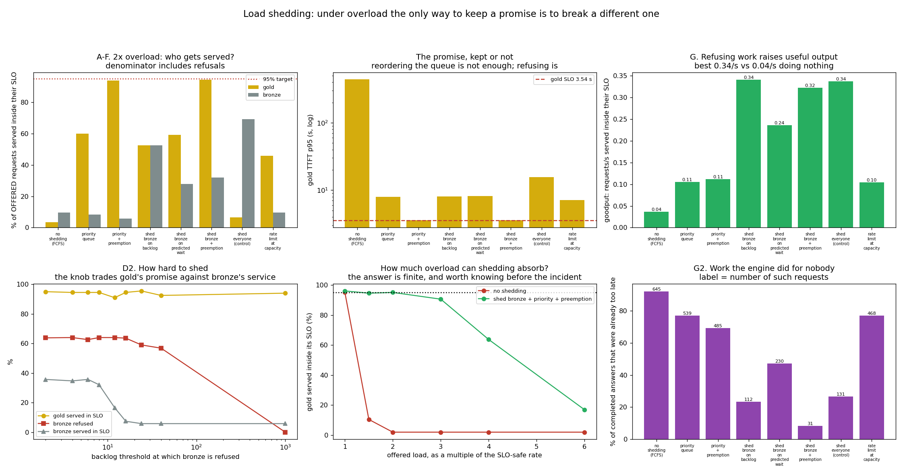

# Load-Shedding Policy

---

> At twice the SLO-safe arrival rate, **serving everybody serves nobody**: gold requests meet their promise 3.5% of the time, and **92% of every answer the engine produced was already too late to be useful**. Reordering the queue by priority takes gold to 60.1% — still a broken promise. **Preemption** — throwing a running bronze request out for a waiting gold one — takes gold to **93.9%**, and costs 22,368 recomputed tokens. **Shedding bronze** takes total [goodput](/shared/glossary/#goodput) from 0.036 to **0.341 requests/second — 9.5x more useful work by doing less work**. Only the combination gets both: gold **94.4%** at a p95 of 3.58 s, goodput 0.323/s, and the share of answers that arrive too late falls from **92% to 8%**. Two controls sharpen it. Shedding **without** priority — refusing 30% of everyone — leaves gold at **6.6%**, worse than doing nothing. And a plain rate limiter set at measured capacity refused 16.2% of gold requests and left gold **worse than the arm that refuses nobody** (46.0% vs 60.1%). The most counter-intuitive row is bronze's own: **refusing 64% of bronze traffic made 6x more bronze users get a usable answer** (5.8% → 35.7%).

---

## Key Insight

Under overload, [load shedding](/shared/glossary/#load-shedding) deliberately refuses some requests early — using priority-aware [admission control](/shared/glossary/#admission-control) — so the most important traffic still meets its [SLO](/shared/glossary/#slo). This project verifies that high-priority requests stay fast even at 2× overload.

## Why This Matters

When demand exceeds capacity, trying to serve everyone degrades the experience for everyone. Dropping low-priority work quickly — a fast rejection beats a slow timeout — keeps the requests that matter within their targets.

---

**This is project 65.**

### The words first

- **Gold / bronze** — two classes of traffic. Gold is 30% of requests and is promised p95 [TTFT](/shared/glossary/#ttft) under 3.54 s (the SLO [project 61](../61-slo-simulation/README.md) located). Bronze is best effort, with a loose 20 s bound so "best effort" still means something.
- **[Admission control](/shared/glossary/#admission-control)** — deciding at the door whether to accept a request at all.
- **Shedding** — refusing it. The client gets an immediate error and can retry, fail over, or degrade gracefully.
- **[Preemption](/shared/glossary/#preemption)** — evicting a request that is *already running* to make room for a more important one. Its work so far is thrown away.
- **[Goodput](/shared/glossary/#goodput)** — requests per second served *inside their SLO*. Throughput counts answers; goodput counts useful answers.
- **Attainment** — the fraction of **offered** requests served inside their SLO. Refusals count against it, which is what makes the number honest.
- **Token bucket** — the classic rate limiter: tokens refill at a fixed rate, each admission spends one, an empty bucket means refuse.

### "Projects 21 and 22 already did admission and SLO scheduling. What is left?"

Different question, and the three answers do not substitute for each other.

[Project 21](../21-cache-aware-admission/README.md) asked a **memory** question: will this request's [KV cache](/shared/glossary/#kv-cache) fit, and what happens when the engine accepts one that will not? Its constraint is bytes, and its failure mode is a preemption storm.

[Project 22](../22-slo-aware-scheduler/README.md) asked an **ordering** question: given a queue of requests with deadlines, which one goes next? Its constraint is fairness against urgency, and it assumed everything in the queue would eventually run.

This project asks the question both of those defer: **the queue is longer than anything you can serve, so who never runs at all?** Sections A and B show why the other two are not enough on their own — with the queue permanently full, reordering it improves gold to 60% and stops there, because a perfect order over an impossible workload is still impossible. Something has to leave.

### "Why is refusing a request better than serving it slowly?"

Because a late answer costs exactly as much to produce as a timely one and is worth nothing.

The measurement in section A makes this concrete: without shedding, **645 of the 700 requests that completed — 92% — arrived after their deadline**. The engine ran at full utilisation the whole time. Every one of those 645 answers consumed prefill, decode, KV memory and a slot, and produced something the caller had already given up on.

Refusing early converts that spend into two things a late answer cannot give you: **capacity for someone who can still be served**, and **a fast, actionable signal to the caller**. A client that gets a `429` in 5 ms can retry against another region, fall back to a cached answer, or show a "try again" message. A client that waits 440 seconds gets none of those options, and has usually timed out anyway.

---

## Running it

```bash
python3 run.py           # ~5 seconds; no model, no GPU
python3 run.py --plot    # redraw from outputs/findings.json
```

Uses [project 18](../18-chunked-prefill-simulator/README.md)'s `simlib.py` and the cost model [project 61](../61-slo-simulation/README.md) fitted to real forward passes.

> **About the numbers.** 700 requests, 30% gold, 24 concurrent slots. The offered rate is **2.0x the SLO-safe rate** project 61 measured (0.35 req/s), which is **1.14x the engine's raw serving capacity** (0.61 req/s) — those two multipliers are very different and both are quoted deliberately. Real overload is usually only slightly above capacity; that is already enough to destroy latency, because the queue integrates the excess.



---

## A. Doing nothing

| | gold TTFT p95 | gold attainment | bronze attainment | goodput | answers already too late |
|---|---|---|---|---|---|
| no shedding, FCFS | **440.7 s** | **3.5%** | 9.6% | 0.036 req/s | **645 of 700 (92%)** |

**The gold SLO is 3.54 seconds and the p95 is 440.7 seconds — off by a factor of 125.** Bronze, with its 20-second allowance, is met 9.6% of the time. Nobody is served.

Note that throughput is *fine*: 0.461 requests per second completed, the engine ~100% busy. **A throughput dashboard would show this system working perfectly.** Goodput is 0.036/s. The gap between those two numbers is the entire subject of this project: 92% of the output was produced too late to be worth producing.

That is also the fairness trap in first-come-first-served under overload. FCFS treats every request identically, which sounds equitable and is in fact the worst possible outcome — it distributes the damage so evenly that no class of user gets a working service. **Under overload, fairness and usefulness are opposed.**

---

## B, C. Reordering, then preempting

| | gold p95 | gold attainment | bronze attainment | goodput | preemptions | tokens recomputed |
|---|---|---|---|---|---|---|
| A. no shedding (FCFS) | 440.7 s | 3.5% | 9.6% | 0.036 | 0 | 0 |
| B. priority queue | 7.94 s | **60.1%** | 8.4% | 0.106 | 0 | 0 |
| C. priority + **preemption** | **3.59 s** | **93.9%** | 5.8% | 0.112 | 171 | **22,368** |

**Sorting the queue by priority takes gold from 3.5% to 60.1%, and stops there.** A 17x improvement that still misses the promise by a wide margin.

The reason is structural and it is the thing most people get wrong about priority queues: **reordering only helps a request that is still in the queue.** Once 24 bronze requests occupy all 24 slots, a gold request arriving behind them waits for one to finish, however urgent it is. The queue order decides who goes next; it has no authority over who is already inside.

**Preemption is what gives it that authority**, and it works: gold reaches 93.9% with a p95 of 3.59 s, essentially on the 3.54 s promise. The bill is itemised in the last two columns — **171 evictions and 22,368 decode tokens thrown away and recomputed**, which is why total throughput falls from 0.461 to 0.365 req/s. The system does 21% less work overall in order to do the *right* work.

**And bronze is now worse off than under FCFS** (5.8% against 9.6%). Preemption did not create capacity; it reallocated it, and the people it took it from were bronze users who had already started being served. Section D is what happens when you take it from them *before* they start instead.

---

## D. Shedding: 9.5x more useful work by doing less work

| | gold attainment | bronze attainment | bronze refused | goodput | too-late answers |
|---|---|---|---|---|---|
| A. no shedding | 3.5% | 9.6% | 0% | 0.036 | 645 (92%) |
| D. shed bronze on backlog | 52.5% | **52.6%** | 43.8% | **0.341** | 112 (23%) |
| E. shed bronze on predicted wait | 59.1% | 27.9% | 42.4% | 0.236 | 230 (47%) |
| **F. shed bronze + preemption** | **94.4%** | 32.1% | 63.9% | 0.323 | **31 (8%)** |

**Goodput goes from 0.036 to 0.341 requests per second — 9.5x — by refusing 44% of bronze traffic.** The engine completes *fewer* requests (0.445/s against 0.461) and delivers nearly ten times as many useful answers.

The mechanism is the one section A set up. Under overload the queue grows without bound, so every request waits behind a backlog that will never clear, and everything finishes late. Refusing arrivals stops the backlog growing; the requests that *are* admitted find a queue short enough to clear inside their deadline. **The refused requests were not going to be served usefully anyway — shedding just makes that explicit at millisecond zero instead of at second 440.**

### Shedding fixes goodput; preemption fixes the promise; you need both

Read arms C, D and F together, because each one is missing something the others have.

- **C (preempt, no shedding)**: gold 93.9% ✓, goodput 0.112 ✗. The promise is kept and the system as a whole is still mostly producing waste — bronze's 400 requests are all still in the system, all still finishing late.
- **D (shed, no preempt)**: goodput 0.341 ✓, gold 52.5% ✗. The system is efficient and the promise is broken, because bronze requests already *inside* the engine still hold their slots.
- **F (both)**: gold **94.4%**, goodput **0.323**, and only **8% of completed answers arrive too late**, against 92% for doing nothing.

**They fix different halves because they act at different moments.** Shedding controls what *enters*; preemption controls what *stays*. A policy with only one of them has a hole exactly where the other one operates.

### The counter-intuitive row: bronze is better off being refused

Sweep the backlog threshold at which bronze gets refused (with preemption on throughout):

| refuse bronze when backlog exceeds | bronze refused | **bronze served inside its SLO** | gold attainment | goodput |
|---|---|---|---|---|
| 2 | 63.7% | **35.7%** | 94.9% | 0.346 |
| 8 | 63.9% | 32.1% | 94.4% | 0.323 |
| 16 | 63.5% | 7.4% | 94.4% | 0.206 |
| 40 | 56.8% | 5.8% | 92.4% | 0.184 |
| never shed | 0% | **5.8%** | 93.9% | 0.112 |

**Refusing 64% of bronze traffic produced 6x more bronze users with a usable answer** — 35.7% against 5.8%. The class being shed is the class that benefits.

This looks like a paradox and is not. "Serve every bronze request" and "serve a bronze request usefully" are different goals, and under overload they are in direct conflict: admitting all of them guarantees that all of them are late. Turning away two-thirds leaves a queue short enough that the remaining third finishes inside twenty seconds. **A bronze user's realistic choice was never "served or refused" — it was "refused in 5 ms" or "served uselessly in 457 s", and a third of them got an actual answer instead.**

Note also what the threshold column does *not* move: **gold attainment sits at 92–95% regardless.** The shedding threshold is not a gold knob at all — preemption is what protects gold — it is a knob that trades bronze's *acceptance rate* against bronze's *service quality*. Knowing which knob controls which class is most of operating one of these systems.

### Shedding by predicted wait was worse than shedding by backlog

Arm E refuses a bronze request when `backlog × mean service time` already exceeds bronze's 20-second budget — a smarter-looking rule that estimates the actual delay rather than counting bodies. It refused almost the same fraction (42.4% vs 43.8%) and delivered **0.236 goodput against 0.341**, with bronze attainment 27.9% against 52.6%.

The estimator is the problem. `backlog × mean service time` uses the *mean*, and this workload's service times are lognormal — a handful of long requests dominate. So the estimate is too low whenever a long request is in flight, the rule admits when it should refuse, and the backlog it is trying to bound grows anyway. **A predictive admission rule is only as good as its predictor, and a mean is a poor predictor of a fat-tailed quantity.** The dumb rule that counts queue entries has no model to be wrong about.

---

## G. Two controls that both fail informatively

| | gold attainment | gold refused | bronze attainment | goodput |
|---|---|---|---|---|
| B. priority queue (refuses nobody) | 60.1% | 0% | 8.4% | 0.106 |
| **G1. shed everyone, no priority** | **6.6%** | 28.3% | **69.3%** | 0.338 |
| **G2. rate limit at measured capacity** | **46.0%** | 16.2% | 9.6% | 0.105 |

### Shedding without priority destroys the class you were protecting

G1 refuses on the same backlog rule as D but applies it to *everyone*. Goodput is nearly as good (0.338), bronze does **better than in any other arm** (69.3%) — and **gold collapses to 6.6%, worse than doing nothing at all.**

Which is exactly right, and exactly the point. A class-blind shedder refuses gold and bronze in proportion to their traffic, so gold — 30% of arrivals — absorbs 30% of the refusals. Every refused gold request is an SLO miss by definition. **Load shedding is not a capacity mechanism, it is a prioritisation mechanism**, and a shedder that cannot tell your customers apart will happily optimise total throughput by dropping the ones who pay.

The comparison D-vs-G1 isolates it cleanly: same rule, same threshold, one of them knows about classes. 52.5% gold against 6.6%.

### A rate limiter at capacity made gold worse than no limiter at all

G2 is the standard operations answer: a token bucket at the ingress, refilling at the measured capacity of 0.61 req/s with a burst of 8. It refused 12.2% of bronze and **16.2% of gold**, and gold attainment came out at **46.0% — below the 60.1% of the arm that refuses nobody.**

Three things went wrong, and all three generalise:

1. **It is class-blind**, so it refuses gold — the same failure as G1, in milder form.
2. **It is blind to the queue.** A token bucket knows the *arrival rate* and nothing about how backed up the server is. It happily admits during a lull that follows an overload, when the backlog from the overload is still draining.
3. **A limiter set at capacity does not prevent overload; it prevents *exceeding capacity on average*.** Queues are built by variance, not by averages — [project 61](../61-slo-simulation/README.md) measured a mild burst costing a 3.38x safety factor at an unchanged mean rate — so a bucket tuned to the mean lets exactly the bursts through that create the backlog.

> **A rate limiter is the right tool for a different job: protecting against a runaway client or a retry storm, where the arrival rate itself is pathological.** It is the wrong tool for protecting an SLO under legitimate sustained demand, because it is looking at the wrong variable. The metric a shedder needs is queue depth or predicted wait — the `llm_num_requests_waiting` gauge from [project 59](../59-metric-instrumentation/README.md) — not requests per second.

---

## How much overload can shedding absorb?

Offered load, as a multiple of the SLO-safe rate, against gold attainment:

| load | no shedding | shed bronze + priority + preemption |
|---|---|---|
| 1.0x | 95.0% | 96.0% |
| 1.5x | **10.4%** | **94.5%** |
| 2.0x | 2.0% | **95.0%** |
| 3.0x | 2.0% | **90.5%** |
| 4.0x | 2.0% | 63.7% |
| 6.0x | 2.0% | 16.9% |

**Without shedding the promise is already gone at 1.5x.** With it, gold holds above 90% through **3x** overload, degrades at 4x, and is gone by 6x.

Two things worth taking from the shape of that column. First, **at 1.0x the shedding policy costs nothing** — 96.0% against 95.0%, inside the noise, and zero bronze refusals. A well-built shedder is invisible until it is needed, which is what makes it safe to leave switched on.

Second, **the protection is finite and its limit is arithmetic.** Gold is 30% of traffic, so at 3.3x the SLO-safe rate gold *alone* exceeds capacity, and no amount of refusing bronze helps — there is no bronze left to refuse. The measured collapse between 3x and 4x is exactly that boundary. **Knowing your own number is the point of running this ladder before the incident**, because it tells you when shedding stops being the answer and capacity is the only answer left.

---

## What to take from this

1. **Under 2x overload FCFS serves nobody**: gold 3.5%, and 92% of all completed answers arrived too late.
2. **Throughput looked perfect** (0.461 req/s, engine 100% busy) while goodput was 0.036/s. Measure goodput.
3. **A priority queue took gold to 60.1% and stopped.** Reordering has no authority over requests already running.
4. **Preemption took gold to 93.9%**, at 171 evictions and 22,368 recomputed tokens, and 21% less total throughput.
5. **Shedding bronze took goodput to 0.341 req/s — 9.5x — by completing fewer requests.**
6. **Only the combination gets both**: gold 94.4%, goodput 0.323, too-late answers 92% → 8%. Shedding controls entry, preemption controls occupancy.
7. **Refusing 64% of bronze gave 6x more bronze users a usable answer** (5.8% → 35.7%). The shed class benefits.
8. **The shedding threshold is a bronze knob, not a gold knob.** Gold sat at 92–95% across the whole sweep.
9. **A "smarter" predicted-wait rule lost to counting the queue** (0.236 vs 0.341 goodput) — its mean-based estimator is wrong on a fat-tailed workload.
10. **Class-blind shedding left gold at 6.6%, worse than no shedding.** Shedding is prioritisation, not capacity.
11. **A rate limiter at measured capacity refused 16.2% of gold and left gold worse than refusing nobody.** Buckets watch arrival rate; queues are built by variance.
12. **Shedding bought ~3x of overload headroom, and no more.** Past 3.3x, gold alone exceeds capacity.

### Common traps this project walks into on purpose

- **Treating everyone equally under overload.** FCFS is the fairest policy and the worst outcome.
- **Reporting throughput during an incident.** It was 0.461/s while 92% of the output was waste.
- **Believing a priority queue protects a class.** It stops at the slot boundary.
- **Shedding without a class label.** Gold 52.5% → 6.6% from that one change.
- **Rate limiting to protect an SLO.** Wrong variable; it watches arrivals, not the queue.
- **Building a predictive admission rule on a mean.** Lognormal service times make the mean an optimistic lie.
- **Assuming refusals help only the protected class.** Bronze's own service improved 6x.
- **Counting attainment over *served* requests.** Every table here divides by requests *offered*, refusals included; the other denominator makes a shedder look perfect by construction.

---

## Next

[Project 66 — postmortem drill](../66-postmortem-drill/README.md) closes the phase by putting the instruments, the budget and the policies together: three faults injected into a live engine, a written diagnosis procedure scored against them, and the metric that decides whether you can tell a dying replica from a busy Tuesday.
