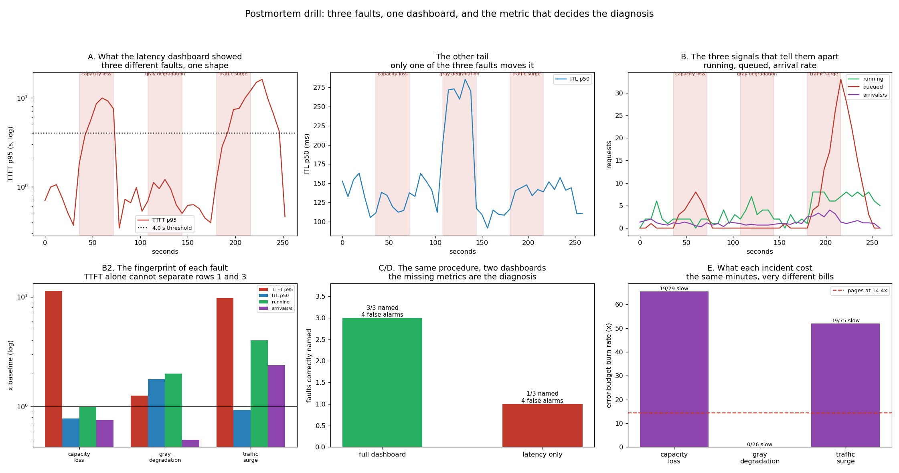

# Postmortem Drill

---

> Three faults injected into one live engine — a capacity loss, a **gray degradation** where every forward pass gets 2.2x slower, and a 3x traffic surge. On the latency chart **all three look the same**: [TTFT](/shared/glossary/#ttft) p95 goes from 0.76 s to 8.57, 0.95 and 7.36 s. A written diagnosis procedure reading the full dashboard names **3 of 3**, the first one in the very first window. The same procedure reading a **latency-only dashboard names 1 of 3** — capacity loss and demand surge both come back "something is queueing", in every window, because the two metrics that separate them (`running` and the arrival rate) are not on the chart. Three findings sharpen it. **The capacity loss made [ITL](/shared/glossary/#itl--tpot) 22% *better*** (119 ms vs 153), because fewer requests share each forward pass — losing capacity improved a latency metric. **The gray degradation cost exactly 0% of the error budget** — a [burn rate](/shared/glossary/#burn-rate) of **0.0x** against 66x and 52x for the others — because the SLI watches TTFT and the damage was entirely in ITL. And **the surge's aftermath cost more than the surge**: 70 late requests during recovery against 39 during the incident itself, a burn rate of **81x after it was over**.

---

## Key Insight

This project injects real failures — a capacity loss, a silent slowdown, a traffic surge — then runs the incident end to end and writes a [postmortem](/shared/glossary/#postmortem): a blameless account of what broke, how it was detected, and what will keep it from happening again.

## Why This Matters

Systems fail; teams that rehearse failure recover faster and calmer when it happens for real. A good postmortem turns one painful outage into permanent lessons, so the same problem does not bite twice.

---

**This is project 66.**

### The words first

- **Fault injection** — deliberately breaking something, on purpose, while watching. Here: cutting the concurrency cap, slowing every forward pass, and tripling arrivals.
- **Gray failure** — a fault where nothing errors and nothing crashes; the system just gets worse. The hardest kind to detect, because every alert that watches for failures stays quiet.
- **[MTTD / MTTR](/shared/glossary/#mttd--mttr)** — mean time to *detect* and to *recover*. Different problems with different cures: detection is an [observability](/shared/glossary/#observability) problem, recovery is an operations one.
- **[Burn rate](/shared/glossary/#burn-rate)** — how many times faster than "even" the [error budget](/shared/glossary/#error-budget) is being spent. Scale-free, so a 36-second drill and a 30-day month use the same threshold.
- **Blameless** — the postmortem's subject is the system and the instruments, never the people. Not politeness: a postmortem that assigns blame stops collecting facts.
- **Draining** — the period after a fault clears when the queue it created is still being worked off. Not a fault, and not healthy either.

### "Project 48 already ran a failure drill. What is different?"

[Project 48](../48-failure-mode-drill/README.md) asked what a failure *does*: kill a replica, measure the damage, measure whether retries and health checks help. Its answers were about the system's behaviour.

This project asks what you can *see*, and scores it. The faults are a means; the measured quantity is **how many of them a stated procedure can name from a stated set of metrics.** That is a different deliverable — it produces an action item list about the dashboard, not about the fleet — and it is the one that decides how long the next real incident lasts.

It also completes the phase. [Project 59](../59-metric-instrumentation/README.md) built the instruments, [61](../61-slo-simulation/README.md) found the cliff, [62](../62-error-budget-tracker/README.md) built the budget and the alerts, [65](../65-load-shedding-policy/README.md) built the response. This is all of them at once, against three faults, with a score at the end.

### "Why write the diagnosis as code instead of just looking at the graphs?"

Because "I would have spotted that" is not a measurement, and a dashboard cannot be improved by an opinion about it.

The procedure in [`run.py`](run.py) is a short decision tree — the one an on-call engineer would actually walk, in the order they would walk it. Writing it down makes three things possible that eyeballing does not. It can be run against **every** window, so detection time is a number rather than a memory. It can be run twice, once with the full metric set and once with the metrics most teams actually have, and the difference between the two scores is exactly the value of the missing metrics. And it can be **wrong in public**, which is how the honest limitation in section D got found.

---

## Running it

```bash
python3 run.py              # ~4 minutes (a real 260-second engine run)
python3 run.py --reanalyse  # redo the diagnosis from the committed windows
python3 run.py --plot       # redraw from outputs/findings.json
```

Needs [project 16](../16-static-vs-continuous/README.md)'s `batchlib.py` and [project 59](../59-metric-instrumentation/README.md)'s `obslib.py`. The engine is real Qwen2.5-0.5B on 8 KV slots; the clock is virtual (it advances by the measured duration of each real forward pass), which is what lets a 2.2x slowdown be injected without waiting 2.2x longer.

> **About the numbers.** 336 requests over 260 s of virtual time, arrivals at 1.05 req/s except during the surge, metrics sampled every 6 s — the scrape interval. Everything below is from the committed [`outputs/findings.json`](outputs/findings.json); the generated incident report is [`outputs/postmortem.md`](outputs/postmortem.md).



---

## The timeline

| phase | TTFT p95 | ITL p50 | running | arrivals/s | slow requests |
|---|---|---|---|---|---|
| baseline (0–36 s) | 0.76 s | 153 ms | 2.0 | 1.33 | 0 |
| **capacity loss** (36–72 s) | **8.57 s** (11.3x) | **119 ms** (0.8x) | 2.0 | 1.00 | 19 |
| recovery 1 | 0.72 s | 141 ms | 2.0 | 1.17 | 3 |
| **gray degradation** (108–144 s) | 0.95 s (1.3x) | **272 ms** (1.8x) | 4.0 | 0.67 | **0** |
| recovery 2 | 0.57 s | 109 ms | 2.0 | 1.00 | 0 |
| **traffic surge** (180–216 s) | **7.36 s** (9.7x) | 142 ms (0.9x) | 8.0 | **3.17** | 39 |
| recovery 3 (216–258 s) | **9.79 s** (12.9x) | 142 ms | 7.0 | 1.17 | **70** |

The faults were: the concurrency cap cut from 8 to 2 (a replica's worth of slots gone), every forward pass multiplied by 2.2 (a thermally throttled or mis-scheduled host), and arrivals tripled (a marketing email).

---

## A. On the latency chart, two of the three faults are the same picture

TTFT p95: **8.57 s** for the capacity loss, **7.36 s** for the surge. Within 16% of each other. Both times the queue grew, both times the first token took ten times longer than usual, and **the shapes on panel A are indistinguishable.**

They have opposite cures. A capacity loss needs the capacity back — restart the replica, fail over, reduce the batch cap on the survivors. A demand surge needs the *demand* reduced — [shed load](/shared/glossary/#load-shedding), rate-limit the offending tenant, autoscale out. **Applying the surge cure to a capacity loss (shed traffic) throws away requests you could have served; applying the capacity cure to a surge (add replicas) is right but slow, and does nothing for the next ten minutes.** Guessing wrong costs the length of the guess.

### The gray degradation moved the *other* tail, and only that one

TTFT barely moved (0.95 s, 1.3x). **ITL went from 153 ms to 272 ms — 1.8x — and stayed there for the whole fault.** Users would see the first word arrive normally and then the answer crawl out.

This is the guide's "two latency tails" as a single measured picture, and the diagnostic content is high: **each of the three faults has a distinct ITL signature.** The gray degradation raised it 1.8x. The surge left it alone (0.9x) — the batch was already full, so more arrivals go to the queue, not into the forward pass. And the capacity loss made it **better**.

### The inversion: losing capacity improved a latency metric

**ITL during the capacity loss: 119 ms, against 153 ms at baseline — 22% faster.**

Nothing is wrong with the measurement. Cutting the concurrency cap from 8 to 2 means at most two requests share each forward pass instead of up to eight, and a narrower batch is a quicker forward pass. So the two requests that got in were served *faster per token* than they would have been on a healthy system — while twenty-seven others queued behind them.

**A dashboard panel showing "ITL p50" would have gone green at the exact moment the incident started.** That is worth internalising, because "which metrics improve during this failure" is not a question most people think to ask, and metrics that improve are the ones that will fool you. It also explains the diagnostic tree in the next section: ITL going *up* is a strong, specific signal, because only one of these three faults can do it.

---

## B, C. The diagnosis, written down and scored

The procedure, in the order an engineer walks it:

1. **Is ITL up?** Then the engine itself got slower. Neither other fault can do this — a capacity loss makes ITL better, a surge leaves it flat.
2. **Otherwise the queue is what grew. Did demand grow with it?** Then it is a surge: the system is fine, the world changed.
3. **Queue grew, demand did not:** capacity went away.

| | faults named | detection time | false alarms |
|---|---|---|---|
| **full dashboard** | **3 of 3** | capacity 0 s, gray 6 s, surge 6 s | 4 in 20 healthy windows |
| **latency-only dashboard** | **1 of 3** | gray 6 s only | 4 in 20 |

**With TTFT and ITL alone, the capacity loss and the traffic surge return "unclear (queueing: capacity or demand?)" in every single window of both incidents.** Not a wrong answer — an *undecidable* one. The information needed to separate them was never collected.

Step 1 survives the amputation, which is why the gray degradation is still named: ITL is a latency metric, so a latency-only dashboard can see it. Steps 2 and 3 both need `arrival_rate` and `waiting`, and both die. **The score difference — 3 versus 1 — is the exact value of two counters that cost 720 nanoseconds each to maintain** ([project 59 section E](../59-metric-instrumentation/README.md)).

That is the whole argument for the boring half of the guide's dashboard figure. Queue depth and arrival rate are not interesting to look at; for most of this run they are flat lines. They are what makes the interesting chart interpretable.

---

## D. Where the procedure is wrong, and why that is the useful part

Four windows in "healthy" phases raised an alarm. Here they are:

| t | phase | call | TTFT p95 | queue depth |
|---|---|---|---|---|
| 228 s | recovery 3 | capacity | 16.06 s | 22 |
| 234 s | recovery 3 | capacity | 9.79 s | 15 |
| 240 s | recovery 3 | capacity | 6.51 s | 9 |
| 246 s | recovery 3 | capacity | 4.19 s | 3 |

**None of them is a false alarm.** The queue depth is 22, 15, 9, 3 — monotonically draining. The surge ended at t=216 and the backlog it built took another 30 seconds to clear, during which requests really were waiting 16 seconds for a first token. The alert is right; the label "healthy" is wrong, and it is wrong because *this project* drew the phase boundary at the moment the fault was removed rather than the moment its effects ended.

Two real lessons come out of that mislabelling, and neither is about the drill.

**The aftermath cost more than the incident.** 70 late requests during recovery 3 against 39 during the surge itself — a [burn rate](/shared/glossary/#burn-rate) of **81x after the fault was over**, higher than the 52x while it was happening. A queue is an integral: it accumulates while arrivals exceed service and it only drains at the *difference* between them, which is much smaller than the surge was. **An incident's duration on the status page and its duration in the error budget are different numbers, and the second one is larger.**

**The procedure has no memory.** It classifies each window independently, so during the drain it confidently reports "capacity" — a queue with normal demand, which is exactly what step 3 says a capacity loss looks like. It cannot say "this is the tail of the thing that just ended", because it has never heard of the thing that just ended. A deployable version needs hysteresis: compare against the previous windows, and suppress a diagnosis whose queue depth is *falling*. **A rule that reads one window at a time cannot tell a system breaking from a system recovering**, and those want opposite responses.

---

## E. What each incident cost

Against a 99% latency SLO (requests answered in under 4 s):

| incident | served | slow | **burn rate** | pages at 14.4x? |
|---|---|---|---|---|
| capacity loss | 29 | 19 | **66x** | yes |
| **gray degradation** | 26 | **0** | **0.0x** | **no** |
| traffic surge | 75 | 39 | **52x** | yes |
| *recovery 3 (the drain)* | *86* | *70* | *81x* | *yes* |

**The gray degradation cost exactly nothing.** Zero slow requests, a burn rate of 0.0x, no page, no budget spent. Every forward pass was 2.2x slower for 36 seconds and by the SLO's own arithmetic **it never happened.**

The SLI is why. "99% of requests under 4 s TTFT" is a promise about *time to first token*, and this fault damaged *time between tokens*. Prefill got slower too, but TTFT had 3 seconds of headroom over the threshold and 2.2x was not enough to spend it. So the incident is invisible not because the instrument was missing — [project 59](../59-metric-instrumentation/README.md)'s registry recorded the ITL histogram faithfully, and panel B shows it plainly — but because **no SLO was written against it.**

**An SLI does not measure health; it defines which failures count.** A service with only a TTFT SLO is, by construction, permitted to make the streaming experience arbitrarily worse forever. The action item writes itself: if users can perceive a stuttering answer, there must be a TPOT SLO, or that failure mode has no owner. [Project 61](../61-slo-simulation/README.md) measured the same asymmetry from the other side — the TTFT and TPOT promises break at rates 5.4x apart.

**And note which alert would have caught it.** Not the burn-rate alert (0.0x, silent). Not an error-rate alert — no request failed. Only a direct threshold on the ITL histogram. This is the defining property of a gray failure: everything that watches for *failure* sleeps through it, because nothing failed.

---

## The postmortem

The drill's actual deliverable is [`outputs/postmortem.md`](outputs/postmortem.md), generated from the data. Its three action items, and why each one is the measurement rather than an opinion:

1. **Put `llm_num_requests_running` and the arrival rate on the main dashboard.** Without them, capacity loss and a demand surge are the same picture — measured: 3 of 3 named with them, 1 of 3 without.
2. **Alert on queue wait, not on engine-busy.** The busy gauge was above 90% during all three incidents *and* during the healthy windows; it has no discriminating power here. [Project 61](../61-slo-simulation/README.md) found the same thing from the load side: utilisation reads 0.86 at a 2.5-second p95 and 1.00 at 441 seconds.
3. **Add a TPOT SLO, or accept that gray degradations are not incidents.** The 2.2x slowdown raised no errors and spent 0% of the budget.

A fourth, from section D: **give the diagnosis rule hysteresis**, so a draining queue is reported as recovery rather than as a new capacity fault.

---

## What to take from this

1. **Two of three faults produced the same TTFT chart** (8.57 s and 7.36 s) and need opposite cures.
2. **Full dashboard: 3 of 3 named. Latency-only: 1 of 3.** The difference is two counters costing 720 ns each.
3. **Capacity loss and demand surge are undecidable from latency alone** — "unclear" in every window of both incidents.
4. **The capacity loss made ITL 22% better** (119 ms vs 153). Metrics that improve during a failure are the ones that fool you.
5. **Each fault has a distinct ITL signature**: gray 1.8x up, surge flat, capacity loss down. ITL rising is a specific, high-value signal.
6. **The gray degradation cost 0.0x burn rate.** An SLI does not measure health; it defines which failures count.
7. **Nothing failed during the gray degradation**, so no error-rate or burn-rate alert could fire. Only a direct ITL threshold.
8. **The aftermath cost more than the incident**: 70 late requests draining versus 39 during the surge, burn rate 81x after it ended.
9. **All four "false alarms" were real** — queue depth 22 → 3, still draining. The label was wrong, not the alert.
10. **A one-window rule cannot tell breaking from recovering.** Add hysteresis before deploying one.

### Common traps this project walks into on purpose

- **Diagnosing from the latency chart.** It cannot separate the two most common causes.
- **Trusting a metric that improved.** ITL went green as the incident started.
- **Assuming an incident ends when the fault is removed.** The drain cost twice as much.
- **Believing "no errors" means "no incident".** The gray failure raised none.
- **Writing one SLI and calling it coverage.** A TTFT SLO permits unlimited TPOT damage.
- **Alerting on GPU utilisation.** Saturated in every phase, healthy and broken alike.
- **Classifying each scrape independently.** A falling queue and a rising queue look identical to a rule with no memory.
- **Counting a still-draining window as a false alarm.** It flatters the alert's precision and hides the aftermath.

---

## Phase 9 in one page

| project | the number worth remembering |
|---|---|
| [59 metric instrumentation](../59-metric-instrumentation/README.md) | averaging four windows' p99s was **53% low**; one request-id label cost **260,000 series** |
| [60 synthetic load tests](../60-synthetic-load-tests/README.md) | same mean, different spread: **1.73x** the p99; closed loop reports **1.27x** the throughput |
| [61 SLO simulation](../61-slo-simulation/README.md) | 24% more traffic took TTFT p95 from **2.77 s to 19.85 s**; utilisation reads 1.00 across a 175x range |
| [62 error budget tracker](../62-error-budget-tracker/README.md) | request-based vs time-based disagreed **16x**; burn-rate alerting cut 112 pages to 3 and missed the 3 a.m. incident |
| [63 cost report](../63-cost-report/README.md) | the batch knob is worth **1.00x**; how full the box is, **9.35x** |
| [64 right-sizing](../64-right-sizing-experiment/README.md) | a 360M model tied a 1.5B at **81.2%** for **2.8x less** per correct answer |
| [65 load shedding](../65-load-shedding-policy/README.md) | refusing 44% of traffic raised useful output **9.5x**; class-blind shedding left gold worse than doing nothing |
| **66 postmortem drill** | **3 of 3 named with the full dashboard, 1 of 3 with latency only** |

The through-line: **every one of these is a measurement that a plausible dashboard would have gotten backwards.** That is what the phase is for.

---

## Next

[Phase 10](../../README.md#phase-10-frontier-topics-in-serving) leaves the operations layer for the frontier — reasoning-model serving, routers, MoE, FP4, on-device — with the instruments from this phase available to measure whichever of them turns out to be worth deploying.
