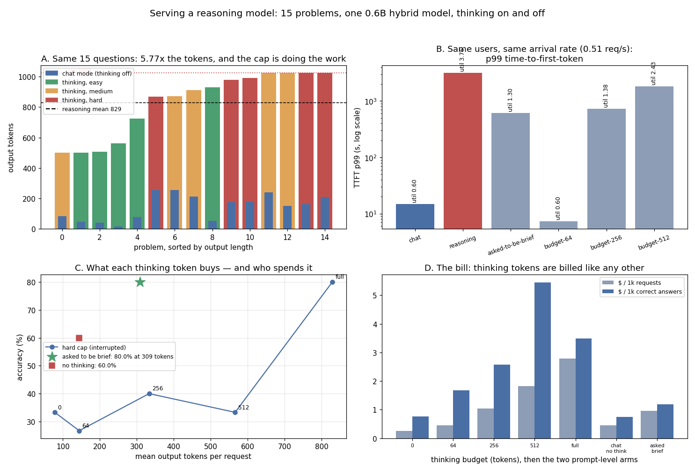

# Reasoning-Model Serving

---

> The same 15 problems, one real hybrid [reasoning model](/shared/glossary/#reasoning-model) (Qwen3-0.6B), and its thinking switched on and off. Thinking is worth **+20 accuracy points (60% → 80%)** and costs **5.77x the output tokens** (144 → 829 on average). At one fixed arrival rate the two workloads are not the same system: chat runs at **0.60 [utilisation](/shared/glossary/#utilization) with a 14.8 s p99 [TTFT](/shared/glossary/#ttft)**, and the identical users asking the identical questions of the thinking model run at **3.76 utilisation with a p99 of 3,194 s** — the queue never recovers. Then the result that decides how to fix it. **Interrupting the model's thinking is far worse than asking it to think less.** A hard 256-token [thinking budget](/shared/glossary/#thinking-budget) yields **40.0% accuracy at 334 mean tokens**; simply *asking* for at most three sentences of reasoning yields **80.0% at 309 tokens** — the same length, **twice the accuracy**, and **2.9x cheaper per correct answer** than letting it run free ($1.19 vs $3.49 per 1,000 correct). Two more facts a serving stack needs: the budget curve is **not monotonic** (26.7% at 64 tokens, below the 33.3% of no thinking at all), and *how* you turn thinking off matters — the model's own no-think template scores **60.0%** while forcing an empty think block at runtime scores **33.3%**.

---

## Key Insight

This project serves a long-[chain-of-thought](/shared/glossary/#cot) [reasoning model](/shared/glossary/#reasoning-model), measures how wildly its output length swings from one request to the next, and then adds a [thinking-budget](/shared/glossary/#thinking-budget) knob that caps how long the model is allowed to think before it must answer. Watching the output-length distribution makes the core problem visible: unlike a chat model, you cannot guess how much work a single request will be.

## Why This Matters

Output-length variance is what breaks naive capacity planning for reasoning models: a handful of hard prompts can each generate 10× the tokens of a normal reply, blowing up [latency](/shared/glossary/#latency) and [cost](/shared/glossary/#cost-per-million-tokens) for everyone sharing the GPU. A thinking budget gives you a direct dial to trade accuracy for predictable cost and tail latency — the single most useful control when serving this class of model.

---

**This is project 67.**

### The words first

- **[Long CoT](/shared/glossary/#long-cot)** — "long chain of thought". The model writes out its reasoning, at length, inside a `<think> ... </think>` block before answering. You pay for every one of those tokens; the user never reads them.
- **Hybrid reasoning model** — one checkpoint that can do both. Qwen3's [chat template](/shared/glossary/#chat-template) has a switch: on, and the model opens a think block; off, and the template closes the block immediately so it answers straight away. Using one model for both arms is what makes this comparison clean — every difference measured here is the thinking, not a different set of weights.
- **[Thinking budget](/shared/glossary/#thinking-budget)** — a limit on how many tokens the model may spend inside the think block before the server forces `</think>` and demands an answer. The runtime version of "stop thinking and answer me."
- **[Censored measurement](/shared/glossary/#censored-measurement)** — when your instrument cuts the data off. Every request that hits the generation cap tells you "at least 1024 tokens", not how many it wanted. Four of 15 requests here are censored, and the mean is therefore an under-estimate — which is stated rather than hidden.
- **[Utilisation](/shared/glossary/#utilization)** — how much of the engine's capacity a workload demands. Below 1.0 the queue drains; above 1.0 it grows without limit and latency is bounded only by how long you run the experiment.

### "Why measure output length? Isn't the model just slower?"

No — and this is the distinction the whole phase turns on. The model is not slower per token: the *same* weights produce a token at the *same* speed in both arms. What changes is **how many tokens each request emits**, and it changes by 5.77x on average.

That is a scheduling problem, not a kernel problem. A serving system sizes itself with two numbers per request: prompt tokens (known when it arrives) and output tokens (unknown until it finishes). Chat traffic makes the second number roughly predictable. Reasoning traffic does not — and every [batching](/shared/glossary/#continuous-batching) decision, every [KV cache](/shared/glossary/#kv-cache) reservation and every capacity estimate is built on it. Section B replays both measured length distributions through the same engine simulator at the same arrival rate; nothing changes except the lengths, and the tail latency moves by 216x.

### "The model already stops on its own. Why add a budget?"

Because "on its own" is not a bound. Two of these 15 requests never closed their think block within 1,024 tokens — they produced **no answer at all** after spending the entire budget of a long generation. On a shared GPU that request occupied a slot for the whole time, evicted nothing useful, and returned nothing.

A budget is the difference between a distribution with a tail and a distribution with a **maximum**. Everything downstream — capacity planning, timeouts, memory reservations, the promise you make to a customer — needs the maximum, and the model does not provide one.

---

## Running it

```bash
python3 run.py            # a long run: ~40 minutes on this shared CPU
python3 run.py --cap 512  # ~13 minutes, and more thoughts get cut off
python3 run.py --reuse    # re-analyse outputs/raw.json in a second
python3 run.py --plot     # redraw the figure from outputs/findings.json
```

Needs `torch`, `transformers`, `matplotlib`, and — for section B — [project 18](../18-chunked-prefill-simulator/README.md)'s `simlib.py` with [project 59](../59-metric-instrumentation/README.md)'s `obslib.py`, which supply the engine simulator and [project 61](../61-slo-simulation/README.md)'s fitted cost model.

> **About the run time.** This project generates about **19,000 real tokens** from a real reasoning model on a CPU, and that is the whole cost: the thinking arm alone is 15 requests × up to 1,024 tokens and took **1,304 s**, the "brief" arm **697 s**. There is no shortcut that keeps the data honest — a smaller cap censors exactly the tail the project is about. If you want a faster look, `--cap 512` roughly thirds the run — and *changes the result*: more requests are cut off mid-thought, so the thinking arm's accuracy falls and the length distribution is censored at 512 instead of 1024 (that is section C's finding, arriving early). The committed numbers use the default 1024. Everything after the generation is instant: `--reuse` re-runs all four sections from the committed [`outputs/raw.json`](outputs/raw.json).

> **About the numbers.** 15 problems in three difficulty tiers (5 each), greedy decoding, exact numeric grading. With 15 problems one problem is 6.7 percentage points, so read small differences as ties — the results quoted here are the large ones. Committed in [`outputs/findings.json`](outputs/findings.json).



---

## A. The same questions, 5.77x the tokens

| arm | mean tokens | p50 | p95 | max | [CV](/shared/glossary/#coefficient-of-variation) | accuracy |
|---|---|---|---|---|---|---|
| chat (thinking off) | 143.7 | 163 | 256 | 256 | 0.565 | **60.0%** |
| **thinking** | **829.3** | 913 | 1024 | 1024 | 0.246 | **80.0%** |
| thinking, asked to be brief | 308.7 | 250 | 644 | 729 | 0.572 | **80.0%** |

**Thinking buys 20 accuracy points for 5.77x the tokens.** On this problem set that is a real gain, concentrated where you would hope: the hard tier goes from 40% to 80%, and the easy tier from 80% to 100%.

Thinking length also tracks difficulty, which is the good news for anyone hoping to predict it: **546 mean thinking tokens for easy problems, 715 for medium, 776 for hard.** The bad news is the ratio — the easiest question in the set (`17 × 4`) still consumed **425 thinking tokens**. A small reasoning model does not have a short mode; it has one mode, applied to everything.

### The honest limit: this distribution is censored

**Four of 15 requests hit the 1,024-token cap, and two of those never closed their think block at all.** Their true lengths are unknown and at least 1,024. So:

- the reported mean of 829.3 is a **lower bound**;
- the CV of 0.246 *understates* the spread, because the cap chopped off the tail — and the tail is exactly what this project is about;
- the honest headline is not "the spread is 0.246" but "**27% of requests wanted more than the maximum we allowed**".

That is not a flaw in the experiment; it is what every production reasoning deployment sees, because every one of them sets `max_tokens`. **The cap is not measuring the workload; the cap is the workload's upper half.** Compare the chat arm: its p95 of 256 is also its cap, for the same reason.

### The two requests that produced nothing

Two requests spent 1,024 tokens thinking and emitted no answer. In an [SLO](/shared/glossary/#slo) accounting they are failures — the user got nothing — but note what they are *not*: they are not errors. No exception, no 500, no log line. A dashboard watching error rate sees a perfectly healthy system, exactly like the gray failure in [project 66](../66-postmortem-drill/README.md). **The metric that catches them is "finished without emitting an answer", and nothing collects it unless you ask.**

---

## B. What that does to a queue

Both measured length distributions are replayed through the phase's engine simulator ([project 18](../18-chunked-prefill-simulator/README.md)'s scheduler with [project 61](../61-slo-simulation/README.md)'s fitted cost model), at **one fixed arrival rate** — the rate at which the chat workload sits at a comfortable 0.60 utilisation, 0.51 requests/second. Same users, same questions, same engine. Only the answer lengths differ.

| workload | utilisation | TTFT p50 | TTFT p99 | end-to-end p99 |
|---|---|---|---|---|
| chat | 0.60 | 0.41 s | **14.8 s** | 84 s |
| **thinking** | **3.76** | 1,562 s | **3,194 s** | 3,356 s |
| asked to be brief | 1.30 | 300 s | 610 s | 733 s |
| hard budget 64 | 0.60 | 0.42 s | **7.3 s** | 51 s |
| hard budget 256 | 1.38 | 366 s | 736 s | 813 s |
| hard budget 512 | 2.43 | 911 s | 1,837 s | 1,973 s |

**Turning thinking on took the system from 60% loaded to 376% loaded without a single extra request arriving.** Utilisation above 1.0 means the queue grows for as long as the traffic lasts; the "3,194 s p99" is not a property of the model, it is a property of the experiment's length. Run it twice as long and it doubles.

This is the capacity-planning point in one line: **switching a chat product to a reasoning model is a 6x traffic event, not a model upgrade.** If the fleet was sized at 60% for chat, the thinking version needs about **6.3x the machines** to sit at the same utilisation.

The interesting rows are the middle ones. Brief-prompting alone (1.30) and a 256-token budget (1.38) land in the same place — both still overloaded at this rate, both about 2.9x better than unrestricted thinking. Only the tightest budget (64 tokens, 0.60 utilisation) restores chat-like latency, and section C shows what it costs in answers.

---

## C. Interrupting is not the same as asking

This is the project's main result, and it is the reason the previous section's "just cap it" is not the end of the story.

| how the thinking was limited | mean output tokens | accuracy |
|---|---|---|
| no thinking (model's own chat template) | 143.7 | **60.0%** |
| runtime budget 0 (force `</think>` immediately) | 78.1 | 33.3% |
| runtime budget 64 | 144.4 | **26.7%** |
| runtime budget 256 | 333.5 | 40.0% |
| runtime budget 512 | 566.3 | 33.3% |
| **asked to be brief (prompt)** | **308.7** | **80.0%** |
| unrestricted thinking | 829.3 | **80.0%** |

**At the same length — 334 tokens capped versus 309 tokens asked — asking is worth twice the accuracy (40.0% vs 80.0%).**

The mechanism is visible in the transcripts. A hard budget interrupts the model in the middle of a sentence of arithmetic and then demands a final answer; what follows is a guess dressed as a conclusion. A prompt-level request produces a *complete but short* chain: the model plans a three-sentence solution and finishes it. **The token count is the same; one of them contains a finished thought and the other contains two thirds of one.**

The serving lesson is precise: **a thinking budget is a safety limit, not a tuning knob.** Use it to bound the tail (nothing may exceed N tokens) and use the prompt to control the typical case. The two are not interchangeable, and the one that looks like the engineering control is the one that damages answers.

### The budget curve is not monotonic

64 tokens (26.7%) scores *below* 0 tokens (33.3%), which scores below 256 (40.0%), which scores above 512 (33.3%). With 15 problems each point is ±6.7 points, so these differences are individually small — but the *shape* is the finding: **there is no clean "more thinking, more accuracy" curve to tune along.** A little interrupted thinking can be worse than none, because it fills the context with a false start that the forced answer then follows.

Anyone tuning a budget by sweeping it on a small eval set will find a "best" value that is mostly noise. The stable comparisons here are the big ones: unrestricted ≈ brief-prompted (80%) ≫ any hard cap (27–40%) and chat-template-off (60%).

### How you turn thinking off matters too

**The model's own no-think template scores 60.0%. Forcing an empty think block at runtime scores 33.3%.** Both produce no reasoning; they differ only in *how* the prompt is assembled — the template's official no-think form versus an injected `<think>\n</think>` from the server.

That is a 27-point difference from prompt formatting, and it is the guide's "match training and inference exactly" rule ([Key Advice #3](../../README.md#key-advice)) arriving in a new disguise: the model was tuned with a specific no-think format, and the ad-hoc one is out of distribution. **If your stack offers a "disable thinking" flag, check which of these two it implements.**

---

## D. The bill

Cost uses [project 63](../63-cost-report/README.md)'s formula on the engine seconds each arm actually consumes.

| arm | $ / 1,000 requests | $ / 1,000 **correct** answers |
|---|---|---|
| chat (no thinking) | $0.444 | **$0.740** |
| runtime budget 0 | $0.253 | $0.758 |
| runtime budget 64 | $0.446 | $1.670 |
| runtime budget 256 | $1.030 | $2.575 |
| runtime budget 512 | $1.815 | $5.451 |
| **asked to be brief** | $0.951 | **$1.188** |
| unrestricted thinking | $2.790 | $3.487 |

**Per correct answer, brief-prompted thinking is 2.9x cheaper than unrestricted thinking, at identical accuracy.** And the cheapest arm per correct answer is chat mode — which is the honest reading of a 20-point accuracy gain that costs 5.8x the tokens: on this problem set, *if you only care about cost per right answer*, thinking does not pay. It pays when the 20 points are the difference between a usable product and an unusable one, which is a product judgement, not an arithmetic one.

The two columns rank the arms differently, which is [project 63](../63-cost-report/README.md)'s lesson repeating: budget 512 is 1.9x the price of budget 256 per request and **2.1x** per correct answer, because the extra tokens bought negative accuracy. **Denominate in the thing you sell.**

One accounting note that reasoning models force on every serving platform: **thinking tokens are output tokens.** They are generated, they occupy the KV cache, they consume decode steps, and they are billed — but the user never sees them. A customer who is charged for 829 tokens and shown 40 will ask why, and "the model was thinking" needs to be a line item in your API response, not an explanation in a support ticket.

---

## What to take from this

1. **Thinking is +20 accuracy points for 5.77x the tokens** (60% → 80%, 144 → 829 tokens) on the same weights.
2. **Same users, same rate: utilisation 0.60 → 3.76.** Switching to a reasoning model is a 6x traffic event, not a model upgrade.
3. **A hard 256-token budget scores 40%; asking for brevity scores 80% at the same length.** Interrupting a thought is not the same as requesting a short one.
4. **The budget curve is not monotonic** — 64 tokens scored below zero tokens. There is no smooth knob to tune.
5. **How you disable thinking is worth 27 points**: the model's own no-think template (60%) versus an injected empty think block (33%).
6. **27% of requests hit the cap** and 2 of 15 produced **no answer at all** after a full budget — with no error raised anywhere.
7. **Every reported length distribution is censored by its own cap.** Say so, and report the fraction that hit it.
8. **Thinking length tracks difficulty** (546 / 715 / 776 tokens by tier) but never gets short: the easiest question still burned 425 thinking tokens.
9. **Per correct answer, brief-prompting is 2.9x cheaper than free-running thinking**, and chat mode is cheaper still.
10. **Thinking tokens are billed output tokens the user never sees.** Account for them separately or expect the question.

### Common traps this project walks into on purpose

- **Reading a mean output length that the cap produced.** 829 is a lower bound, not a mean.
- **Treating a thinking budget as a quality dial.** It is a safety limit; the prompt is the dial.
- **Sweeping a budget on 15 problems and shipping the argmax.** The curve is not monotonic and the differences are inside the noise.
- **Assuming "no answer" shows up as an error.** It shows up as a satisfied request with an empty result.
- **Sizing a reasoning fleet with chat-derived output lengths.** 0.60 utilisation becomes 3.76.
- **Quoting a p99 from an overloaded simulation as a property of the system.** Above 1.0 utilisation it is a property of how long you ran it.
- **Implementing "thinking off" by injecting tags** instead of using the model's own template.
- **Billing thinking tokens without showing them.** They are the majority of what the customer pays for here.

---

## Next

[Project 68 — stateful sessions](../68-stateful-sessions/README.md) takes the other half of the agentic serving problem: not how long one request thinks, but how a conversation's [KV cache](/shared/glossary/#kv-cache) survives between requests — and what happens to it when the memory runs out.
