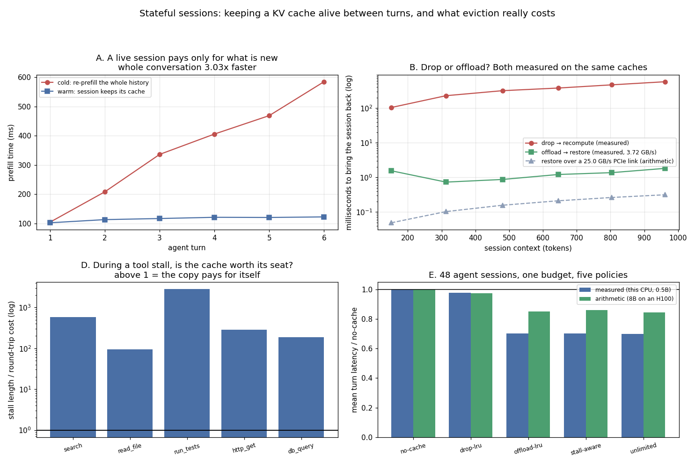

# Stateful Sessions

---

> A six-turn agent conversation served twice on a real model: cold, where every turn re-runs [prefill](/shared/glossary/#prefill) over the whole history (105 ms → **585 ms** by turn 6), and warm, where the session keeps its [KV cache](/shared/glossary/#kv-cache) (**a flat 102–122 ms**) — **3.03x** over the conversation, and the gap grows with every turn. Then the question this project exists for: when memory runs out, does an evicted session get **dropped** (recompute it later) or **[offloaded](/shared/glossary/#kv-offload)** (copy it out and copy it back)? Measured on the same caches, **restoring is 315x cheaper than recomputing** — and the general rule falls out as one line of arithmetic: offload wins whenever the link is faster than `bytes-per-token × prefill-tokens-per-second`, which is **1.31 GB/s for an 8B model on an H100**. PCIe (25 GB/s) clears it by 19x; **10 Gb Ethernet (1.25 GB/s) does not**, so remote KV storage flips the answer back to recompute. In a 48-session fleet, offloading reaches the latency of infinite memory (**595 ms against 594 ms**) while holding **11.4x less of it**, a stall-aware policy cuts held memory another **31%** for 0.4 ms, and the eviction policy everyone argues about — LRU that *drops* — is worth **2.2%** over having no cache at all. Forking a session for three parallel branches costs **0.004x** the prefill it replaces and **2.94x less memory** than copying.

---

## Key Insight

This project builds a session API that keeps each conversation's [KV cache](/shared/glossary/#kv-cache) alive across separate requests, so every new turn reuses the work of every earlier turn instead of re-running [prefill](/shared/glossary/#prefill) over the whole history. The harder half is eviction: GPU memory is finite, so when many sessions are active at once the system must cleanly drop the coldest ones and rebuild them later if they come back.

## Why This Matters

[Multi-turn](/shared/glossary/#multi-turn-conversation) chat and long-running agents grow their history every turn, and re-reading the full transcript each time is both slow and wasteful. Treating the cache as a session-lifetime resource — created, reused, and evicted under pressure — is what lets a [multi-tenant](/shared/glossary/#multi-tenant) system stay fast for warm sessions without falling over when too many arrive at once.

---

**This is project 68.**

### The words first

- **[Session](/shared/glossary/#stateful-session)** — a conversation that outlives one request. Its state is the token history plus, if you are lucky, the KV cache built from it.
- **Warm turn / cold turn** — a turn served with the session's cache still in memory, versus one that has to rebuild it. This project is about the second kind.
- **Drop** — throw the cache away. Free, instant, and the next turn pays a full prefill.
- **[Offload](/shared/glossary/#kv-offload)** — copy the cache to host memory (or disk) and free the accelerator's copy. Costs a copy out now and a copy back later, and nothing is recomputed.
- **Fork** — start two continuations from the same history. Agents do this whenever they explore alternatives in parallel.
- **[Tool stall](/shared/glossary/#agentic-inference)** — the seconds or minutes an agent spends waiting for a tool to return. The model is idle; the cache is not — it is still occupying memory.
- **GB-seconds** — memory held multiplied by how long it is held. The right unit for "what did this session cost the fleet", because a cache that sits idle for a minute is expensive even though it did nothing.

### "Project 57 already built a session cache. What is different here?"

[Project 57](../57-stateful-session-api/README.md) asked **which eviction policy** keeps the hit rate up — LRU, LFU, TTL, cost-aware, admission control — and found that [LRU and LFU are byte-for-byte identical](../57-stateful-session-api/README.md) and that refusing new sessions beats evicting old ones.

This project asks the question *underneath* that one: **when a session is evicted, what actually leaves?** Every policy in project 57 dropped the cache; here dropping is only one of two options, and the other one turns out to be two orders of magnitude cheaper. That changes what an eviction policy is even for — section E measures the eviction policy as worth **2.2%** and the *destination* of the evicted data as worth **1.43x**.

The workload is also different in a way that matters: these are **agent** sessions, with tool stalls between turns. A chat session is idle for the seconds a human takes to type; an agent session is idle for however long `run_tests` takes. Section D prices that idleness.

### "The model is stateless. How can a session have a cache at all?"

Worth being precise, because "stateful model" is a common misreading. The weights never change and the model never remembers anything. What a session keeps is the [KV cache](/shared/glossary/#kv-cache): the per-token key and value vectors that attention has *already computed* for this conversation's tokens.

Re-sending the whole history to a stateless model gives the same answer — it just recomputes those vectors from scratch, which is what section A measures as 585 ms on turn 6. So the session is a **cache**, in the strict sense: an optimisation that never changes the result, only the cost. That is also why dropping it is always safe, and why a cache miss is measured in milliseconds rather than in correctness.

---

## Running it

```bash
python3 run.py           # ~2 minutes
python3 run.py --plot    # redraw from outputs/findings.json
```

Needs `torch`, `transformers`, `matplotlib` and [project 51](../51-needle-in-a-haystack/README.md)'s `ctxlib.py`. The model is Qwen2.5-0.5B-Instruct truncated to **8 of 24 blocks** — the same trick [project 57](../57-stateful-session-api/README.md) used, so that dozens of live caches fit in RAM. The KV cache per token is proportionally smaller (8,192 bytes here), and every conclusion in this project is about *ratios* — recompute versus restore, memory held versus latency — which the truncation leaves intact. Absolute milliseconds are not comparable with projects 51–56.

> **About the numbers.** Sections A–D are measured on this CPU with real `DynamicCache` tensors. Section E is a virtual-time simulation of 48 sessions × 6 turns under a 24 MB budget, **calibrated with the measurements from A and B**, and is run twice: once with this machine's numbers and once with arithmetic for an 8B model on an H100 over PCIe, which is labelled as arithmetic everywhere it appears. Committed in [`outputs/findings.json`](outputs/findings.json).



---

## A. What a live session is worth

| turn | context (tokens) | new tokens | cold prefill | warm prefill | speedup |
|---|---|---|---|---|---|
| 1 | 151 | 151 | 104.2 ms | 102.1 ms | 1.02x |
| 2 | 313 | 162 | 208.1 ms | 112.9 ms | 1.84x |
| 3 | 480 | 167 | 336.1 ms | 116.6 ms | 2.88x |
| 4 | 645 | 165 | 405.7 ms | 120.8 ms | 3.36x |
| 5 | 804 | 159 | 468.8 ms | 120.2 ms | 3.90x |
| 6 | 962 | 158 | 584.8 ms | 122.2 ms | **4.79x** |
| **total** | | | **2,107.8 ms** | **694.7 ms** | **3.03x** |

**The warm line is flat and the cold line is not.** That is the whole shape of the result, and it is worth reading as a statement about growth rather than about speed: a warm turn costs what the *new* tokens cost — about 160 of them each time, so about 120 ms — while a cold turn costs what the *whole conversation* costs, which grows every turn. At turn 6 the gap is 4.79x; at turn 20 it would be worse, without anything about the system changing.

This is why sessions matter more for agents than for chat. An agent turn appends a tool result — here about 160 tokens of pasted output for 12 tokens of model reply — so **the context grows mostly from things the model did not write**, and it grows fast.

The tokens themselves are cheap to store: 962 tokens of conversation is **7.88 MB** of KV cache at 8,192 bytes per token (8 layers, float32). Sections B–E are about what to do with those megabytes when there are 48 conversations and not 1.

---

## B. Evicting is a choice, and the two options differ by 315x

Both paths measured on the same caches: **drop** means the next turn re-runs prefill over the full history; **offload** means the cache is copied to host memory now and copied back later.

| context | cache size | recompute (measured) | restore (measured) | ratio | restore over 25 GB/s PCIe (arithmetic) |
|---|---|---|---|---|---|
| 151 | 1.24 MB | 103.7 ms | 1.55 ms | 67x | 0.049 ms |
| 313 | 2.56 MB | 227.2 ms | 0.73 ms | 313x | 0.103 ms |
| 480 | 3.93 MB | 317.1 ms | 0.87 ms | 363x | 0.157 ms |
| 645 | 5.28 MB | 377.7 ms | 1.21 ms | 313x | 0.211 ms |
| 804 | 6.59 MB | 467.7 ms | 1.37 ms | 341x | 0.263 ms |
| 962 | 7.88 MB | 575.2 ms | 1.82 ms | **315x** | 0.315 ms |

Measured copy bandwidth here is **3.72 GB/s** (a RAM-to-RAM clone, so it both reads and writes).

**Restoring a session is two orders of magnitude cheaper than rebuilding it.** The obvious objection is that this machine has no PCIe link in the path — a real GPU has to push those bytes across a bus. So the next table does that arithmetic properly rather than hand-waving it.

### The crossover, as one formula

Offloading wins when the copy is faster than the recomputation:

```
bytes_per_token / link_bandwidth   <   1 / prefill_tokens_per_second
        ⇕
link bandwidth needed  =  bytes_per_token × prefill_tokens_per_second
```

Both sides are *per token*, so **the crossover does not depend on how long the session is** — a 200-token session and a 200,000-token session flip at the same bandwidth. It depends on the model's shape and the machine's link:

| deployment | KV bytes/token | prefill tok/s | link needed | link available | verdict |
|---|---|---|---|---|---|
| this CPU, 0.5B (8 layers), measured | 8,192 | 1,563 | **0.013 GB/s** | 3.72 GB/s | **offload** |
| 8B on an H100, host memory over PCIe (arithmetic) | 131,072 | 10,000 | **1.31 GB/s** | 25 GB/s | **offload** |
| the same 8B, cache stored over 10 Gb Ethernet (arithmetic) | 131,072 | 10,000 | 1.31 GB/s | 1.25 GB/s | **recompute** |
| 70B without [GQA](/shared/glossary/#gqa), 8 GPUs, PCIe (arithmetic) | 2,621,440 | 4,000 | **10.49 GB/s** | 25 GB/s | offload |

Three things this table settles.

**Local host memory always wins.** Every realistic model needs 0.01–10 GB/s to break even, and PCIe delivers 25. This is why serving engines have a "swap to CPU" path at all.

**Remote storage does not.** Move the same cache one hop further — to another machine over a 10 Gb link — and the arithmetic reverses: recomputing an 8B model's prefill is *cheaper* than fetching its cache. That is the quantitative version of the guide's warning about cache-as-a-service ([Phase 10](../../README.md#phase-10-frontier-topics-in-serving)): the idea is only viable on fabrics well above 10 Gb, or for models whose prefill is much more expensive per token than this.

**A model without GQA moves the line by 8x.** The 70B row needs 10.49 GB/s because multi-head attention stores 20x more cache per token. Attention architecture, chosen during training, decides whether your serving stack can offload.

---

## C. Forking a session

Agents branch: try three tools in parallel, explore two plans, run *n* samples of the same step. All of those continuations share a prefix — everything up to the branch point.

Measured on a 480-token base (3.93 MB) with three branches:

| | bytes | vs shared |
|---|---|---|
| copy the cache per branch | 11.92 MB | 2.94x |
| share the prefix, store only what differs | **4.06 MB** | 1.00x |

**Sharing the prefix costs 2.94x less memory for three branches**, and the saving grows with the branch count: *n* branches of a long prefix cost `prefix + n × suffix` instead of `n × prefix`. This is [PagedAttention](/shared/glossary/#pagedattention)'s copy-on-write sharing ([project 11](../11-tiny-paged-cache/README.md)) applied at the session level rather than the request level.

And the fork itself is nearly free: **cloning the cache costs 0.004x the prefill it replaces** (1.2 ms against 293 ms). Whatever a fork API costs to build, it is not paying for the copy.

---

## D. Tool stalls: the seat is occupied while nothing happens

An agent session spends most of its life waiting. During a stall the cache is not being used — but it is still holding memory, so other sessions cannot.

A 962-token session is 7.88 MB, and a park-and-restore round trip costs **4.27 ms** measured (0.63 ms over PCIe, arithmetic):

| tool | stall | stall / round trip | memory held if you keep it |
|---|---|---|---|
| `read_file` | 0.4 s | 94x | 3.2 MB-seconds |
| `db_query` | 0.8 s | 187x | 6.3 MB-seconds |
| `http_get` | 1.2 s | 281x | 9.5 MB-seconds |
| `search` | 2.5 s | 585x | 19.7 MB-seconds |
| `run_tests` | 12.0 s | **2,810x** | **94.6 MB-seconds** |

**Every stall in this table is at least 94x longer than the round trip needed to park the cache and fetch it back.** By the arithmetic alone, a server should park a session the moment a tool call starts.

By the arithmetic alone — which is why section E's stall-aware policy adds a second condition. Parking is only *worth* doing when someone else needs the seat: on an empty machine you would pay 4.27 ms of copying to free memory nobody wants. The policy that ships is therefore "park during a stall **if** memory is above 70% full", and section E measures what that qualifier is worth.

---

## E. The fleet: 48 sessions, one budget, five policies

48 agent sessions × 6 turns, arriving over about 5 minutes of virtual time, sharing a **24 MB** budget — room for roughly three full sessions of the twenty-four that are live at the peak.

| policy | mean turn latency | p95 | evictions | tokens recomputed | memory held (GB-s) |
|---|---|---|---|---|---|
| no cache at all | 849.7 ms | 1,105.6 ms | 0 | 153,600 | 0.00 |
| drop (LRU) | 830.6 ms | 1,105.6 ms | 260 | 140,960 | 1.00 |
| **offload (LRU)** | **595.1 ms** | 596.5 ms | 260 | **0** | 1.00 |
| **stall-aware offload** | 595.5 ms | 597.6 ms | 234 | 0 | **0.69** |
| unlimited memory (infeasible) | 593.8 ms | 593.8 ms | 0 | 0 | 11.43 |

**Offloading reaches the latency of infinite memory — 595.1 ms against 593.8 — while holding 11.4x less of it.** That is the headline, and it is the argument for building the offload path: the fleet behaves as if every session were resident, on a budget that fits three.

**An LRU policy that drops is worth 2.2%.** 830.6 ms against 849.7 for keeping no cache at all. When the budget is this much smaller than the working set, choosing *which* session to evict barely matters — almost everything gets evicted before it is used again. The eviction policy is the part of this system that gets designed and argued about; the destination of the evicted bytes is worth **1.43x** and usually gets a config flag.

**The stall-aware policy is the memory result, not the latency result.** It ties offload-LRU on latency (0.4 ms apart, noise) and holds **31% less memory** (0.69 against 1.00 GB-seconds) with 26 fewer evictions, because it parks sessions *before* they are forced out and never has to evict someone else's. On a fleet where memory is the constraint — which is the premise of the whole project — 31% is a real number, and it is invisible on a latency dashboard.

### The same fleet on hardware this machine does not have

Every number above comes from a CPU with no accelerator link. Repeating the simulation with arithmetic for an 8B model on an H100 (131 kB/token, 10,000 prefill tokens/s, 25 GB/s PCIe):

| policy | mean turn latency | turn 1 | turn 6 |
|---|---|---|---|
| no cache | 256.0 ms | 216.0 ms | 296.0 ms |
| drop (LRU) | 249.7 ms | 216.0 ms | 289.3 ms |
| offload (LRU) | **217.8 ms** | 216.0 ms | **219.8 ms** |
| unlimited | 216.0 ms | 216.0 ms | 216.0 ms |

The ranking is identical and the *margins shrink*: offloading is worth **1.18x** here rather than 1.43x, because a GPU's prefill is fast enough that recomputing is no longer a disaster. **The policy conclusion survives the hardware change; the size of the win does not.** That is the honest way to read any single-machine measurement — check whether the *ordering* is robust, and expect the multiplier to move.

Note also what stays constant: `turn 1` is identical in every row (216.0 ms), because the first turn of a session has nothing to reuse. **No caching policy helps a new conversation.** Everything in this project is about turns 2 and later.

---

## What to take from this

1. **A warm turn is flat, a cold turn grows**: 122 ms versus 585 ms at turn 6, 3.03x over the conversation, and worse the longer it runs.
2. **Restoring an offloaded cache is 315x cheaper than recomputing it** on this machine.
3. **The crossover is `bytes_per_token × prefill_tok/s`** — 1.31 GB/s for an 8B model — and it is **independent of session length**.
4. **Local host memory clears that bar by 19x; a 10 Gb network link does not.** Remote cache storage flips the answer back to recompute.
5. **A model without GQA moves the crossover 8x** (10.5 GB/s), which can put offloading out of reach entirely.
6. **Offloading reached the latency of unlimited memory while holding 11.4x less of it.**
7. **The eviction *policy* was worth 2.2%; the eviction *destination* was worth 1.43x.** The unglamorous half is the one that pays.
8. **Stall-aware parking bought 31% less held memory for 0.4 ms of latency** — a result you can only see if you measure GB-seconds.
9. **Forking shares a prefix for 2.94x less memory** and the clone costs 0.004x the prefill it replaces.
10. **Every tool stall here is 94x to 2,810x longer than a park-and-restore round trip.** During a stall, holding the seat is the expensive choice.
11. **Turn 1 is identical under every policy.** Sessions are an optimisation for conversations, not for users.

### Common traps this project walks into on purpose

- **Tuning the eviction policy before asking where evicted data goes.** Worth 2.2% against 1.43x.
- **Measuring a session cache by hit rate only.** The GB-seconds column is where the stall-aware policy's win lives.
- **Assuming offload always wins because a memcpy is fast.** Over a 10 Gb link, for an 8B model, it loses.
- **Quoting a crossover as a function of context length.** Both sides scale with tokens; it cancels.
- **Ignoring the KV shape of the model you are serving.** GQA versus MHA moves the decision by 8x.
- **Reporting a CPU measurement as if the ratios transfer.** They do not — 1.43x here is 1.18x on an H100; only the ordering survived.
- **Forgetting that turn 1 can never be warm.** A cache-hit-rate target above `(turns-1)/turns` is unreachable by construction.
- **Copying a cache to fork it.** Sharing the prefix is 2.94x cheaper at three branches and better as branches grow.

---

## Next

[Project 69 — router model](../69-router-model/README.md) moves from keeping one conversation cheap to keeping *all* traffic cheap: a tiny model in front of the fleet that decides which model each request deserves.
