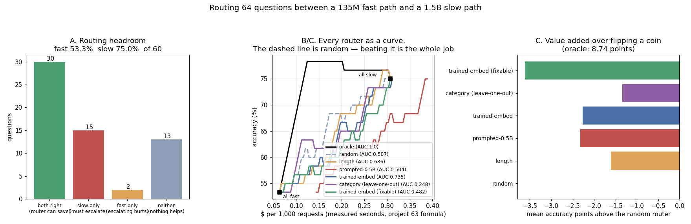

# Router Model

---

> Two real serving paths on one CPU — SmolLM2-135M (**53.3%** correct, **$0.063** per 1,000 requests) and Qwen2.5-1.5B (**75.0%**, **$0.307**, 4.86x the price) — and 60 questions with a checkable answer. The prize is real and large: an **oracle** router that knows which questions the big model will fix reaches the big model's quality while escalating only **21.7%** of traffic, for **62.2% less money**. Then the result that matters more than the prize. **Every router you can actually build loses to a coin flip**: a length heuristic **−1.61** accuracy points against a random router, a prompted 0.5B judge **−2.32**, a trained [logistic regression](/shared/glossary/#logistic-regression) on sentence embeddings **−2.27**, and routing by task category **−1.34**. The trained router is *not* bad at its stated job — it scores [AUC](/shared/glossary/#auc) **0.735** at predicting "the small model will get this wrong" — it is bad at the job that pays, because **the questions the small model fails are mostly questions the big model also fails**: 15 of 60 are fixable by escalation, 13 are hopeless on both, and from the outside they look the same. And the router's own bill is not free: the prompted 0.5B judge costs **212 ms per request against the 165 ms fast path it is supposed to protect**.

---

## Key Insight

This project builds a tiny [router model](/shared/glossary/#router-model) ([trained or just prompted](/shared/glossary/#trained-or-just-prompted)) that looks at each incoming request and decides whether to send it down a fast 1B "easy path" or escalate it to a slow, expensive 70B "hard path." You then measure the two things that matter: answer quality and [cost per token](/shared/glossary/#cost-per-million-tokens), to see how much you save without users noticing.

## Why This Matters

In real traffic, the large majority of queries are easy and never needed a frontier-size [LLM](/shared/glossary/#llm) at all. A router captures that fact directly — paying the big model's cost only for the requests that actually require it — which is often a larger cost win than any kernel or quantization trick, for a fraction of the engineering effort.

---

**This is project 69.**

### The words first

- **Fast path / slow path** — two deployed models. Here 135M parameters and 1.5B: a 11x parameter gap standing in for the guide's "1B vs 70B", small enough to run both on this CPU with real weights and a real grader.
- **[Escalation](/shared/glossary/#escalation)** — sending a request up to the expensive model. The router's only action.
- **[Cascade routing](/shared/glossary/#cascade-routing)** — the related design where you *first* answer with the cheap model, then decide whether to redo it with the expensive one. It sees the cheap answer (more information) and pays for it every time (more cost). This project routes *before* generation; section D shows why the difference matters.
- **Escalation fraction** — the share of traffic sent to the slow path. Sweeping it from 0% to 100% turns any router into a **curve** rather than a single point, which is the only fair way to compare routers that are differently trigger-happy.
- **[AUC](/shared/glossary/#auc)** — "area under the ROC curve". For a scorer, it is exactly the probability that a randomly chosen positive example scores above a randomly chosen negative one. 0.5 is a coin flip, 1.0 is perfect. It measures *ranking*, which is what a router does.
- **Oracle** — a cheating router that already knows every answer's outcome. It cannot be deployed; it measures how much money is on the table.
- **Out-of-fold prediction** — when scoring a trained router, each question is scored by a model that never saw that question in training. Without it, a router's report card is a memory test.

### "The whole point is to avoid the big model. Why do you run it on every question?"

Because the labels have to come from somewhere. To know whether a router made the right call on question *q*, you need to know what **both** paths would have answered — the router's decision is only right or wrong relative to that.

So the offline experiment runs both models on all 60 questions once, which is exactly the data a production shadow-evaluation would collect for a week before anyone ships a router. In production the big model runs only on escalated traffic; here it runs everywhere, once, to build the answer key. That is the difference between the *evaluation* and the *deployment*, and mixing them up is how routers get shipped on numbers that never existed.

### "Isn't this the same as project 64, which already compared model sizes?"

No, and the difference is the whole point of routing.

[Project 64](../64-right-sizing-experiment/README.md) asked: **which single model should serve all traffic?** It found a 360M model that tied a 1.5B — one model, one price, forever.

This project asks: **can we decide per request?** Its answer can, in principle, beat every fixed choice — the oracle here reaches the 1.5B's quality for 38% of its price, which no single model can do. But that potential only turns into money if something cheap can *tell the requests apart before answering them*. Sections B and C are the measurement of whether anything can.

---

## Running it

```bash
python3 run.py           # ~7 minutes (two model loads and 60 x 2 generations)
python3 run.py --reuse   # re-score the routers from outputs/raw.json
python3 run.py --plot    # redraw from outputs/findings.json
```

Needs `torch`, `transformers`, `matplotlib`. Four models are loaded one at a time and freed: SmolLM2-135M-Instruct, Qwen2.5-1.5B-Instruct, Qwen2.5-0.5B-Instruct (the prompted judge) and all-MiniLM-L6-v2 (the embedder for the trained router).

> **About the numbers.** 60 questions in 5 categories (easy facts, easy arithmetic, extraction from the prompt, multi-step word problems, harder facts), greedy decoding, 32 new tokens, identical prompts and grader for both paths. Dollars use [project 63](../63-cost-report/README.md)'s formula over **measured** seconds per request on this machine. With 60 questions, one question is 1.7 percentage points — read differences under ~5 points as ties. Everything below is in the committed [`outputs/findings.json`](outputs/findings.json).



---

## A. What the two paths can and cannot do

| | correct | seconds/request | $ / 1,000 requests |
|---|---|---|---|
| fast path — SmolLM2-135M | **53.3%** | 0.165 | **$0.063** |
| slow path — Qwen2.5-1.5B | **75.0%** | 0.804 | $0.307 (**4.86x**) |

Splitting the 60 questions by what each path did gives the **routing headroom**, and it is the most useful table in the project:

| outcome | count | what a router should do |
|---|---|---|
| both right | **30** | keep it on the fast path — this is where the savings live |
| **slow only** | **15** | escalate — this is the only category where escalation buys anything |
| fast only | 2 | escalating actively *loses* 2 questions |
| **neither** | **13** | escalating wastes money and changes nothing |

Two consequences that shape everything after this.

**Only 15 of 60 questions (25%) are worth escalating.** That is the oracle's escalation rate, and it is why the oracle can match the big model at 21.7% of traffic.

**13 questions are unfixable, and they are the trap.** They are hard — that is why the small model fails them — and a router trained to spot "hard" will happily escalate all 13, paying 4.86x for the same wrong answer. In this workload the *unfixable* pile is almost as big as the *fixable* one.

Per category (12 questions each):

| category | fast correct | slow correct | fixable by escalating |
|---|---|---|---|
| facts | 8 | 10 | 2 |
| arithmetic | 6 | 12 | **6** |
| extraction | 10 | 12 | 2 |
| **multi-step word problems** | **0** | **1** | **1** |
| harder facts | 8 | 10 | 2 |

**The category with the worst fast-path score is the category with almost nothing to gain.** The 135M model gets 0 of 12 multi-step problems — and the 1.5B gets 1. Any rule that says "send the hard-looking ones to the big model" spends its entire budget here.

---

## B. Every router as a curve, against the line that a coin flip draws

A router that escalates *x*% of traffic costs `fast × (1−x) + slow × x + router overhead`. A **random** router at the same *x* is the honest control: it draws the straight line between the two endpoints. Any router that is not above that line is adding cost, latency and a component to maintain, for nothing.

| router | AUC ("fast will fail") | AUC ("slow will fix it") | accuracy at 25% escalated | mean points above random |
|---|---|---|---|---|
| **oracle** (cheating) | 1.000 | 1.000 | **78.3%** | **+8.74** |
| random | 0.507 | 0.593 | 61.7% | 0.00 |
| prompt length | 0.686 | 0.426 | 56.7% | **−1.61** |
| prompted 0.5B judge | 0.504 | 0.430 | 60.0% | **−2.32** |
| trained on embeddings | **0.735** | 0.456 | 56.7% | **−2.27** |
| by task category (leave-one-out) | 0.248 | 0.505 | 63.3% | **−1.34** |
| trained on "fixable" | 0.482 | 0.385 | 58.3% | **−3.61** |

**Every deployable router in this table is worse than random.** Not "disappointing" — *negative*.

### Why the trained router is good at the wrong question

The trained router scores **AUC 0.735** at predicting "the fast path will get this wrong". That is a genuine signal, well above the 0.5 of a coin. And it is worth **less than nothing**, because the question that pays is a different one: **"will the slow path get this right when the fast path does not?"** On *that* target the same scores measure **0.456 — below chance.**

The mechanism is section A's table. The learner finds "hard" and escalates it; "hard" contains 15 fixable questions and 13 unfixable ones; escalating both costs 4.86x and repairs less than half. **A router must predict the *difference* between two models, not the difficulty of the question.** Difficulty is easy to see and does not pay.

Training directly on the difference (`slow right AND fast wrong`) is the obvious fix — and it is the worst arm in the table at −3.61 points, because that target has only 15 positive examples in 60. This is an honest limit of the experiment, and it is also the honest state of the technique: **the paying target is both harder to learn and much rarer than the tempting one.**

### Why routing by task category also fails

"Route by endpoint" is the most deployable rule imaginable — a real API already knows whether a request is a summarisation, a code completion, or a maths question. Scored leave-one-out, it lands at **−1.34 points** and an inverted AUC of 0.248. Same mechanism: the category it escalates hardest (multi-step problems, 0/12 on the fast path) is the category the slow path cannot do either (1/12).

The good news hiding in it: **the category-level table in section A is exactly what you need to make the decision correctly.** Escalating *arithmetic* — where the fast path scores 6/12 and the slow path 12/12 — is a clear win. The failure here is not that categories are useless; it is that the obvious category feature ranks by difficulty rather than by repairability.

---

## C. What the oracle proves, and what it does not

The oracle reaches **75.0% — the full slow-path quality — at 21.7% escalation and $0.116 per 1,000 requests, a 62.2% saving.** At 25% escalation it is at **78.3%**, which is *better than the slow path alone*, because it also keeps the 2 questions the big model gets wrong and the small one gets right.

That is the number to compute before starting any routing project, and it takes one afternoon of shadow evaluation: **run both models on real traffic, count the four quadrants, and see how big the "slow only" pile is.** If it is small, routing has nothing to sell no matter how clever the router. If it is large, the remaining question is whether anything predicts it — which is the question sections B answers negatively *for this workload and this amount of training data*.

**What this project does not show** is that routers never work. Published routers are trained on tens of thousands of labelled requests, across quality gaps far wider than 53% versus 75%, with request features (user, endpoint, history, retrieval hits) that this experiment does not have. What it *does* show is the measurement that decides whether yours is working: **the random-router line**. A router evaluated without it will look successful whenever it escalates a lot, because escalating a lot is what the expensive model does.

---

## D. The router's own bill

A router is a component in the request path. It has a cost and a latency, and both are charged on **100%** of traffic while the savings arrive on the escalated fraction only.

| | per request | $ / 1,000 requests | as a share of the fast path |
|---|---|---|---|
| fast path (the thing being protected) | 165 ms | $0.063 | 1.00x |
| **prompted 0.5B judge** | **212 ms** | $0.081 | **1.29x** |
| embedding model (MiniLM, 22M params) | 11.1 ms | $0.0043 | 0.07x |

**The prompted judge costs more than the model it is routing away from** — 212 ms against 165 ms — and scores at chance (AUC 0.504). Its curve in the figure is the one below every other line: it pays a 29% surcharge on every request to make a decision no better than a coin. Notice how the deployment shape is what makes it unusable, not the AUC alone: *if* it were accurate, 212 ms of routing to save 804 ms of slow path would still be a good trade.

The rule this gives you: **the router's cost must be small compared with the *gap* it manages, not compared with the slow path.** Here the gap is 804 − 165 = 639 ms; a 212 ms judge eats a third of it before being right about anything.

The embedder is the shape a router should have: 11 ms, 7% of the fast path, negligible. Its problem in section B is accuracy, not price — which is a fixable problem, while a 212 ms judge's problem is structural.

### The design this points at instead

If a cheap, accurate pre-answer signal is hard to find, use the signal that is free: **the cheap model's own answer.** That is [cascade routing](/shared/glossary/#cascade-routing) — answer with the fast path, then escalate on a confidence check (logprobs, self-consistency, a verifier). It costs the fast path on 100% of traffic (here $0.063, cheap) instead of a judge, and it decides with the one piece of evidence a pre-router does not have. The measurement in section A holds either way: whichever mechanism decides, only 15 of 60 questions can be repaired by escalation, and 13 cannot be repaired at all.

---

## What to take from this

1. **The prize is real: an oracle matches the big model at 21.7% escalation for 62.2% less money.** Routing headroom is worth measuring before anything else.
2. **Four quadrants, not two.** 30 both-right, 15 slow-only, 2 fast-only, 13 neither. Only the 15 pay.
3. **Every deployable router here lost to random** — by 1.3 to 3.6 accuracy points.
4. **A router that predicts difficulty is solving the wrong problem.** AUC 0.735 on "fast will fail", 0.456 on "slow will fix it".
5. **The hardest category was the least repairable**: 0/12 fast, 1/12 slow. Difficulty-ranked routing spends everything there.
6. **Train on the difference between the models** — and expect the label to be rare: 15 positives in 60 here, and that arm was the worst of all.
7. **Always plot the random-router line.** Without it, any escalation-happy router looks like it is working.
8. **The prompted 0.5B judge cost 1.29x the fast path** and scored at chance. Price the router against the *gap*, not the slow path.
9. **An embedding model is the right cost shape** (11 ms, 7%); its accuracy is the fixable part.
10. **A cascade (answer cheap, then decide) has evidence a pre-router does not** — the cheap model's own answer — for the price of always running the cheap model.

### Common traps this project walks into on purpose

- **Evaluating a router without a random baseline at the same escalation rate.**
- **Reporting AUC on "the small model fails" and calling it router quality.**
- **Assuming hard questions are the ones worth escalating.** Half of them are hopeless on both models.
- **Forgetting the router's own latency and price**, charged on 100% of traffic.
- **Scoring a trained router in-fold.** Every number here is out-of-fold; the in-fold version of the same model looks far better and means nothing.
- **Training a 384-feature classifier on 60 examples** and reading the result as a property of the method.
- **Treating "matches the big model's accuracy" as the only target.** At 25% escalation the oracle *beats* it, because 2 questions are fast-only.
- **Comparing routers at one operating point.** Any of these can be made to look good by choosing its escalation rate after the fact.

---

## Next

[Project 70 — MoE serving](../70-moe-serving/README.md) keeps the "use only the part of the model you need" idea but moves it inside the model: a Mixture-of-Experts router picks 8 of 32 experts for every token, and the serving question becomes what that routing does to a fleet of GPUs.
