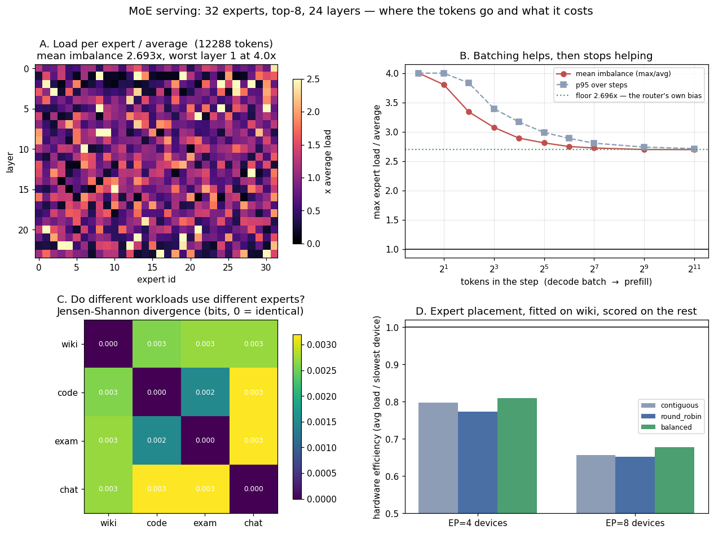

# MoE Serving

---

> A real [Mixture-of-Experts](/shared/glossary/#moe) checkpoint (granite-3.0-1b-a400m: 24 layers, **32 experts, top-8**), 12,288 real tokens, and every routing decision the model made recorded through a hook on its own [router](/shared/glossary/#moe-router). The busiest expert in a layer does **2.69x** the average expert's work, so **63% of an expert-parallel fleet is idle at the end of every step**. Two layers sit at **4.00x — the arithmetic ceiling** — because one expert there is on the top-8 list of *every single token*: 6 of the model's 768 expert slots are not sparse at all. Then the results that run against the usual story. **Batching does not fix it**: imbalance falls from 4.00x at one token to 2.70x by 64 tokens and then *stops*, because the remaining lopsidedness is the router's own preference, not a small-sample effect. **The four workloads route almost identically** — a mean [Jensen-Shannon divergence](/shared/glossary/#jensen-shannon-divergence) of **0.0027 bits** between wiki, code, exam and chat — so "experts specialise by domain" is not what this checkpoint does. A placement tuned on one corpus scores **0.877 on it and 0.809 on the others**, beating naive contiguous placement by only **1.4%**, while round-robin placement is **worse than doing nothing**. And splitting the same experts over more devices makes it worse, not better: **EP=4 wastes 20% of the fleet, EP=8 wastes 34%**.

---

## Key Insight

This project stands up a [Mixture-of-Experts](/shared/glossary/#moe) model (such as Mixtral or a DeepSeek MoE) and measures expert *imbalance* under a real workload — how unevenly the router spreads tokens across the [experts](/shared/glossary/#expert). When experts are split across GPUs with [expert parallelism](/shared/glossary/#expert-parallelism-ep), a lopsided distribution means some GPUs are overworked while others wait, capping throughput.

## Why This Matters

MoE models give you huge capacity at a fixed compute cost per token, but only if the experts stay evenly busy. Imbalance is the dominant serving headache: it turns the [all-to-all token routing](/shared/glossary/#all-to-all-token-routing) on every step into a bottleneck and wastes the very hardware you added experts to use. Measuring it on your own traffic is the first step to tuning capacity factors and placement.

---

**This is project 70.**

### The words first

- **[Mixture-of-Experts (MoE)](/shared/glossary/#moe)** — instead of one big feed-forward block per layer, the model has many small ones ("experts") and uses only a few of them for each token. This checkpoint has 32 experts per layer and uses 8, so it stores 1.3 billion parameters and computes with about 400 million per token. "Enormous on paper, cheap per token."
- **[Router](/shared/glossary/#moe-router) (or gate)** — a tiny linear layer that scores all 32 experts for each token and picks the top 8. It is the only thing that decides where work goes, and it is the thing this project watches.
- **Top-k routing** — "k" is how many experts each token is sent to. Here k = 8. Higher k means more compute per token and more traffic on the wire.
- **[Expert parallelism (EP)](/shared/glossary/#expert-parallelism-ep)** — putting different experts on different GPUs. With 32 experts and 4 GPUs, each GPU holds 8 experts and must run whatever tokens the router sends it.
- **[All-to-all](/shared/glossary/#all-to-all-token-routing)** — the network operation that ships each token's vector to the GPUs holding its chosen experts (*dispatch*) and ships the results back (*combine*). It happens **twice per layer, on every step**.
- **[Expert imbalance](/shared/glossary/#expert-imbalance)** — one expert getting far more tokens than another. Measured here as `busiest expert's tokens ÷ average expert's tokens`. 1.0 is perfect.
- **[Capacity factor](/shared/glossary/#capacity-factor)** — how much room each expert's input buffer gets, as a multiple of its fair share. Tokens that arrive after the buffer is full are **dropped**: they skip that expert entirely. No error is raised.
- **[Jensen-Shannon divergence](/shared/glossary/#jensen-shannon-divergence)** — a number between 0 and 1 bit saying how different two distributions are. Here: do two workloads use the experts in the same proportions? 0 bits means identical.

### "The model was trained with a load-balancing loss. Isn't balance already handled?"

This is the right question to ask, and the answer is the reason this project exists.

A [load-balancing loss](/shared/glossary/#load-balancing-loss) is an extra term added during *training* that punishes the router for over-using an expert. It works on the **average over the training distribution**, over batches of thousands of tokens. It is a statistical nudge, not a guarantee.

Serving asks a completely different question: is *this* step, with *these* 8 tokens, from *your* users, balanced? Nothing in training promised that. And a step's cost is set by its slowest device, not by its average — so the average being fine is exactly the wrong statistic. Section B measures the gap: at 8 tokens in a step the imbalance is **3.08x**, and even with 2,048 tokens it never goes below **2.70x**.

### "Doesn't the capacity factor solve it?"

The capacity factor caps the *damage*, by throwing work away. When an expert's buffer is full, the extra tokens are dropped — they pass through that layer without the expert's contribution. The model still produces output; it is just a slightly different model than the one you evaluated. Section D measures the price: at a batch of 8 tokens and a capacity factor of 1.25, **24.7% of dispatches are dropped**. Buying safety costs memory instead: capacity factor 4.0 drops nothing, and reserves four times the buffer.

---

## Running it

```bash
python3 run.py            # ~5 minutes (about 2 of them loading the model)
python3 run.py --reuse    # re-analyse outputs/assign.npz without re-routing
python3 run.py --plot     # redraw from outputs/findings.json
```

Needs `torch`, `transformers`, `numpy`, `matplotlib`, and [project 30](../30-quantize-a-7b-model-end-to-end/README.md)'s `quantlib.py` for the four corpora. The model (`ibm-granite/granite-3.0-1b-a400m-instruct`, ~2.5 GB) downloads on first run.

**Why this model.** Serving a frontier MoE (DeepSeek-V3, Mixtral 8x7B) needs hundreds of gigabytes. This one is a genuine MoE — real router, real top-8 sparsity, real trained expert weights — at 1.3B parameters, so the *routing behaviour* is real even though the hardware is a CPU. Every conclusion in this project is about where tokens go, which does not depend on how fast the arithmetic runs.

> **About the numbers.** 4 corpora × 6 chunks × 512 tokens = **12,288 tokens**, each routed at 24 layers to 8 of 32 experts — 2.4 million dispatch decisions, all in the committed [`outputs/findings.json`](outputs/findings.json) (raw assignments in [`outputs/assign.npz`](outputs/assign.npz)). Batch-size rows are averages over 300 random draws.



---

## A. Where the tokens actually go

Every layer's 32 experts, as a multiple of the average load, is panel A. Two things are visible immediately: **the pattern is not noise** (bright columns persist), and **it differs per layer**.

| | value |
|---|---|
| mean imbalance across 24 layers | **2.693x** |
| worst layer (1) | **4.000x** |
| best layer (14) | 1.903x |
| mean routing entropy (1.0 = perfectly even) | 0.9427 |
| expert slots that see >95% of all tokens | **6** of 768 |
| expert slots that see <5% of all tokens | 47 of 768 |

**The 4.00x is not a coincidence — it is the ceiling.** With 32 experts and top-8, each token creates 8 dispatches, so the average expert gets `tokens × 8 ÷ 32 = tokens/4`. An expert cannot receive more than one dispatch per token, so the most it can be is `tokens`, which is exactly **4x the average**. Layers 1 and 2 sit at that ceiling: they each contain an expert that is on the top-8 list of *every token in the corpus*.

That is worth restating plainly. **Six of this model's expert slots are not sparse at all.** They are dense feed-forward blocks that the router dresses up as a choice. A serving system that assumes "any expert may be idle" will place one of these on a device and watch that device saturate.

The other tail matters too: 47 slots see fewer than 5% of tokens. Their weights occupy memory on some device, are shipped across the fabric during model load, and do almost nothing.

### Entropy and imbalance disagree, on purpose

Layer 1 has entropy 0.8435 — which sounds "mostly even" — while its imbalance is at the arithmetic maximum. [Entropy](/shared/glossary/#entropy) describes the whole distribution; imbalance describes only the worst expert. **A serving step ends when its slowest device finishes, so the worst expert is the one that sets the clock.** Report both, act on the second.

---

## B. Batching helps, and then it stops helping

The obvious hypothesis: imbalance is a small-sample effect. With one token you can only touch 8 experts, so of course it looks lopsided; with thousands of tokens the law of large numbers should even things out.

Half of that is right.

| tokens in the step | imbalance | p95 | idle hardware | dispatches dropped at cf=1.25 |
|---|---|---|---|---|
| 1 (batch-1 decode) | **4.00x** | 4.00x | 75.0% | 68.8% |
| 8 | 3.08x | 3.40x | 67.5% | 25.1% |
| 64 | 2.75x | 2.89x | 63.6% | 17.0% |
| 512 (a prefill) | 2.70x | 2.74x | 62.9% | 15.9% |
| 2,048 | **2.696x** | 2.71x | 62.9% | 15.8% |

**The curve flattens at 2.70x and never approaches 1.0.** Going from 64 tokens to 2,048 — 32x the batch — buys 2%. The sampling noise is gone by about 64 tokens; what remains is the router's own preference, and no batch size on earth touches it.

This splits the problem in two, with two different owners:

- the part that batching fixes (4.00x → 2.70x) is a **scheduling** problem: run decode with more requests in flight and it goes away;
- the part that stays (2.70x) is a **model** problem: it is baked into the trained router and can only be answered by placement, replication of hot experts, or retraining.

**The batch-1 row is the number to remember for decode.** A single token dispatches to 8 experts and leaves 24 idle. With expert parallelism across 4 devices, at least one device is doing 4x the average work while others may have nothing to do. This is the concrete reason MoE serving needs large decode batches far more urgently than a dense model does — for a dense model, batch 1 is merely inefficient; for an MoE, batch 1 is *structurally* unbalanced.

---

## C. The four workloads route almost identically

The standard intuition — "experts specialise, so code goes to the code experts" — predicts that different workloads should use noticeably different experts. Measured across wiki text, source code, exam questions and chat:

| | wiki | code | exam | chat |
|---|---|---|---|---|
| **wiki** | 0 | 0.003 | 0.003 | 0.003 |
| **code** | 0.003 | 0 | 0.002 | 0.003 |
| **exam** | 0.003 | 0.002 | 0 | 0.003 |
| **chat** | 0.003 | 0.003 | 0.003 | 0 |

Jensen-Shannon divergence in bits; the maximum is 1.0. **The mean pairwise divergence is 0.0027 bits.** For scale: two distributions that shared no experts at all would score 1.0. These four are, for practical purposes, **the same distribution**.

The top-5 experts by load are `[30, 26, 13, 8, 28]` for wiki and `[13, 19, 8, 31, 30]` for code — three of five in common, and the differences are between experts of similar load.

Two consequences for a serving stack:

1. **Good news for planning.** You can measure expert load on any convenient corpus and the placement will transfer. Section D confirms this with a held-out test.
2. **Bad news for a tempting optimisation.** "Route each tenant's traffic to the machines holding their experts" has nothing to work with here: every tenant wants the same experts.

**Where specialisation does live: layer 7**, whose per-layer divergence is **0.1176 bits — 44x the model-wide mean**. Layers 7–11 are consistently the most workload-sensitive block in the stack. So specialisation is real but *local*, and it is invisible in the whole-model average. If you want to study expert specialisation, look per layer; if you want to plan a fleet, the whole-model average is what you get.

---

## D. Expert parallelism: placement, and why more devices is worse

With EP, each device holds a slice of the experts and the step ends when the slowest device is done. **Hardware efficiency** here is `average device load ÷ slowest device load` — the fraction of your fleet that is doing useful work at the end of a step.

Placements are **fitted on the wiki corpus only** and scored on the other three, because a placement you can only compute after seeing the traffic is not a plan:

| | EP=4, wiki (fit) | EP=4, held out | EP=8, wiki (fit) | EP=8, held out |
|---|---|---|---|---|
| contiguous (experts 0–7 on device 0, …) | 0.803 | **0.798** | 0.684 | **0.657** |
| round robin (expert *i* on device *i* mod 4) | 0.807 | 0.772 | 0.683 | 0.651 |
| balanced (greedy, from measured loads) | **0.877** | **0.809** | **0.745** | **0.678** |

Three findings, two of them uncomfortable:

**More expert parallelism is less efficient.** EP=4 wastes about 20% of the fleet; EP=8 wastes about 34%. Splitting the same lopsided load into more, smaller bins makes the worst bin relatively worse. EP is a memory strategy — it is how a model too big for one device gets served — and it is bought at a throughput discount that grows with the split.

**The clever placement wins by 1.4%, not by the 9% it appears to win.** Balanced placement scores 0.877 on the corpus it was fitted on and **0.809** on corpora it has not seen, against contiguous placement's 0.798. The gap between 0.877 and 0.809 is [overfitting](/shared/glossary/#overfitting) to one corpus's sampling noise — and section C already told us why the remaining honest gain is small: every workload wants the same experts, so there is no clever assignment that helps one without hurting another. Report the held-out number.

**Round-robin is worse than contiguous, and it is the placement people reach for first.** 0.772 versus 0.798 at EP=4. Spreading experts "evenly by index" assumes expert index has nothing to do with expert load; here neighbouring indices have mildly correlated loads, and contiguous chunks accidentally average them out. Neither scheme is *reasoning* about load — the lesson is that an intuition about index order is not a load-balancing strategy, and the only way to know which way it lands is to measure.

### The capacity factor: the price list for buffer space

| tokens in the step | cf 1.0 | cf 1.25 | cf 1.5 | cf 2.0 | cf 3.0 | cf 4.0 |
|---|---|---|---|---|---|---|
| 8 | 33.4% | 24.7% | 16.9% | 7.9% | 1.4% | **0.0%** |
| 64 | 26.0% | 16.7% | 10.8% | 4.5% | 0.9% | 0.0% |
| 512 | 25.0% | 16.0% | 9.9% | 4.1% | 0.9% | 0.0% |

Percentages are dispatches dropped — tokens that skip an expert they were routed to. Note that dropping does **not** show up in any latency metric, any error rate, or any log line. It shows up as slightly worse answers, which is the hardest kind of regression to attribute.

**Capacity factor 4.0 is exactly the E/k ceiling from section A**, and it is the only setting that guarantees zero drops for this model, because one expert really can receive every token. A stack that ships "cf=1.25, it is the usual default" on this checkpoint silently drops a quarter of its dispatches at decode batch sizes.

---

## E. The wire, in bytes

From the model's own shapes (hidden 1024, expert FFN 512, top-8, bf16 on the fabric):

- **dispatch + combine = 32,768 bytes per token per layer** (8 experts × 1024 values × 2 bytes, twice).
- **expert arithmetic = 25.2 MFLOPs per token per layer.**
- ratio: **768 FLOPs per byte on the wire.**

Compare that with the ratio the hardware offers. A device doing ~400 TFLOP/s of bf16 while its fabric carries ~50 GB/s per device needs about 8,000 FLOPs per byte to stay compute-bound. At 768, **an MoE layer is roughly an order of magnitude off the balance point: the all-to-all, not the expert matmuls, is the limiting resource** — and unlike the matmuls, it happens twice per layer and cannot be overlapped away without careful pipelining. This is the arithmetic reason MoE serving stacks care so much about topology and why they prefer to keep expert parallelism inside a fast domain (NVLink) rather than across nodes.

Scaling note: the wire cost is proportional to **k**, not to the expert count. Going from top-8 to top-2 would cut the fabric traffic by 4x and the FLOPs by 4x together — but top-2 routing on 32 experts also multiplies the imbalance ceiling from 4x to **16x**.

---

## What to take from this

1. **Mean imbalance 2.693x; 63% of an EP fleet idles at the end of each step.** Imbalance is the default state, not a fault condition.
2. **Layers 1 and 2 sit at the arithmetic ceiling of 4.00x** — one expert on the top-8 list of every token. **6 of 768 expert slots are effectively dense.**
3. **Batching cures 4.00x → 2.70x and then stops.** The floor is the router's preference; only placement, replication or retraining moves it.
4. **Batch-1 decode is structurally unbalanced** (8 of 32 experts touched). MoE needs a full decode batch far more than a dense model does.
5. **wiki, code, exam and chat route identically — 0.0027 bits apart.** Domain specialisation is not what this checkpoint learned.
6. **Specialisation is local: layer 7 is 44x the model-wide divergence.** Averages hide it; per-layer measurement finds it.
7. **A placement fitted on one corpus transfers** (0.809 held out) but beats naive contiguous by only **1.4%**.
8. **Round robin is worse than contiguous** — an index-order intuition is not a load-balancing strategy.
9. **EP=4 wastes 20% of the fleet, EP=8 wastes 34%.** Expert parallelism buys memory and sells throughput.
10. **At capacity factor 1.25 and batch 8, 24.7% of dispatches are dropped** — invisible in every latency and error metric. Only cf ≥ 4.0 guarantees zero here.
11. **768 FLOPs per wire byte** puts the all-to-all, not the experts, on the critical path.

### Common traps this project walks into on purpose

- **Trusting the training-time load-balancing loss to hold per step.** It is an average over the training distribution.
- **Reporting mean expert load.** The step ends with the slowest expert; report the max.
- **Reading routing entropy as "balanced".** Layer 1 reads 0.84 entropy at the maximum possible imbalance.
- **Measuring imbalance during prefill and planning decode with it.** They differ by 1.5x here.
- **Scoring a placement on the corpus it was fitted on.** Worth 9% there, 1.4% in reality.
- **Assuming round-robin spreads load.** Measured worse than contiguous.
- **Adding devices to "spread the experts out".** Efficiency falls from 0.80 to 0.66.
- **Shipping the default capacity factor.** A quarter of dispatches dropped, silently.
- **Expecting per-domain expert specialisation.** Four very different corpora, 0.003 bits apart.

---

## Next

[Project 71 — FP4 (Blackwell) inference](../71-fp4-blackwell-inference/README.md) takes the other lever the frontier is pulling on: not fewer experts per token, but fewer bits per number — and the half of that idea nobody has measured yet in this guide, 4-bit *activations*.
