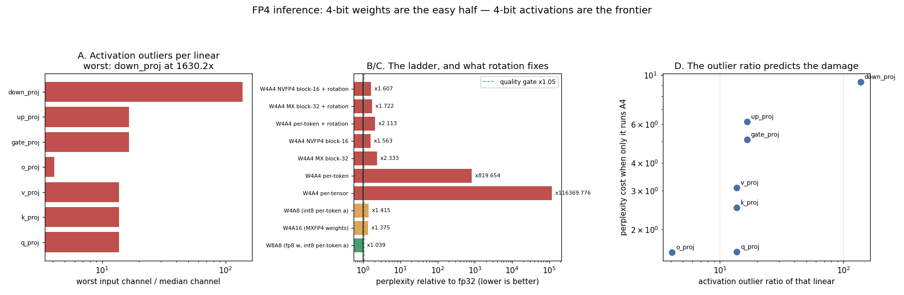

# FP4 (Blackwell) Inference

---

> [Project 36](../36-fp4-blackwell-deployment/README.md) built FP4 **weights**; this one does the half that [Blackwell](/shared/glossary/#blackwell)'s tensor cores actually need — **4-bit [activations](/shared/glossary/#activations)** — and the numbers span five orders of magnitude depending on one design choice nobody puts in the headline. Same weights, same 4 bits, different scale sharing: one scale per tensor is **×116,370** [perplexity](/shared/glossary/#perplexity), one per token is **×819.7**, one per 32 values is **×2.33**, one per 16 values with an fp8 scale ([NVFP4](/shared/glossary/#nvfp4)) is **×1.563**. That last number is the surprise: **4-bit activations cost only 10% more than 8-bit ones** (×1.563 against ×1.415) once the scales are small enough. [Hadamard rotation](/shared/glossary/#hadamard-rotation) — the QuaRot trick — is worth **388x** where the blocks are big (×819.7 → ×2.11) and **nothing at all** where they are small (×1.563 → ×1.607, 2.7% *worse*): rotation and [microscaling](/shared/glossary/#microscaling) fix the same problem and do not add up. The blame is exactly where the outliers are — `down_proj`'s worst input channel is **1,630x its median**, and 4-bit activations on that one linear cost **×9.31** — but protecting it does not save you: everything *except* `down_proj` at 4 bits still costs **×63.9**, because the damage compounds across 24 layers. And [project 35](../35-eval-suite-for-quantized-models/README.md)'s quality gate rejects **every 4-bit arm in this project**, passing only FP8 at ×1.039.

---

## Key Insight

This project benchmarks [FP4](/shared/glossary/#fp4) weights and [activations](/shared/glossary/#activations) against the [FP8](/shared/glossary/#fp8) baseline on [Blackwell](/shared/glossary/#blackwell) hardware, which accelerates 4-bit math natively, and then checks quality on a real eval. The point is to see both sides of the trade at once: how much memory and speed you gain, and how much accuracy (if any) you give up by halving the bits again.

## Why This Matters

[Quantization](/shared/glossary/#quantization) is the most leveraged cost knob in serving, and FP4 pushes it to the edge of what is usable — fitting models on fewer chips than ever before. But "lossless 4-bit" is a claim to verify, never trust: with only 16 representable values, quality can drop in ways that only a workload-matched eval will catch before customers do.

---

**This is project 71.**

### The words first

- **[W4A4](/shared/glossary/#w4a4)** — 4-bit weights **and** 4-bit activations. The notation is `W<weight bits>A<activation bits>`; W4A16 means 4-bit weights with unquantised activations.
- **[E2M1](/shared/glossary/#fp4)** — the FP4 number format: 1 sign bit, 2 exponent bits, 1 mantissa bit, giving 16 representable values (`±0, ±0.5, ±1, ±1.5, ±2, ±3, ±4, ±6`). Everything else is done by the *scale*.
- **[Microscaling](/shared/glossary/#microscaling)** — one shared scale per small block of values instead of per tensor. [MXFP4](/shared/glossary/#mxfp4) uses blocks of 32 with a power-of-two scale; [NVFP4](/shared/glossary/#nvfp4) uses blocks of 16 with an fp8 scale.
- **[Activation outlier](/shared/glossary/#activation-outlier)** — one input channel whose values are hundreds of times larger than its neighbours'. It forces the scale up, and everything else in the block rounds to zero.
- **[Hadamard rotation](/shared/glossary/#hadamard-rotation)** (QuaRot, SpinQuant) — multiply by a matrix of +1s and −1s (scaled to be a rotation) before quantising. It mixes every channel into every other, so an outlier is spread out and the block's maximum comes down. The matmul's result is unchanged, because the rotation is undone on the other side.
- **Fake quantisation** — round the numbers to the target grid and keep them in float32. The *numerics* are exactly what a 4-bit kernel would compute; only the speed is missing, which is what makes a quality study possible on hardware with no 4-bit units.

### "Project 36 already did FP4. Why again?"

[Project 36](../36-fp4-blackwell-deployment/README.md) compared the shipping FP4 formats on **weights**: MXFP4 against NVFP4 against int4, block sizes, scale formats, the second-level scale. That is the easy half, and its results carry over unchanged.

Weights are easy because they **sit still**. They are known before the server starts, so you can look at every one of them, spend minutes choosing scales, run [AWQ](/shared/glossary/#awq) or [GPTQ](/shared/glossary/#gptq), and check the result offline.

Activations are produced fresh for every token of every request. Their scales must be computed **inside the kernel, from the numbers themselves, in nanoseconds** — and they contain outliers that weights do not. That is why this project exists, and why its results are not a rerun of 36's: section B measures a **74,000x spread** between the best and worst way of doing the *same* 4 bits.

### "Project 32 already measured 8-bit activations. Same thing at 4?"

Not the same, and the difference is instructive. [Project 32](../32-w4a8-ablation/README.md) found that 8-bit activations are nearly free **if** you scale per token (×1.03) and a disaster if you scale per tensor (×4.72) — a 4.6x difference from a free choice.

At 4 bits, per-token scaling — the fix that rescued 8-bit — is **not enough**: ×819.7. Halving the bits again removes the headroom that made per-token work, and you have to go one step further, to a scale per 16 or 32 values. **The technique that solves a problem at 8 bits is not the technique that solves it at 4.** That is the single most transferable thing in this project.

### "There is no Blackwell here. What is actually measured?"

Every quality number is **measured**, because FP4 numerics are fully determined by the format: rounding to E2M1 with a given scale produces the same values on any machine. The formats are implemented from their specifications in [`fp4act.py`](fp4act.py) and [project 36's `fp4.py`](../36-fp4-blackwell-deployment/fp4.py), and the perplexities come from running the real model.

What is **not** measured is throughput: this machine has no FP4 units (or any usable GPU). Section E's speed figures are arithmetic from published specifications and are labelled as such everywhere they appear. Nothing in this project claims a measured FP4 speedup.

---

## Running it

```bash
python3 run.py           # ~5 minutes
python3 run.py --plot    # redraw from outputs/findings.json
```

Needs `torch`, `transformers`, `matplotlib`, [project 30](../30-quantize-a-7b-model-end-to-end/README.md)'s `quantlib.py` and [project 36](../36-fp4-blackwell-deployment/README.md)'s `fp4.py`. The new code is [`fp4act.py`](fp4act.py) — activation quantisation at four granularities plus the rotation — and it is meant to be read.

> **About the numbers.** Qwen2.5-0.5B-Instruct in fp32, perplexity **18.457** over 6 × 512 held-out [WikiText](https://huggingface.co/datasets/Salesforce/wikitext) tokens; activation statistics calibrated on 4 further chunks the eval never sees. All ratios are against that fp32 baseline. Committed in [`outputs/findings.json`](outputs/findings.json).



---

## A. Why activations are the hard half

For each linear, the ratio of its **worst** input channel to its **median** channel, averaged over the 24 layers:

| linear | mean outlier ratio |
|---|---|
| `down_proj` | **138.2x** |
| `gate_proj`, `up_proj` | 16.6x |
| `q_proj`, `k_proj`, `v_proj` | 13.7x |
| `o_proj` | 4.1x |

The single worst linear in the model is **`layers.2.down_proj`, at 1,630x** — one channel whose values reach 1,769 while the typical channel sits near 1.09.

**That number is the whole problem in one line.** A 4-bit grid has 16 levels. If the scale has to stretch to cover 1,769, then everything at the typical scale of 1.09 lands between the two smallest levels and rounds to 0 or 0.5 — the entire tensor is destroyed to represent one channel. This is the same `down_proj` pathology [project 32](../32-w4a8-ablation/README.md) found at 8 bits (1,457x there, on the same architecture with different calibration data), except that 8 bits had 256 levels to spend and 4 bits has 16.

Note which linear it is: `down_proj` is the one that reads the **output of the activation function** in the MLP, where [SwiGLU](/shared/glossary/#swiglu)'s multiplicative gate produces occasional very large values. The outliers are not random; they are a known consequence of the architecture, in a known place.

---

## B. The ladder: one bit-width, five orders of magnitude

Weights are MXFP4 (block 32) throughout the 4-bit rows; only the activation treatment changes.

| configuration | perplexity | vs fp32 | [quality gate](/shared/glossary/#quality-gate) (×1.05) |
|---|---|---|---|
| fp32 baseline | 18.457 | ×1.000 | — |
| **W8A8** (fp8 weights, int8 per-token activations) | 19.176 | **×1.039** | **PASS** |
| W4A16 (MXFP4 weights, activations untouched) | 25.386 | ×1.375 | FAIL |
| W4A8 (int8 per-token activations) | 26.125 | ×1.415 | FAIL |
| **W4A4, one scale per tensor** | 2,147,892 | **×116,370** | FAIL |
| **W4A4, one scale per token** | 15,128.7 | **×819.7** | FAIL |
| W4A4, MX blocks of 32 | 43.06 | ×2.333 | FAIL |
| **W4A4, NVFP4 blocks of 16** | **28.84** | **×1.563** | FAIL |

**Three readings, in increasing order of usefulness.**

**The bits are not the variable — the scale sharing is.** Every W4A4 row uses exactly 4 bits per activation value. They differ by **74,000x** in quality purely in how many values share a scale. Any paper, vendor claim or config flag that says "4-bit activations" without saying "…in blocks of N" has not told you the thing that matters.

**Per-token scaling — the fix from the 8-bit era — fails here.** It was worth 4.6x at 8 bits ([project 32](../32-w4a8-ablation/README.md)) and it leaves the model at ×819.7 at 4 bits. A token's row still contains that 1,630x outlier channel, and at 16 levels there is no headroom left to absorb it. The fix has to be a scale *per block of channels*, which is precisely what the MX and NVFP4 standards define.

**With small enough blocks, 4-bit activations are nearly as good as 8-bit ones.** NVFP4's blocks of 16 land at ×1.563 against W4A8's ×1.415 — **10% worse for half the activation bits**. That is the result that makes the Blackwell design sensible: the hardware wants both operands in FP4, and with microscaling, giving it both costs a tenth of what the weights alone already cost.

**Blocks of 16 beat blocks of 32 by 1.49x** (×1.563 against ×2.333) — the opposite of [project 36's](../36-fp4-blackwell-deployment/README.md) weight-side finding, where shrinking the block from 128 to 16 moved perplexity **2% in the wrong direction**. Weights are well-behaved enough that block size barely matters; activations are not, and on them NVFP4's smaller block is the whole difference.

---

## C. Rotation: worth 388x, or worth nothing

| configuration | without rotation | with rotation | rotation is worth |
|---|---|---|---|
| W4A4 per-token | ×819.65 | **×2.113** | **388.0x** |
| W4A4 MX block-32 | ×2.333 | ×1.722 | 1.354x |
| W4A4 NVFP4 block-16 | ×1.563 | ×1.607 | **0.973x** (worse) |

**Rotation rescues a broken configuration and does nothing for a good one.**

The mechanism explains both ends. A rotation spreads an outlier across the block it is applied to: the block's maximum falls, the other values rise, and the scale no longer has to stretch. With one scale per token (896 channels sharing it) there is an enormous outlier to spread, and spreading it is worth 388x. With one scale per 16 values, **each block is already small enough that no single channel dominates it** — there is nothing left for the rotation to fix, and its own cost (mixing channels of genuinely different magnitudes, plus rounding in the rotation itself) makes it 2.7% worse.

Two consequences worth carrying:

**Rotation and microscaling are substitutes, not complements.** They solve the same problem — an outlier dominating its scale — and stacking them buys almost nothing. Choosing between them is an engineering decision: rotation costs arithmetic at run time (a Hadamard transform per layer) and works with coarse scales; microscaling costs metadata (0.25–0.5 bits per value) and needs hardware that understands block formats. Blackwell has the hardware, so it uses microscaling; a kernel targeting older silicon uses rotation.

**Where a technique is measured decides what it looks like.** A paper demonstrating rotation on per-token quantisation reports a spectacular win; the same technique measured on top of NVFP4 reports nothing. Both are true. Neither is "the" value of rotation — and this is why an ablation needs the baseline you would actually deploy, not the one that makes the number large.

---

## D. Which linear breaks, and why protecting it does not help

4-bit activations enabled on **one group of linears at a time**, with the cheap per-token granularity so the differences are visible:

| linear at A4 | perplexity cost | its outlier ratio |
|---|---|---|
| `down_proj` | **×9.31** | 138.2x |
| `up_proj` | ×6.14 | 16.6x |
| `gate_proj` | ×5.12 | 16.6x |
| `v_proj` | ×3.10 | 13.7x |
| `k_proj` | ×2.52 | 13.7x |
| `q_proj` | ×1.59 | 13.7x |
| `o_proj` | ×1.58 | 4.1x |
| **everything except `down_proj`** | **×63.90** | |

**The outlier ratio predicts the damage** (panel D): the ranking of the seven linears by measured cost is nearly the ranking by outlier ratio, and `o_proj` — the one linear with a small ratio — is the cheapest to quantise. So the cheap offline statistic tells you where the risk is before you run a single eval. That is the useful half.

**And then the trap.** The obvious deployment recipe — "keep the worst linear at 8 bits and quantise the rest" — is measured on the last row: **×63.90**, seven times worse than `down_proj` alone at 4 bits. The individual costs are ×1.58 to ×6.14, and together they make ×63.90.

**Damage compounds, it does not add.** Each layer's quantisation error becomes the next layer's input, so 24 layers of small errors multiply into a large one — and the linear-by-linear table, which is the standard way to decide what to protect, systematically understates what a full deployment will cost. Use it to *rank* candidates for protection, never to predict the result of protecting them. The only trustworthy number is the one measured on the configuration you intend to ship, which is section B's job.

---

## E. What FP4 buys — memory measured, throughput arithmetic

**Weights** (Qwen2.5-0.5B, group-32 scales, embedding and head left at 16 bits):

| weight bits | model bytes | shrink |
|---|---|---|
| 16 | 987.9 MB | 1.00x |
| 8 | 674.8 MB | 1.46x |
| 4 | **495.9 MB** | **1.99x** |

Note how far that is from 4x: this model's tied embedding and output head are 27% of its parameters and stay at 16 bits, so "4-bit weights" gives an *effective* 8.0 bits per weight for the whole file. On a 70B model, where the head is under 2% of the parameters, the same recipe lands near 4.3 bits. **The smaller the model, the less quantisation buys** — a fact that makes small-model FP4 benchmarks flattering to no one.

**KV cache** ([project 31](../31-fp8-kv-cache/README.md) owns this axis, but FP4 changes it too):

| cache bits | bytes per token | sessions per GB |
|---|---|---|
| 16 | 12,288 | 81,000 tokens |
| 8 | 6,144 | 163,000 |
| 4 | **3,072** | **326,000** |

**Throughput (arithmetic, not measured).** A B200 is quoted at 9 PFLOPS of dense FP4 against 4.5 PFLOPS of FP8 — **2x**, and only if *both* operands are FP4, which is what makes W4A4 (rather than W4A16) the interesting configuration. But recall the guide's roofline result ([project 37](../37-roofline-plot-for-your-engine/README.md)): **[decode](/shared/glossary/#decode) is memory-bound at every batch size**, so decode does not collect that 2x — it collects the bandwidth saving from carrying half the bytes. The FLOPs matter for [prefill](/shared/glossary/#prefill), and prefill is where a long-context serving stack spends its compute. Two different halves of the workload, two different reasons to want FP4.

---

## F. The gate says no

Applying [project 35](../35-eval-suite-for-quantized-models/README.md)'s deployment gate (no more than 5% perplexity loss):

- **W8A8 passes** at ×1.039.
- **Every 4-bit arm fails**, the best being NVFP4 W4A4 at ×1.563 and 4-bit weights alone at ×1.375.

The honest reading is not "FP4 does not work" — it is **"FP4 does not work on a 0.5B model"**, which is what this machine can run. Quantisation error is roughly a fixed perturbation per weight, while a model's redundancy grows with its size, so the same recipe that costs ×1.375 here costs a few percent on a 70B. That is why published FP4 results are demonstrated at scale, and why the number that transfers from this project is not the perplexity — it is the **ordering**: per-tensor ≪ per-token ≪ block-32 < block-16, rotation helps only where the blocks are coarse, and damage compounds across layers.

**Which is also the reason to run a gate at all.** [Project 36](../36-fp4-blackwell-deployment/README.md) found the same gate rejecting even FP8 by 0.03 points on its own eval. A gate that rejects everything is telling you that this model is too small for the recipe — that is information, and it arrives before customers provide it.

---

## What to take from this

1. **The same 4 bits span 74,000x** in quality depending only on how many values share a scale: ×116,370 (per tensor), ×819.7 (per token), ×2.33 (block 32), ×1.563 (block 16).
2. **Per-token scaling rescued 8-bit activations and fails at 4-bit.** The fix at one precision is not the fix at the next.
3. **With blocks of 16, 4-bit activations cost only 10% more than 8-bit ones** (×1.563 vs ×1.415) — the result that makes Blackwell's design sensible.
4. **Block 16 beats block 32 by 1.49x on activations**, the opposite of the weight-side finding, where block size was worth −2%.
5. **Rotation is worth 388x on per-token and 0.97x on NVFP4.** It and microscaling are substitutes; measure a technique against the baseline you would ship.
6. **`down_proj`'s worst channel is 1,630x its median** — the architectural pathology that drives every number here.
7. **The outlier ratio ranks the linears correctly** by measured damage. Cheap offline statistics find the risk.
8. **Protecting the worst linear does not save you**: everything else at A4 is still ×63.90, against ×9.31 for the worst linear alone. Damage compounds across layers.
9. **"4-bit weights" is 8.0 effective bits on a 0.5B model** because the embedding and head stay at 16. Small models flatter no quantisation recipe.
10. **The quality gate rejects every 4-bit arm here** and passes FP8. On a 0.5B model that is the correct answer, and it is why the gate exists.
11. **FP4's 2x FLOPs is a prefill win; its halved bytes is the decode win.** Different halves of the workload, different mechanisms.

### Common traps this project walks into on purpose

- **Reading "4-bit activations" as one thing.** Without the block size the number is meaningless.
- **Carrying the 8-bit recipe to 4 bits.** Per-token scaling is 819x off there.
- **Stacking rotation on top of microscaling** and expecting the gains to add. They are substitutes.
- **Demonstrating a technique on the baseline that makes it look best.** Rotation is 388x or nothing depending on the choice.
- **Quantising one linear at a time and adding up the costs.** ×1.58 to ×6.14 individually, ×63.90 together.
- **Protecting the worst layer and shipping.** It is not the layer, it is the compounding.
- **Quoting a small model's shrink factor.** The head dominates and 4-bit becomes 8.0 effective bits.
- **Claiming a speedup on hardware you do not have.** Quality is measured here; throughput is arithmetic and labelled.

---

## Next

[Project 72 — on-device build](../72-on-device-build/README.md) takes quantisation to the other extreme of the hardware range: not the newest data-centre silicon, but a laptop with no usable GPU, where the same 4-bit idea is what decides whether the model runs at all.
