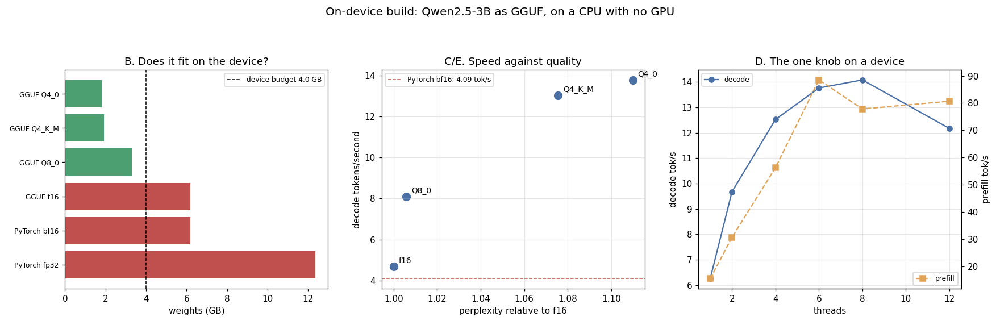

# On-Device Build

---

> Qwen2.5-3B compiled to real [GGUF](/shared/glossary/#gguf) files and benchmarked with real `llama.cpp` on a machine whose GPU [PyTorch cannot use](/shared/glossary/#compute-capability) — which is exactly the situation a laptop or a phone is in. The headline is a clean, measured split. **[Quantising](/shared/glossary/#quantization) to 4 bits made [decode](/shared/glossary/#decode) 2.8x faster (4.68 → 13.04 tokens/second) and left [prefill](/shared/glossary/#prefill) unchanged (79.5 → 77.9)** — the textbook memory-bound/compute-bound split, on one model, one machine, one afternoon. Swapping runtimes bought almost nothing next to that: **PyTorch bf16 decodes at 4.09 tok/s and llama.cpp f16 at 4.68 — 1.14x.** The other 2.8x is the *bits*, not the runtime. Fitting matters more than either: at a 4 GB device budget, **fp32 (12.4 GB), bf16 (6.2 GB) and f16 GGUF (6.2 GB) do not fit at all**, while Q4_K_M fits with **56,154 tokens of [KV cache](/shared/glossary/#kv-cache) left over**. The price is measured too: [perplexity](/shared/glossary/#perplexity) **+0.6% at 8 bits, +7.5% at Q4_K_M, +11.0% at Q4_0** — the 4-bit K-quant gives back **31% of the quality loss for a 5% speed loss**. Finally the knob nobody tunes: **decode peaks at 8 threads and loses 14% at 12** on a 12-core machine, while prefill peaks at 6 and 1 → 8 threads is worth only 2.3x.

---

## Key Insight

This project compiles a 3B model to a real on-device runtime — Apple's MLX, TensorRT-LLM on Jetson, or a [GGUF](/shared/glossary/#gguf) build for `llama.cpp` — and measures actual tokens per second on the hardware in your hand. Running it on the device makes the constraints concrete: no data-center GPU, limited memory shared with the rest of the system, and a battery to respect.

## Why This Matters

[Edge inference](/shared/glossary/#edge-inference) is private, works offline, and costs nothing per request — but it lives or dies on fitting a [quantized](/shared/glossary/#quantization) model into a small memory and power envelope. The same [KV-cache](/shared/glossary/#kv-cache) and quantization principles from the rest of this guide carry over directly; this project shows how they feel when the "server" is a laptop or a phone.

---

**This is project 72.**

### The words first

- **[GGUF](/shared/glossary/#gguf)** — "GGML Universal File", the single-file model format `llama.cpp` reads. One file holds the weights, the [tokenizer](/shared/glossary/#tokenizer), and the metadata, so a device app ships one artefact and memory-maps it. (GGML was the original C tensor library by Georgi Gerganov, whose initials the names carry.)
- **[`llama.cpp`](/shared/glossary/#llama-cpp)** — a C/C++ inference runtime with no Python and no CUDA requirement, built for exactly this case: run a quantised model well on whatever the device has.
- **[Q4_K_M](/shared/glossary/#q4-k-m)** — a quantisation name that encodes its own recipe: **Q4** = about 4 bits per weight, **K** = a "K-quant", which stores a per-block scale *and* a per-super-block scale instead of one flat scale, **M** = the medium variant of that family, which spends extra bits on the layers that need them. Compare **Q4_0**, the original flat 4-bit scheme: one scale per 32 weights, no super-blocks, nothing layer-aware.
- **Prefill (prompt processing, `pp` in `llama-bench`)** — reading the prompt. Many tokens at once, so it is [compute-bound](/shared/glossary/#compute-bound).
- **Decode (token generation, `tg`)** — writing the answer, one token at a time. It re-reads every weight for each token, so it is [memory-bound](/shared/glossary/#memory-bound).
- **Device budget** — how much RAM the operating system will actually let one app hold. Here 4 GB, a fair figure for a mid-range phone, and the line every bar in panel B is measured against.

### "The model already runs in PyTorch. Why compile it at all?"

Because "runs" and "runs on a device" are different claims, and this project measures both halves of the difference.

PyTorch on this machine can load the 3B model in [bfloat16](/shared/glossary/#bfloat16) and decode at **4.09 tokens/second** while holding **7.06 GB** resident. That is a working demo and an unshippable app: it exceeds a 4 GB budget before the first token, and [fp32](/shared/glossary/#float32) — PyTorch's default — would need **12.4 GB**.

Compiling to GGUF changes two things, and only one of them is the runtime:

1. **The format lets you store 4-bit weights at all.** PyTorch has no native 4-bit tensor type; a 4-bit model in PyTorch means an extra library that unpacks weights on the fly. GGUF stores the packed blocks and `llama.cpp`'s kernels read them directly.
2. **The runtime is written for this hardware** — hand-tuned SIMD, memory mapping, no Python.

Section C separates them, and the answer is worth internalising: **at the same precision the two runtimes are 1.14x apart.** The remaining 2.8x comes from point 1. "Use a faster runtime" is not the lesson; "the format lets you carry fewer bits" is.

### "Is a CPU with no GPU really 'on-device'?"

For this experiment's purposes, yes, and in the ways that matter it is the harder case. A phone NPU differs in absolute speed; the *constraints* being measured here — a hard memory ceiling shared with the rest of the system, a handful of cores, no accelerator PyTorch can drive, quality that has to survive 4-bit weights — are identical. Every ratio in this project (bits versus speed, bits versus quality, weights versus context) transfers; the absolute tokens/second do not, and are labelled as this machine's.

---

## Running it

```bash
python3 run.py             # ~8 minutes once the artefacts are cached
python3 run.py --prepare   # only build llama.cpp + convert + quantise
python3 run.py --plot      # redraw from outputs/findings.json
```

The **first** run also clones and builds `llama.cpp` (~4 minutes with `cmake`, needs a C++ compiler) and converts the model to GGUF (~3 minutes, downloads ~6 GB of weights). Both land in `vendor/` next to the project and are skipped on later runs; set `LLAMA_WORKDIR` to put them elsewhere. Nothing in `vendor/` is committed — the f16 GGUF alone is 6.2 GB.

> **About the numbers.** `llama-bench` with 512-token prompts and 64-token generations, 2 repetitions, 6 threads unless the sweep says otherwise; `llama-perplexity` over 4 × 512 tokens of held-out [WikiText](https://huggingface.co/datasets/Salesforce/wikitext). This is a shared machine, so treat differences under ~5% as noise (the reported standard deviations are in [`outputs/findings.json`](outputs/findings.json)). Energy is not measured: the kernel's RAPL counters are not readable by an unprivileged user here, so no joules-per-token figure is claimed anywhere in this project.



---

## A. What came out of the build

| file | size | bits per weight | shrink vs f16 |
|---|---|---|---|
| `qwen2.5-3b-f16.gguf` | 6.18 GB | 16.00 | 1.00x |
| `qwen2.5-3b-Q8_0.gguf` | 3.29 GB | 8.51 | 1.88x |
| `qwen2.5-3b-Q4_K_M.gguf` | **1.93 GB** | **5.00** | **3.20x** |
| `qwen2.5-3b-Q4_0.gguf` | 1.82 GB | 4.72 | 3.39x |

Two things in that table surprise people.

**"4-bit" is 5.00 bits.** Q4_K_M stores its 4-bit weights plus per-block scales, per-super-block scales, and a handful of layers kept at higher precision because the recipe knows they are sensitive. Q8_0 is likewise 8.51, not 8.00. This is the same accounting [project 36](../36-fp4-blackwell-deployment/README.md) found for MXFP4 (4.25 bits) and NVFP4 (4.5): **scales are weights too**, and any memory plan built on the nominal bit count is 6–25% optimistic.

**The 3.20x shrink is smaller than the 4x you would expect from 16 → 4 bits**, for the same reason plus one more: the token [embedding](/shared/glossary/#embedding) and output layers are large in a 3B model and are quantised more gently.

---

## B. Does it fit? — the question that comes before speed

| what you would ship | weights | fits in 4 GB? |
|---|---|---|
| PyTorch fp32 | 12.36 GB | **no** |
| PyTorch bf16 | 6.18 GB | **no** |
| GGUF f16 | 6.18 GB | **no** |
| GGUF Q8_0 | 3.29 GB | yes |
| GGUF Q4_K_M | **1.93 GB** | yes |
| GGUF Q4_0 | 1.82 GB | yes |

The measured PyTorch process actually peaked at **7.06 GB** resident — 14% above the weights, for activations, the KV cache and the allocator. On a server that overhead is a rounding error; against a 4 GB ceiling it is the difference between shipping and being killed by the OS.

**On a device this table outranks every performance number below it.** A model that does not fit does not have a tokens/second.

---

## C. Speed: the bits matter, the runtime does not

| | prefill (tok/s) | decode (tok/s) | vs f16 decode |
|---|---|---|---|
| GGUF f16 | 79.5 | 4.68 | 1.00x |
| GGUF Q8_0 | 65.3 | 8.10 | 1.73x |
| GGUF Q4_K_M | 77.9 | **13.04** | **2.79x** |
| GGUF Q4_0 | 71.4 | 13.79 | 2.95x |
| PyTorch bf16 (same weights, same machine) | — | 4.09 | 0.87x |

### The clean version of the roofline story

**Decode went 2.79x faster and prefill did not move (79.5 → 77.9, and the four prefill numbers span 65–80 in no particular order — that is the noise floor of a shared machine).**

Decode generates one token at a time. To produce that one token the machine must read *every weight* — 6.18 GB of them at f16 — and do only a couple of arithmetic operations with each. It is limited by how fast memory can be read, so halving the bytes nearly halves the time. Prefill processes 512 tokens together, so each weight it reads is used 512 times; it is limited by arithmetic, and `llama.cpp` un-quantises the 4-bit blocks back to a computable format before multiplying — the same arithmetic as before, plus unpacking. Hence: **all of quantisation's speed goes to decode and none of it to prefill.**

This is the guide's central roofline claim ([project 37](../37-roofline-plot-for-your-engine/README.md), [project 38](../38-profile-a-single-decode-step/README.md)), and here it falls out of two rows of a table on a laptop-class CPU with no profiler involved.

### The runtime is not the win

**PyTorch bf16: 4.09 tok/s. llama.cpp f16: 4.68 tok/s.** Two very different stacks — one Python with a large tensor library, one C++ with hand-written SIMD kernels — land **1.14x** apart when they carry the same number of bits, against the **2.79x** that changing the bits is worth.

Both are reading ~6.2 GB per token from the same memory, and neither can go much faster than that. **When a workload is memory-bound, the optimisation that matters most is moving fewer bytes** — the runtime's careful kernels are worth 14%, the missing 12 bits are worth 179%. The corollary is a warning about how such comparisons are usually reported: any benchmark showing "llama.cpp is 3x faster than PyTorch" is almost certainly comparing a 4-bit build against a 16-bit one and attributing the bits to the runtime.

### Q4_0 versus Q4_K_M: 6% faster, 45% more damage

Q4_0 decodes at 13.79 against Q4_K_M's 13.04 — 6% faster, and 0.11 GB smaller. Section E prices the difference: **+11.0% perplexity against +7.5%.** The K-quant's extra 0.28 bits per weight buy back **31% of the quality loss** for a 5% speed cost. That is the trade the "K" in the name exists to make, and on a device it is nearly always the right one.

---

## D. Threads: the one knob a device really has

| threads | prefill (tok/s) | decode (tok/s) |
|---|---|---|
| 1 | 15.6 | 6.25 |
| 2 | 30.7 | 9.67 |
| 4 | 56.3 | 12.52 |
| 6 | **88.5** | 13.76 |
| 8 | 77.9 | **14.08** |
| 12 (all cores) | 80.7 | 12.17 |

**Decode peaks at 8 threads and loses 14% at 12; prefill peaks at 6 and loses 9%.** Using every core is worse than using two thirds of them, for both phases, and the two phases do not even peak in the same place.

Why: decode's threads are not waiting on arithmetic, they are waiting on memory. Past the point where the memory system is saturated, extra threads add synchronisation at every layer boundary and contend for the same cache lines — and on a shared machine they also fight whatever else is running. Prefill scales further (1 → 6 threads is 5.7x, close to linear) because it really is arithmetic-bound, then falls off for the same reasons.

**Scaling from 1 to 8 threads gives decode 2.3x, not 8x.** If your mental model says "8 cores, 8x the tokens", the memory bus is about to correct it.

This matters more on a device than in a data centre: a phone has performance and efficiency cores, the OS moves your threads between them, and other apps are running. `-t` is the cheapest experiment in this entire project and the one most likely to be left at its default.

---

## E. What the bits cost in quality

| | perplexity | relative |
|---|---|---|
| f16 | 7.8357 | 1.0000 |
| Q8_0 | 7.8814 | **1.0058** |
| Q4_K_M | 8.4262 | **1.0754** |
| Q4_0 | 8.6964 | **1.1098** |

**8-bit is nearly free (+0.6%), 4-bit is not (+7.5%).** This is the same shape [project 30](../30-quantize-a-7b-model-end-to-end/README.md) measured for server-side quantisation, on a different model and a different implementation, which is the useful part: the ranking is a property of the number formats, not of anyone's kernel.

Whether +7.5% perplexity is acceptable is a product question, not a serving one — but note what it buys here: it is the difference between an app that fits on the device and one that does not exist. On a server the same 7.5% would be a much harder sell, because the alternative is simply a bigger machine.

---

## F. What is left for context

The weights are not the whole memory bill: every token of conversation adds KV cache. Qwen2.5-3B has 36 layers and 2 KV heads of 128 dimensions ([GQA](/shared/glossary/#gqa)), so at f16 one token costs `36 × 2 × 2 × 128 × 2 bytes` = **36,864 bytes**, about 36 kB.

| | weights | context that fits in the remaining 4 GB |
|---|---|---|
| f16 | 6.18 GB | **0 tokens** (already over budget) |
| Q8_0 | 3.29 GB | 19,382 tokens |
| Q4_K_M | 1.93 GB | **56,154 tokens** |
| Q4_0 | 1.82 GB | 59,058 tokens |

**Quantising the weights bought 2.9x more context**, because every byte saved on weights is a byte available for the cache. On a device, weight quantisation and context length are the same decision — which is not true on a server, where the cache usually has its own budget and its own [quantisation](/shared/glossary/#kv-cache-quantization) options ([project 31](../31-fp8-kv-cache/README.md)).

Perspective on 36 kB per token: it is small only because of GQA. This model has 16 attention heads but only **2** key/value heads, so it stores 8x less cache than full multi-head attention would; with MHA every token would cost 288 kB and Q4_K_M's headroom would fall from 56,154 tokens to about **7,100**. **The architecture choice made during training is what makes long context on a phone possible at all.**

---

## What to take from this

1. **4-bit weights made decode 2.79x faster and prefill 0% faster.** Quantisation is a memory-bandwidth optimisation; only decode is memory-bound.
2. **PyTorch bf16 and llama.cpp f16 are 1.14x apart, against 2.79x for the bits.** The runtime is not the win — the bits are.
3. **"4-bit" is 5.00 bits per weight** once scales are counted. Plan memory from the file size, never from the format's name.
4. **fp32, bf16 and f16 all miss a 4 GB device budget**; Q4_K_M fits in 1.93 GB. On a device, fitting is the first question.
5. **PyTorch's process peaked 14% above its weights** (7.06 GB for 6.18 GB of parameters). Budget for the overhead.
6. **Q4_K_M costs +7.5% perplexity, Q4_0 +11.0%** — the K-quant recovers 31% of the loss for a 5% speed cost.
7. **8-bit quantisation is nearly free in quality (+0.6%)** and gives 1.73x decode. It is the safe default when 3.3 GB fits.
8. **More threads is not more speed**: decode peaks at 8 of 12 cores, prefill at 6, and using all 12 is worse than both.
9. **1 → 8 threads is 2.3x on decode, 5.7x on prefill (at 6).** The two phases scale differently on the same silicon.
10. **Weight bits and context length are the same budget on a device**: 4-bit weights bought 2.9x more KV cache.
11. **GQA is what makes 56,154 tokens possible**; the same model with multi-head attention would leave room for about 7,100.

### Common traps this project walks into on purpose

- **Reporting a runtime speedup that is really a precision change.** Compare f16 to f16 first.
- **Benchmarking prefill and concluding quantisation is useless** (or benchmarking decode and concluding it is magic).
- **Trusting the quantisation name for memory planning.** Q4_K_M is 5.00 bits.
- **Sizing a device build from the weights alone**, ignoring the runtime's overhead and the KV cache.
- **Setting threads to the core count.** Measured worse than two thirds of it, in both phases.
- **Shipping Q4_0 because it is smaller and slightly faster.** It costs 45% more quality loss than Q4_K_M.
- **Quoting joules per token from a number nobody measured.** RAPL is unreadable here, so this project claims none.
- **Assuming server conclusions transfer unchanged.** On a server, +8% perplexity to save 4 GB is usually a bad trade; on a phone it is the difference between shipping and not.

---

## Next

[Project 73 — speculative agent steps](../73-speculative-agent-steps/README.md) closes the phase and the guide by taking the one trick that has paid off everywhere in it — guess, then verify — and applying it not to tokens or weights, but to whole agent actions.
