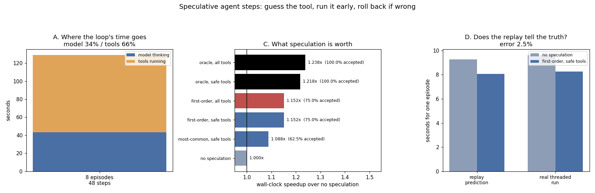

# Speculative Agent Steps

---

> A real [agent](/shared/glossary/#agent) loop — 8 tasks, 48 steps, tool choices made by a real 0.5B model — spends **34% of its wall clock waiting for the model to decide** and the rest waiting for tools. Starting the *guessed* tool while the model is still thinking recovers part of that: a first-order Markov table over the previous tool guesses right **75%** of the time and returns **1.152x** end to end, against a perfect oracle's **1.218x** — so a ten-line predictor captures **70% of everything available**. The ceiling is not a tuning failure, it is arithmetic: a correct guess saves exactly `min(model time, tool time)`, and here the model decides in 0.9 s while a `read_file` takes 0.3 s, so most hits save 0.3 s and nothing can save more. The replay that produces those numbers is checked against a **real threaded run** — actual worker threads, actual overlap — and lands within **2.5%** (1.163x measured against 1.149x predicted). Then the finding that decides whether you may do this at all: only **2 of 48 steps** call a tool that changes something, so extending speculation to mutating tools is worth **+0.000x** — the entire risk of an unwanted write, for none of the reward.

---

## Key Insight

This project takes the guess-and-verify idea behind [speculative decoding](/shared/glossary/#speculative-decoding) and lifts it up a level: inside an [agent](/shared/glossary/#agent) loop, it speculatively runs the most likely next [tool call](/shared/glossary/#tool-call) *before* the model has finished deciding, then verifies the choice and rolls back the work if the guess was wrong. The agent's idle time — waiting on the model to think — becomes useful work done ahead of time.

## Why This Matters

Agent loops spend a lot of time stalled: waiting for the model to choose a tool, then waiting for that tool to return. Anywhere you can *guess and verify*, you can hide that latency, exactly as speculative decoding hides decode latency. This project generalizes the most reliable "free" trick in inference from single tokens to whole agent steps — a frontier the field is actively exploring.

---

**This is project 73.**

### The words first

- **[Speculative execution](/shared/glossary/#speculative-execution)** — doing work before you know it is needed, then keeping it if it was and discarding it if it was not. CPUs have done this past unresolved branches since the 1990s; [speculative decoding](/shared/glossary/#speculative-decoding) does it for tokens; this project does it for tool calls.
- **Acceptance rate** — how often the guess was right. The single number that decides whether speculation pays.
- **[Idempotent](/shared/glossary/#idempotent) / read-only tool** — one you can run twice with no extra consequence (`read_file`, `search`, `run_tests`). Its opposite has a **side effect** (`write_file`, `git_commit`) and cannot be speculated, because a wrong guess cannot be taken back.
- **First-order Markov predictor** — guesses the next tool from the previous one and nothing else ("first-order" = one step of history). A table of counts; roughly ten lines of code.
- **Replay** — reconstructing a timeline from measured per-step durations instead of re-running the whole loop. It makes six policies comparable on identical decisions; section D checks that it does not lie.

### "Speculative decoding already exists. Isn't this the same thing?"

Same idea, different unit, and the difference in unit changes two things that matter.

[Speculative decoding](/shared/glossary/#speculative-decoding) guesses **tokens** and verifies them with a single forward pass of the big model — verification is cheap, exact, and the wrong guesses cost only some arithmetic that was discarded. That is why it is the guide's rare "free" win ([project 23](../23-greedy-speculative-decoding/README.md)).

Guessing an **agent step** changes both halves:

1. **Verification is free but the work is not.** Checking the guess costs nothing (compare two strings), but the speculated work is a real tool invocation — a process, a network call, a test suite. A wrong guess spends real seconds of a real machine's time. This project measures the waste: 2.17 s across 24 steps for the winning policy.
2. **The work may not be undoable.** A discarded token is a discarded tensor. A discarded `git commit` is a commit. That is section E, and it is the reason the default policy here refuses to speculate anything that writes.

What survives unchanged is the *shape* of the trade: speculate, measure acceptance, and check that the wasted work is cheaper than the hidden latency.

### "Why not just make the model choose faster?"

Because that is a different (and harder) project, and speculation attacks the part that is left over after you have. The model's decision is 0.9 s here; even if it were free, the tools would still take 85.7 s of the 128.9 s total. Speculation does not make anything faster — **it overlaps two things that were happening one after the other**, and its ceiling is exactly the smaller of the two.

---

## Running it

```bash
python3 run.py           # ~4 minutes
python3 run.py --plot    # redraw from outputs/findings.json
```

Needs `torch`, `transformers`, `matplotlib`. The model is Qwen2.5-0.5B-Instruct, choosing among six tools with realistic latencies (`list_dir` 0.1 s … `run_tests` 4.0 s). Tools are simulated by sleeping for their latency, which is what makes the threaded validation in section D honest: a sleeping thread consumes no CPU, so the overlap being measured is real and is not competing with the model for cores.

> **About the numbers.** 8 tasks × 6 steps = 48 real agent decisions; predictors are fitted on the first 4 episodes and scored on the last 4 (24 held-out steps). Sections A–C and E come from one recorded run replayed under six policies; section D re-runs one episode for real, twice. Committed in [`outputs/findings.json`](outputs/findings.json).



---

## A. Where an agent loop's time goes

| | seconds | share |
|---|---|---|
| model deciding which tool to call | **43.2 s** | 34% |
| tools running | 85.7 s | 66% |
| **total** | 128.9 s | |

Mean decision: **0.90 s** for **8.8 generated tokens** (p95 1.82 s). Mean tool: 1.79 s.

**34% of the loop is the model thinking about what to do next, not doing it.** That is the opportunity: during those 43.2 seconds the tools are idle, and during the 85.7 seconds of tool time the model is idle. They are strictly sequential, and nothing about the problem requires that.

The tool mix the model actually chose is worth reporting, because it drives everything downstream:

| tool | times chosen | latency | read-only |
|---|---|---|---|
| `read_file` | **27** | 0.3 s | yes |
| `run_tests` | **19** | 4.0 s | yes |
| `git_commit` | 2 | 0.8 s | **no** |
| `list_dir`, `search`, `write_file` | 0 | — | |

**A 0.5B model driving an agent is extremely repetitive**: it used three of six available tools, and two of them account for 96% of the steps. Whole episodes are a single tool repeated (`run_tests` × 6 in one case). That is a real property of small agent models — and it is exactly what makes the next section work. Speculation feeds on predictability, and a weak model is very predictable.

---

## B. Is the next tool guessable?

Predictors fitted on 4 episodes, scored on the 4 the fitting never saw (24 steps):

| predictor | held-out accuracy |
|---|---|
| always guess the most common tool | 62.5% |
| **previous tool → most likely next (first-order)** | **75.0%** |
| oracle (cheating) | 100% |

The fitted table is small enough to print, and reading it is the explanation of the accuracy:

| after… | the model chose |
|---|---|
| *(start)* | `read_file` 2, `run_tests` 2 |
| `read_file` | **`read_file` 8**, `run_tests` 2 |
| `run_tests` | **`run_tests` 6**, `read_file` 2, `git_commit` 1 |
| `git_commit` | `run_tests` 1 |

**The dominant pattern is "keep doing what you were doing"** — 8 of 10 after `read_file`, 6 of 9 after `run_tests`. One step of history is worth **12.5 accuracy points** over ignoring history entirely (75.0% against 62.5%), and there is no reason to expect a second step of history to add much on top: the table's rows are already dominated by a single entry.

**A cheap predictor is the right shape for this job.** It has to run *before* the model's decision, which means it must not use the model — anything as expensive as the thing it is racing has already lost. Ten lines of counting is the correct amount of engineering here.

---

## C. What speculation is worth

Six policies over the four held-out episodes. The rule for each step: the speculated tool starts when the model starts thinking, so a hit costs `max(model, tool)` instead of `model + tool`, and a miss costs the full sum plus the wasted tool-seconds.

| policy | wall clock | speedup | accepted | wasted tool-seconds | unwanted writes |
|---|---|---|---|---|---|
| no speculation | 55.71 s | 1.000x | — | 0 | 0 |
| most-common guess, read-only tools | 51.21 s | 1.088x | 62.5% | 2.70 s | 0 |
| **first-order, read-only tools** | **48.34 s** | **1.152x** | **75.0%** | 2.17 s | 0 |
| first-order, all tools including writes | 48.34 s | 1.152x | 75.0% | 2.17 s | 0 |
| oracle, read-only tools | 45.74 s | 1.218x | 100% | 0 | 0 |
| oracle, all tools | 45.01 s | 1.238x | 100% | 0 | 0 |

**The realistic policy gets 1.152x and the perfect one gets 1.218x** — so 75% acceptance captures **70% of the maximum available**. Acceptance and speedup are not proportional: going from 62.5% to 75% acceptance moved the speedup from 1.088x to 1.152x, and the last 25 points of acceptance are worth only 0.066x more.

### The ceiling is arithmetic, not effort

A correct guess saves **`min(model time, tool time)`** — the two only overlap while both are running. With a 0.9 s decision:

- `read_file` (0.3 s): a hit saves 0.3 s. The model is still the bottleneck.
- `run_tests` (4.0 s): a hit saves 0.9 s, not 4.0. The tool is still the bottleneck.

Summing that over the tool mix gives about 25 s of the 129 s total — and the oracle measures 1.218x, which is exactly it. **Nothing in the design of the predictor can beat that number.** If you want more, the levers are elsewhere: a faster decision (smaller model, fewer tokens, constrained decoding) raises the ceiling for cheap tools, and speculating *further ahead* — two steps, not one — raises it for expensive ones.

This is the same shape as [project 28](../28-speculation-batching/README.md)'s result for token-level speculation, where the speedup collapsed from 1.70x to 1.07x as batching changed what the bottleneck was. **Speculation is never a speed-up of the work; it is an overlap of two waits, and it is capped by the shorter one.**

### The wasted work is small, and it is not free

The winning policy wastes **2.17 tool-seconds** across 24 steps — about 4% of the tool time. It is charged to the machine, not to the user: the wall clock in the table excludes abandoned work, because a real server abandons it and moves on. On a busy fleet that distinction matters, and the right way to price speculation is on both axes at once: **1.152x of latency for 4% more tool work**. If tools cost money (an API call, a GPU-backed retrieval, a CI runner), that 4% has a real invoice, and the trade is not automatically good.

---

## D. Does the replay tell the truth?

Sections A–C come from a *replay*: measured per-step durations reassembled into a timeline. That is what makes six policies comparable on identical decisions, and it is also exactly the kind of model that can be quietly wrong.

So one episode was run for real — a `ThreadPoolExecutor` starting the speculated tool while the model generates in the main thread — twice, with and without speculation:

| | without speculation | with first-order speculation | speedup |
|---|---|---|---|
| **real threaded run** | 9.62 s | 8.27 s | **1.163x** |
| replay prediction | 9.26 s | 8.06 s | 1.149x |

**Error: 2.5%**, with 4 of 6 guesses accepted in the real run. The replay is telling the truth.

That agreement is not automatic, and getting there fixed a real bug worth repeating. The first threaded implementation measured the speculative run as **16% slower** than the baseline. The cause was the measurement, not the mechanism: the timer stopped when the thread pool drained, so a mispredicted `run_tests` still sleeping in a worker was charged to the user's wall clock. **A real server abandons that work and returns; the user does not wait for a guess that was wrong.** Stopping the clock when the agent finishes its last step — and accounting the abandoned seconds separately as waste — is what turned 0.85x into 1.16x.

The general lesson is a familiar one from [project 60](../60-synthetic-load-tests/README.md): **an experiment that keeps the harness in the measurement measures the harness.** Speculation's whole premise is that wasted work happens off the critical path; a benchmark that puts it back on the critical path cannot see the benefit.

---

## E. The rule that decides whether you may do this at all

| | count | share |
|---|---|---|
| steps calling a read-only tool | 46 | 96% |
| steps calling a mutating tool (`git_commit`) | **2** | 4% |

Speculating the mutating tools too: **+0.000x speedup, 0 spurious writes** in this run.

Zero spurious writes only because the predictor never guessed `git_commit` — after seeing it once in training, the table's only entry for it points elsewhere. The important number is the other one. **Extending speculation to mutating tools bought exactly nothing**, because mutations are 4% of the steps, and each one has a modest latency (0.8 s) against a 0.9 s decision.

So the safety rule costs nothing to follow:

> **Speculate read-only tools. Never speculate a tool that changes something.**

Notice how the arithmetic and the safety argument agree, which is the comfortable case. They will not always: an agent whose expensive step is a *write* (a large upload, a slow database migration) would show a real speedup for speculating it, and then the choice is a genuine one — and the answer is still no, unless the tool has a transaction you can roll back. **"Verify and roll back" is easy to say about tokens and hard to implement about the world.** A wrongly speculated commit is not undone by discarding a variable; it is undone by another commit, which is a different thing entirely.

The distinction to hold on to: token-level speculation is **provably** output-identical ([project 23](../23-greedy-speculative-decoding/README.md) verifies this to the last logit). Agent-level speculation is output-identical **only if every speculated action is idempotent**. Same idea, one extra precondition — and that precondition is a property of your tools, not of your serving stack.

---

## What to take from this

1. **34% of an agent loop's wall clock is the model deciding** what to do next. That is the window speculation can hide.
2. **A first-order Markov table hits 75%** on held-out episodes; one step of history is worth 12.5 points over none.
3. **1.152x realistic against 1.218x oracle** — a ten-line predictor captures 70% of everything available.
4. **A hit saves `min(model, tool)` and nothing more.** Cheap tools are capped by their own duration, expensive ones by the model's.
5. **Acceptance and speedup are not proportional**: +12.5 points of acceptance bought +0.064x, and the last 25 points bought +0.066x.
6. **The replay was validated against a real threaded run to 2.5%.** Do this before trusting any simulated timeline.
7. **Charging abandoned speculative work to the user's clock made speculation look 16% *slower*.** A real server abandons it; measure the same way.
8. **Wasted work is 4% of tool time.** Speculation trades a small amount of machine work for latency; price both.
9. **Only 4% of steps mutate anything, and speculating them is worth +0.000x.** All of the risk, none of the reward.
10. **Small agent models are highly repetitive** — three of six tools, 96% of steps in two of them — which is what makes them predictable enough to speculate at all.

### Common traps this project walks into on purpose

- **Timing the thread pool instead of the agent.** Abandoned work is not the user's wait.
- **Assuming speculation speeds up the work.** It overlaps two waits and is capped by the shorter one.
- **Reading a high acceptance rate as a high speedup.** They are related by `min(model, tool)`, not by proportion.
- **Speculating with a predictor that costs as much as the decision.** It has to be cheap or it has already lost the race.
- **Ignoring the wasted tool-seconds** because they are off the critical path — they are still on the invoice.
- **Assuming "verify and roll back" transfers from tokens to actions.** Only for idempotent actions.
- **Fitting the predictor on the episodes you score it on.** Held-out here; in-fold accuracy would flatter it.

---

## The end of the phase, and of the guide

Seven projects at the frontier of the serving stack, each ending with a measurement that a plausible design document would have gotten backwards:

| project | the number worth remembering |
|---|---|
| [67 reasoning-model serving](../67-reasoning-model-serving/README.md) | switching on thinking took the same traffic from **0.60 to 3.76 utilisation**; a hard budget scored **40%** where *asking* for brevity scored **80%** at the same length |
| [68 stateful sessions](../68-stateful-sessions/README.md) | restoring an offloaded cache is **315x** cheaper than recomputing it, the crossover is `bytes/token × prefill tok/s`, and the eviction *policy* was worth **2.2%** against the destination's 1.43x |
| [69 router model](../69-router-model/README.md) | an oracle router saves **62%**, and **every deployable router lost to a coin flip** — because difficulty is not repairability |
| [70 MoE serving](../70-moe-serving/README.md) | mean expert imbalance **2.69x**, batching cures it only to **2.70x**, and four very different workloads route **0.0027 bits** apart |
| [71 FP4 inference](../71-fp4-blackwell-inference/README.md) | 4-bit *activations* span **1.56x to 116,000x** perplexity depending only on how the scales are shared; rotation is worth **388x** at one granularity and nothing at another |
| [72 on-device build](../72-on-device-build/README.md) | 4-bit weights made decode **2.79x** faster and prefill **0%** faster; swapping runtimes at equal precision was worth **1.14x** |
| **73 speculative agent steps** | **1.152x** from a ten-line predictor, capped by `min(model, tool)`, validated to **2.5%** against real threads |

The through-line of the phase is the guide's closing argument. **Every frontier idea here is a bet about where the time and the memory actually go, and every one of those bets is checkable on a laptop.** Reasoning models are an output-length problem. Sessions are a memory-destination problem. Routers are a label problem. MoE is a load-balance problem. FP4 is a scale-granularity problem. On-device is a bits problem. Speculation is an overlap problem. None of them needed a data centre to be measured — they needed a control, an honest denominator, and the willingness to publish the result when it went the other way.

That is the habit this guide was built to leave you with. The engines will change; vLLM's scheduler will be rewritten, Blackwell will be superseded, the next generation of models will break some assumption in every phase above. What does not change is the method: **find the two numbers that govern the system, measure them under conditions that look like production, and check the obvious explanation against a control before believing it.** Every project in these ten phases is one instance of that, and the last one is no different — a 1.152x speedup, an arithmetic ceiling that explains it, and a validation run that caught the measurement being wrong before the conclusion was.

Where to go from here: the [Suggested Timeline](../../README.md#suggested-timeline) recommends picking one frontier thread and going deep. The engines listed in [Engines You Should Read](../../README.md#engines-you-should-read) are the best next step — their schedulers and cache managers are the production versions of everything built here from scratch, and after these seventy-three projects they will read like code rather than like magic.
