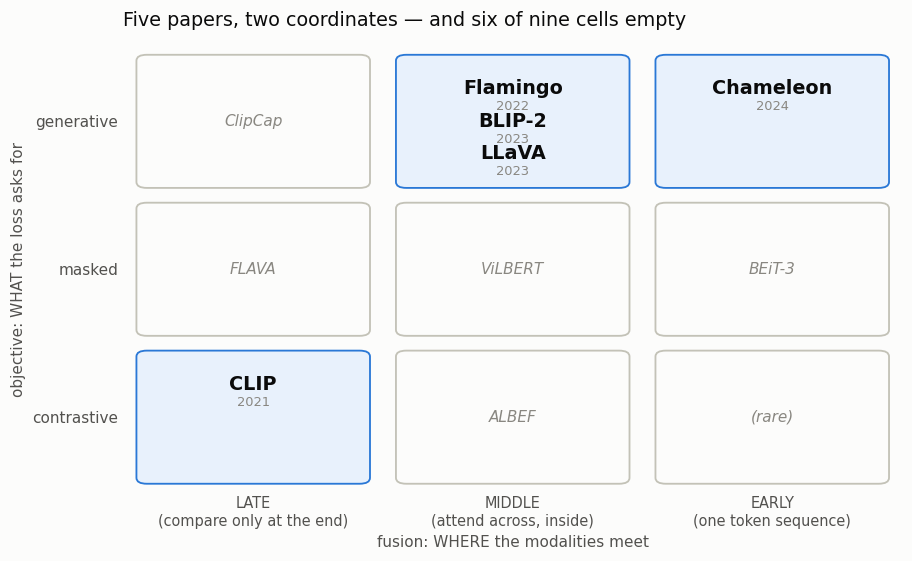
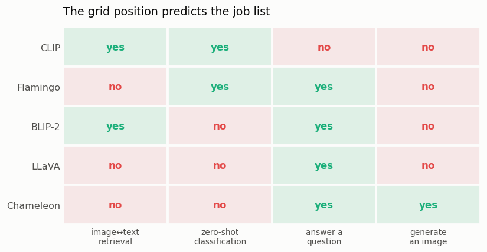
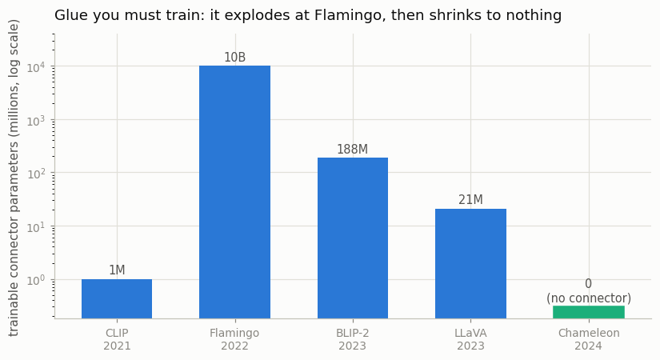

# Modality Survey

## Key Insight

Almost every [multimodal](/shared/glossary/#modality) paper can be pinned down by two coordinates: *how* it joins the modalities — its [fusion](/shared/glossary/#fusion-earlymiddlelate) point — and *what* objective trains it, whether [contrastive](/shared/glossary/#infonce), masked (hide part of the input and predict the missing piece), or generative (predict the next token). Read through that lens, the field stops being a flood of unrelated names and becomes a small grid of recombinations: a [dual encoder](/shared/glossary/#dual-encoder) like [CLIP](/shared/glossary/#clip) sits at "late + contrastive," a vision-language model like [LLaVA](/shared/glossary/#llava) at "middle + generative," and an early-fusion model like [Chameleon](/shared/glossary/#chameleon) at "early + generative." Forcing yourself to read five real papers and write down those two coordinates for each builds the single most useful habit for staying oriented as new models arrive almost every week.

## What this project actually does

There is no model to train here — this is the reading project. What turns it from
"read five papers" into something you can check is that the survey is written as
**data, not prose**: `papers.py` holds one dictionary per paper with the same
fields for all five, and `survey.py` reads that table and draws it.

Why bother writing it as code when you could just write five paragraphs? Because
a paragraph lets you dodge. If a paper does not fit your category, prose lets you
write "sort of a hybrid" and move on; a table field forces you to pick one. Being
forced to pick is what makes the *pattern* visible, and the pattern is the point.

The five papers are the ones the rest of this guide keeps referring back to:

| paper | year | fusion | objective | glue you must train |
|---|---|---|---|---|
| [CLIP](https://arxiv.org/abs/2103.00020) | 2021 | late | contrastive | ~1M (two linear layers) |
| [Flamingo](https://arxiv.org/abs/2204.14198) | 2022 | middle | generative | ~10B |
| [BLIP-2](https://arxiv.org/abs/2301.12597) | 2023 | middle | generative | 188M (a [Q-Former](/shared/glossary/#q-former)) |
| [LLaVA](https://arxiv.org/abs/2304.08485) | 2023 | middle | generative | 21M (an MLP [projector](/shared/glossary/#projector)) |
| [Chameleon](https://arxiv.org/abs/2405.09818) | 2024 | early | generative | none |

## Decoding the two coordinate names

**Fusion** is a word borrowed from sensor engineering: combining several sources
into one picture. "Early / middle / late" says *at which point in the network*
that combining happens.

- **Late fusion** — each modality is encoded completely on its own, and the two
  results only meet at the final comparison. CLIP's image tower never sees a
  single word.
- **Middle fusion** — separate encoders, but somewhere inside the network one
  modality is allowed to look at the other, usually via
  [cross-attention](/shared/glossary/#cross-attention).
- **Early fusion** — there is no "each modality" any more. Everything is turned
  into [tokens](/shared/glossary/#token-visualaudio) of one sequence at step one,
  and a single stack processes them together from the first layer.

**Objective** is what the loss function asks the model to do:

- **Contrastive** — literally "by contrast". The model is never told what the
  right answer *is*, only which pairing is right *compared to* the wrong ones in
  the same batch: pull the true pair together, push the rest apart.
- **Masked** — hide part of the input, predict the hidden part. Named after the
  *mask* you place over the hidden tokens.
- **Generative** — predict the next token, over and over. The technical name is
  [autoregressive](/shared/glossary/#autoregressive-model): *auto* = self,
  *regress* = predict from earlier values, so the model predicts its next piece
  from the pieces it has already produced itself.

## The grid, filled in



Two things to notice, and the second is the interesting one.

**First, the papers really do land on distinct squares.** They are not five
variations of one design; they are three genuinely different answers to "where do
the modalities meet".

**Second, six of the nine squares are empty.** The italic grey names are real
models that *do* live there — FLAVA, ViLBERT, BEiT-3 — but none of them is what
you would reach for today. The whole **masked** row emptied out. That row was the
mainstream direction in 2019–2021, when multimodal models were built by copying
BERT's "hide a word, predict it" recipe. It lost, for a reason worth
internalising: masked training teaches a model to *fill in blanks*, but the two
things people actually want are *matching* (retrieval, filtering) and *talking*
(answering questions), and contrastive and generative losses train those two
directly instead of hoping they emerge from blank-filling.

## The grid position predicts what the model can do



This is the payoff of the exercise. You do not have to memorise five feature
lists — the coordinates imply them:

- **Late + contrastive → good at comparing, incapable of talking.** CLIP produces
  one vector per item and nothing else. That is enough to rank a photo against a
  million captions ([cross-modal retrieval](/shared/glossary/#cross-modal-retrieval))
  and enough to classify by comparing against label phrases
  ([zero-shot](/shared/glossary/#zero-shot)) — and it is structurally unable to
  emit a sentence, because a single vector is not a sequence.
- **Middle + generative → can talk, cannot search cheaply.** Flamingo, BLIP-2 and
  LLaVA all end in a language model, so they answer questions. But they have no
  single "image vector" you can compute once and store, so ranking a million
  images would mean running the whole model a million times *per query*. BLIP-2
  is the exception with a "yes" in the retrieval column, and only because its
  Q-Former was *also* trained with a contrastive term in stage 1 — the capability
  tracks the loss, not the architecture.
- **Early + generative → the only one that can output an image.** Chameleon's
  image codes are tokens in the same vocabulary as words, so "predict the next
  token" can produce a picture. The others physically cannot: their output layer
  contains only word tokens.

## The cost of being multimodal, and how it collapsed



Every middle-fusion design has to answer the same awkward question. The image
encoder was trained separately from the language model, so their internal vectors
are mutually meaningless — the encoder's 1,024 numbers per patch are not word
embeddings and the language model has never seen anything like them. Something
must translate. That something is the **connector**, and it is the only part you
are forced to train yourself; both towers can be downloaded ready-made.

Read the bars left to right, ignoring CLIP (which needs no connector at all,
because its two towers never meet):

- **Flamingo, 2022 — ~10B trainable parameters.** It inserts whole new
  cross-attention layers between the frozen language model's existing layers.
  Each new layer sits behind a [gate](/shared/glossary/#gated) initialised to
  zero, so at the very first step the model is *exactly* the original text-only
  LM and nothing is broken; the gate opens gradually as training discovers the
  visual signal is worth listening to.
- **BLIP-2, 2023 — 188M.** Replaces all that with 32 learnable query vectors that
  cross-attend to the image and hand the LM exactly 32 "tokens". About 50×
  cheaper.
- **LLaVA, 2023 — 21M.** Replaces even that with a two-layer MLP. The image
  simply becomes a run of extra "words" spliced into the prompt. Another 10×
  cheaper.
- **Chameleon, 2024 — zero.** There is no seam to bridge, because there were
  never two separate towers.

In plain terms: **between 2022 and 2024 the amount of custom machinery needed to
make a model see fell by roughly a factor of 500, and quality did not fall with
it.** What replaced the machinery was data — LLaVA's real contribution was 665k
GPT-4-written visual instructions, not its projector.

The catch is that Chameleon's "zero" is not free, it is *relocated*. Nothing is
downloadable any more, so everything is trained from scratch on ~9.2 trillion
tokens. The cost did not vanish; it moved from the connector to the pretraining
bill.

## "Isn't a vision encoder already free? Why would anyone throw one away?"

A reasonable beginner objection to Chameleon: CLIP-style image encoders work
well, cost nothing to download, and are already good at seeing. Why make a model
relearn vision from raw pixels?

Because a frozen encoder does two jobs and only one of them is wanted. It gives
you good features — and it also **fixes what the model is allowed to notice**.
Whatever CLIP's contrastive training decided was worth keeping is kept, and
everything it discarded is gone before the language model ever sees the image.
That is fine for describing a photo and bad for reading small text inside one,
which is why OCR is a classic weak spot of bolt-on VLMs. A frozen tower is also
one-directional: it turns pixels into features and can never turn features back
into pixels, so a model built on one can never *draw*. Early fusion pays an
enormous training bill to buy back both properties.

Note the asymmetry this creates. The frozen encoder in a VLM and the encoder
inside CLIP are the same object doing *different* jobs: in CLIP it is half of a
matching system and its output is compared to text; in LLaVA it is a fixed
feature source whose output is translated into the LLM's vocabulary and never
compared to anything. That is why "LLaVA uses CLIP" does not mean "LLaVA can do
what CLIP does" — see the retrieval column above.

## What's in this directory

| file | what it is |
|---|---|
| `papers.py` | the five papers as a table: coordinates, what is frozen, connector size, capabilities, and a paragraph each |
| `survey.py` | reads that table, draws the three figures, writes the markdown survey |
| `plot_style.py` | shared figure styling, imported by projects 02 and 03 |
| `outputs/survey.md` | the generated survey — the table plus five one-paragraph summaries |
| `outputs/taxonomy_grid.png` | the 3×3 fusion × objective grid |
| `outputs/capability_matrix.png` | which of the four canonical jobs each model can do |
| `outputs/glue_cost.png` | trainable connector size by year |

## How to run

```bash
python3 survey.py     # ~1 second; no model, no data, no network
```

To extend the survey, add a dictionary to `PAPERS` in `papers.py` and re-run —
every figure and the markdown update themselves. That is the whole reason for
keeping the survey as data.

## Takeaways

1. **Two coordinates explain most of the field.** Where the modalities meet
   (fusion) and what the loss asks for (objective) are enough to predict what a
   multimodal model can and cannot do.
2. **The grid is sparse, and the empty cells are informative.** Six of nine
   squares hold nothing you would build today; the entire masked row lost to
   contrastive and generative training.
3. **Capability follows the objective, not the architecture.** BLIP-2 can do
   retrieval only because it was *also* trained contrastively; Chameleon can draw
   only because image codes live in its output vocabulary.
4. **The connector shrank ~500× in two years and the models got better.** Simpler
   glue plus better data beat cleverer glue — the same lesson recurs in
   [Phase 4](../../README.md#phase-4-fusion-architectures--how-modalities-talk-to-each-other)
   and [Phase 5](../../README.md#phase-5-vision-language-models-vlms).
5. Project [02](../02-visualize-the-modality-gap/README.md) takes the bottom-left
   square of this grid — CLIP, late + contrastive — and looks at what its shared
   space actually looks like from the inside. It is not what the diagrams
   suggest.
