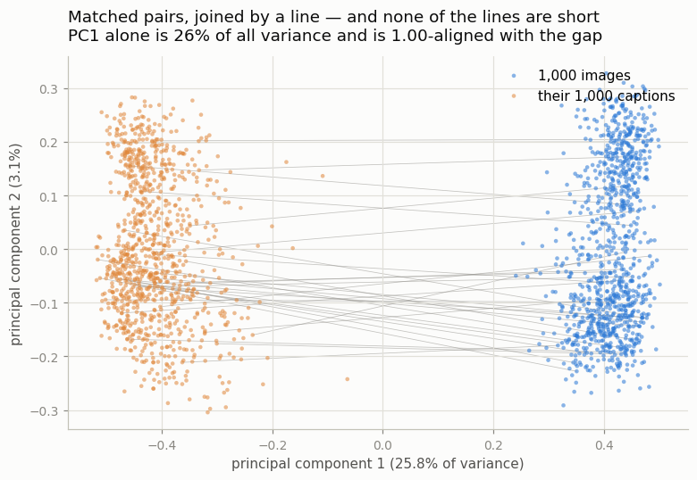
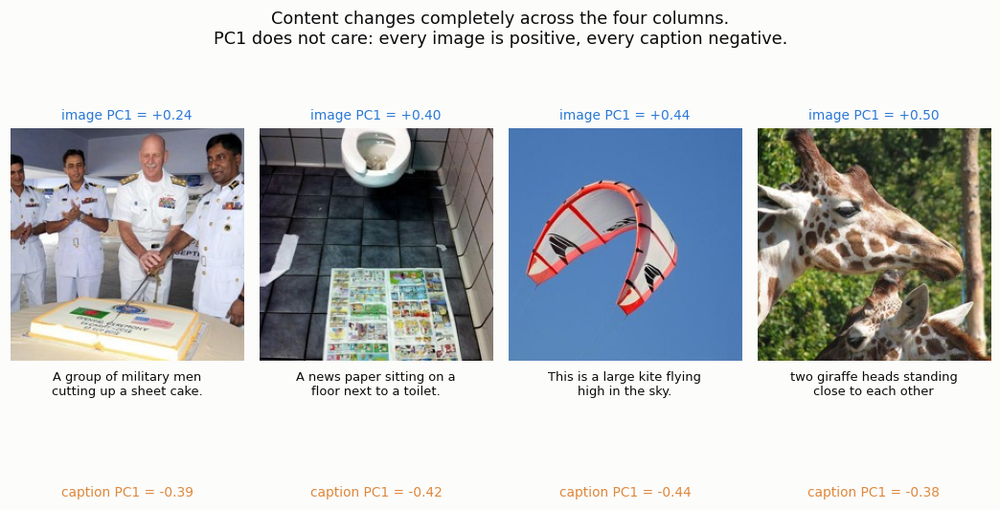
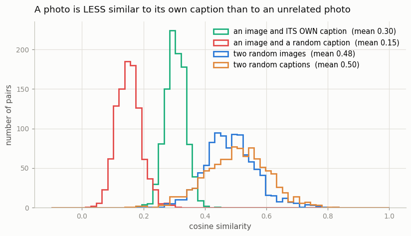
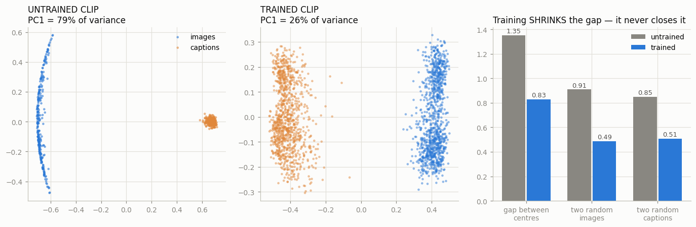
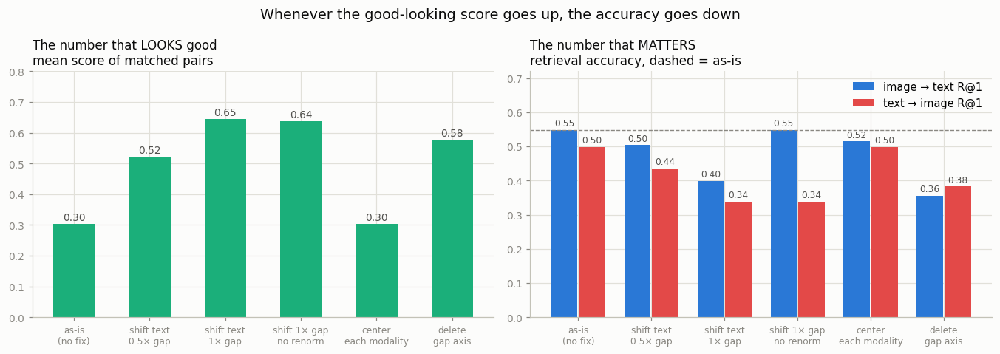

# Visualize the Modality Gap

## Key Insight

[CLIP](/shared/glossary/#clip) is trained to drop an image and its caption onto the *same* spot in a shared space, so you might expect the picture of a dog and the words "a dog" to land right on top of each other. They do not. If you encode 1,000 images and 1,000 captions and squash all 2,000 [embeddings](/shared/glossary/#embedding) down to a 2D plot with [PCA](/shared/glossary/#pca-principal-component-analysis), you will see the [modality gap](/shared/glossary/#modality-gap). Seeing the gap with your own eyes explains a string of later surprises: why [cosine similarity](/shared/glossary/#cosine-similarity) scores between correctly matched image–text pairs are lower than you would guess, and why some retrieval and generation methods add a correction step that shifts one modality toward the other to close it. That last part comes with a warning this project measures directly: closing the gap makes the similarity numbers look much better and makes retrieval accuracy strictly *worse*.

## The setup

- **Model:** the real `openai/clip-vit-base-patch32`, downloaded once and
  completely [frozen](/shared/glossary/#frozen). Nothing here is trained; the
  whole project is measurement.
- **Data:** 1,000 [COCO](/shared/glossary/#coco) test images with their human
  captions (COCO ships 5 per image; we use the first one, except where stated).
- **Cost:** about two minutes end to end on a CPU — ~40 s to download the images,
  ~40 s to encode all 2,000 items, seconds for everything else.

Every number below is in `outputs/`, and every figure is redrawn from those files
by `run.py --stage figures`.

## Step 1: the two clouds do not overlap



Each dot is one item, projected onto its top two principal components — the two
directions along which the 2,000 vectors vary most. Blue dots are photos, orange
dots are the captions of *those same photos*. The thin grey lines join 30 matched
pairs.

Every line crosses an empty corridor. Not one image sits among the captions.

This is worth pausing on, because it looks like the training failed. It did not.
CLIP's loss never asked for images and captions to occupy the same region — it
asked, for each image, that *its own* caption score higher than the other 999
captions in the batch. That is a **ranking** requirement, and a ranking survives
perfectly well if you slide all the captions a metre to the left. Nothing in the
loss penalises the corridor.

## Step 2: the separation is the single biggest thing in the data

The header of that figure has the real result:

- **PC1 alone accounts for 25.8% of the total variance** of all 2,000 vectors.
  (Variance here just means "spread". PC1 is the single direction along which the
  data spreads out most, and it holds a quarter of all the spread; PC2, the
  next-best direction, holds only 3.1% — eight times less.)
- **PC1 is 0.9998-aligned with the gap direction.** We computed the gap direction
  independently — average all the image vectors, average all the caption vectors,
  subtract — and it turns out to be the same arrow PCA found. A
  [cosine similarity](/shared/glossary/#cosine-similarity) of 0.9998 between two
  unit arrows means they point the same way to within a fraction of a degree.

Put together: *if you ask "what is the biggest way in which these 2,000 vectors
differ from each other?", the answer is not "some are about dogs and some about
kitchens". The answer is "some are pictures and some are sentences".* Content —
the thing CLIP is supposed to encode — is only the second-biggest effect.



Four items, ordered by their PC1 value. The photos range from a cake ceremony to
a giraffe; the captions describe exactly those things. PC1 is blind to all of it:
every image is positive (+0.24 to +0.50), every caption negative (−0.38 to
−0.44), and the ordering *within* each group is unrelated to what the picture
shows.

## Step 3: the numbers this makes strange



Four distributions of cosine similarity, and the headline is the crossing:

| what is compared | mean cosine |
|---|---|
| an image and **its own** caption | **0.30** |
| an image and a random caption | 0.15 |
| two random, unrelated **images** | **0.49** |
| two random, unrelated **captions** | 0.51 |

**A photo of a giraffe is more similar to an unrelated photo of a bathroom (0.49)
than it is to its own caption (0.30).** If you have ever set a CLIP-score
threshold and been baffled that "good" matches score 0.3 while you expected 0.9,
this is why. The absolute value of a CLIP score is close to meaningless; only the
comparison against *other candidates of the same modality* means anything. This
is exactly why [CLIP-score data filtering](../../README.md#phase-3-contrastive-learning--clip-and-friends)
keeps "the top 30%" rather than "everything above 0.5".

## Step 4: training did not cause the gap — it inherited it

Here is the experiment that explains where the gap comes from. Build the *same
CLIP architecture* with random weights, train it for exactly zero steps, and
encode the same 300 images and captions.



| | untrained CLIP | trained CLIP |
|---|---|---|
| two random images | **0.91** | 0.49 |
| two random captions | **0.85** | 0.51 |
| distance between the cloud centres | **1.35** | 0.83 |
| share of variance on PC1 | **79%** | 26% |

Read the left panel: the untrained image tower has collapsed all 300 photos onto
a thin arc, and the untrained text tower has collapsed all 300 captions onto a
single dot. Two *unrelated* photos already score 0.91 similarity before the model
has learned anything at all.

This is the [cone effect](/shared/glossary/#cone-effect), and the name is
literal. Draw every output vector as an arrow from the origin: instead of
spreading over the whole sphere, a randomly initialized deep network squeezes
them all into one narrow ice-cream cone. Stacked non-linear layers and
[residual connections](/shared/glossary/#residual-connection) each nudge every
input a little toward a shared dominant direction, and the effect compounds with
depth.

Now the crucial part: **the two towers are initialized separately, so they get
two different cones**, pointing in two different directions. That separation
exists before training and is *larger* (1.35) than what survives afterwards
(0.83). Contrastive training spends its effort pulling the cones open — spreading
each modality out from 0.91 to 0.49 internally — and dragging them partly toward
each other. It never finishes the job, because, as Step 1 explained, its loss
gets no credit for finishing.

So the honest summary is: **the gap is not a bug introduced by training. It is a
birthmark of random initialization that training only partially removes.**

## Step 5: closing the gap makes things worse

The obvious fix is to just push the two clouds together. This is the interesting
part of the project, because it does not work — and it fails in a way that
teaches you what cosine similarity actually is.

We try five interventions and score each one two ways: the **matched-pair score**
(the pretty number, what a paper would quote) and
**[Recall@1](/shared/glossary/#recall-at-k)** (given a photo, is its true caption
ranked first out of 1,000 — the number a user experiences).



| intervention | matched score | gap | image→text R@1 | text→image R@1 |
|---|---|---|---|---|
| as-is (no fix) | 0.30 | 0.83 | **0.549** | **0.499** |
| slide captions halfway | 0.52 | 0.42 | 0.504 | 0.436 |
| slide captions all the way | 0.65 | 0.01 | 0.399 | 0.338 |
| slide all the way, skip re-normalizing | 0.64 | 0.00 | **0.549** | 0.338 |
| centre each modality on its own mean | 0.30 | 0.02 | 0.515 | 0.498 |
| delete the gap axis entirely | 0.58 | 0.01 | 0.356 | 0.383 |

Read the two halves against each other and the pattern is exact: **every
intervention that raises the good-looking score lowers the accuracy, and the one
that leaves accuracy nearly intact is the one that does not raise the score at
all.** Sliding the captions onto the images more than doubles the matched-pair
number (0.30 → 0.65) — and costs 15 points of Recall@1 (0.549 → 0.399). Deleting
the gap direction outright, 1 of 512 dimensions, costs 19 points. Centring, the
only intervention that keeps R@1 within 3 points, leaves the matched score
unchanged at 0.30. There is no row where the pretty number goes up for free.

### Why moving the cloud can hurt at all

The mechanism is worth understanding, because it is a property of cosine
similarity that trips people up everywhere, not just here.

**Cosine similarity measures angles, and angles are not preserved when you move
things.** Slide the whole caption cloud one step to the right and every
image-to-caption *angle* changes, each by a different amount depending on where
that caption already sat. So a "harmless constant shift" silently reshuffles the
ranking.

The fourth row makes this precise, and it is the sharpest result in the project:

- **Slide the captions by the gap vector but do NOT re-normalize** → image→text
  R@1 is *unchanged*, exactly 0.549. Every caption `t` became `t + g`, so every
  score `i·t` became `i·t + i·g`. For a fixed image `i`, the added term `i·g` is
  the *same* for all 1,000 captions — a constant added to every candidate cannot
  change which one is largest.
- **The same shift, same direction, other query type** → text→image R@1 collapses
  from 0.499 to 0.338. Now the query is `t + g` and the candidates are images
  `i₁ … i₁₀₀₀`. The added term is `g·i`, which is *different for each candidate*.
  Not a constant. Rankings move.
- **Add re-normalizing back in** (row 3) and even the image→text direction breaks,
  because dividing each shifted caption by its own new length is a per-caption
  rescale — again, not a constant.

So the gap is *invisible* to one direction of retrieval and *harmful* to remove
in both. That is a strange, useful fact: **you should not "fix" a geometry your
metric never looked at.**

### The one intervention that is nearly free

Centring each modality on its own mean (row 5) closes the gap from 0.83 to 0.02
while barely touching accuracy (0.549 → 0.515, 0.499 → 0.498) — and, tellingly,
without raising the matched-pair score either (0.304 → 0.304). Intuition for why
it is gentler than sliding one cloud into the other: centring translates *both*
clouds to the origin and treats them symmetrically, whereas the slide pushes the
caption cloud into the region the image cloud occupies, so the re-normalization
step afterwards distorts one side far more than the other. If you genuinely need
the clouds overlapped — for visualisation, or to hand embeddings to a downstream
model that expects zero-mean inputs — this is the way to do it. It still costs a
little.

### Is the gap axis pure noise, then?

Almost, but not quite, and the "not quite" is why deleting it hurts. Measured
along the gap direction:

- images sit at +0.40, spread **±0.042**
- captions sit at −0.43, spread **±0.057**
- the two centres are **0.829** apart

The within-modality spread is 15–20× smaller than the between-modality distance,
which works out to roughly **99% of the variance along that axis being nothing
but "am I a picture or a sentence?"**. But the leftover ±0.05 is not zero, and
CLIP's margins are thin — the
gap between a correct caption at 0.33 and a wrong one at 0.33 is often a couple
of hundredths. Wipe out a direction carrying ±0.05 of real per-item signal and
you shuffle exactly those close calls, which is where Recall@1 lives.

## What's in this directory

| file | what it is |
|---|---|
| `clip_lib.py` | the shared Phase-1 backbone: COCO download, frozen CLIP encoding, caching, PCA, Recall@K. Imported by project [03](../03-toy-retrieval/README.md). |
| `run.py` | stages: `data`, `encode`, `cone`, `close`, `figures` |
| `outputs/pca_gap.png` | the two clouds with matched pairs joined |
| `outputs/pc1_examples.png` | what PC1 separates (and does not) |
| `outputs/similarity_histograms.png` | the four cosine distributions |
| `outputs/cone_effect.png` | untrained vs trained CLIP |
| `outputs/closing_the_gap.png` | the four interventions, scored two ways |
| `outputs/gap_stats.json`, `cone_stats.json`, `gap_axis_spread.json`, `closing_the_gap.csv` | every number quoted above |

## How to run

```bash
python3 run.py --stage all       # ~2 min total on CPU, first run
python3 run.py --stage figures   # ~5 s, once the caches exist
```

The first run downloads ~1,000 small JPEGs into `data/` and the CLIP weights into
the usual Hugging Face cache. Embeddings are cached as `.npz`, so every later
stage is instant. `data/` is gitignored; delete it to start over.

## Takeaways

1. **The shared space is not shared.** Images and captions occupy two separated
   regions, and that separation is the largest single direction of variation in
   the data — bigger than any content difference.
2. **CLIP's loss never asked for overlap.** It asked for a *ranking*, and a
   ranking is unchanged by sliding one modality's whole cloud. The geometry is a
   consequence of what the loss ignores.
3. **Absolute CLIP scores are close to meaningless.** A photo scores 0.30 against
   its own caption and 0.49 against an unrelated photo. Only comparisons within
   one modality-pair carry information.
4. **The gap is inherited, not learned.** An untrained CLIP has a *bigger* gap
   (1.35 vs 0.83) because each tower starts life squeezed into its own narrow
   [cone](/shared/glossary/#cone-effect). Training shrinks the gap; it does not
   create it.
5. **Do not fix what the metric never looked at.** Every way of closing the gap
   raised the matched-pair score and lowered retrieval accuracy — by up to 19
   points of Recall@1. A pure translation is provably invisible to one direction
   of retrieval and provably harmful to the other.
6. Project [03](../03-toy-retrieval/README.md) reuses `clip_lib.py` and these
   same embeddings to build the search engine those Recall numbers came from.
