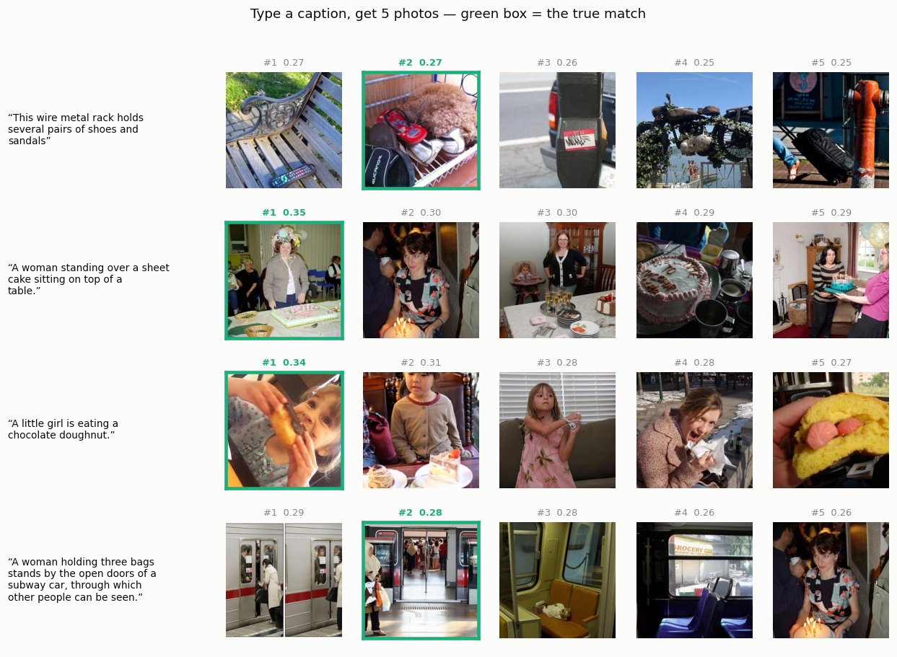
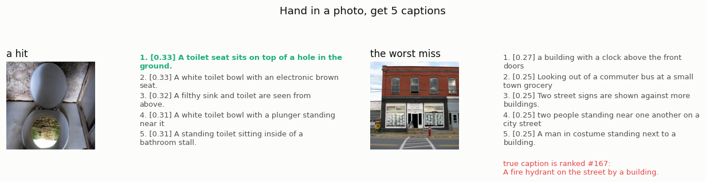
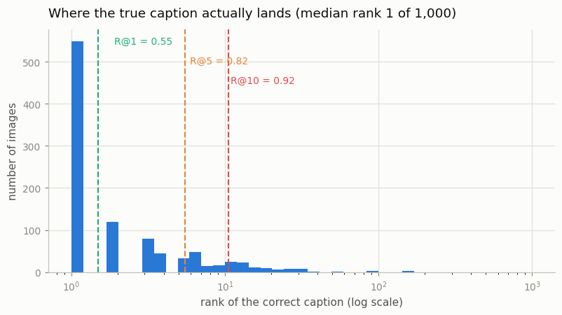
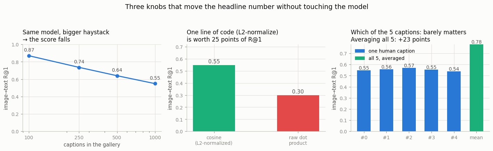

# Toy Retrieval

## Key Insight

[Cross-modal retrieval](/shared/glossary/#cross-modal-retrieval) sounds elaborate but reduces to [nearest-neighbour search](/shared/glossary/#nearest-neighbour-search) in a shared space. You encode a few hundred images and their captions with [CLIP](/shared/glossary/#clip) once, then to serve a query you compare its [embedding](/shared/glossary/#embedding) against every stored embedding and return the closest five (a [top-k](/shared/glossary/#top-k) lookup with k=5). "Closest" here means highest [cosine similarity](/shared/glossary/#cosine-similarity), and because one [matrix multiplication](/shared/glossary/#matmul) is just a big batch of [dot products](/shared/glossary/#dot-product), a single matmul scores every caption against every image at once. The whole lesson is that retrieval is "encode each item once, then compare with cheap dot products" — the exact same primitive that scales from this toy up to billion-vector search engines.

## The entire search engine

Everything that makes this a search engine is four lines. The rest of this
project is about what moves its score.

```python
I = l2_normalize(clip.encode_images(paths))    # (1000, 512), computed ONCE
T = l2_normalize(clip.encode_texts(captions))  # (1000, 512), computed ONCE
S = I @ T.T                                    # every image vs every caption
top5 = np.argsort(-S, axis=1)[:, :5]           # the answer
```

Two design choices are doing all the work, and both are worth naming.

**The encoders run once, offline.** This is the entire reason a
[dual encoder](/shared/glossary/#dual-encoder) is used for search at all. A model
that reads the image and the query *together* (like a
[VLM](/shared/glossary/#vlm)) would give better answers, but it would have to run
once per (query, candidate) pair — a million candidates means a million forward
passes for a single query. CLIP splits the work so the expensive half is paid
before any query arrives, and the per-query half is arithmetic.

**[L2-normalizing](/shared/glossary/#l2-normalization) turns a dot product into a
cosine.** Once every vector has length exactly 1, `a · b` *is* the cosine of the
angle between them, so `I @ T.T` — one matmul — is a full similarity table. The
name "L2" comes from the *p* in the general *Lp* norm: set *p* = 2 and the
formula becomes the ordinary Pythagorean length √(x₁² + x₂² + …). Section
"Knob 2" below shows this is not a formality — skipping it costs 25 points.

## Results

Gallery: 1,000 [COCO](/shared/glossary/#coco) images and their 1,000 first
human captions, encoded with the frozen `openai/clip-vit-base-patch32` from
project [02](../02-visualize-the-modality-gap/README.md).

| direction | [R@1](/shared/glossary/#recall-at-k) | R@5 | R@10 |
|---|---|---|---|
| image → text | 0.549 | 0.825 | 0.918 |
| text → image | 0.499 | 0.791 | 0.896 |

Random guessing would score 0.001. So: hand the system a photo and its exact
caption is the single top result out of a thousand **55% of the time**, and is
somewhere in the top ten **92%** of the time — from a model that was never
trained on COCO and never saw a label.



Type a caption, get five photos back; the green box is the true match. Look at
row 1: the true answer ("wire metal rack … shoes and sandals") is ranked #2 at
0.27, while #1 — a park bench — scored 0.27 as well. **The margin is 0.003.**
That thinness is the recurring theme of this project, and it explains why so many
apparently cosmetic choices move the score so much.



The same thing in reverse, with one hit and the worst miss in the whole set. The
miss is instructive: the photo *does* contain a fire hydrant (small, lower left),
but it is dominated by a building, so CLIP returns five building captions and
ranks the true caption **#167 of 1,000**. CLIP scores the *whole image* as one
vector; a small object that the human captioner chose to name gets averaged away.
This is a characteristic failure mode of [dual-encoder](/shared/glossary/#dual-encoder)
retrieval, and it is what [Q-Former](/shared/glossary/#q-former)-style and
dense-token approaches in
[Phase 4](../../README.md#phase-4-fusion-architectures--how-modalities-talk-to-each-other)
exist to fix.



Where the true caption actually lands. The distribution is extremely lopsided:
median rank 1, over half at rank 1, a long thin tail out past rank 100. "R@1 =
0.55" is not "the model is half-right about everything" — it is "the model is
exactly right about most images and badly wrong about a few".

## Three knobs that move the number without touching the model

The model is frozen for every bar below. Only the evaluation setup changes.



### Knob 1 — how big the haystack is

| captions in the gallery | image→text R@1 |
|---|---|
| 100 | 0.870 |
| 250 | 0.736 |
| 500 | 0.640 |
| 1,000 | 0.549 |

Same model, same images, same captions — **the score falls from 0.87 to 0.55
purely because there are more wrong answers to beat.** This is why a retrieval
number quoted without a gallery size is not a number. It also explains a
frustration you will eventually hit: your prototype scores beautifully on 500
items and disappoints on the real catalogue, with nothing having changed but the
size of the catalogue.

### Knob 2 — L2-normalize, or not

| scoring | image→text R@1 |
|---|---|
| cosine (L2-normalized) | **0.549** |
| raw dot product | 0.299 |

Skipping one line of code costs **25 points**. Here is why. CLIP's raw output
vectors do not all have the same length — caption vectors vary by ±0.79 around a
mean of about 8. A raw dot product multiplies similarity *by* length, so a long
caption vector beats a short one at every query regardless of what it says. The
gallery ends up sorted partly by "how confident CLIP feels about this caption in
general", which has nothing to do with your query. Normalizing throws the lengths
away and keeps only direction — that is, meaning.

This also answers a fair beginner objection: *the embeddings already came out of
CLIP, which was trained with normalization, so why normalize again?* Because
CLIP's training-time normalization was applied to compute its loss, not baked
into the weights. `get_image_features` hands you the un-normalized vector; the
normalization is your job, every time.

### Knob 3 — which "correct answer" you use

COCO gives five human captions per image. Which one you call the ground truth
barely matters (R@1 ranges 0.539–0.570 across the five, a spread of 0.031). What
matters is what you do with all five:

| gallery entry | image→text R@1 |
|---|---|
| one human caption | 0.549 (caption #0; the five range 0.539–0.570) |
| the mean of all 5 caption vectors | **0.781** |

**Averaging five description vectors into one gallery entry buys 23 points,
with no training and no new model.** Each human noticed different things; the
mean keeps what they agreed on and cancels what only one of them mentioned.
This is exactly the trick behind CLIP's famous "prompt ensembling" for
[zero-shot](/shared/glossary/#zero-shot) classification — average the embeddings
of `a photo of a LABEL`, `a blurry photo of a LABEL`, and 78 other templates
— reappearing here in its simplest form.

An honest caveat: this is not a free upgrade for a real product. It requires five
descriptions per item, which you usually do not have. It is a lesson about *where
the headroom is* — cheap, data-side changes are competitive with model changes.

### And a fourth: a harder benchmark that scores higher

Put all **5,000** captions in the gallery at once and count a hit if any of an
image's own five captions comes back first:

| gallery | image→text R@1 | R@5 |
|---|---|---|
| 1,000 captions, 1 correct | 0.549 | 0.825 |
| 5,000 captions, 5 correct | **0.711** | 0.915 |

The haystack got five times bigger and the score went *up* by 16 points, because
the number of needles grew too. Neither setup is wrong; they measure different
things. But an evaluation table that lists only "R@1 on COCO" without saying
which protocol it used is comparing numbers that are not comparable — a problem
that recurs at full scale in
[Phase 9](../../README.md#phase-9-evaluation-and-benchmarks).

## Why one matmul instead of a loop

| gallery | one matmul | Python loop over queries |
|---|---|---|
| 1,000 items | 2.4 ms | 12.3 ms (5×) |
| 5,000 items | 13.1 ms | 84.3 ms (6×) |

Both versions do the same 512 multiply-adds per (query, item) pair and both call
the same optimized BLAS kernel underneath, so the 5–6× is not magic — it is the
per-call overhead of 1,000 separate NumPy calls disappearing, plus better cache
reuse when the whole gallery is walked once instead of a thousand times. The
advantage grows with gallery size, and on a GPU the same rewrite is worth far
more.

Exact timings wobble a few milliseconds between runs; the ratio is the stable
part. The real point is the scaling shape: 1,000 queries against 5,000 items is
13 ms.
The cost is *linear* in gallery size, so exact search stays comfortable into the
millions. Past that, production systems switch to *approximate*
[nearest-neighbour](/shared/glossary/#nearest-neighbour-search) indexes (FAISS,
HNSW), which accept a small chance of missing the true best match in exchange for
not touching every vector. That is an optimization of this exact primitive, not a
different idea.

## What's in this directory

| file | what it is |
|---|---|
| `run.py` | stages: `search`, `ablate`, `qualitative`, `figures`. Imports project 02's `clip_lib`. |
| `outputs/text_to_image.png` | caption query → top-5 photos |
| `outputs/image_to_text.png` | photo query → top-5 captions, one hit and the worst miss |
| `outputs/knobs.png` | the three knobs, side by side |
| `outputs/rank_distribution.png` | where the true answer lands, on a log scale |
| `outputs/ablations.csv`, `ablation_extra.json`, `search_stats.json`, `qualitative.json` | every number quoted above |

## How to run

```bash
python3 run.py --stage all      # ~5 s once project 02's cache exists
```

It reuses project [02](../02-visualize-the-modality-gap/README.md)'s images and
embeddings (`../02-visualize-the-modality-gap/data/`) and will download and
encode them itself if they are not there yet (~2 min the first time).

## Takeaways

1. **Retrieval is: encode once, then one matmul.** Everything expensive happens
   before the query arrives; serving a query is arithmetic on stored vectors.
2. **L2-normalize, always.** One line is worth 25 points of R@1, because a raw
   dot product lets long vectors win on length rather than meaning.
3. **A retrieval score is meaningless without its protocol.** The same frozen
   model scored 0.87, 0.55, or 0.71 depending only on the gallery size and how
   many answers count as correct.
4. **The margins are razor thin.** True and false matches routinely sit within
   0.01 cosine of each other, which is why cosmetic-looking changes move the
   score so much — and why the [modality gap](/shared/glossary/#modality-gap)
   surgery in project [02](../02-visualize-the-modality-gap/README.md) did so
   much damage.
5. **Data-side tricks compete with model changes.** Averaging five captions per
   item bought 23 points of R@1 with no training at all.
6. **The characteristic failure is small objects.** One pooled vector per image
   averages away the fire hydrant that the human captioner chose to name — the
   motivation for the richer [fusion](/shared/glossary/#fusion-earlymiddlelate)
   architectures in
   [Phase 4](../../README.md#phase-4-fusion-architectures--how-modalities-talk-to-each-other).
