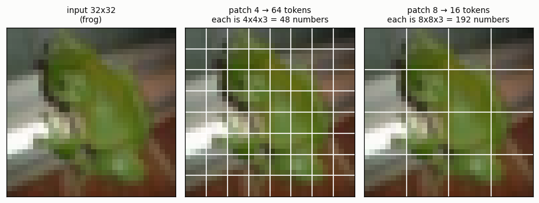
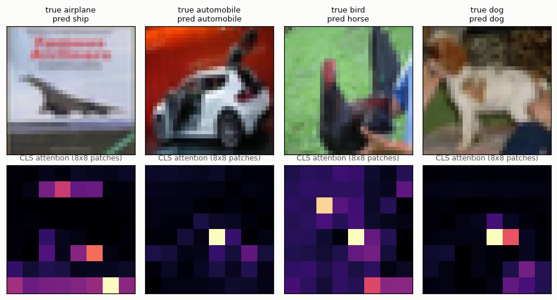
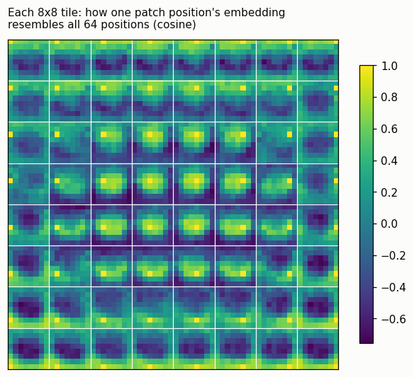
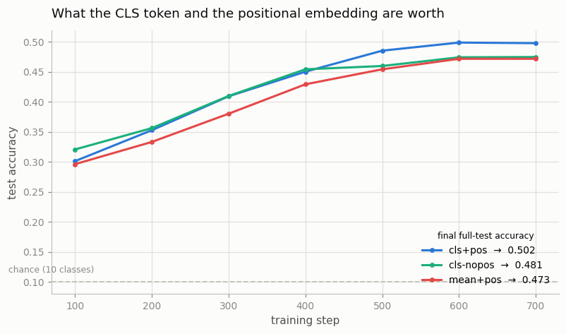

# Implement ViT From Scratch

## Key Insight

A [ViT](/shared/glossary/#vit) treats an image as a short sentence whose "words" are square [patches](/shared/glossary/#patch): you cut the picture into a grid, project each block into a token ([patchification](/shared/glossary/#patchification)), prepend a learnable [CLS token](/shared/glossary/#cls-token), and run the sequence through ordinary [transformer](/shared/glossary/#transformer) blocks, then read the CLS token's final vector as the whole-image summary. Coding every piece yourself on [CIFAR-10](/shared/glossary/#cifar-10) — small enough to train on a laptop — makes the key abstraction concrete: the transformer never "sees" a 2D picture, only a list of vectors, so the same block that reads words reads pixels once you hand it patches.

## Why this project belongs in a *multimodal* guide

It is worth saying plainly, because it looks like a detour into computer vision. Every phase after this one takes "an image encoder" as a given: Phase 3 trains two of them against each other, Phase 4 bolts one onto a language model, Phase 5 builds a [VLM](/shared/glossary/#vlm) on top of one. If the encoder stays a black box, none of those phases can be reasoned about — you cannot judge how many [tokens](/shared/glossary/#token-visualaudio) an image should cost, or why a fusion layer sees 197 vectors instead of one picture, without having built the thing that produces them.

The deeper payoff is the last line of the Key Insight. A transformer block accepts a list of D-dimensional vectors and has no idea where they came from. That is precisely why one architecture can serve text, images, audio, and video — and it is the entire premise of this guide. This project is where that stops being a slogan.

## The setup

- **Model:** a 0.81M-parameter ViT, all of it in `vit.py`. Nothing is imported from `timm` or `torchvision.models`.
- **Data:** CIFAR-10 — 50,000 32×32 training photos in 10 classes.
- **Size:** 32×32 images, patch 4 → an 8×8 grid = 64 patches, plus the CLS token = **65 tokens**. Width 128, 4 layers, 4 heads.
- **Cost:** ~30 s for the three numerical proofs, then ~2.5 minutes per training run on 12 CPU threads. Three runs, so about 9 minutes total.

Everything quoted below is saved in `outputs/` and reproducible with one command.

## Step 1: what the transformer actually receives



A 32×32 colour photo is 3,072 numbers. Cut into 4×4 squares it becomes 64 tiles of 48 numbers each. Each tile is multiplied by one shared matrix to become a 128-dimensional vector, and that list of 64 vectors — plus one extra, described below — is *all* the model ever sees. The grid is gone. The word "above" has no meaning to a transformer block.

### The strided-convolution trick, and why it is not a trick

The guide's sample code slices patches with a single `nn.Conv2d(3, 128, kernel_size=4, stride=4)`, which looks like sleight of hand if you were expecting a loop over squares. It is not. When a convolution's kernel size *equals* its stride, its windows never overlap, so it visits exactly the same squares you would have cut by hand — and applying the kernel to a window *is* the linear projection you wanted anyway. One operation does both jobs, and it runs on a heavily optimized convolution kernel instead of a Python loop.

`run.py --stage verify` proves this rather than asserting it. `PatchEmbed.as_linear` takes the *same layer's weights*, flattens them into a plain matrix, and multiplies the hand-cut patches by it:

| claim | max difference |
|---|---|
| strided conv vs unfold-then-matmul | **8.3 × 10⁻⁷** |
| hand-written softmax attention vs `F.scaled_dot_product_attention` | **1.0 × 10⁻⁷** |

Both differences are float32 rounding noise, not disagreement. The second row matters for reading the rest of the code: `Attention` has a `fast` switch, and this confirms the switch changes only which kernel runs, never the math.

> **"Raster order"** — the order the patches come out in — is named after how a cathode-ray television painted a picture: a beam swept left to right along one line, snapped back, and swept the next line down. Reading patches left-to-right then top-to-bottom is the same sweep, which is why the term outlived the hardware.

## Step 2: the CLS token, and why an image needs a token that is not part of the image

Adding a 65th token that contains no pixels looks redundant — the model already has 64 vectors describing the picture, so why not just average them?

You *can*, and this project measures exactly that (the `mean+pos` run below). But the two are not the same operation, and the difference is worth naming. A mean treats all 64 patches as equally important, forever; it is a fixed rule chosen by you, before you know anything about the image. The [CLS token](/shared/glossary/#cls-token) starts as one learned vector, identical for every image, and its only way to acquire content is to *attend* — to decide, per image, which patches to pull from. Whatever ends up inside it was gathered, not averaged. That is also why it starts empty of pixels: it has no home patch to be biased toward, so nothing pulls it toward one corner of the picture.



The bottom row shows where the trained CLS token actually looks in the last block, averaged over its four heads. The attention is *sparse* — a handful of bright patches rather than a smooth blob — and it lands on the subject more often than not (the car's body, the dog's flank). It is also visibly noisy, and the leftmost image is misclassified. At 0.81M parameters and two and a half minutes of training this is about as much interpretability as one should claim. The honest reading is "it learned to look somewhere specific, and that somewhere is often the object", not "it segments the subject".

## Step 3: positional embeddings, and the experiment that proves they are needed

[Attention](/shared/glossary/#attention) has no notion of order. It computes a weighted average over a *set* of tokens, and a set has no first or last element. So if you feed a ViT the same 64 patches in a scrambled order, without extra help it must return the identical answer — not a similar one, the identical one.

We add one learned vector per slot (a **[positional embedding](/shared/glossary/#positional-embedding)**) to restore the missing information. The verification stage tests both halves of that claim by scrambling the patches of a real image and comparing outputs:

| model | max change in output after scrambling patches |
|---|---|
| no positional embedding | **3.6 × 10⁻⁷**  (i.e. exactly zero, up to rounding) |
| with positional embedding | 1.0 × 10⁻³  (three thousand times larger) |

The first row is the interesting one: the model is not *approximately* order-blind, it is **provably** order-blind. Position information does not leak in through some other route.

### Did the embedding learn that the image is a grid?

Nothing tells the model that patch 9 sits directly below patch 1. Those are just two of 64 free vectors, initialized randomly and trained by gradient descent like any other parameter. So: did they discover the layout?



Each small 8×8 tile answers "how much does *this* position's embedding resemble each of the 64 positions?" ([cosine similarity](/shared/glossary/#cosine-similarity)). The bright spot in every tile sits where that patch actually is, and the glow around it fades outward in both directions. Tiles in the top row have their blob at the top; tiles down the left edge have theirs at the left.

Quantified: a position's embedding scores **0.563** against its four grid neighbours and **0.016** against all other positions on average — a 35× difference. **The model reconstructed the 2D layout of the image from nothing but the classification task.** This is one of the cleanest "emergent structure" results you can produce in ten minutes, and it previews why ViTs scale: what a [CNN](/shared/glossary/#cnn) is *told* about spatial layout by its architecture, a ViT can *learn*, given enough signal.

## Step 4: three configurations at one budget

Same initialization, same data, same optimizer, same 700 steps. Only the pooling and the positional embedding change.



| configuration | test accuracy (10,000 images) |
|---|---|
| **CLS token + positional embedding** | **0.5017** |
| CLS token, no positional embedding | 0.4814 |
| mean pooling + positional embedding | 0.4734 |

Two honest observations, both more useful than a clean win would have been.

**First: 50% accuracy is not impressive, and that is the expected result.** A basic CNN reaches ~80% on CIFAR-10 with this budget. The ViT loses because it has almost no **[inductive bias](/shared/glossary/#inductive-bias)** — the assumptions an architecture makes about the data *before* it sees any. A convolution is built already believing that nearby pixels belong together and that a pattern means the same thing wherever it appears. Those two beliefs are free, roughly correct, and worth an enormous amount when all you have is 50,000 small images. A ViT is told neither and must learn both from data, which is why the original ViT paper found transformers *lose* to CNNs on small datasets and only overtake them past roughly 100 million images. **You are watching that finding reproduce on a laptop** — and it is the reason every model in later phases starts from an encoder pretrained on hundreds of millions of images instead of training one from scratch.

**Second: dropping the positional embedding costs only 2 points.** That is far less than Step 3's proof would lead you to expect. The reason is a property of the dataset, not of the architecture — which the next step shows directly.

## Step 5: scramble the test set — the result that explains Step 4

Take the *trained* models and scramble every test image's 64 patches into one fixed random order, like a jigsaw dumped back in the box.

| model | normal images | scrambled patches | cost |
|---|---|---|---|
| CLS + positional embedding | 0.5017 | 0.4595 | −4.2 points |
| **CLS, no positional embedding** | **0.4814** | **0.4814** | **−0.0000** |
| mean pooling + positional embedding | 0.4734 | 0.4618 | −1.2 points |

The middle row is Step 3's proof cashed out on a real model: the accuracy is unchanged **to the last decimal place**, because for that model the scramble is not a hard input — it is *no input change at all*. Every other row in this README could be a coincidence of training noise. This one is arithmetic.

And the top row explains Step 4's small gap. The model *with* positional embeddings does use them — scrambling costs it 4.2 points — but it still gets 46% right on images that have been cut up and shuffled. So most of what a small ViT extracts from CIFAR-10 is a **bag of patches**: this image contains blue sky-textured tiles and a grey metallic tile, therefore probably an airplane. Spatial arrangement is a garnish here, worth a couple of points.

The general lesson is worth carrying forward: **a component can be genuinely used and still be nearly worthless, if the task does not require it.** Position matters enormously for reading text in an image, for counting, and for "is the cat left or right of the dog" — the [grounding](/shared/glossary/#grounding) and [VQA](/shared/glossary/#vqa-visual-question-answering) tasks of Phase 5. It barely matters for "which of ten very different objects is this". Before concluding a design choice is useless, check whether your benchmark is capable of noticing it.

## What's in this directory

| file | what it is |
|---|---|
| `vit.py` | the whole architecture — `PatchEmbed`, `Attention`, `Block`, `ViT` — plus CIFAR-10 loading, [augmentation](/shared/glossary/#data-augmentation), and the training loop. Imported by project [08](../08-patch-size-study/README.md). |
| `run.py` | stages: `verify`, `train`, `shuffle`, `figures` |
| `outputs/verify.json` | the three numerical proofs |
| `outputs/training_curves.png`, `training.json` | the three configurations |
| `outputs/shuffle.json` | the scrambled-patch experiment |
| `outputs/patchification.png` | what the transformer receives |
| `outputs/cls_attention.png` | where the CLS token looks |
| `outputs/pos_embed_similarity.png`, `pos_embed_stats.json` | the learned 2D grid |
| `outputs/vit_*.pt` | the three trained models — gitignored (3.3 MB each), rebuilt by `--stage train` |

## How to run

```bash
python3 run.py --stage verify    # ~30 s, no training, no download
python3 run.py --stage all       # ~9 min on 12 CPU threads
python3 run.py --stage figures   # ~20 s, once the models exist
```

The first run downloads CIFAR-10 (~170 MB) from the Hugging Face mirror into `data/`, which is gitignored. Project [08](../08-patch-size-study/README.md) reuses that same cache.

## Takeaways

1. **A ViT is short.** Patchify, add a CLS token and positions, stack ordinary transformer blocks, read the CLS vector. `vit.py` holds the entire architecture and fits on two screens.
2. **The strided convolution is not a shortcut.** Kernel size equal to stride means non-overlapping windows, so cutting and projecting are literally one operation — verified to 8 × 10⁻⁷.
3. **The CLS token is not a redundant extra vector.** A mean is a fixed rule you impose; the CLS token learns, per image, which patches to gather from. Here that is worth ~3 points over mean pooling.
4. **Attention is provably order-blind.** Without positional embeddings, scrambling the patches changes the trained model's accuracy by exactly 0.0000. Position enters the model through one addition, and only through it.
5. **The positional embedding rediscovers the 2D grid on its own** — 0.563 cosine similarity to grid neighbours versus 0.016 to everything else, learned from the classification loss alone.
6. **A small ViT on a small dataset underperforms a CNN, and should.** No [inductive bias](/shared/glossary/#inductive-bias) means nothing is free. The [transfer learning](/shared/glossary/#transfer-learning) that every later phase depends on exists precisely because training these from scratch is a bad deal below ~100M images.
7. **Used ≠ needed.** Position costs the model 4.2 points when removed at test time yet only 2 points when never trained with — because CIFAR-10 is mostly solvable as a bag of patches. Check whether your benchmark can see the thing you are ablating.
8. Project [08](../08-patch-size-study/README.md) imports this exact `vit.py` and sweeps the one knob left untouched here: the patch size.
