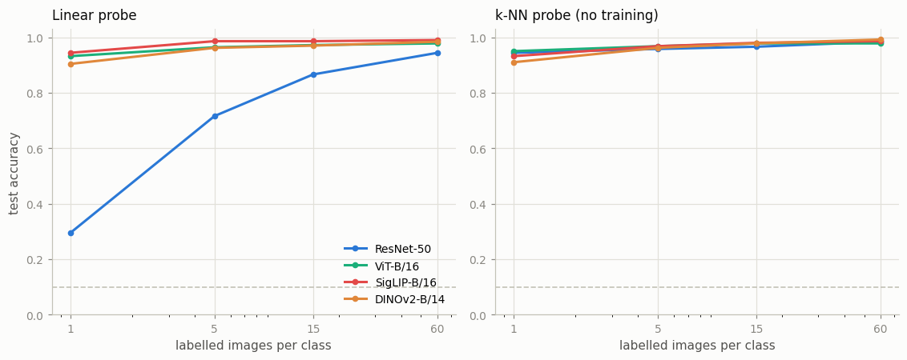
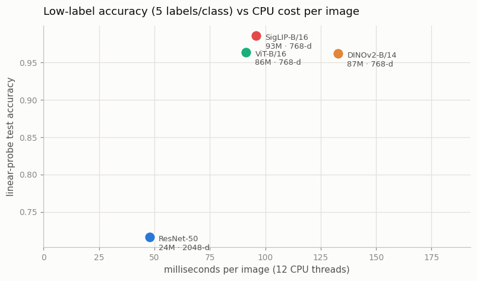

# Compare Encoders

## Key Insight

The fairest way to ask "which encoder sees the world best" is to freeze each one, pull its [features](/shared/glossary/#embedding) for the same set of [ImageNet](/shared/glossary/#imagenet) images, and fit a [linear probe](/shared/glossary/#linear-probe) on top: if a single linear layer can separate the classes, the encoder already did the hard work. Comparing a convolutional [ResNet](/shared/glossary/#resnet)-50 against a [ViT](/shared/glossary/#vit), a contrastively trained [SigLIP](/shared/glossary/#siglip), and a label-free [self-supervised](/shared/glossary/#self-supervised) [DINOv2](/shared/glossary/#dinov2) on one probe reveals that *how* a model was trained often matters more than its architecture — DINOv2, which never saw a label, frequently beats supervised towers, which is why it has become a default off-the-shelf vision backbone in 2026.

## Why "freeze it and probe it" is the right test

The obvious way to compare encoders is to fine-tune each one on your task and see which wins. That measures the wrong thing. [Fine-tuning](/shared/glossary/#fine-tuning) *changes* the features, so a tower that started with poor ones can catch up given enough gradient steps, and you end up ranking "how well does this adapt" rather than "what does this already know".

Freezing removes that escape route. A [linear probe](/shared/glossary/#linear-probe) can only draw flat boundaries through the space the encoder handed it — it cannot bend the space. So its accuracy is a direct readout of how much work the encoder has already done. If one linear layer can separate tenches from golf balls, the encoder had already placed them in separate regions.

We use two probes, because they ask different questions:

- **Linear probe** — "can one flat boundary separate these classes?" A *global* question about the whole space.
- **k-NN probe** — "does each image land near others of its own kind?" ([cosine similarity](/shared/glossary/#cosine-similarity), no training at all.) A *local* question.

Running both turns out to matter far more than expected. See Step 3.

## The setup

| encoder | how it was trained | params | output dim | CPU cost |
|---|---|---|---|---|
| **ResNet-50** | supervised on ImageNet-1k **labels** | 23.5M | 2048 | 48 ms/image |
| **ViT-B/16** | supervised on ImageNet-21k **labels** | 86.4M | 768 | 91 ms/image |
| **SigLIP-B/16** | [contrastive](/shared/glossary/#infonce) on web **image–text pairs** | 92.9M | 768 | 96 ms/image |
| **DINOv2-B/14** | [self-supervised](/shared/glossary/#self-supervised) on **images alone** | 86.6M | 768 | 133 ms/image |

Three different kinds of supervision — human labels, web captions, and nothing at all — which is the comparison worth making.

- **Data:** Imagenette, 10 ImageNet classes chosen to be easy to tell apart (tench, English springer, cassette player, chain saw, church, French horn, garbage truck, gas pump, golf ball, parachute). 600 training images, 500 held-out test images, class-balanced.
- **Cost:** ~6 minutes to encode 1,100 images through all four towers. Features are cached, so every probe afterwards takes seconds.

> **A confound to state up front.** ResNet-50 and ViT-B/16 were trained on ImageNet *labels*, and these ten classes are ImageNet classes. Those two towers have literally been supervised on the answer key. SigLIP and DINOv2 have not. Any result where the two supervised towers lose is therefore *stronger* than it looks, and any result where they win should be discounted.

## Step 1: with plenty of labels, everything ties



At 60 labels per class, the linear probe reads:

| encoder | linear probe | k-NN probe |
|---|---|---|
| SigLIP-B/16 | **0.990** | 0.986 |
| DINOv2-B/14 | 0.984 | **0.992** |
| ViT-B/16 | 0.978 | 0.978 |
| ResNet-50 | 0.944 | 0.984 |

Everything is between 94% and 99%. This is a **saturated benchmark**: the task is too easy for the measurement to mean much, and the differences are inside the noise of a 500-image test set (roughly ±1.3 points). If you stopped here you would conclude that all four encoders are interchangeable.

They are not. The benchmark just cannot see it.

## Step 2: starve the probe of labels and the differences appear

The fix is to reduce the labels rather than change the task. A weak representation needs many examples before a boundary can be fitted through it; a strong one needs almost none, because the classes are already sitting in separate places. Cutting to **one labelled image per class** — the [few-shot](/shared/glossary/#few-shot) regime — turns the probe into a much sharper instrument.

| encoder | 1 label/class | 5 | 15 | 60 |
|---|---|---|---|---|
| SigLIP-B/16 | **0.944** | **0.986** | **0.986** | **0.990** |
| ViT-B/16 | 0.932 | 0.964 | 0.972 | 0.978 |
| DINOv2-B/14 | 0.904 | 0.962 | 0.970 | 0.984 |
| **ResNet-50** | **0.294** | 0.716 | 0.866 | 0.944 |

Three of the four towers classify ten classes at **90%+ from a single example each**. That is worth pausing on: the probe sees ten photos in total, and gets nine out of ten test images right. Nothing about the classifier is doing that work — a linear layer fitted to ten points is nearly the weakest model there is. The encoder had already placed each class in its own region; the probe only had to name the regions.

And ResNet-50 collapses to 0.294 — sixty-five points behind, on classes it was *directly supervised on*. That is the finding the saturated table in Step 1 completely hid.

## Step 3: the two probes disagree, and that is the real lesson

Now put ResNet-50's two 1-label numbers side by side:

| ResNet-50, 1 label per class | accuracy |
|---|---|
| linear probe | **0.294** |
| k-NN probe (cosine, no training) | **0.944** |

The same features, the same ten labelled images, the same test set — and a **65-point disagreement**.

This is not a bug or an under-trained probe. We checked: the 0.294 is identical at 400, 2,000 and 4,000 optimizer steps, and across learning rates and weight decays from 0 to 1e-4. It converges to that number immediately and stays.

Here is what is actually happening. Ten training points in a 2,048-dimensional space can be separated by infinitely many planes — the problem is wildly underdetermined, and the optimizer settles on one particular solution among them. Which one it picks depends on the geometry of the features. ResNet-50's outputs come straight out of a ReLU, so every one of the 2,048 numbers is non-negative and most are near zero; the transformer towers output roughly centred 768-dimensional vectors. The plane that the optimizer finds through ten sparse non-negative points in 2,048 dimensions happens to generalize badly, while the same ten points' *neighbourhoods* are perfectly clean — which is exactly what the k-NN probe reports.

Two practical consequences:

1. **"Which encoder is best" is not a well-posed question without naming the probe.** Swap the probe and ResNet-50 goes from worst by a mile to statistically tied. Papers that rank encoders by linear probe are measuring "linear separability", which is a real property but not the same as "these features are good".
2. **Feature dimension and sign structure are part of the deal.** ResNet-50's 2,048-d non-negative vectors are not just bigger, they are *shaped differently*, and that shape interacts with whatever you bolt on top. When you attach a [projector](/shared/glossary/#projector) to a [VLM](/shared/glossary/#vlm) in Phase 5, this is the sort of thing that decides whether the first thousand steps go anywhere.

## Step 4: what it costs



At 5 labels per class, plotted against milliseconds per image on 12 CPU threads:

| encoder | linear probe @5 labels | ms/image | params |
|---|---|---|---|
| SigLIP-B/16 | 0.986 | 96 | 92.9M |
| ViT-B/16 | 0.964 | 91 | 86.4M |
| DINOv2-B/14 | 0.962 | 133 | 86.6M |
| ResNet-50 | 0.716 | **48** | **23.5M** |

ResNet-50 is **twice as fast and a quarter the size** of every transformer here. On this easy 10-class task with plenty of labels it gives up only 4 points (0.944 vs 0.990), which for many production systems is a trade worth taking. Cost is a real axis, and "which is best" without it is an incomplete answer.

Note also that DINOv2 is the slowest despite having fewer parameters than SigLIP. The reason is in its name: **DINOv2-B/14** uses 14-pixel patches, so a 224×224 image becomes 256 [tokens](/shared/glossary/#token-visualaudio) rather than the 196 that patch-16 models produce — 31% more sequence for the same weights. That is project [08](../08-patch-size-study/README.md)'s knob showing up as a line on someone else's spec sheet.

## Honest reading of the Key Insight

The Key Insight above says DINOv2, trained without labels, "frequently beats supervised towers". **On this benchmark it does not** — it lands third of four in the linear probe at every label budget, a point or two behind SigLIP and ViT-B/16.

Two reasons not to over-read that, and one thing the data does support:

- **The task is easy and saturated.** Ten visually distinct classes at 96–99% leaves no room to separate good from excellent. DINOv2's published advantages show up on dense tasks — segmentation, depth, fine-grained retrieval — that a 10-class whole-image probe cannot express.
- **The scale here is small.** 600 training images and a 500-image test set means ±1.3 points of noise; the DINOv2/ViT gap of 0.8 points is inside it.
- **What the data *does* support:** DINOv2 wins the **k-NN** probe at the largest budget (0.992, the best number in the whole table). That is the local, neighbourhood-quality question, and it is the property DINOv2 is actually known for. Different probe, different winner — Step 3's lesson again.

The defensible version of the claim is the first half of the Key Insight: **how a model was trained matters more than its architecture.** SigLIP, trained on nothing but noisy web [alt-text](/shared/glossary/#alt-text), beats a ViT of the same size and shape trained on 14 million hand-labelled ImageNet-21k images. Same architecture, same parameter count — different supervision, and the free noisy data wins. That is the result that should change what you reach for.

## What's in this directory

| file | what it is |
|---|---|
| `encoders.py` | the four frozen towers behind one `embed()` interface, the Imagenette loader, and both probes |
| `run.py` | stages: `embed`, `probe`, `figures` |
| `outputs/probes.csv` | every accuracy quoted above |
| `outputs/encoders.json` | dimensions, parameter counts, measured ms/image |
| `outputs/shots_sweep.png` | the label sweep, both probes |
| `outputs/accuracy_vs_cost.png` | accuracy against CPU cost |

## How to run

```bash
python3 run.py --stage all       # ~7 min cold (downloads Imagenette + 4 models)
python3 run.py --stage probe     # ~30 s, once features are cached
```

`data/` is gitignored and holds Imagenette (~95 MB) plus the cached feature matrices.

## Takeaways

1. **Freeze, then probe.** Fine-tuning measures adaptability; a frozen probe measures what the encoder already knows. Only the second one answers "which encoder should I build on".
2. **A saturated benchmark ranks nothing.** At 60 labels per class all four towers sit between 0.944 and 0.990 — inside the noise. Every real difference in this project only became visible after cutting the labels.
3. **Good features classify from one example.** Three of four towers hit 90%+ on ten classes from a single labelled image each. The linear layer is not doing that work; the encoder already did it.
4. **The probe is part of the measurement.** ResNet-50 at one label scores 0.294 linear and 0.944 k-NN — a 65-point disagreement, stable across every probe hyperparameter we tried. Its features *cluster* the classes correctly but are not linearly separable from ten points in 2,048 dimensions. Never quote an encoder ranking without saying how you probed.
5. **Supervision beats architecture.** SigLIP and ViT-B/16 are the same size and shape; SigLIP, trained on free noisy web captions, wins at every label budget over a ViT trained on 14M curated labels.
6. **Cost is an axis.** ResNet-50 is 2× faster and 4× smaller for a 4-point loss on this task. "Best" without a latency budget is half an answer.
7. **Patch size shows up on spec sheets.** DINOv2-B/14 is the slowest tower here despite average size, because /14 means 256 tokens per image instead of 196 — the knob project [08](../08-patch-size-study/README.md) measures directly.
