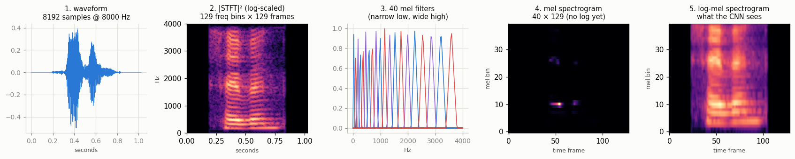
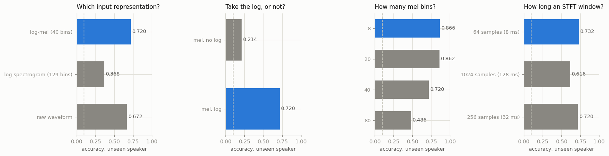
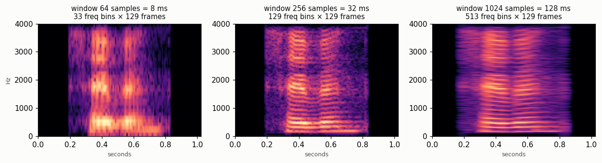

# Mel Spectrogram Pipeline

## Key Insight

Before a neural network can "hear," sound has to become a picture. A [mel spectrogram](/shared/glossary/#mel-spectrogram) is that picture — a 2D (time × frequency) image produced by a [Short-Time Fourier Transform](/shared/glossary/#stft) and then bent onto a perceptual pitch scale — and once audio is an image, the very same [CNN](/shared/glossary/#cnn) machinery built for vision can process it directly. Building the pipeline end to end on a 10-second clip shows why almost every audio model starts here rather than with the raw waveform: a minute of sound is millions of samples, but its mel spectrogram is a compact, perceptually meaningful grid a small network can chew through.

## The setup

- **Front end:** written out in `audio_lib.py` with no `torchaudio` and no `librosa`. The [STFT](/shared/glossary/#stft) is `torch.stft`; the mel [filterbank](/shared/glossary/#filterbank) is thirty lines of numpy you can read.
- **Data:** the Free Spoken Digit Dataset (FSDD) — 3,000 recordings of six people saying the digits 0–9, fifty times each, at 8 kHz. 15 MB.
- **Task:** which digit was spoken. A small CNN, trained from scratch.
- **Split:** train on five voices, test on the sixth (`yweweler`), whom the model has never heard.
- **Cost:** ~5 minutes for all four ablations on a CPU.

> **Why hold out a whole speaker?** A random split would put other recordings of the *same* person saying the *same* digit on both sides. A model could then score well by recognising the voice and remembering what that voice usually says — passing the test without ever learning what a "seven" sounds like. Holding one speaker out entirely closes that shortcut. It also makes every number below lower than a random split would give, and more meaningful.

## Step 1: the pipeline, one stage at a time



**1 → 2, the [STFT](/shared/glossary/#stft).** A plain Fourier transform of the whole clip tells you *which* frequencies are present but not *when* — it gives the same answer for "two-one" and "one-two". So you chop the signal into short overlapping windows and transform each one. That is what "short-time" means, and the result is a [spectrogram](/shared/glossary/#spectrogram): time across, frequency up, energy as brightness.

**2 → 3 → 4, the mel [filterbank](/shared/glossary/#filterbank).** The spectrogram has 129 evenly spaced frequency rows. We collapse them to 40 by multiplying with a bank of overlapping triangles.

**4 → 5, the log.** The same picture, wildly different visibility.

Each of those three steps is a design decision that could have gone the other way, so the rest of the project tests all three by removing them.

### Why "mel"?

The **mel** scale — short for *melody* — comes from listening experiments run by Stevens, Volkmann and Newman in 1937. People were played a tone and asked to tune a second one until it sounded "half as high". Their answers were *not* half the frequency. Below roughly 1 kHz, perceived pitch tracks frequency almost linearly; above it, you need ever-larger jumps in Hz to hear the same step in pitch. The formula in `hz_to_mel` is a curve fitted to that finding.

The consequence is visible in panel 3: the triangles are **narrow at low frequencies and wide at high ones**. Fine resolution where the ear is fine, coarse where the ear is coarse. Every filter's output is an average of neighbouring FFT bins, and the triangles overlap by half so no frequency falls into a gap — energy gets redistributed, never discarded.

### Why the Hann window?

`stft_power` multiplies each chunk by a Hann window (a smooth bump that tapers to zero at both edges) before transforming it. Without it, the hard cut at a chunk boundary looks to the Fourier transform like a click — an instantaneous jump — and a click contains *every* frequency. The result is energy smeared across the whole spectrum, called **spectral leakage**. Tapering the edges to zero removes the artificial discontinuity, so what you measure is the sound rather than the act of cutting it up.

## Step 2: the log is not cosmetic — it is the whole thing

Panels 4 and 5 above are the same array. In the raw mel spectrogram you can make out one bright smudge; in the log version you can see the structure of the whole utterance.

The measurement behind that:

- **The loudest cell holds 426,000× the energy of the median cell.**
- **The loudest 1% of cells hold 60% of all the energy in the clip.**
- After the log, the whole array spans a range of about 19.

So without the log, 99% of the picture is numerically almost zero. Feeding that to a network means it spends nearly all its gradient on a handful of loud cells and never learns what the quiet ones mean.

| input | accuracy on the unseen speaker |
|---|---|
| **mel spectrogram, log** | **0.720** |
| mel spectrogram, no log | 0.214 |

From 72% to 21% — barely above the 10% you get by guessing. One `torch.log` is the difference between a working model and a broken one.

The reason the log is the right compression is the same reason the mel scale is the right frequency warping: **human loudness perception is logarithmic too.** A whisper and a shout differ by a factor of thousands in energy but only a few steps in perceived volume. Taking the log puts the numbers on the scale the information actually lives on.

## Step 3: mel versus the alternatives



| representation | accuracy | model params |
|---|---|---|
| **log-mel, 40 bins** | **0.720** | 56.7k |
| raw waveform, 1D CNN | 0.672 | 279.3k |
| log-spectrogram, 129 bins (no mel warping) | 0.368 | 56.7k |

**Against the raw waveform:** the mel front end wins by 5 points while using **five times fewer parameters** — and the best mel setting from Step 4 wins by 19 points. The 1D CNN has to spend its early layers rediscovering something like a frequency decomposition from 8,192 raw samples, which is work the STFT does exactly, for free, with no parameters at all. This is the practical answer to "why not just feed it the waveform": you can, and models like wav2vec 2.0 do at scale — but at small scale you are paying to relearn the Fourier transform.

**Against the un-warped spectrogram:** this is the surprise. Same CNN, same log, same clips — the only change is skipping the mel filterbank, leaving 129 evenly spaced frequency rows instead of 40 perceptual ones. Accuracy falls from 0.720 to 0.368.

Two honest caveats before reading too much into it. The 129-row input is three times taller, so the CNN sees a different aspect ratio at the same layer count and the same 20 epochs — part of the gap is that the taller input is simply harder to fit in the budget given. And the mel warping concentrates speech information into the low-frequency rows where vowels live, which suits this task particularly well. The direction of the result is reliable; treat its size as specific to this setup.

## Step 4: more resolution makes it worse — the honest inversion

Sweeping the number of mel bins gives the opposite of what "higher resolution is better" would predict:

| mel bins | accuracy | median FFT bins per filter |
|---|---|---|
| **8** | **0.866** | 18.7 |
| 20 | 0.862 | 7.9 |
| 40 | 0.720 | 4.0 |
| 80 | 0.486 | 2.0 |

**Eight mel bins beat eighty by 38 points.** Two things are going on, and they compound.

**First, there is nothing there to resolve.** The [STFT](/shared/glossary/#stft) only produced 129 frequency bins to draw from. `outputs/mel_coverage.json` measures how many of them each mel filter actually averages, using the participation ratio (Σw)²/Σw² — a standard way to ask "how many terms is this average really made of?", where a filter leaning entirely on one bin scores 1 and one weighting four bins equally scores 4. At 80 mel bins, **39 of the 80 filters average fewer than two FFT bins**, and the median filter averages 2.0. Half the filterbank is copying single numbers out of the spectrogram, each sitting next to a neighbour doing almost the same. Those rows carry no information the coarser bank did not already have — they are duplicated columns dressed up as detail.

**Second, and more interesting: the extra detail encodes the wrong thing.** Fine spectral resolution captures the precise pitch and harmonic structure of a voice — which is exactly what makes *that person's* voice recognisable. Because we test on a speaker the model has never heard, every bit of speaker-specific detail the model latches onto is a liability. A coarse 8-bin representation is forced to describe the broad shape of the sound, which is closer to *what was said* than to *who said it*.

That is a general principle worth carrying, not a quirk of this dataset: **a representation's resolution should match the scale of the thing you are trying to predict, not be maximised.** Project [07](../07-whisper-encoder-reuse/README.md) shows the same tension from the other end — it measures a real speech encoder progressively *throwing away* speaker identity as it goes deeper, because it was trained to transcribe.

## Step 5: the window length trade-off



The three panels are the same clip at three window lengths. Read them left to right:

- **64 samples (8 ms)** — sharp vertical edges: you can see exactly *when* each sound starts. But the horizontal bands are smeared, so you cannot tell precisely *which* frequency.
- **1024 samples (128 ms)** — crisp horizontal bands (clear harmonics, clear pitch) but the timing is blurred across the frame.
- **256 samples (32 ms)** — the usual compromise for speech.

This is not a tuning detail you can optimize away. Time resolution and frequency resolution trade off against each other exactly, and no window setting gives you both.

| window | accuracy |
|---|---|
| **64 samples (8 ms)** | **0.732** |
| 256 samples (32 ms) | 0.720 |
| 1024 samples (128 ms) | 0.616 |

The short window edges out the standard one here, and the long window clearly loses. That fits the task: spoken digits are distinguished by fast events — the burst of the *t* in "two", the *s* in "six" — and a 128 ms window smears those across a third of the whole word.

## What's in this directory

| file | what it is |
|---|---|
| `audio_lib.py` | wav reading, resampling, `hz_to_mel`, the triangular filterbank, `stft_power`, `log_mel`, the FSDD loader, the speaker-held-out split, and both CNNs. Imported by project [07](../07-whisper-encoder-reuse/README.md). |
| `run.py` | stages: `data`, `figures`, `train`, `report` |
| `outputs/pipeline.png` | the five stages, drawn |
| `outputs/window_tradeoff.png` | time versus frequency resolution |
| `outputs/ablations.png`, `ablations.csv` | all four experiments |
| `outputs/log_stats.json` | the dynamic-range numbers behind Step 2 |
| `outputs/mel_coverage.json` | how many FFT bins each mel filter really averages |

## How to run

```bash
python3 run.py --stage all       # ~5 min on a CPU, downloads FSDD (~15 MB)
python3 run.py --stage figures   # ~10 s, no training
```

`data/` is gitignored; project [07](../07-whisper-encoder-reuse/README.md) keeps its own copy at 16 kHz.

## Takeaways

1. **Audio becomes an image, and then vision machinery just works.** A 2D CNN with 56.7k parameters classifies spoken digits from a 40×129 grid using layers designed for photographs.
2. **The log is not a finishing touch.** The loudest 1% of cells hold 60% of a clip's energy; without the log, accuracy drops from 0.720 to 0.214 — one step above guessing.
3. **The mel warping earns its place.** Replacing 40 perceptual bins with 129 evenly spaced ones costs 35 points here, though part of that gap is the taller input under a fixed budget.
4. **The front end beats learning it from scratch at this size.** log-mel + 2D CNN reaches 0.720 with 56.7k parameters; a 1D CNN on raw samples reaches 0.672 with 279.3k. The STFT does for free what the first layers would otherwise have to learn.
5. **More resolution made it worse — 8 mel bins beat 80 by 38 points.** Half of an 80-filter bank averages fewer than two FFT bins, so it adds no information; and the fine detail it does add describes *who is speaking*, which is the wrong thing when the test speaker is unseen.
6. **Time and frequency resolution trade off exactly.** Short windows pin down when, long windows pin down what pitch, and there is no setting that gives both. For spoken digits, short wins.
7. **Every "obvious" step in this pipeline is a real decision.** Remove the log, the warping, or the right window and the model degrades measurably. None of it is convention for its own sake.
