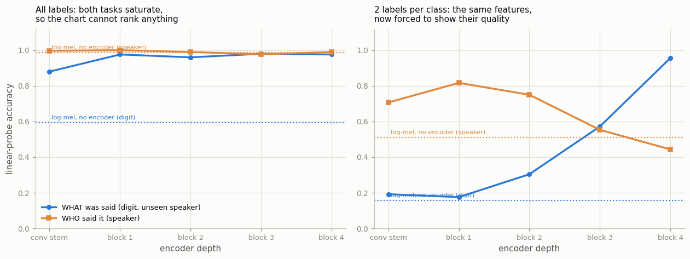
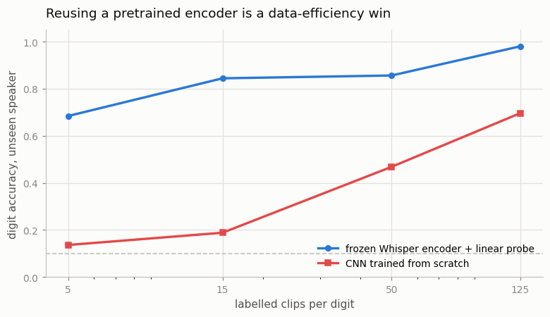

# Whisper Encoder Reuse

## Key Insight

[Whisper](/shared/glossary/#whisper) was trained to turn speech into text, but its encoder — the front half that digests a [mel spectrogram](/shared/glossary/#mel-spectrogram) into a sequence of rich audio [embeddings](/shared/glossary/#embedding) — is useful far beyond transcription. Throw away the decoder, freeze the encoder, and you have a strong pretrained audio feature extractor for free: a tiny classifier trained on those frozen embeddings can recognize languages, emotions, or sound events with a fraction of the data needed to learn audio from scratch. It is the same "reuse a pretrained backbone, train a small head" move as a vision [linear probe](/shared/glossary/#linear-probe) — representations learned for one task are quietly general.

## Why throw away the decoder at all?

A reasonable objection: Whisper already transcribes speech. If you want to know which digit was spoken, why not just run Whisper and read the word it prints?

You can, for this particular task — but that only works because "which digit" happens to be a transcription problem. The decoder is a *committed* component: it was trained to emit text, and text is the only thing it can produce. Ask it which emotion the speaker feels, which of six people is talking, whether a door slammed, or which of your product's twelve wake-words was uttered, and it has no vocabulary for the answer.

The encoder has no such commitment. Its job is to turn 30 seconds of audio into a sequence of vectors that *contain enough information for the decoder to do its job* — and that turns out to be far more than the transcript. Keeping the encoder and dropping the decoder gives you the general part and discards the specialised part. What you attach in its place is up to you, and can be a single linear layer.

This is [transfer learning](/shared/glossary/#transfer-learning) in its cheapest form, and this project measures exactly what it is worth.

## The setup

- **Model:** `openai/whisper-tiny`'s encoder only — 4 transformer blocks, width 384, **8.2M parameters, completely [frozen](/shared/glossary/#frozen)**. Nothing here is trained except linear heads.
- **Data:** 1,500 FSDD clips (6 speakers × 10 digits × 25 takes), loaded through project [06](../06-mel-spectrogram-pipeline/README.md)'s `audio_lib.py` so the two projects are graded on identical audio.
- **Two questions:** *WHAT* was said (which digit, tested on a speaker the model has never heard) and *WHO* said it (which of the six voices, tested on held-out recordings).
- **Baseline:** the plain log-mel spectrogram, mean-pooled over time. This is what the features are worth *before* Whisper touches them — the encoder has to beat its own input.
- **Cost:** ~4 minutes to encode all 1,500 clips; every probe afterwards takes seconds.

> **Two splits, on purpose.** The digit task holds out a whole speaker, so the probe cannot cheat by memorizing a voice. The speaker task *cannot* do that — you cannot identify a voice you have never heard — so it splits by recording instead. Using one split for both would quietly break one of the two tasks.

## Step 1: the padding trap

Whisper's front end always pads audio to exactly 30 seconds and always emits 1,500 frames, one per 20 ms. Our clips are 1.024 seconds long. So **52 of the 1,500 output frames are real audio and 1,448 are padded silence.**

If you mean-[pool](/shared/glossary/#pooling) over all 1,500 frames — the obvious thing to write, and what most one-line implementations do — you average 52 informative vectors together with 1,448 vectors describing nothing.

| pooling | digit accuracy |
|---|---|
| **frames 0–51 (real audio only)** | **0.980** |
| all 1,500 frames | 0.812 |

**17 points, lost to a single slicing decision.** No error is raised, no shape mismatch occurs, and the wrong version still gets 81% — which is precisely what makes it dangerous. It looks like it works.

The general shape of this bug survives well past Whisper: any time a model pads to a fixed length and you pool across the sequence, you are averaging signal with padding. In Phase 4 and Phase 5, when [projectors](/shared/glossary/#projector) pool image or audio tokens before handing them to a language model, the same mistake is one line away.

## Step 2: the layer sweep, and why the first version of this chart was useless

Probe each of the encoder's five stages — the convolutional stem plus the four transformer blocks — on both tasks.



**The left panel is what you get with all 1,250 training labels.** Every point sits between 0.88 and 1.00. The digit line is flat, the speaker line is flat, and the log-mel baseline for the speaker task is already at 0.987. This chart ranks nothing: with six distinct voices and a thousand examples, telling the speakers apart is trivial from the raw spectrogram, so the encoder has no room to add anything measurable.

**The right panel is the same features with 2 labels per class.** Nothing about the encoder changed. Only the probe's budget did.

| layer | digit (2 labels/class) | speaker (2 labels/class) |
|---|---|---|
| log-mel (no encoder) | 0.156 | 0.510 |
| conv stem | 0.192 | 0.707 |
| block 1 | 0.176 | **0.817** |
| block 2 | 0.304 | 0.750 |
| block 3 | 0.572 | 0.553 |
| **block 4** | **0.956** | 0.443 |

**The two lines cross.** Digit accuracy climbs from 0.19 to 0.956 with depth. Speaker accuracy peaks early at block 1 (0.817) and then *falls* to 0.443 — worse than the raw spectrogram it started from.

This is Whisper's training objective made visible. Whisper was trained to transcribe, and for transcription the speaker's identity is a **nuisance variable**: whether a "seven" is said by a low voice or a high one, the correct output is the same five letters. A model that lets voice characteristics leak into its representation makes its own decoder's job harder. So over four blocks the encoder progressively discards identity and builds up phonetic content — *deliberately throwing information away*, because the task rewards it.

Two things follow that are worth carrying:

- **Depth is not monotonic across tasks.** If you want speaker or emotion features from a speech model, the *last* layer is often the wrong place to tap; block 1 is 37 points better here. "Take the final hidden state" is a habit, not a rule.
- **The measurement determines what you can see.** The left panel and the right panel come from the identical feature matrices. One shows two flat lines; the other shows a crossing that explains the model's whole design. Project [05](../05-compare-encoders/README.md) hits the same wall in vision — a saturated benchmark cannot rank anything, and starving the probe of labels is the cheapest way to un-saturate it.

## Step 3: what the encoder is actually worth

With all labels available, block 3 gives **0.980** on the digit task against a log-mel baseline of **0.592**. The frozen encoder converts a barely-working representation into a nearly-solved one, with zero training on our data.

The more useful framing is data efficiency:



| labelled clips per digit | frozen Whisper + linear probe | CNN trained from scratch |
|---|---|---|
| 5 | **0.684** | 0.136 |
| 15 | **0.844** | 0.188 |
| 50 | **0.856** | 0.468 |
| 125 | **0.980** | 0.696 |

The from-scratch CNN is project [06](../06-mel-spectrogram-pipeline/README.md)'s `MelCNN`, given exactly the same clips.

**At 5 clips per digit the frozen probe gets 68% and the from-scratch CNN gets 14% — barely above the 10% of guessing.** The scratch model is not badly designed; it simply has to learn what speech *is* before it can learn which digit was said, and fifty recordings is nowhere near enough for that. The probe skips the first job entirely because Whisper already did it, on 680,000 hours of audio.

Notice too that the gap *narrows* as labels grow: 55 points at 5 clips, 28 points at 125. Extrapolate and the two would eventually meet. That is the general rule for transfer learning — **the payoff is largest exactly where you have least data**, because that is where "learn the representation yourself" is least affordable. If you had a million labelled clips, training your own encoder would be back on the table.

## An honest limitation

The speaker task at full labels is saturated (0.987 from the raw spectrogram alone), so this project cannot make the strong claim that Whisper's encoder is *bad* at speaker identity in absolute terms. What it can show, and does, is the **trend with depth** under a label budget tight enough to be informative — and that trend is unambiguous and in the direction the training objective predicts.

Six speakers is also a very small identity task. A real speaker-verification benchmark would have thousands, and the effect would have room to show at full labels too.

## What's in this directory

| file | what it is |
|---|---|
| `run.py` | stages: `embed`, `probe`, `figures`. Imports `audio_lib.py` from project [06](../06-mel-spectrogram-pipeline/README.md). |
| `outputs/layers.csv` | the layer sweep with all labels |
| `outputs/layers_lowshot.csv` | the same sweep at 2 labels per class |
| `outputs/layer_sweep.png` | both panels |
| `outputs/pooling.csv` | the padding trap |
| `outputs/label_efficiency.csv`, `label_efficiency.png` | frozen probe vs from-scratch CNN |
| `outputs/model.json` | encoder size, frame counts, clip count |

## How to run

```bash
python3 run.py --stage all       # ~6 min cold (downloads whisper-tiny + FSDD)
python3 run.py --stage probe     # ~2 min, once features are cached
```

`data/` is gitignored and holds FSDD at 16 kHz plus the pooled encoder features.

## Takeaways

1. **The encoder is the reusable half.** The decoder can only produce text; the encoder produces vectors that contain far more than the transcript. Dropping the decoder is what makes Whisper a general audio feature extractor rather than a transcription tool.
2. **Mind the padding.** Whisper pads everything to 30 s and emits 1,500 frames; our clips fill 52 of them. Pooling over all 1,500 costs 17 points and raises no error — it just quietly averages signal with silence.
3. **A saturated benchmark ranks nothing.** With all labels, both tasks sit near 1.00 and the layer chart is two flat lines. Cutting to 2 labels per class, on the identical features, exposed everything.
4. **Whisper's encoder throws speaker identity away on purpose.** With depth, digit accuracy climbs 0.19 → 0.956 while speaker accuracy falls 0.82 → 0.44. Identity is a nuisance variable for transcription, so the training objective pays the model to discard it.
5. **The last layer is not always the right tap.** For speaker features, block 1 beats block 4 by 37 points. Which layer you read should follow from what the model was trained to do.
6. **Transfer learning is a data-efficiency win, and it shrinks.** 0.684 vs 0.136 at five clips per digit; 0.980 vs 0.696 at 125. The advantage is largest where labels are scarcest, because that is where learning your own representation is least affordable.
7. **Frozen means frozen.** Nothing in this project trains an audio model. Every number comes from 8.2M frozen parameters plus a linear layer.
