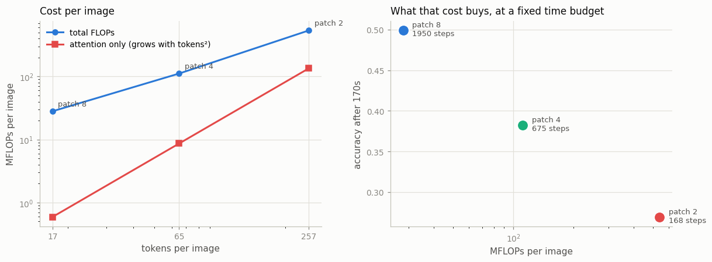
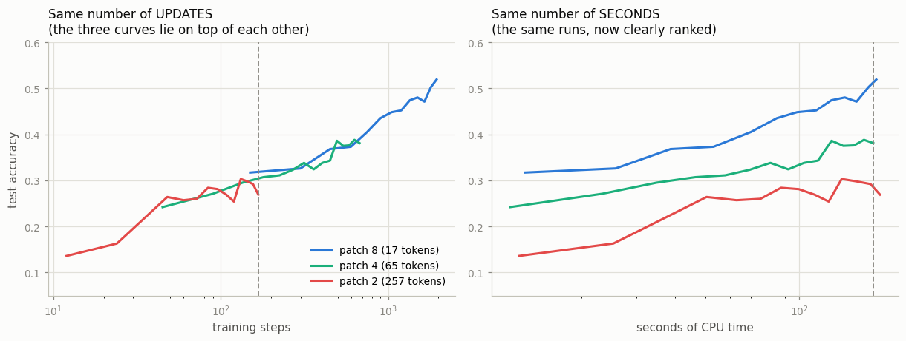

# Patch-Size Study

## Key Insight

A [ViT](/shared/glossary/#vit)'s [patch](/shared/glossary/#patch) size is the single knob that trades accuracy for compute. Halving the patch edge (32 → 16 → 8) quarters the area each token covers, so the token count rises — and because [attention](/shared/glossary/#attention) cost grows with the square of the sequence length, the [FLOPs](/shared/glossary/#flops) climb steeply, buying the fine detail the model needs for small objects and text. Running one ViT at patch 8, 16, and 32 and plotting accuracy against FLOPs lets you *see* that curve and pick the smallest patch you can afford — exactly the tradeoff the "/16" or "/8" suffix in a name like ViT-B/16 is quietly announcing.

## The setup

This project imports project [04](../04-implement-vit-from-scratch/README.md)'s `vit.py` unchanged — same architecture, same optimizer, same data — so patch size is genuinely the only variable.

**On the numbers used.** CIFAR-10 images are 32×32, so patch 8 / 4 / 2 give **17 / 65 / 257** [tokens](/shared/glossary/#token-visualaudio). Those are the same token counts a 224×224 ViT gets from patch 56 / 28 / 14 — the guide's "8, 16, 32" sweep rescaled to an image seven times smaller in each direction. What a transformer actually feels is the **number of tokens**, not the pixel width of a patch, and 257 tokens is squarely in ViT-B/16 territory (196).

- **Model:** width 128, 4 layers, 4 heads, ~0.82M parameters at every patch size.
- **Budget:** every run gets the same **170 seconds of CPU**, and logs (step, seconds, accuracy) as it goes.
- **Cost:** ~9.5 minutes for the whole sweep.

### Why a time budget instead of a step count

Give every run 1,000 steps and you have not run a fair experiment — you have handed the expensive model twenty times more compute and then congratulated it for winning. Giving every run the same *seconds* is what an engineer with one machine and one afternoon actually faces.

The trick that makes this cheap: because each run logs both its step count and its elapsed time at every evaluation, **one set of runs answers both questions.** Slice the curves vertically at a common step count and you get the equal-updates comparison; slice at a common time and you get the equal-compute one. No second sweep needed.

One detail this requires: the [learning rate](/shared/glossary/#learning-rate) is held **constant** after warmup rather than decayed on a cosine schedule. With a decaying schedule a run is only "finished" at its own final step, so reading an early slice would compare a half-annealed model against a fully-annealed one. A flat rate makes every prefix of a run a legitimate checkpoint. (It also costs a few points of final accuracy — project [04](../04-implement-vit-from-scratch/README.md)'s patch-4 model reaches 0.50 *with* cosine decay where this one reaches 0.38 without. That is the price of a clean two-axis read, and it is charged equally to all three runs.)

## Step 1: what the tokens cost

Measured with `torch.utils.flop_counter.FlopCounterMode`, which instruments the real tensor operations rather than applying a formula:

| patch | tokens | MFLOPs/image | attention share | raw numbers per patch → 128-d |
|---|---|---|---|---|
| 8 | 17 | 28.1 | **2.1%** | 192 → 128 (**1.50×**, lossy) |
| 4 | 65 | 111.7 | **7.7%** | 48 → 128 (0.38×) |
| 2 | 257 | 540.3 | **25.0%** | 12 → 128 (0.09×) |



**Total cost grows about 19× from patch 8 to patch 2**, and the attention share grows from 2.1% to 25.0%. That climb is the quadratic term becoming visible: every other layer in a transformer processes each token independently, so its cost grows in proportion to the token count, but attention compares **every token against every other token**, so its cost grows with the token count *squared*. At 17 tokens the comparison table has 289 entries and is a rounding error; at 257 tokens it has 66,049 and is a quarter of the model.

> **A tooling trap worth knowing.** `FlopCounterMode` does not know how to price the fused `scaled_dot_product_attention` kernel on CPU and silently counts it as **zero** — which would have hidden exactly the term this project is about. `stage_flops` therefore builds the model with `fast=False`, which spells attention out as two ordinary batched matrix multiplies that the counter does understand. Project [04](../04-implement-vit-from-scratch/README.md)'s verification stage confirms the two paths agree to 1 × 10⁻⁷, so nothing is being measured except the same math written differently.

The last column is worth a moment. A patch-8 tile holds 8 × 8 × 3 = **192 raw numbers** and gets projected into a 128-dimensional vector, so that projection is genuinely **lossy** — 1.5 numbers in for every 1 out. Patch 2 holds 12 numbers projected into 128 dimensions, which is pure expansion and loses nothing. So of the three, **only the largest patch throws pixel information away at the very first layer.** Keep that in mind for Step 3.

## Step 2: the same runs, read along two axes



| patch | steps completed in 170 s | equal-step accuracy (at 168 steps) | equal-time accuracy (at 173 s) |
|---|---|---|---|
| 8 | **1,950** | 0.317 | **0.502** |
| 4 | 675 | 0.295 | 0.381 |
| 2 | 168 | 0.269 | 0.292 |

**The left panel is the surprise: per update, patch size barely matters.** The three curves lie almost on top of each other. Patch 2 is actually *ahead* of patch 4 in the 30–100 step range (0.264 vs 0.242 at ~50 steps) before they converge. Whatever the extra 240 tokens are buying, it is not faster learning per gradient step.

**The right panel is the same three runs against the clock, and the ranking is decisive and never crosses.** Patch 8 completes 1,950 updates in the time patch 2 completes 168 — **11.6× more** — and finishes 21 points ahead.

Put plainly: **the smaller patch is not worse at learning; it is worse at being affordable.** Its disadvantage is almost entirely that each step costs 19× more, so it takes far fewer of them. That is a different failure mode from "this architecture is bad", and it is the one that actually governs decisions when you have a fixed machine and a deadline.

## Step 3: the honest inversion — fine detail you do not need is not worth buying

The Key Insight above says smaller patches buy "the fine detail the model needs for small objects and text." **On this benchmark that detail is worth nothing**, and patch 8 wins on *both* axes.

The reason is not a flaw in the reasoning; it is a mismatch between the reasoning and the task. Look at what CIFAR-10 actually is: a 32×32 thumbnail where a single object fills most of the frame. There are no small objects, because there is only one object. There is no text. There is nothing at a finer scale than about eight pixels, because at 32×32 there is barely anything at all.

And Step 1 said the patch-8 projection is lossy — it compresses 192 numbers into 128. So we can be precise about the result: **the model that discards pixel information at layer one still wins, which means the information it discarded was not useful for this task.**

That is exactly why real ViTs are built the other way. A 224×224 photo of a street *does* have small objects, distant faces, and readable signs, and 16-pixel patches at that resolution cover a small fraction of the scene. The DINOv2 model project [05](../05-compare-encoders/README.md) benchmarks goes further still — **DINOv2-B/14** uses 14-pixel patches, giving 256 tokens instead of 196, and pays for it in exactly the way this project measures: it is the slowest of the four encoders there despite having fewer parameters than SigLIP.

So the rule is not "smaller patches are better if you can afford them." It is:

> **Match the patch to the scale of the detail your task actually contains — then buy the smallest patch that still fits your compute budget.**

Both halves matter. Choose a patch finer than your task's detail and you pay quadratically for nothing, which is what patch 2 does here. Choose one coarser and you destroy information you needed, which is what a patch-8 ViT would do on a document-OCR task.

This is the third time in Phase 2 that the same shape of lesson appears — project [04](../04-implement-vit-from-scratch/README.md) found that positional information is used but barely needed on CIFAR-10, and project [06](../06-mel-spectrogram-pipeline/README.md) found that 8 mel bins beat 80. In all three cases extra resolution was genuinely available and genuinely useless, because the task had no structure at that scale.

## What's in this directory

| file | what it is |
|---|---|
| `run.py` | stages: `flops`, `train`, `slices`, `figures`. Imports `vit.py` from project [04](../04-implement-vit-from-scratch/README.md). |
| `outputs/flops.csv` | measured FLOPs, attention share, and the compression ratio |
| `outputs/training.json` | the full (step, second, accuracy) curve for each patch size |
| `outputs/slices.csv`, `slice_points.json` | the equal-step and equal-time reads |
| `outputs/two_axes.png` | the same runs along both axes |
| `outputs/flops_vs_accuracy.png` | cost per image, and what it buys |

## How to run

```bash
python3 run.py --stage flops     # ~10 s, no training
python3 run.py --stage all       # ~9.5 min (3 runs × 170 s + evaluation)
```

CIFAR-10 is read from project [04](../04-implement-vit-from-scratch/README.md)'s `data/` cache, so run that project first (or let this one download it).

## Takeaways

1. **Patch size sets token count, and token count sets everything else.** 17 / 65 / 257 tokens costs 28 / 112 / 540 MFLOPs per image — a 19× spread from one integer.
2. **You can watch attention's quadratic term appear.** Its share of total FLOPs goes 2.1% → 7.7% → 25.0% as tokens grow, because attention compares every token with every other one while every other layer sees each token alone.
3. **Budget by wall clock, not by steps.** Equal step counts hand the expensive model 19× the compute and then declare it the winner. One time-budgeted run per config, logging both axes, answers both questions.
4. **Per update, patch size barely mattered here** — the three curves overlap, and patch 2 briefly leads. **Per second, patch 8 finished 21 points ahead** after fitting 11.6× more updates into the same 170 seconds. The small patch is not a worse learner; it is a more expensive one.
5. **Patch 8 wins even though its projection is lossy.** It compresses 192 raw numbers into 128 dimensions while patch 2 expands 12 into 128 — and still wins, which proves the discarded detail was not needed.
6. **The rule is matching, not minimizing.** Pick the patch size to the scale of detail your task contains, then take the largest one that still captures it. Finer than that costs quadratically for nothing; coarser destroys what you need.
7. **The "/14" and "/16" in a model name are this decision, published.** DINOv2-B/14 is the slowest encoder in project [05](../05-compare-encoders/README.md) for exactly the reason measured here.
