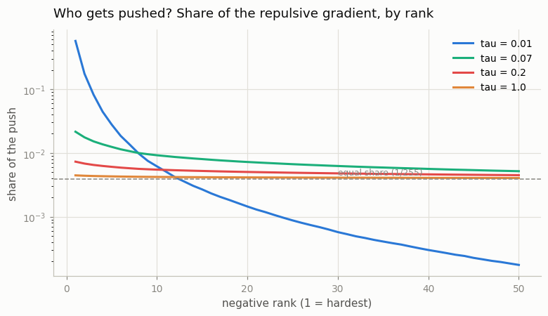
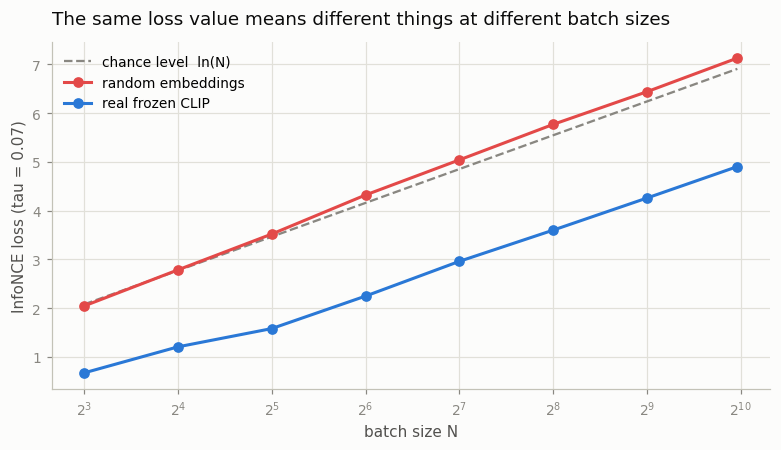
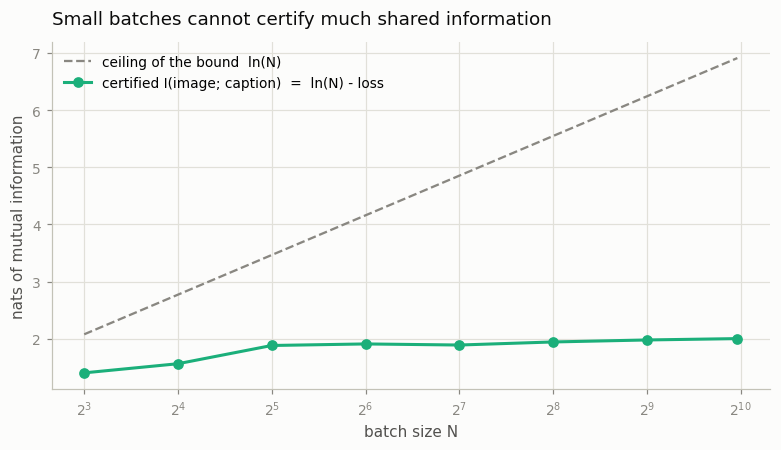
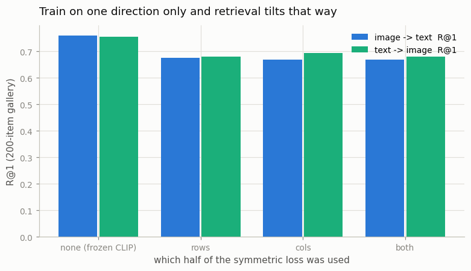

# Implement InfoNCE

## Key Insight

Writing [InfoNCE](/shared/glossary/#infonce) — the [contrastive](/shared/glossary/#contrastive-learning) [loss](/shared/glossary/#loss-function) at the heart of [CLIP](/shared/glossary/#clip) and almost every [dual encoder](/shared/glossary/#dual-encoder) — by hand demystifies it: once you have [L2-normalized](/shared/glossary/#l2-normalization) the image and text [embeddings](/shared/glossary/#embedding) and built the N×N [cosine-similarity](/shared/glossary/#cosine-similarity) grid with a single [matmul](/shared/glossary/#matmul), the loss is just [cross-entropy](/shared/glossary/#cross-entropy) with the [softmax](/shared/glossary/#softmax) pushed toward the diagonal. The subtlety the formula hides is that it is *symmetric* — you run it once down the rows (each image picks its caption) and once down the columns (each caption picks its image), then average the two; skipping one half quietly biases the model toward one [modality](/shared/glossary/#modality). Verifying the [gradients](/shared/glossary/#gradients) against a finite-difference estimate — nudging one input by a tiny ε and checking the loss moves by the amount the gradient predicts — is the cheapest way to catch a sign flip or a wrong axis before you waste a full training run.

## What this project is

No training. This is the one project in the phase where you can check *everything* against an independent answer, so the whole thing runs in about 13 seconds once [CLIP](/shared/glossary/#clip)'s embeddings are cached.

We do four things:

1. **Verify** the hand-written loss against `torch.nn.functional.cross_entropy`, the hand-derived gradient against autograd, and autograd against [finite differences](/shared/glossary/#finite-difference).
2. **Dissect the gradient** — find out which of the wrong answers actually receives the pushing-apart force.
3. **Show that an InfoNCE number is meaningless on its own** without the batch size that produced it, and connect that to what the loss is secretly measuring.
4. **Test the symmetry claim in the Key Insight above** — and report what we actually found, which is not what the claim predicts.

Everything runs on **real** frozen CLIP embeddings of 1,000 [COCO](/shared/glossary/#coco) image–caption pairs (reused from project [02](../02-visualize-the-modality-gap/README.md)), so the numbers describe a real model, not a synthetic toy.

## Decoding the name: why "InfoNCE"?

The name is two abbreviations glued together, and both halves explain something about the loss.

**NCE = [Noise-Contrastive Estimation](/shared/glossary/#noise-contrastive-estimation)**, an idea from 2010. Suppose you want to fit a probability model but the normalizing constant is too expensive to compute. NCE's trick is to *not compute it*: mix your real data with samples from a known "noise" source and train a classifier to tell real from noise. A model that can separate data from noise has implicitly learned the data's distribution. The word "contrastive" is literal — the true example is *contrasted against* noise.

**Info = mutual information.** The loss turns out to be a lower bound on the [mutual information](/shared/glossary/#mutual-information) between the two views — roughly, how much knowing the image tells you about the caption. Step 3 measures that bound directly.

So InfoNCE is: *estimate how much two things share, by making the model tell the true pair apart from noise*. In CLIP the "noise" is not sampled from anywhere fancy — it is simply the other pairs that happen to be in the same [batch](/shared/glossary/#batch).

## The loss, written out

For a batch of N pairs, after [L2-normalizing](/shared/glossary/#l2-normalization) every vector:

```
S = (V @ U.T) / tau        # (N, N) grid; S[i, j] = cos(image i, caption j) / tau

row loss for image i:      -S[i, i] + log( sum_j exp(S[i, j]) )
column loss for caption j: -S[j, j] + log( sum_i exp(S[i, j]) )

loss = 0.5 * (mean over rows + mean over columns)
```

The `-S[i,i] + logsumexp(...)` shape *is* cross-entropy: "out of these N candidates, the right one is number i."

> **Why [L2-normalize](/shared/glossary/#l2-normalization) at all, when we are about to divide by a temperature anyway?** They do different jobs. Normalizing puts every vector on the unit sphere so the dot product *becomes* the cosine — an angle, immune to how long the vectors happen to be. Without it, a model could shrink the loss by simply making some vectors longer, which is a scaling trick rather than a change in meaning. Only *after* the scores are angles does dividing by τ mean something consistent. **Where does the "L2" in the name come from?** From the *p* in the general L*p* norm, `(Σ|x_i|^p)^(1/p)`. Set p = 2 and you get `sqrt(Σ x_i²)` — ordinary straight-line length, the one from Pythagoras. So "L2 normalization" just means "divide by the ordinary length."

## Step 1: does the code do what the formula says?

Three independent checks, all on the same 256 real CLIP pairs at τ = 0.07:

| check | what it compares | largest disagreement |
|---|---|---|
| hand-written loss vs `F.cross_entropy` | rows / columns / symmetric | **4.4 × 10⁻¹⁶** |
| hand-derived gradient vs autograd | `dL/dS = (softmax(S) − I) / N` | **8.7 × 10⁻¹⁹** |
| autograd vs [finite differences](/shared/glossary/#finite-difference) | 40 probes into the image embeddings | **1.9 × 10⁻¹²** |
| autograd vs finite differences | 40 probes into the text embeddings | **3.6 × 10⁻¹²** |

All four are at the floor of float64 rounding error, which is the answer you want. The last two are the ones worth internalizing as a habit: a **finite-difference check** needs no theory at all. Nudge one input up by a tiny ε, nudge it down by ε, and see how much the loss moved:

```
(loss(x + eps) - loss(x - eps)) / (2 * eps)   ≈   dL/dx
```

If that number disagrees with your gradient, one of them is wrong, and it is almost always the gradient. This catches sign flips and transposed axes — the two bugs that otherwise show up as "my model trains but badly", three hours later.

One number from the table is not an error check but a fact about the loss: the **row half and the column half disagree by 0.0099** (3.6047 vs 3.5947) on the very same matrix. They are genuinely different quantities — the row [softmax](/shared/glossary/#softmax) normalizes across captions, the column softmax across images — which is why CLIP averages both instead of picking one.

## Step 2: the gradient goes almost entirely to the hardest negative

Differentiating the row loss gives a formula small enough to read:

```
dL/dS[i, j]  =  ( P[i, j] − [i == j] ) / N,      where P = softmax across row i
```

In plain language: **every candidate is pushed down in proportion to how much probability the model currently gives it, and the true pair is pulled up by one full unit.** So a wrong caption the model already scores near zero receives a gradient near zero. It contributes nothing. It is, for training purposes, not there.

That has a consequence you can measure. Take the softmax probabilities on the 255 wrong captions in a row, sort them hardest-first, and ask how the pushing force is divided up:



| τ | loss | share of the push taken by the single hardest negative | negatives needed to account for half the push | *effective* number of negatives |
|---|---|---|---|---|
| **0.01** | 0.934 | **57.0%** | **1** | **2.7** |
| **0.07** (CLIP's init) | 3.600 | 2.2% | 74 | 178.5 |
| 0.2 | 4.824 | 0.7% | 109 | 245.8 |
| 1.0 | 5.398 | 0.4% | 124 | 254.6 |

The last column is the honest count of how many negatives are doing work — computed as `1 / Σw²`, which equals 255 when the weights are perfectly even and 1 when a single negative takes everything. Read the extremes:

- **At τ = 0.01, a batch of 256 behaves like a batch of about 3.** One negative absorbs 57% of the force; the other 254 are ignored. You paid for 255 negatives and got the benefit of two or three.
- **At τ = 1.0, all 255 negatives are treated almost identically** — including the ones that are obviously, uselessly wrong. The gradient is diluted across noise.

τ = 0.07, the value CLIP initializes to, sits in between: 178 effective negatives out of 255 — focused, but not tunnel-visioned. **This single table is why [temperature](/shared/glossary/#temperature) matters so much** (project [13](../13-temperature-ablation/README.md) trains at each setting) **and why [hard-negative mining](/shared/glossary/#hard-negatives) is worth doing at all** (project [12](../12-hard-negative-mining/README.md)): if only the hardest negatives teach anything, you may as well put hard ones in the batch on purpose.

Note the middle column of the table: **the in-batch accuracy is 0.7305 at every τ.** Temperature cannot change which caption scores highest, only by how much — it is a monotone rescaling. It changes the *gradient*, not the *ranking*.

## Step 3: an InfoNCE number is meaningless without its batch size



The same frozen CLIP, evaluated on batches of different sizes:

| batch N | chance level `ln(N)` | loss, random embeddings | loss, **real CLIP** | in-batch top-1 accuracy |
|---|---|---|---|---|
| 8 | 2.079 | 2.046 | **0.674** | 1.000 |
| 32 | 3.466 | 3.520 | 1.582 | 0.969 |
| 128 | 4.852 | 5.041 | 2.960 | 0.805 |
| 512 | 6.238 | 6.438 | 4.258 | 0.629 |
| 1000 | 6.908 | 7.129 | **4.904** | 0.548 |

Two things a beginner will otherwise trip over:

**The chance level is `ln(N)`, not zero.** If the model has no idea, it spreads probability evenly over N candidates, each gets 1/N, and the loss is `−log(1/N) = ln(N)`. The "random embeddings" column lands on it, as it must. So a loss of 3.0 is *excellent* at N = 1000 (chance 6.91) and *worse than guessing* at N = 8 (chance 2.08).

**A rising loss can mean nothing changed.** CLIP's loss climbs from 0.674 to 4.904 across this table, and the model is byte-for-byte identical throughout. Only the exam got harder. **Never compare InfoNCE losses across different batch sizes.** If you must, divide by `ln(N)` first — that is exactly what project [10](../10-tiny-clip/README.md)'s loss-curve plot does.

### What the loss is secretly measuring



InfoNCE is a lower bound on the [mutual information](/shared/glossary/#mutual-information) between images and captions:

```
I(image ; caption)  >=  ln(N) − loss
```

Filling in the numbers above:

| batch N | ceiling of the bound `ln(N)` | mutual information this batch can certify |
|---|---|---|
| 8 | 2.079 | 1.406 nats |
| 32 | 3.466 | 1.884 nats |
| 128 | 4.852 | 1.892 nats |
| 1000 | 6.908 | **2.004 nats** |

**Here is the non-obvious consequence, and it is the strongest argument for large batches there is.** The bound can never exceed `ln(N)`. A batch of 32 cannot certify more than 3.47 nats of shared information *no matter how good your model is* — the measuring instrument tops out below the thing being measured. The bound tightens as the batch grows (1.41 → 2.00 nats here) not because CLIP improved — it is the same frozen model — but because a bigger lineup is a more demanding test, and passing a more demanding test proves more.

That is the mathematical version of "bigger batches are better in contrastive learning." Project [10](../10-tiny-clip/README.md) checks whether it survives contact with a real training run on a fixed CPU budget. (Partly, it turns out.)

## Step 4: the symmetry claim, tested — and an honest correction

The Key Insight above says that using only half the loss "quietly biases the model toward one modality." We tried to demonstrate that, and **on this setup we could not.**

The experiment: train a small aligner on top of the frozen CLIP features with rows-only, columns-only, and symmetric loss, then measure retrieval both ways over a 200-item [gallery](/shared/glossary/#gallery).

> **Why the aligner is a zero-initialized residual, `out = x + W·x` with `W = 0`.** A plain `nn.Linear` starts from random weights, so step 0 already scrambles CLIP's features and all three conditions begin from a broken model — you would be comparing three kinds of damage rather than three losses. With the residual at zero, the model *at step 0 is exactly frozen CLIP*, so any difference between the conditions has to have been produced by the loss. (This is Flamingo's [gating](/shared/glossary/#gated) trick from Phase 4, borrowed for an experiment.)



| loss used | image→text R@1 | text→image R@1 | the gap |
|---|---|---|---|
| none (frozen CLIP, the starting point) | 0.760 | 0.755 | +0.005 |
| **rows only** (each image picks its caption) | 0.675 | 0.680 | −0.005 |
| **columns only** (each caption picks its image) | 0.670 | 0.695 | −0.025 |
| **symmetric** (both halves averaged) | 0.670 | 0.680 | −0.010 |

The three trained conditions are within 2.5 points of each other, which is inside the noise of a 200-item test set. There is no tilt to see.

**Why not?** The mechanism is measurable. Look at how much gradient each half of the loss delivers to each tower:

| loss used | gradient norm on the **image** embeddings | on the **text** embeddings |
|---|---|---|
| rows only | 0.0539 | 0.0761 |
| columns only | 0.0547 | 0.0739 |
| symmetric | 0.0540 | 0.0745 |

They are practically identical. The row-only half already pushes on the text embeddings just as hard as the column-only half does — because both halves act through the *same* similarity matrix, and every entry of that matrix depends on both towers. The two halves are far more redundant than the loss's shape suggests.

**Two honest caveats on this null result:**

- **The towers here are frozen.** Only a thin residual is being trained. Project [10](../10-tiny-clip/README.md) reruns the same comparison with both towers trained from scratch, where there is much more room for a bias to develop.
- **All three trained conditions are worse than not training at all** (0.67–0.68 vs 0.76). Fine-tuning a strong model on 800 pairs damages it. That is its own lesson, and it is why this stage compares the three conditions to *each other* rather than treating any of them as an improvement.

What the data *does* support is the narrower claim from Step 1: the two halves compute genuinely different numbers (3.6047 vs 3.5947). Averaging them is cheap and principled, and there is no reason to skip one. Just do not expect skipping one to be a dramatic bug at this scale.

## What's in this directory

| file | what it is |
|---|---|
| `infonce.py` | the loss written by hand, the reference version, the analytic gradient, the finite-difference checker |
| `run.py` | stages: `verify`, `anatomy`, `floor`, `symmetry` |
| `outputs/verification.json` | every number in the Step 1 table |
| `outputs/anatomy.csv` | the push-weight table |
| `outputs/push_weights.png` | how the repulsive gradient is divided among negatives |
| `outputs/batch_size.csv` | loss, accuracy and the mutual-information bound at each batch size |
| `outputs/batch_size.png`, `outputs/mi_bound.png` | the two Step 3 figures |
| `outputs/symmetry.csv`, `outputs/gradient_pressure.json` | the Step 4 result and its mechanism |
| `outputs/symmetry.png` | the Step 4 figure |

## How to run

```bash
python3 run.py --stage all       # ~13 s once the CLIP embeddings are cached
python3 run.py --stage verify    # the correctness checks alone, ~4 s
```

The COCO images and their CLIP embeddings are cached in project [02](../02-visualize-the-modality-gap/README.md)'s gitignored `data/` directory and downloaded automatically on first run (~90 s).

## Takeaways

1. **The loss is cross-entropy on a similarity grid.** One [matmul](/shared/glossary/#matmul), one [softmax](/shared/glossary/#softmax) per row, one per column, average. There is no hidden machinery.
2. **Check the gradient with finite differences before you train.** It costs seconds, needs no derivation, and catches the sign and axis errors that otherwise look like "the model just doesn't learn well." Ours agreed to 2 × 10⁻¹².
3. **Only the hard negatives receive gradient.** At τ = 0.07 a batch of 256 has 178 *effective* negatives; at τ = 0.01 it has 2.7. This one measurement motivates both project [12](../12-hard-negative-mining/README.md) and project [13](../13-temperature-ablation/README.md).
4. **Temperature changes the gradient, not the ranking.** In-batch accuracy was 0.7305 at every τ from 0.01 to 1.0 — it is a monotone rescaling of the scores.
5. **Never compare InfoNCE across batch sizes.** Chance is `ln(N)`. The same frozen CLIP "scores" 0.674 at N = 8 and 4.904 at N = 1000.
6. **The loss is a bound on shared information, capped at `ln(N)`.** A batch of 32 can certify at most 3.47 nats however good the model is — the cleanest argument for big batches, and it is arithmetic, not folklore.
7. **The two halves of the symmetric loss are more redundant than they look.** We measured no directional bias from dropping one, and the reason is visible in the gradients: both halves push on both towers about equally. Average them anyway — it is free — but do not expect drama.
