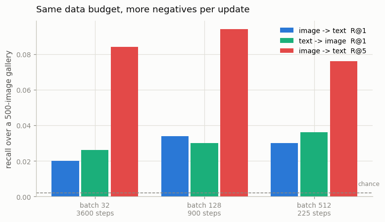
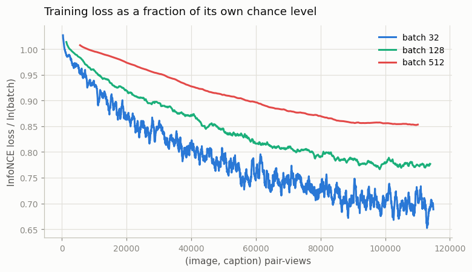
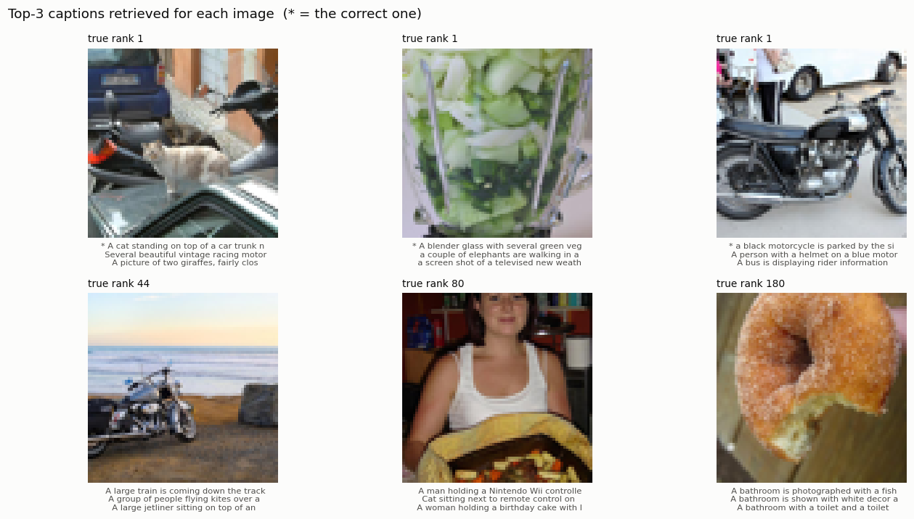

# Tiny CLIP

## Key Insight

Building a small [CLIP](/shared/glossary/#clip) end to end — a little [ViT](/shared/glossary/#vit) for images, a small transformer [text encoder](/shared/glossary/#text-encoder), and the [InfoNCE](/shared/glossary/#infonce) loss tying them together — shows how little the architecture matters and how much the training setup does. The single biggest lever is [batch size](/shared/glossary/#batch): every other caption in the batch acts as a negative example, so a batch of 1,024 gives each image a thousand wrong answers to be pushed away from, while a batch of 32 gives it only thirty-one and learns a far blurrier shared space. Train it on a modest set of image–caption pairs and you reproduce CLIP's headline trick in miniature — [zero-shot](/shared/glossary/#zero-shot) matching of unseen captions to images — while feeling firsthand why the original paper fought so hard for huge batches.

## What gets built

Two towers and one loss. This is the whole model:

```
image  (64x64)  --> ViT: 16px patches -> 17 tokens, d=128, 4 layers --> 128-d vector
caption (words) --> transformer: 20 tokens, d=128, 2 layers        --> 128-d vector

                    L2-normalize both, dot them, divide by tau,
                    symmetric InfoNCE (project 09)
```

**1.56M parameters in total** — about 0.5% of CLIP B/32's 151M. Everything else in this phase (projects [12](../12-hard-negative-mining/README.md), [13](../13-temperature-ablation/README.md), [14](../14-data-filtering-with-clip/README.md)) reuses this exact model from `tiny_clip.py`, so when project 12 reports "hard negatives beat random negatives", the *only* thing that differed between the two runs is which pairs shared a batch.

| | |
|---|---|
| **data** | 5,000 [COCO](/shared/glossary/#coco) images with their 5 human captions each; 4,500 for training, **500 held out** |
| **vocabulary** | 2,361 words appearing ≥5 times (CLIP uses [BPE](/shared/glossary/#bpe); at this scale whole words are plenty) |
| **evaluation** | [Recall@K](/shared/glossary/#recall-at-k) over a 500-image [gallery](/shared/glossary/#gallery) — chance R@1 is 0.002 |
| **cost** | ~145 ms per step at batch 128 on 12 CPU threads |

> **Why 16-pixel patches on a 64-pixel image — a 4×4 grid, which sounds far too coarse?** Because the budget is wall-clock, not steps. 8-pixel patches give 65 [tokens](/shared/glossary/#token-visualaudio) instead of 17 and cost 3× as much per step, so the same three minutes buys a third as many updates. Measured directly: 8px patches for 400 steps reach R@1 0.006; 16px patches for 1,200 steps reach 0.040. On a fixed CPU budget the extra steps are worth far more than the extra detail — Phase 2 project [08](../08-patch-size-study/README.md)'s finding, arriving again. Match the patch to the task; do not minimize it.

> **The data-augmentation detail.** Images are cached at 72×72 and randomly cropped to 64×64 (plus a random horizontal flip) during training, and centre-cropped at evaluation. With only 4,500 images, [augmentation](/shared/glossary/#data-augmentation) is close to free extra data. Captions are augmented for free too: COCO ships five per image and we resample which one is used every time the image appears.

## The experiment: what does "bigger batch is better" actually mean?

The Key Insight's claim needs care, because "bigger batch" can mean two different experiments and they give different answers.

- **Equal *data* budget** — every run sees the same number of (image, caption) pair-views. Batch 512 then gets one sixteenth as many optimizer steps as batch 32. This isolates the effect of *more negatives per update*.
- **Equal *update* budget** — every run does 300 steps. Batch 512 then sees 16× more data than batch 32. This is the framing where big batches "obviously" win — but partly for the wrong reason.

We ran both. The learning rate is scaled by `sqrt(batch / 128)` in every run, the usual default: a larger batch averages more examples per update, so its gradient is less noisy and it can safely take a bigger step.

## Step 1: equal data budget — bigger wins, then stops winning



Every run sees 115,200 pair-views:

| batch | steps | wall clock | i2t R@1 | i2t R@5 | i2t R@10 | t2i R@1 |
|---|---|---|---|---|---|---|
| 32 | 3,600 | 177 s | 0.020 | 0.084 | 0.148 | 0.026 |
| **128** | **900** | **140 s** | **0.034** | **0.094** | **0.158** | 0.030 |
| 512 | 225 | 118 s | 0.030 | 0.076 | 0.142 | **0.036** |

First, the sanity check: **R@1 of 0.034 against a 500-image gallery is 17× chance**, and R@10 of 0.158 is 7.9× chance. A 1.56M-parameter model trained for two minutes on 4,500 photographs has learned something real about the relationship between pictures and English.

Now the result. Going from batch 32 to 128 gives **+70% relative on i2t R@1** (0.020 → 0.034) *while doing four times fewer updates*. That is the Key Insight's claim, confirmed: the extra negatives are worth more than the extra steps.

**But batch 512 does not continue the trend — it dips back to 0.030.** This is the honest boundary of the claim. At a fixed data budget, a bigger batch buys negatives by spending updates, and 225 updates is simply not enough to train a network from random initialization. The real CLIP paper used batch 32,768 *and* hundreds of thousands of steps; it never had to choose. On a fixed budget you do.

**The right reading is that batch size trades negatives against updates, and there is an interior optimum.** Here it is 128. "Bigger is better" is true up to the point where you run out of gradient steps.

### The training loss ranks the runs differently from the test set



The curves are plotted as `loss / ln(batch)` — each divided by *its own* chance level, because as project [09](../09-implement-infonce/README.md) showed, a raw InfoNCE number is not comparable across batch sizes. Batch 32's chance is 3.47 and batch 512's is 6.24, so the raw losses (2.39 vs 5.32) cannot be put on one axis.

| batch | final training loss | its chance level `ln(N)` | loss as a fraction of chance |
|---|---|---|---|
| 32 | 2.394 | 3.466 | **0.691** ← best |
| 128 | 3.773 | 4.852 | 0.778 |
| 512 | 5.320 | 6.238 | 0.853 |

**By the normalized training loss, batch 32 wins — and on held-out retrieval it loses.** Two reasons, both worth knowing:

1. Batch 32 did 3,600 passes over 4,500 images, so it saw each image many times and fitted them better; the held-out set does not care.
2. A 32-way multiple-choice question is genuinely easier than a 512-way one, and dividing by `ln(N)` corrects for the *chance* level but not for the difficulty curve above chance.

**Never rank contrastive runs by training loss across different batch sizes.** Evaluate retrieval on held-out data. This is the same lesson as [09](../09-implement-infonce/README.md)'s Step 3, now with a case where following it changes the answer.

## Step 2: equal update budget — clean and monotone, and partly a trick

Every run does exactly 300 steps, so the large batches also see more data:

| batch | pair-views seen | wall clock | i2t R@1 | i2t R@10 | t2i R@1 |
|---|---|---|---|---|---|
| 32 | 9,600 | 18 s | 0.002 (= chance) | 0.058 | 0.000 |
| 128 | 38,400 | 40 s | 0.010 | 0.108 | 0.016 |
| **512** | **153,600** | **137 s** | **0.026** | **0.158** | **0.042** |

Perfectly monotone — and you should distrust it. Batch 512 here saw **16× more data** than batch 32, so this table conflates "more negatives" with "more data" and cannot separate them. It is the comparison people usually show, and it is why Step 1's equal-data version is the one to trust.

There is one thing this table shows that Step 1 cannot: **batch 32 at 300 steps is at chance.** 9,600 pair-views is not enough to leave the ground. Small batches are not just slower per unit of progress; below some point they make no progress at all in the time you have.

## Step 3: what the model actually retrieves



Three queries the model got right and three it got badly wrong, from the batch-128 model, over the 500-image held-out gallery:

| true rank | the correct caption | what the model ranked first |
|---|---|---|
| **1** | *A cat standing on top of a car trunk next to a parked…* | (correct) |
| **1** | *A blender glass with several green vegetables in it.* | (correct) |
| **1** | *a black motorcycle is parked by the side of the road* | (correct) |
| 44 | *A motorcycle is parked on the beach near the ocean.* | *A large train is coming down the track between a bea…* |
| 80 | *A lady holding up a pot roast while posing for a pho…* | *A man holding a Nintendo Wii controller in front of…* |
| 180 | *a sugar donut with a bite taken out of it* | *A bathroom is photographed with a fisheye filter.* |

The failures are informative. Rank 44 and rank 80 are **the right scene at the wrong level of detail** — a large vehicle beside a wide-open background, a person holding an object up to the camera. The model has learned the coarse layout and not the nouns. That is exactly what you would expect from 17 image tokens and 4,500 photographs: it sees composition, not objects. Rank 180 is simply a miss.

**Always look at retrieved examples, not only the metric.** "R@1 = 0.034" does not tell you whether the model is randomly wrong or systematically wrong at one level of abstraction, and those call for different fixes (more data vs. more resolution).

## Step 4: does the symmetric loss matter once the towers are trained from scratch?

Project [09](../09-implement-infonce/README.md) tested this on *frozen* CLIP features and found nothing. Here both towers are learned, so there is room for a bias to develop. Same 450 steps at batch 128, changing only which half of [InfoNCE](/shared/glossary/#infonce) is used:

| loss | i2t R@1 | t2i R@1 | i2t − t2i | matched cosine | mismatched cosine | text-side [uniformity](/shared/glossary/#alignment-and-uniformity) |
|---|---|---|---|---|---|---|
| **symmetric** | 0.014 | 0.024 | −0.010 | 0.322 | 0.224 | **−1.388** |
| **rows only** | 0.016 | 0.010 | +0.006 | 0.454 | **0.352** | **−1.071** |

Two findings, and the second is the interesting one.

**On retrieval, the tilt appears but is small.** Rows-only ("each image ranks the captions") loses 1.4 points of text→image while gaining 0.2 of image→text — the direction the Key Insight predicts, but a 1.6-point swing at R@1 values this small is barely above noise.

**On geometry, the effect is unmistakable.** Under rows-only the *text* embeddings partially collapse: mismatched pairs sit at cosine **0.352** instead of 0.224, and text-side uniformity worsens from −1.388 to −1.071 (less negative = points bunched together rather than spread over the sphere). The matched cosine rises too, to 0.454, but that is not a win — **everything** got closer together, matched and mismatched alike, which is the signature of [representation collapse](/shared/glossary/#representation-collapse) rather than of learning.

Why does dropping the column half do this? The column half is the only term that asks *each caption to pick out its own image among all the images*. Without it, nothing penalizes a caption for being generically similar to everything, so the text space contracts. The row half alone still trains both towers — project [09](../09-implement-infonce/README.md)'s gradient measurement showed that — but it never applies that particular pressure.

So the Key Insight's "quietly biases the model toward one modality" is **supported, with a correction to where you should look for it**: the damage shows up in the shape of the space well before it shows up in the score.

## What's in this directory

| file | what it is |
|---|---|
| `tiny_clip.py` | **the shared Phase-3 backbone** — data download and caching, the word tokenizer, both towers, the training loop, evaluation. Imported by projects 12, 13 and 14 |
| `run.py` | stages: `sweep`, `steps`, `examples`, `figures`, `direction` |
| `outputs/batch_sweep.csv`, `outputs/batch_sweep.png` | the equal-data-budget sweep |
| `outputs/equal_steps.csv` | the equal-update-budget sweep |
| `outputs/direction.csv` | the rows-only vs symmetric ablation |
| `outputs/loss_curves.png` | training loss normalized by each run's own chance level |
| `outputs/examples.png`, `outputs/examples.json` | retrieved captions for six held-out images |

## How to run

```bash
python3 run.py --stage all         # ~8 min:  sweep + examples + figures
python3 run.py --stage steps       # +3.5 min: the equal-update-budget sweep
python3 run.py --stage direction   # +2.5 min: rows-only vs symmetric
```

The first run downloads 5,000 COCO images into the gitignored `data/` (~4.5 minutes; the listing API is rate-limited, so the download backs off and resumes). Trained checkpoints go to the gitignored `checkpoints/`; every run is cached by tag, so re-running a stage is instant.

## Takeaways

1. **A working CLIP is two towers and one loss.** 1.56M parameters, two minutes of CPU, and held-out retrieval at 17× chance. The architecture really is the easy part.
2. **Bigger batches win — until they run out of updates.** At a fixed data budget, 32 → 128 gained 70% relative on R@1 with 4× fewer steps; 128 → 512 gave it back. There is an interior optimum, and where it sits depends on your budget, not on the loss.
3. **Beware the equal-steps version of that experiment.** It looks cleaner and monotone, but the big-batch run also saw 16× more data. Equal *data*, not equal *steps*, is the comparison that isolates negatives.
4. **Training loss ranked the runs differently from the held-out set** — batch 32 had the best loss-relative-to-chance and the worst retrieval. Contrastive losses at different batch sizes are not comparable even after normalizing.
5. **Match the patch size to your budget.** 16px patches beat 8px by 6× on this task, because they buy 3× more optimizer steps and the task has no fine detail worth resolving at 64×64.
6. **Read the retrieved captions.** The failures here are the right *scene* with the wrong *objects*, which points at resolution and data — a diagnosis no R@K number gives you.
7. **Drop half the symmetric loss and the space collapses before the score does.** Mismatched cosine went 0.224 → 0.352 and text uniformity −1.39 → −1.07, while R@1 barely moved. Watch geometry, not only accuracy.
