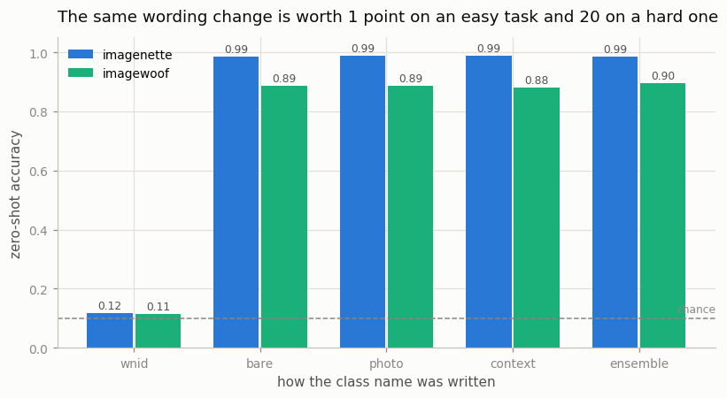
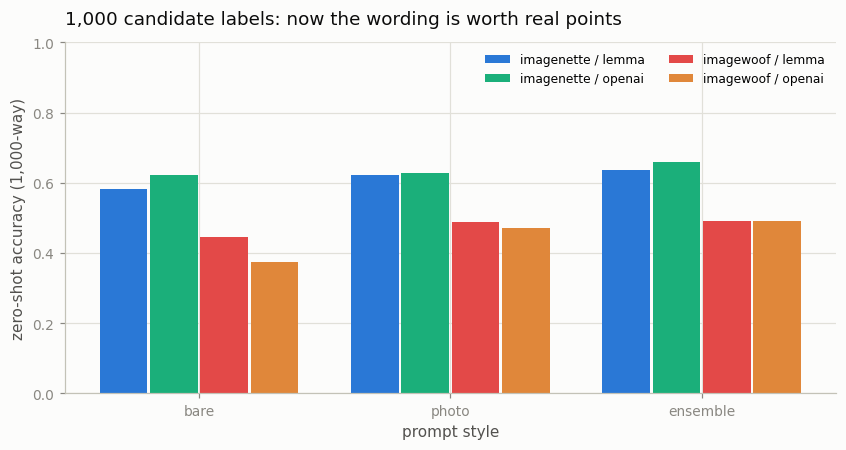
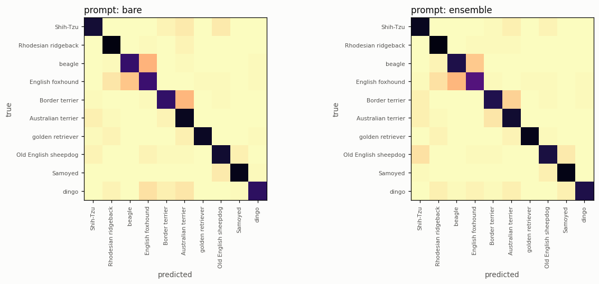

# Zero-Shot ImageNet

## Key Insight

[Zero-shot](/shared/glossary/#zero-shot) classification is [CLIP](/shared/glossary/#clip)'s most surprising trick, and this project runs it on the full 1,000-class [ImageNet](/shared/glossary/#imagenet) benchmark: with no training on its labels, you write each class name as a [prompt-template](/shared/glossary/#zero-shot) sentence like *"a photo of a golden retriever"*, encode it with the [text encoder](/shared/glossary/#text-encoder), and label each picture with the class whose sentence sits closest (by [cosine similarity](/shared/glossary/#cosine-similarity)) to its [image embedding](/shared/glossary/#image-embedding). What the project makes concrete is how much that wording moves the score: swapping a bare label for a natural caption, and averaging several templates ([prompt ensembling](/shared/glossary/#prompt-ensembling)), each lift accuracy by a measurable margin. The lesson is that with a model trained on enough image–text pairs, classification becomes [retrieval](/shared/glossary/#cross-modal-retrieval) — you are simply searching for the label whose description best fits the picture.

## The idea in one paragraph

A classifier is normally a learned matrix: one weight vector per class, fitted to labelled images. Zero-shot classification replaces that fitted matrix with one you **write in English**. Encode the sentence "a photo of a golden retriever" with CLIP's [text encoder](/shared/glossary/#text-encoder), [L2-normalize](/shared/glossary/#l2-normalization) it, and you have a weight vector for the class "golden retriever". Do that for every class, stack them, and one [matmul](/shared/glossary/#matmul) against an [image embedding](/shared/glossary/#image-embedding) gives you the scores. No [gradient](/shared/glossary/#gradients) ever flows. The "training" was typing.

That reframing is the point: **classification and [retrieval](/shared/glossary/#cross-modal-retrieval) become the same operation.** In project [03](../03-toy-retrieval/README.md) you searched a set of captions for the one matching an image; here the set of captions happens to be the 1,000 class names.

## The setup

| | |
|---|---|
| **model** | `openai/clip-vit-base-patch32`, frozen, never trained on anything here |
| **images** | 1,000 [Imagenette](https://github.com/fastai/imagenette) val images (10 easy ImageNet classes) and 1,000 Imagewoof val images (10 dog breeds), 100 per class |
| **label space** | either the 10 classes we hold images for, **or all 1,000 ImageNet classes** |
| **cost** | ~5 minutes cold: two ~95 MB downloads, then ~30 s of image encoding per dataset |

The two datasets are deliberately an easy task and a hard one. Imagenette's ten classes (tench, church, chain saw, parachute, …) were chosen by fast.ai to be visually unmistakable. Imagewoof's ten are *all dog breeds*, several of which look nearly identical.

> **Why we can evaluate against 1,000 classes while holding images for only 20.** This is the part of zero-shot that feels like cheating and is not. A class in this setup is *a sentence*, not a set of example images — so the candidate list can be as long as we like. We know each of our 20 classes' index in the standard ImageNet-1k ordering, so scoring an image against all 1,000 sentences and asking "was the argmax the right index?" is a genuine 1,000-way classification, exactly the benchmark the project is named after. The 980 classes we hold no images for still do real work: they are the distractors.

## Step 1: the control that proves it is reading words

Before any result, a check. If zero-shot really works by *understanding the class name*, then replacing the name with something meaningless should destroy it. ImageNet's folders are named with [WordNet](/shared/glossary/#wordnet) ids — `n01440764`, `n02086240` — so we have a meaningless name for every class ready to hand.

| prompt | imagenette (10-way) | imagewoof (10-way) | imagenette (1,000-way) | imagewoof (1,000-way) |
|---|---|---|---|---|
| **the WordNet id** (`n01440764`) | **0.117** | **0.114** | **0.000** | **0.000** |
| the class name ("tench") | 0.986 | 0.886 | 0.582 | 0.445 |
| chance | 0.100 | 0.100 | 0.001 | 0.001 |

The WordNet ids score exactly at chance in the 10-way setting and get **zero out of 2,000** in the 1,000-way setting. Nothing is memorized, nothing is looked up: CLIP is genuinely reading English.

## Step 2: with 10 classes, the wording barely matters



Scoring each image against only the ten classes we have images for:

| prompt style | example | imagenette | imagewoof |
|---|---|---|---|
| `bare` | `tench` | 0.986 | 0.886 |
| `photo` | `a photo of a tench.` | **0.988** | 0.885 |
| `context` | `a photo of a tench, a type of object.` | 0.987 | 0.881 |
| `ensemble` | 7 templates, averaged | 0.986 | **0.895** |

Everything sits within one point. On a 1,000-image test set, one point is roughly the noise, so **this table ranks nothing.** If you stopped here you would conclude that prompt engineering is a myth.

It is not. The benchmark is just too easy to detect it — the same trap projects [05](../05-compare-encoders/README.md) and [07](../07-whisper-encoder-reuse/README.md) hit in Phase 2. With ten candidates, the correct one wins by a mile whatever sentence you wrap it in. Prompt wording only matters when the competition is close.

## Step 3: put 1,000 labels on the table and the wording is worth 12 points



Same images, same model, same frozen features. The only change is that the classifier now has 1,000 columns instead of 10.

| class names from | prompt style | imagenette | imagewoof |
|---|---|---|---|
| WordNet ids | any | 0.000 | 0.000 |
| **lemma** (raw ImageNet names) | bare | 0.582 | 0.445 |
| lemma | `a photo of a {}.` | 0.622 | 0.487 |
| lemma | 7-template ensemble | 0.635 | 0.491 |
| **openai** (hand-edited names) | bare | 0.623 | **0.374** |
| openai | `a photo of a {}.` | 0.628 | 0.470 |
| **openai** | **7-template ensemble** | **0.660** | **0.491** |

Three things to pull out of this table.

**The wording is now worth real points.** On imagenette, the worst usable setting (bare lemma, 0.582) and the best (OpenAI names + ensemble, 0.660) differ by **7.8 points**. On imagewoof the spread across OpenAI-named settings alone is **11.7 points** (0.374 → 0.491). Same model, same images. Only the sentences changed.

**Accuracy collapsed when the label space grew — and the model is unchanged.** Imagenette went from 0.988 to 0.660. Nothing got worse; the exam got harder, because 990 new wrong answers joined the lineup. This is [gallery](/shared/glossary/#gallery) size again, the same effect project [09](../09-implement-infonce/README.md) measured on the loss and project [03](../03-toy-retrieval/README.md) measured on retrieval. **Any zero-shot number you read must come with its candidate list.**

**A genuine inversion: the "better" class names are 7 points *worse* on the dogs at `bare`.** OpenAI's hand-edited list scores 0.374 on imagewoof against the raw lemmas' 0.445. Their edits were made to disambiguate confusing *object* names ("kite" → "kite (bird of prey)"), which is why they help imagenette everywhere (+4.1 points at `bare`). For dog breeds the edits mostly rename and re-capitalize — the list writes `Shih Tzu` where ImageNet writes `Shih-Tzu`, `Beagle` where ImageNet writes `beagle` — and a bare breed name with no sentence around it is fragile to exactly that kind of surface change. Wrap the same names in `a photo of a {}` and the gap almost closes (0.470 vs 0.487); ensemble them and it closes completely (0.491 vs 0.491). **The sentence is doing the stabilizing, not the vocabulary.**

### Why the class names had to be edited at all

The raw ImageNet class names come from [WordNet](/shared/glossary/#wordnet) lemmas, which were never written to be read by a language model. Several are ambiguous out of context ("kite" is both a bird and a toy), several are archaic, and one is literally `n03000684` if you take the folder name. OpenAI released a hand-corrected list alongside CLIP; this project uses both so you can see what the correction is worth.

## Step 4: why averaging templates works, and the detail that makes it work



[Prompt ensembling](/shared/glossary/#prompt-ensembling) means encoding each class in several sentences and averaging the vectors into one weight per class. Here are the seven templates individually, in the 1,000-way setting:

| classifier | imagenette | imagewoof |
|---|---|---|
| `a photo of a {}.` | 0.628 | 0.470 |
| `a blurry photo of a {}.` | 0.632 | 0.473 |
| `a photo of the large {}.` | 0.636 | 0.464 |
| `a photo of the small {}.` | 0.648 | 0.436 |
| `a cropped photo of a {}.` | 0.641 | **0.477** ← best single |
| `a bright photo of a {}.` | 0.596 ← worst | 0.399 ← worst |
| `a photo of one {}.` | 0.629 | 0.459 |
| *mean of the seven* | 0.630 | 0.454 |
| **the ensemble of all seven** | **0.660** | **0.491** |

**The ensemble beats every single one of its members**, not merely their average: +1.2 points over the best template on imagenette, +1.4 on imagewoof. That is the non-obvious part. Averaging seven classifiers usually gets you something near the average of their scores; getting something *above the maximum* means the templates' errors are partly independent, so averaging cancels noise while the shared meaning survives.

You can check that independence directly. The seven sentence vectors for the same class agree at **cosine 0.919** on average (range 0.826 to 0.992) — close, but far from identical. If they were identical (cosine 1.0), averaging would change nothing at all.

> **The implementation detail that decides whether this works.** [L2-normalize](/shared/glossary/#l2-normalization) each sentence vector *before* averaging, then normalize the average again. If you skip the first normalization, sentences whose raw vectors happen to be longer dominate the average, and you are silently weighting templates by vector length instead of by relevance. Our `classifier_weights()` does the normalize-first version; it is what OpenAI's released code does too.

### What CLIP actually confuses

In the 1,000-way setting, **96% of imagewoof's mistakes name a class we hold no images for.** They are not confusions between the ten breeds in the folder — they are the other 110 dog breeds in ImageNet, which the 10-way benchmark never showed the model:

| true breed | recall (1,000-way) | most common wrong answers |
|---|---|---|
| Border terrier | 0.68 | Cairn Terrier, Australian Terrier, Lakeland Terrier |
| Samoyed | 0.71 | Kuvasz, dog sled, Great Pyrenees dog |
| Rhodesian ridgeback | 0.60 | Redbone Coonhound, Vizsla, Malinois |
| dingo | 0.55 | dhole, Basenji, upright piano |
| **English foxhound** | **0.24** | Treeing Walker Coonhound, Basset Hound, Beagle |
| **Australian terrier** | **0.23** | Australian Silky Terrier, Norwich Terrier, Yorkshire Terrier |

Every one of these is a defensible mistake — a Treeing Walker Coonhound genuinely looks like an English foxhound, and an Australian Silky Terrier genuinely looks like an Australian Terrier. (The "upright piano" for dingo is the exception, and worth keeping as a reminder that some fraction of any zero-shot error is just weirdness.) The model is not confused about *what kind of thing* it is looking at; it is losing fine-grained breed distinctions that a human without a dog book would also lose.

The 10-way confusion matrices above show the same story in miniature: the worst 10-way confusion in either direction is beagle ↔ English foxhound, at 15–16%.

## Step 5: how far is this from a *trained* classifier?

The number that gives zero-shot its meaning is what you would get if you did the normal thing and trained a head on labels. We fit a [linear probe](/shared/glossary/#linear-probe) — plain logistic regression — on the same frozen features, using 600 labelled training images (60 per class) that the zero-shot side never saw:

| dataset | best zero-shot (10-way) | linear probe, 600 labels | difference |
|---|---|---|---|
| imagenette | 0.988 | 0.989 | **+0.001** |
| imagewoof | 0.895 | 0.890 | **−0.005** |

**Zero-shot ties the supervised probe on both tasks.** The probe saw 600 labelled photographs; zero-shot saw a text file. On imagewoof zero-shot is even a hair ahead, which is within noise but certainly not behind.

Two honest qualifications, so you do not over-read this:

- **These 20 classes are real ImageNet classes and CLIP's training data is web-scale.** CLIP has certainly seen many pictures captioned "golden retriever". Zero-shot is not magic on concepts nobody photographs and captions.
- **A probe with 600 labels is not a strong ceiling.** With 60,000 labels a trained head would pull ahead. The claim is "zero-shot is competitive with a modest supervised baseline", not "labels are obsolete".

## What's in this directory

| file | what it is |
|---|---|
| `zeroshot.py` | dataset download and loading, fast text encoding, the 1,000-class label space, prompt construction, the linear probe |
| `run.py` | stages: `prompts`, `fullspace`, `ensemble`, `probe`, `confusion` |
| `outputs/prompts.csv`, `outputs/prompts.png` | the 10-way prompt sweep |
| `outputs/fullspace.csv`, `outputs/fullspace.png` | the 1,000-way sweep across name sources and prompt styles |
| `outputs/ensemble.csv`, `outputs/template_agreement.json` | per-template accuracies and how much the templates disagree |
| `outputs/probe.json` | zero-shot vs the supervised linear probe |
| `outputs/confusion.png`, `outputs/confusion.json` | the 10-way confusion matrices |
| `outputs/confusion_1000way.json` | per-breed recall and the top wrong labels in the full label space |

## How to run

```bash
python3 run.py --stage all         # ~5 min cold (two ~95 MB dataset downloads)
python3 run.py --stage fullspace   # ~2 min once features are cached
```

`data/` is gitignored and holds Imagenette, Imagewoof, the cached image features, the ImageNet class index, and the 1,000-class classifier weights.

> **A speed note worth stealing.** This project encodes ~27,000 class-name sentences. `clip_lib`'s encoder pads every sentence to CLIP's full 77-token context; `zeroshot.encode_texts` pads only to the longest sentence in the batch instead, which is roughly 7× faster **and gives a bit-identical answer**. It is identical because CLIP's text transformer is [causal](/shared/glossary/#causal-mask) — each token may only look leftward — and the sentence vector is read at the end-of-text token, so tokens *after* it cannot affect the result. Padding to 77 makes the model do seven times the work to compute the same number.

## Takeaways

1. **A zero-shot classifier is a matrix you write in English.** One sentence per class, encoded and normalized. No gradient ever runs.
2. **Always run the meaningless-name control.** WordNet ids score exactly at chance (0 / 2,000 in the 1,000-way setting), which is what proves the model is reading the words rather than exploiting something about the data.
3. **The candidate list *is* the benchmark.** Imagenette goes from 0.988 to 0.660 when the label space grows from 10 to 1,000, with an identical model. A zero-shot number without its label space is unreadable.
4. **Prompt wording is worth ~0 points at 10 classes and up to 12 at 1,000.** The 10-class table is not evidence that prompting does not matter; it is evidence the measurement was too coarse to see it.
5. **Wrap the label in a sentence.** `a photo of a {}` beats a bare name in five of the six 1,000-way comparisons here, and it also makes the result robust to how the name was spelled — which is why OpenAI's "better" names lose by 7 points bare and tie once they are in a sentence.
6. **Ensembling templates beats the best single template**, not just the average one (+1.2 and +1.4 points). Normalize each sentence vector *before* averaging, or the longest vectors quietly take over.
7. **Zero-shot matched a linear probe trained on 600 labels** on both tasks. Read that as "competitive with a modest supervised baseline on classes the web has photographed", not as "labels are obsolete".
8. **Look at the errors, not just the score.** 96% of the 1,000-way dog mistakes were other dog breeds — mostly near-identical ones the 10-class benchmark could not even express.
