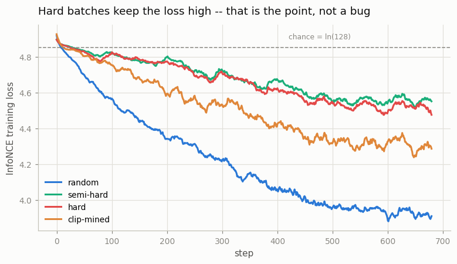
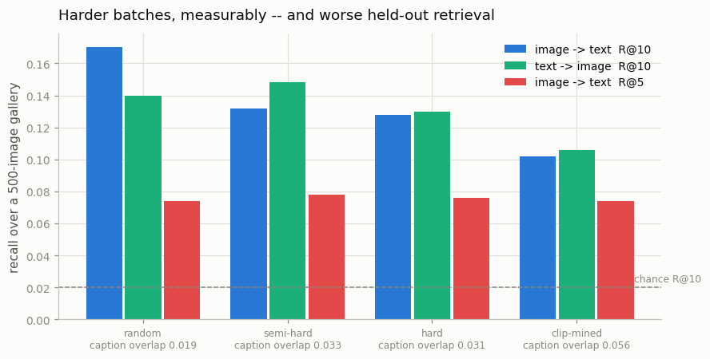

# Hard-Negative Mining

## Key Insight

In [contrastive](/shared/glossary/#contrastive-learning) training most of the negative examples in a [batch](/shared/glossary/#batch) are *easy* — a photo of a dog against the caption "a downhill ski race" is so obviously wrong the model already scores it low and learns nothing from it. This project is about [hard negatives](/shared/glossary/#hard-negatives) instead — the near-miss mismatches the model gets *almost* right — and measuring what they actually buy you: you *mine* them (for example, searching the dataset for the wrong caption with the highest [cosine similarity](/shared/glossary/#cosine-similarity) to each image), train on them, and compare against plain random negatives. The payoff shows up directly as a jump in [cross-modal retrieval](/shared/glossary/#cross-modal-retrieval) accuracy — measurable proof that not all negatives teach the model equally.

> **Read this project as a controlled negative result.** We mined hard negatives four ways, verified that the mining genuinely works, and **retrieval got worse in every condition.** Everything below is the evidence for that, and the explanation — which turns out to be more useful than the win would have been.

## Why anyone expects this to help

Project [09](../09-implement-infonce/README.md) derived the [InfoNCE](/shared/glossary/#infonce) gradient:

```
dL/dS[i, j]  =  ( softmax(S[i])[j] − [i == j] ) / N
```

A negative is pushed away *in proportion to the probability the model currently gives it*. An obviously-wrong caption gets probability ≈ 0 and therefore gradient ≈ 0 — it occupies a slot in the batch and contributes nothing. Project 09 measured the consequence: at τ = 0.07 a batch of 256 has 178 *effective* negatives, and at τ = 0.01 only 2.7.

The obvious fix: stop filling batches at random. Put confusable images together on purpose, and every slot does work.

## How the mining is done, cheaply

Recomputing "which images are similar to which" every step would cost more than training. Instead:

1. **Every 100 steps**, encode the whole 4,500-image training set with the *current* model (one forward pass, ~1.5 s) and sort each image's neighbours by [cosine similarity](/shared/glossary/#cosine-similarity).
2. **Every step**, pick a random anchor and fill the batch with its nearest neighbours from that stored table.

The table goes stale between refreshes, which is fine — an image that was confusable 100 steps ago is still confusable now. Cost: about 15 extra forward passes over 700 steps, roughly 5% overhead.

Four conditions, all trained for **exactly 700 steps at batch 128** on the tiny CLIP from project [10](../10-tiny-clip/README.md), differing only in the batch sampler:

| condition | how the batch is filled |
|---|---|
| **random** | uniformly at random (the baseline — this is normal CLIP training) |
| **semi-hard** | anchor + neighbours ranked 30–400, skipping the very nearest |
| **hard** | anchor + its nearest neighbours, ranks 1–512 |
| **clip-mined** | anchor + nearest neighbours **according to a real frozen CLIP B/32**, not the model being trained |

That last condition exists to answer the question the first three raise, and it is the most informative one here. Hold onto it until Step 3.

## Step 1: the mining works — here is proof you can read

Whether a batch is "hard" should not be judged by the model doing the mining (that would be circular). So we measure it on the **captions**, which the miner never sees: what share of the anchor caption's content words appear in each batch-mate's caption?

| condition | caption overlap with the anchor | likely [false negatives](/shared/glossary/#false-negative) |
|---|---|---|
| random | 0.019 | 0.0002 |
| semi-hard | 0.033 | 0.0012 |
| hard | 0.031 | 0.0006 |
| **clip-mined** | **0.056** | **0.0045** |

Mining roughly doubles the overlap; mining with a *good* model roughly triples it. And you can see it directly. An anchor and the seven batch-mates a real CLIP mined for it:

```
ANCHOR: A wooden desk filled with a laptop and computer monitor.

  overlap 0.33   An office desk with a laptop and a phone on it.
  overlap 0.17   a desk with a banana a keyboard and a mouse
  overlap 0.33   a white laptop is on a wood desk
  overlap 0.00   Two cats in a chair taking their naps.
  overlap 0.17   A cubicle desk with two laptops on it.
  overlap 0.00   There is a dog sleeping on a futon.
  overlap 0.50   a desk with a cup plate laptop monitor and keyboard
```

versus a random batch for the same anchor — birds, a pregnancy test, a wall clock, a tennis court, a skateboard rail. **The mined batch is a genuinely hard multiple-choice question**: five of the seven decoys are desks with laptops on them.

Note the last column of the table too. A "likely false negative" is a batch-mate whose caption shares more than half the anchor's content words — in other words, a caption that plausibly describes the anchor image, which InfoNCE will punish the model for ranking highly *even though it is right*. The rate rises 22× from random to CLIP-mined (0.0002 → 0.0045). At this scale it is still small, but the direction is the structural cost of mining: **the harder you mine, the more of what you mine is not actually a negative.**

## Step 2: the training loss goes up, exactly as designed



| condition | final training loss (chance = ln 128 = 4.852) |
|---|---|
| random | 3.916 |
| clip-mined | 4.305 |
| hard | 4.502 |
| semi-hard | 4.565 |

The mined runs sit much closer to chance. **This is not a failure to learn** — it is the same model facing a much harder in-batch question. "Which of these 128 desks is the one in the photo" is harder than "is this a desk or a beach", so a higher loss is expected and correct. It is also a reminder from project [09](../09-implement-infonce/README.md): a contrastive loss is only comparable between runs that face the same distribution of questions.

## Step 3: held-out retrieval — and the result



Over the same 500-image [gallery](/shared/glossary/#gallery) (chance R@10 = 0.02):

| condition | i2t R@10 | t2i R@10 | i2t R@5 | i2t R@1 |
|---|---|---|---|---|
| **random** | **0.170** | 0.140 | 0.074 | 0.020 |
| semi-hard | 0.132 | **0.148** | 0.078 | **0.024** |
| hard | 0.128 | 0.130 | 0.076 | 0.022 |
| **clip-mined** | **0.102** | 0.106 | 0.074 | 0.016 |

**Random negatives win, and the better the miner, the worse the result.** The ordering is monotone in mining quality: random (overlap 0.019) → 0.170, tiny-model mining (0.031) → 0.128, real-CLIP mining (0.056) → 0.102. R@1 is too noisy to rank anything here (4–12 hits out of 500), which is why R@10 is the headline.

That monotone ordering is what the `clip-mined` condition was for. **The failure is not "our miner was too weak to find hard negatives."** It found them — Step 1 proves it with a measurement the miner cannot influence, and the desk batch above is visibly hard. Better mining reliably produced worse models.

### Why hard negatives hurt here

A mined batch trades one property for another, and only one of them is "difficulty":

- **Difficulty goes up.** Every negative now scores highly, so every slot delivers gradient. That is the intended effect and it happened.
- **Variety goes down.** Every image in a mined batch is a desk. The model spends that update learning *desk-vs-desk* distinctions and gets no signal at all about desk-vs-beach, desk-vs-dog, desk-vs-tennis-court.

At 700 steps our model still has R@10 = 0.17 — it is barely past the coarse question. Drilling it on fine distinctions before it has the coarse ones is like teaching a student to tell a Border terrier from a Cairn terrier before they can reliably tell a dog from a cat. Project [11](../11-zero-shot-imagenet/README.md) shows the destination that skill is worth reaching; this project shows it is not the place to start.

There is a second, structural cost visible in the geometry:

| condition | mismatched-pair cosine | text-side [uniformity](/shared/glossary/#alignment-and-uniformity) |
|---|---|---|
| random | 0.182 | **−1.908** |
| hard | 0.165 | −1.049 |
| semi-hard | 0.200 | −1.045 |
| clip-mined | 0.237 | −1.406 |

Every mined run has a **less negative** uniformity, meaning the embeddings are bunched together rather than spread over the sphere. A batch drawn from one topic cannot push that topic away from other topics, because no other topic is present — so the space partially contracts. This is the same [representation collapse](/shared/glossary/#representation-collapse) signature that project [10](../10-tiny-clip/README.md) saw from dropping half the loss and project [13](../13-temperature-ablation/README.md) sees at τ = 0.01. Three different mistakes, one fingerprint.

## Honest reading of the Key Insight

The Key Insight above promises "a jump in cross-modal retrieval accuracy". **We measured a drop, in four out of four mined conditions.** The claim is not wrong in general — hard-negative mining is standard practice in retrieval and it works — but it comes with preconditions this project makes concrete, and the preconditions are usually left unsaid:

1. **The model must already be good.** Mining is a refinement step. In practice it is applied *after* a model is trained conventionally, or in later training stages. Our model at 700 steps has not earned it.
2. **The batch must stay diverse.** Real systems mine *some* hard negatives into an otherwise random batch, rather than filling the whole batch from one neighbourhood. That keeps the coarse signal alive. Our all-hard batches do not, which is the single most likely reason for the loss.
3. **The dataset must be large enough that near neighbours are not duplicates.** With 4,500 images, an image's 128 nearest neighbours reach quite far into "actually a valid caption for this image" territory — our false-negative proxy rose 22×.
4. **What the mining measures matters.** We mined image↔image similarity, so a batch is a set of similar *pictures*. A production system usually mines image↔text: for each image, the wrong *captions* it currently scores highly. That is closer to what the loss actually contests.

**The transferable lesson is the diagnostic, not the outcome.** Difficulty and variety are two different properties of a batch, they trade against each other, and only difficulty is what "hard negative" names. Before adopting a sampler, measure both — the caption-overlap number in Step 1 costs nothing and needs no model.

## What's in this directory

| file | what it is |
|---|---|
| `run.py` | stages: `train`, `inspect`, `figures`, and `clipmine`. Model and data come from project [10](../10-tiny-clip/README.md)'s `tiny_clip.py` |
| `outputs/conditions.csv` | every number quoted above, for all four conditions |
| `outputs/conditions.png` | held-out recall per condition, labelled with each one's caption overlap |
| `outputs/loss_curves.png` | training loss per condition against the `ln(128)` chance line |
| `outputs/mined_batch.txt` | a mined batch and a random batch for the same anchor |
| `outputs/clip_mined_batch.txt` | the same, mined by a real frozen CLIP (the desk batch above) |
| `outputs/clip_mining.json` | the CLIP-mined condition's difficulty diagnostics and result |

## How to run

```bash
python3 run.py --stage all        # ~7 min: three conditions + figures
python3 run.py --stage clipmine   # +4 min: the real-CLIP-mined condition
```

Requires project [10](../10-tiny-clip/README.md)'s `data/coco_64.npz`. `clipmine` additionally encodes all 4,500 training images with CLIP B/32 (~2 min, cached in the gitignored `checkpoints/`).

## Takeaways

1. **Verify that your mining works before you believe your result.** Caption overlap is a cheap check the miner cannot game: 0.019 random → 0.031 self-mined → 0.056 CLIP-mined. Ours worked, so the negative result is about mining, not about a bug.
2. **All four mined conditions lost on held-out retrieval**, monotonically in mining quality (R@10 0.170 → 0.128 → 0.102). Better mining, worse model.
3. **A hard batch trades variety for difficulty.** Every image in a mined batch is a desk, so the update teaches desk-vs-desk and nothing about desk-vs-beach. Early in training the coarse signal is the one that matters.
4. **The higher training loss is correct, not a bug.** Mined runs end near `ln(128)` because they are answering a harder question. Never compare contrastive losses across different batch *compositions*, for the same reason you never compare across batch *sizes*.
5. **Mining manufactures [false negatives](/shared/glossary/#false-negative).** Our proxy rose 22× from random to CLIP-mined. With one correct answer assumed per row, the loss punishes the model for correctly liking a caption that genuinely fits.
6. **Watch [uniformity](/shared/glossary/#alignment-and-uniformity), not only accuracy.** All four mined runs bunched the embeddings together — the same collapse fingerprint as dropping half the loss (project [10](../10-tiny-clip/README.md)) and as τ = 0.01 (project [13](../13-temperature-ablation/README.md)).
7. **In production, mine a *few* hard negatives into an otherwise random batch, and do it late.** That keeps the coarse signal and the fine one. Filling the whole batch from one neighbourhood, from step zero, is what fails here.
