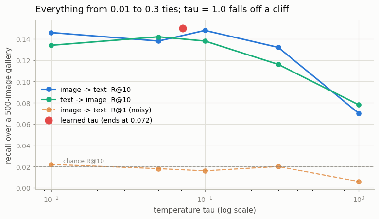
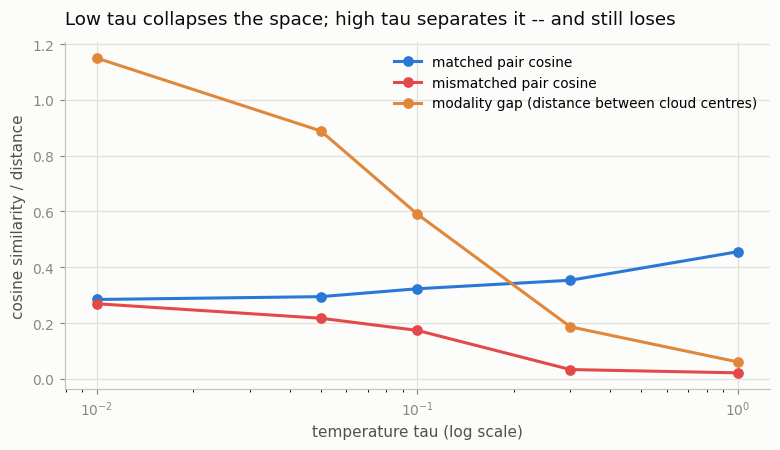
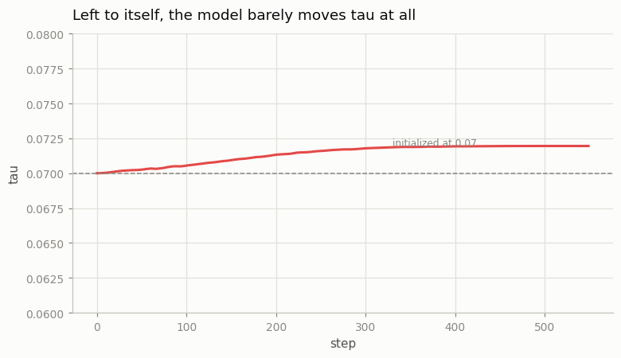

# Temperature Ablation

## Key Insight

The [temperature](/shared/glossary/#temperature) τ divides the [cosine-similarity](/shared/glossary/#cosine-similarity) scores before the [softmax](/shared/glossary/#softmax) in [InfoNCE](/shared/glossary/#infonce), tuning how sharp or soft that contest between the true pair and its [hardest negatives](/shared/glossary/#hard-negatives) becomes — and this project sweeps it end to end instead of trusting the default. Running τ from 0.01 to 1.0 and watching both accuracy and the [geometry of the embedding space](/shared/glossary/#embedding-space) — how tightly true pairs cluster on the unit sphere — makes visible why [CLIP](/shared/glossary/#clip) makes τ a *learned* parameter (initialized around 0.07) rather than a guessed constant. Set it too low and training is unstable and overconfident; too high and the model never commits — which is why this one scalar punches far above its weight.

## What τ does, mechanically

τ appears in one place:

```
S = (image_vectors @ text_vectors.T) / tau
loss = symmetric cross-entropy on S
```

[Cosine similarities](/shared/glossary/#cosine-similarity) live in [−1, 1], which is a very narrow range for a [softmax](/shared/glossary/#softmax) to work with. Dividing by τ stretches them: at τ = 0.01 the scores span [−100, 100] and the softmax is razor sharp; at τ = 1.0 they span [−1, 1] and the softmax is nearly flat.

Project [09](../09-implement-infonce/README.md) measured what that does to the [gradient](/shared/glossary/#gradients), and it is the fact this whole project sits on:

| τ | *effective* number of negatives in a batch of 256 |
|---|---|
| 0.01 | **2.7** |
| 0.07 | 178.5 |
| 1.0 | 254.6 |

At low τ nearly all the pushing-apart force lands on one negative; at high τ it is spread evenly over all of them, including the useless ones. **τ does not change which caption ranks highest — that is a monotone rescaling — it changes who gets trained on.**

> **Why CLIP stores `log(1/τ)` instead of τ.** The parameter in the code is called the [logit scale](/shared/glossary/#logit-scale), and the model *multiplies* by its exponential rather than dividing by τ. Two reasons this detour is standard. First, exponentiating guarantees the scale stays positive whatever the optimizer does — a negative or zero τ is meaningless and would flip or explode the loss. Second, a quantity that ranges over two orders of magnitude is better moved multiplicatively than additively, and log space makes an additive optimizer step multiplicative. CLIP initializes it to `ln(1/0.07) ≈ 2.66` and clamps it at `ln(100)`, refusing to let τ drop below 0.01.

## The experiment

Six runs of the tiny CLIP from project [10](../10-tiny-clip/README.md) — identical model, identical data, identical 550 steps at batch 128 — changing only τ. Five with τ held fixed, one that starts at 0.07 and **learns** it.

> **A measurement caveat, stated up front.** At 550 steps this model gets 3 to 11 R@1 hits out of 500, so R@1 alone cannot rank six conditions. **R@10 is the headline metric here** (35 to 75 hits, chance 0.02), and where a difference matters we also read the geometry, which is measured over all 500 × 500 pairs and is far more stable.

## Step 1: retrieval is flat over two orders of magnitude, then falls off a cliff



| τ | i2t R@10 | t2i R@10 | i2t R@1 | final training loss (chance = 4.852) |
|---|---|---|---|---|
| 0.01 | 0.146 | 0.134 | 0.022 | 4.134 |
| 0.05 | 0.138 | 0.142 | 0.018 | **4.042** |
| 0.1 | **0.148** | 0.138 | 0.016 | 4.049 |
| 0.3 | 0.132 | 0.116 | 0.020 | 4.159 |
| **1.0** | **0.070** | **0.078** | 0.006 | **4.487** |
| learned (0.070 → 0.072) | **0.150** | 0.136 | 0.010 | 4.048 |

**Everything from τ = 0.01 to τ = 0.3 ties** at R@10 ≈ 0.13–0.15, which is 6.6–7.4× chance. A thirty-fold change in τ moves nothing. Then τ = 1.0 halves the score.

The training loss explains the cliff exactly. At τ = 1.0 the model ends at **4.487 against a chance level of 4.852** — it got 8% of the way from guessing to knowing, and stopped. The reason is arithmetic: with τ = 1 the scores stay inside [−1, 1], so the largest possible advantage the true pair can have over a wrong one is 2 logits, and `exp(2) ≈ 7.4` — the true caption can be at most about seven times more likely than any single decoy, against 127 decoys. The softmax cannot express confidence, so **the model has nothing to gain by becoming confident, and never does.** That is the Key Insight's "never commits", visible as a number.

**The practical rule this gives you:** if you are unsure what τ to use, err low. The interval that works is wide on the low side and has a hard wall on the high side.

## Step 2: the geometry — and the result that inverts the intuition



Now measure the *shape* of the learned space rather than the score:

| τ | matched-pair cosine | mismatched-pair cosine | separation between them | [uniformity](/shared/glossary/#alignment-and-uniformity) (images) | [modality gap](/shared/glossary/#modality-gap) |
|---|---|---|---|---|---|
| **0.01** | 0.284 | **0.269** | **0.015** | **−0.288** | 1.150 |
| 0.05 | 0.295 | 0.217 | 0.078 | −1.524 | 0.889 |
| 0.1 | 0.323 | 0.174 | 0.149 | −2.167 | 0.590 |
| 0.3 | 0.353 | 0.033 | 0.320 | **−2.812** | 0.186 |
| **1.0** | **0.456** | 0.021 | **0.435** | −2.035 | **0.060** |

Read the uniformity column first. It measures how evenly the vectors spread over the sphere; **more negative means better spread**, less negative means bunched together. At τ = 0.01 it is −0.288, by far the most collapsed of the six, and mismatched pairs sit at cosine 0.269 against matched pairs' 0.284 — **the two populations are 0.015 apart, essentially on top of each other.**

That is [representation collapse](/shared/glossary/#representation-collapse), and project [09](../09-implement-infonce/README.md) predicted it. At τ = 0.01 a batch of 128 has roughly *three* effective negatives, so there is almost no force spreading the space out. The model pulls matched pairs together and barely pushes anything apart.

Now the part that inverts the obvious reading:

**Higher τ gives a *bigger* separation between matched and mismatched cosines — and worse retrieval.** τ = 1.0 separates the two populations by 0.435, twenty-nine times better than τ = 0.01's 0.015, and scores half the R@10. If you had judged these models by "how far apart are true and false pairs on average", you would have picked the worst one.

The reason is that retrieval does not care about the average margin. It cares about the *ordering* within each query's own row: does image *i*'s own caption beat the other 499 captions for image *i*? A model can have a tiny global margin and still order every row correctly (τ = 0.01), and a model can have a large global margin while getting the fine distinctions inside each row wrong (τ = 1.0). **Never grade a retrieval model by average cosine separation. Grade it by rank.** This is the same trap project [02](../02-visualize-the-modality-gap/README.md) documented for the [modality gap](/shared/glossary/#modality-gap).

Speaking of which — look at the last column. **The modality gap shrinks monotonically as τ rises, from 1.150 to 0.060, and the smallest gap has the worst retrieval.** Project 02 found that every gap-closing intervention applied to a *frozen* CLIP hurt retrieval; here the same relationship falls out of *training* a model from scratch. The gap is not a defect to be minimized.

## Step 3: what happens if you let the model choose τ?



CLIP makes τ learnable rather than a hyperparameter. Ours starts at 0.070 and, after 550 steps, ends at **0.072** — it moved by 3%.

That is an honest, slightly deflating result, and it is worth understanding rather than hiding:

- **At this scale the model has no strong opinion.** τ trades off which negatives get gradient, and the payoff for changing it only shows up over long training, once the model is good enough that the "hard" negatives are genuinely informative. In 550 steps the model is still learning that pictures of food differ from pictures of streets.
- **Real CLIP does move it, a lot** — down to about 0.01, its clamp — but over hundreds of thousands of steps.
- **The learnable run is nonetheless the best model in the sweep** (R@10 0.150, the top score in the table), which is the practical argument for making τ learnable: you get a sensible value without a sweep. It removes a hyperparameter rather than optimizing one.

Note also that the learned τ ends far above the value real CLIP converges to. **Do not read "CLIP learns τ ≈ 0.01" as "0.01 is the right constant".** CLIP arrives there after the space is already well organized; starting there, as our τ = 0.01 run shows, collapses the space instead.

## What's in this directory

| file | what it is |
|---|---|
| `run.py` | stages: `sweep`, `geometry`, `figures`. The model and data come from project [10](../10-tiny-clip/README.md)'s `tiny_clip.py` |
| `outputs/temperature.csv` | every number quoted above, for all six runs |
| `outputs/geometry.json` | the geometry table on its own |
| `outputs/tau_vs_recall.png` | retrieval against τ |
| `outputs/tau_vs_geometry.png` | matched/mismatched cosine and the modality gap against τ |
| `outputs/learned_tau.png` | the learned τ's trajectory over 550 steps |

## How to run

```bash
python3 run.py --stage all        # ~9 min: six training runs
python3 run.py --stage figures    # instant, from the cached checkpoints
```

Requires project [10](../10-tiny-clip/README.md)'s `data/coco_64.npz`; if it is missing, running project 10 first downloads it. Checkpoints go to the gitignored `checkpoints/` and every run is cached by tag.

## Takeaways

1. **τ decides *who gets trained on*, not who wins.** It cannot change the ranking of scores — only how the gradient is divided among the negatives. Project [09](../09-implement-infonce/README.md)'s effective-negative count (2.7 at τ = 0.01, 254.6 at τ = 1.0) is the whole mechanism.
2. **The usable range is wide on the low side and walled on the high side.** τ from 0.01 to 0.3 all landed at R@10 ≈ 0.13–0.15; τ = 1.0 halved it. If in doubt, go low.
3. **τ = 1.0 fails for a reason you can compute.** Cosines are in [−1, 1], so without stretching, the true pair can be at most ~7× more likely than any decoy. The loss ends at 4.487 against a chance level of 4.852 — the model has no way to express confidence and therefore never acquires any.
4. **τ that is too low collapses the space without (yet) hurting the score.** At τ = 0.01, matched and mismatched cosines are 0.015 apart and uniformity is −0.288, the worst of the six — but R@10 is fine. Damage shows in geometry before it shows in accuracy, exactly as in project [10](../10-tiny-clip/README.md)'s rows-only run.
5. **Bigger cosine separation is not better retrieval.** τ = 1.0 separates the populations 29× better than τ = 0.01 and retrieves half as well. Rank is the metric; average margin is a distraction.
6. **A shrinking [modality gap](/shared/glossary/#modality-gap) tracked *worse* retrieval**, monotonically, from 1.150 down to 0.060. Project [02](../02-visualize-the-modality-gap/README.md) found this by editing a frozen model; it reproduces here from training.
7. **Learnable τ is a way to delete a hyperparameter, not to tune one.** Ours moved 0.070 → 0.072 in 550 steps and still gave the best model in the sweep. And CLIP's converged 0.01 is where it *ends up*, not a good place to start.
