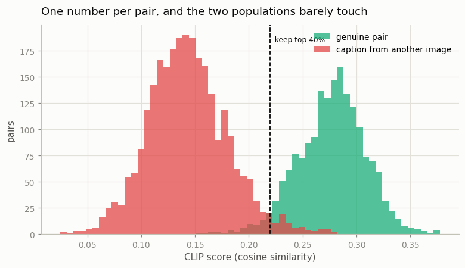
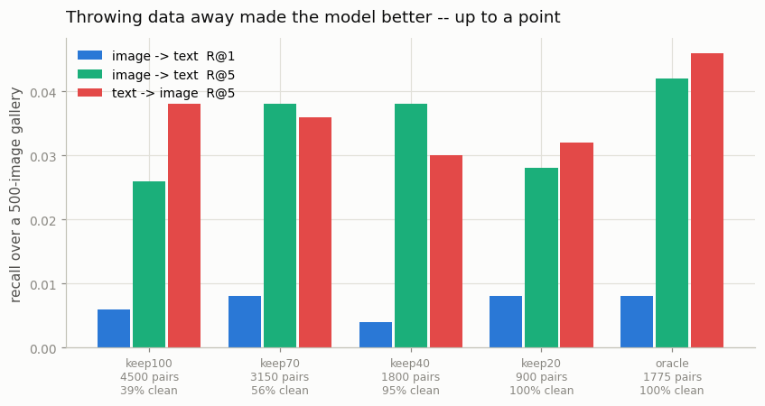

# Data Filtering with CLIP

## Key Insight

The same [cosine similarity](/shared/glossary/#cosine-similarity) that [CLIP](/shared/glossary/#clip) computes between an image and its caption — the *CLIP score* — doubles as a cheap quality detector for noisy web image–text data: a low score usually means the [alt-text](/shared/glossary/#alt-text) is keyword spam or simply unrelated to the picture, so dropping the bottom-scoring pairs throws out the noise that would otherwise confuse a model. Training one [downstream](/shared/glossary/#downstream) model on the filtered set and another on the raw set typically shows the filtered model winning *despite* seeing fewer examples — proof that for web data, quality beats raw quantity. This is exactly the filter that was used to build [LAION](/shared/glossary/#laion) and that opens nearly every large image–text data-curation pipeline.

## The setup, and why we break the data on purpose

Real web data is noisy but nobody knows *which* pairs are bad, so there is no way to check whether a filter caught the right ones. We manufacture that answer key: take the clean [COCO](/shared/glossary/#coco) pairs from project [10](../10-tiny-clip/README.md) and **replace 60% of the captions with a caption belonging to a different image.**

> **Why swapped captions rather than random text?** Because that is what unrelated [alt-text](/shared/glossary/#alt-text) actually looks like. A broken pair here is a fluent, grammatical, perfectly reasonable English sentence about a photograph — just not *this* photograph. Nothing in the text alone gives it away; you have to look at the image. A filter that only reads the text cannot possibly work, which is precisely why the job needs a multimodal model.

```
4,500 training pairs, 60% of them broken
        |
        v
score every pair with a FROZEN CLIP B/32          <- the filter
        |
        v
keep the top 100% / 70% / 40% / 20% by score
        |
        v
train the tiny CLIP from project 10 on each set   <- the downstream model
        |
        v
evaluate retrieval on 500 held-out images with their REAL captions
```

Each downstream run gets the same 550 steps at batch 128, so the conditions differ only in *what data was available*, not in how much training it got.

Plus one extra condition — **`oracle`** — trained on exactly the 1,775 pairs we never broke. That is the ceiling: the best a perfect filter could do. Without it, "filtering helped" is unquantified.

> **Is this circular — using a CLIP to build training data for a CLIP?** Yes, partly, and it is worth naming. The filter is a real 151M-parameter CLIP that already knows what captions mean; the downstream model is a 1.56M-parameter model learning from scratch. So some of the benefit is [distillation](/shared/glossary/#distillation): CLIP's judgment leaks into the student through the data selection. Real pipelines have exactly the same property — [LAION](/shared/glossary/#laion) was filtered with OpenAI's CLIP and then used to train new CLIPs — so this is a faithful reproduction of the real practice, including its circularity. The `oracle` condition is what keeps the result readable: it measures the benefit of *clean data*, with no CLIP judgment involved.

## Step 1: does one number separate the good pairs from the bad?



| | mean CLIP score |
|---|---|
| genuine pair | **0.277** |
| caption from another image | **0.143** |
| **[AUC](/shared/glossary/#auc)** | **0.9939** |

Read the AUC as: *pick one genuine pair and one broken pair at random; CLIP gives the genuine one the higher score 99.4% of the time.* The two histograms barely touch.

> **A caveat we checked rather than assumed.** Project 10 caches images at 72×72 and CLIP wants 224×224, so the filter is scoring upscaled, blurry images. Does that matter? The matched score comes out at 0.277 against 0.304 for the same images at native resolution (measured in project [02](../02-visualize-the-modality-gap/README.md)) — a small loss, and the separation survives completely. The filter only has to answer "is this caption about this picture *at all*", which does not need fine detail.

What each keep-threshold actually retains:

| keep | pairs kept | precision — share of kept pairs that are genuine | recall — share of all genuine pairs kept |
|---|---|---|---|
| 100% (unfiltered) | 4,500 | 39.4% | 100% |
| 70% | 3,150 | 56.3% | **100%** |
| **40%** | **1,800** | **95.4%** | **96.8%** |
| 20% | 900 | **99.9%** | 50.6% |

Two things stand out. At **keep-70%** the filter has thrown away 1,350 pairs and lost **not one genuine pair** — every discard was correct. At **keep-40%** it is holding 95.4% precision *and* 96.8% recall simultaneously, which is close to the best that is possible given only 39.4% of the data was ever good.

At keep-20% precision reaches 99.9% but recall collapses to 50.6%: half the good data is now in the bin. Whether that is a good trade is not a question the filter can answer — it is a question about the downstream model, which is Step 2.

## Step 2: what the downstream model does with it



Same architecture, same 550 steps, evaluated on 500 held-out images with their real captions (chance R@10 = 0.02):

| condition | pairs | % genuine | **i2t R@10** | t2i R@10 | i2t R@5 | final training loss |
|---|---|---|---|---|---|---|
| **keep 100%** (unfiltered) | 4,500 | 39% | **0.052** | 0.054 | 0.026 | 4.278 |
| keep 70% | 3,150 | 56% | 0.066 | 0.068 | 0.038 | 3.611 |
| **keep 40%** | 1,800 | 95% | **0.080** | 0.068 | 0.038 | 1.749 |
| keep 20% | 900 | 99.9% | 0.062 | 0.052 | 0.028 | **0.211** |
| **oracle** (the answer key) | 1,775 | 100% | **0.080** | **0.074** | **0.042** | 1.723 |

**Deleting 60% of the training data made the model 54% better** (R@10 0.052 → 0.080). That is the Key Insight's claim, and it holds cleanly.

The comparison that makes it precise is **keep-40% versus oracle**. Those two sets are almost the same size — 1,800 pairs against 1,775 — so this is a controlled test of *selection quality alone*, with data volume held fixed. They score **identically on i2t R@10 (0.080)** and the oracle is a whisker ahead on the other two columns. **CLIP-score filtering recovered essentially all of the achievable benefit without ever seeing the answer key.**

And then the curve turns over. **keep-20% is worse than keep-40%** (0.062 vs 0.080) despite being 99.9% clean — 4.5 points *cleaner* and 1.8 points *worse*. Its 900 pairs are simply not enough. You can see the failure directly in the training loss: **0.211 against a chance level of 4.852**, which for a [contrastive](/shared/glossary/#contrastive-learning) loss means the model has all but memorized its 900 pairs. It has stopped learning about images and captions and started learning about *these* images and captions — plain [overfitting](/shared/glossary/#overfitting).

**So the filter-strength curve is an inverted U**, and both sides of it are real:

- filter too little → the model spends most of its gradient learning associations that are false
- filter too much → the model runs out of data and memorizes

The peak is not at maximum purity. It is where precision has almost saturated but recall has not yet started to fall — here, keep-40%, at 95.4% precision and 96.8% recall.

## Step 3: what the noise does to the embedding space

The retrieval numbers say which model is better; the geometry says what noise actually did to it:

| condition | matched-pair cosine | mismatched-pair cosine | [modality gap](/shared/glossary/#modality-gap) | image [uniformity](/shared/glossary/#alignment-and-uniformity) |
|---|---|---|---|---|
| keep 100% | 0.104 | **0.067** | 0.782 | −2.509 |
| keep 70% | 0.109 | 0.045 | 0.341 | −2.937 |
| keep 40% | 0.116 | 0.007 | 0.115 | −3.481 |
| oracle | 0.114 | 0.004 | 0.117 | −3.471 |

With 61% wrong labels, matched pairs sit at cosine 0.104 and mismatched pairs at 0.067 — **a margin of 0.037, versus 0.110 for the oracle.** Noisy pairs do not just fail to teach; they actively pull unrelated images and captions together, because for 61% of the batch the loss is *insisting* that an unrelated pair belongs on the diagonal. The [modality gap](/shared/glossary/#modality-gap) also stays 6.8× wider under noise (0.782 vs 0.115).

The practical version: **label noise in contrastive training is not a dilution, it is an opposing force.** Adding 1,000 mismatched pairs is worse than adding nothing, which is exactly why deleting data can win.

## What's in this directory

| file | what it is |
|---|---|
| `run.py` | stages: `score`, `train`, `figures`. Model and data come from project [10](../10-tiny-clip/README.md)'s `tiny_clip.py` |
| `outputs/filter_quality.json` | AUC, mean scores, and precision/recall at each keep-threshold |
| `outputs/score_histogram.png` | the two score populations with the keep-40% cutoff marked |
| `outputs/downstream.csv` | every number in the Step 2 and Step 3 tables |
| `outputs/downstream.png` | held-out recall per condition |

## How to run

```bash
python3 run.py --stage all       # ~9 min (2 min of it is CLIP scoring 4,500 pairs)
python3 run.py --stage score     # the filter analysis alone, ~2 min
```

Requires project [10](../10-tiny-clip/README.md)'s `data/coco_64.npz`. Scores and checkpoints are cached in the gitignored `checkpoints/`.

## Takeaways

1. **One [cosine similarity](/shared/glossary/#cosine-similarity) per pair separates genuine from mismatched at [AUC](/shared/glossary/#auc) 0.994.** No training, no threshold tuning, one forward pass per item. This is why CLIP-score filtering is step one of essentially every image–text pipeline.
2. **Deleting 60% of the data made the model 54% better** on held-out R@10. For noisy web data, quality beats quantity — but only because noise is an *opposing* force, not a neutral one.
3. **A CLIP-score filter matched the answer key.** At the same data volume (1,800 vs 1,775 pairs), keep-40% and the oracle both scored R@10 = 0.080. Filtering recovered essentially all of the achievable benefit with no supervision.
4. **The curve is an inverted U — over-filtering is a real failure mode.** keep-20% was 99.9% clean and *worse* than keep-40% (0.062 vs 0.080), with a training loss of 0.211 against chance 4.852: memorization, not learning.
5. **Aim for the precision/recall knee, not maximum purity.** keep-40% held 95.4% precision *and* 96.8% recall at once. Past that, precision buys almost nothing and recall pays for all of it.
6. **Noise shows up in the geometry too.** With 61% wrong captions the matched/mismatched margin was 0.037 against the oracle's 0.110, and the [modality gap](/shared/glossary/#modality-gap) was 6.8× wider — because for most of each batch the loss was actively insisting that unrelated things belong together.
7. **The circularity is real and it is also what the field does.** Filtering with a big CLIP partly distills it into the small one; [LAION](/shared/glossary/#laion) was filtered exactly this way. Always keep an oracle or clean-held-out condition so you can tell the two effects apart.
