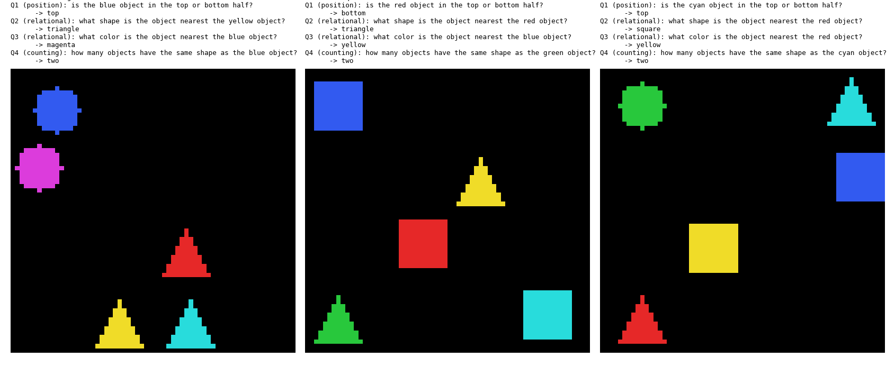
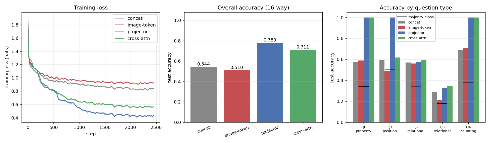
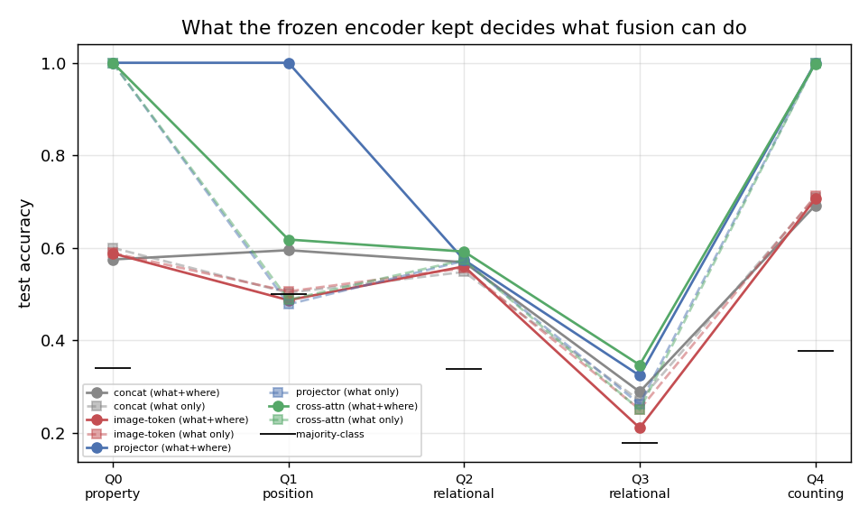

# Concat vs Cross-Attention

## Key Insight

This project pits the three cheapest ways to fuse an image and a question against each other on one small [VQA (Visual Question Answering)](/shared/glossary/#vqa-visual-question-answering) task, so the trade-offs stop being abstract. [Concatenation](/shared/glossary/#concatenation) glues the two feature vectors end to end and adds almost no [parameters](/shared/glossary/#parameters); a [projector](/shared/glossary/#projector) reshapes the image features into the language model's space and is nearly as cheap; [cross-attention](/shared/glossary/#cross-attention) lets the text actively query the image and usually scores higher — but only by adding whole new attention layers, so you pay for it in parameter count. Reporting accuracy *and* parameter counts side by side makes the real lesson land: more interaction between [modalities](/shared/glossary/#modality) costs more weights, and the right pick depends on whether your task actually needs the two streams to look at each other or just to sit next to each other.

## What we actually measured, and one surprise

We ran the comparison and got a cleaner — and slightly different — answer than the sentence above predicts:

- **The mechanism barely matters. The *access* does.** What separated the winners from the losers was not "attention vs no attention" but whether the question could see **all 16 image tokens** or only **one summary vector**. A control that keeps the full attention machinery but feeds it a single vector scores like plain concatenation.
- **Cross-attention did *not* win.** The simplest token-level method — a linear projector, [LLaVA](/shared/glossary/#llava)-style — beat cross-attention 0.780 to 0.711 *with fewer parameters*. That is the guide's "simpler + more data usually wins" insight showing up as a number.
- **A [frozen](/shared/glossary/#frozen) encoder can only pass on what its pretraining forced it to keep.** Our first encoder was taught *what* is in each patch but never *where*. Every question about position collapsed to [chance](/shared/glossary/#chance-level) for all four fusion methods. Fixing the encoder — not the fusion — fixed it. That ablation is kept below because it is the most transferable lesson here.

---

## The task



A 64×64 image holds **5 objects**. Each has one of 3 shapes (square, circle, triangle), one of 6 colours (all distinct inside an image, so "the red object" names exactly one thing), and a spot on a 4×4 grid of cells with a few pixels of jitter.

Every image comes with **five questions, one of each type**:

| # | question | answers | kind |
|---|---|---|---|
| Q0 | what shape is the `<c>` object | square / circle / triangle | non-relational |
| Q1 | is the `<c>` object in the top or bottom half | top / bottom | non-relational, positional |
| Q2 | what shape is the object nearest the `<c>` object | square / circle / triangle | relational |
| Q3 | what colour is the object nearest the `<c>` object | 6 colours | relational |
| Q4 | how many objects have the same shape as the `<c>` object | one … five | counting |

All five share **one 16-word answer vocabulary**, so every model is a single 16-way classifier and the accuracies are directly comparable.

> **Why the split into "non-relational" and "relational" is the whole design.** Q0 and Q1 need one lookup: find the anchor object, read a property off it. Q2, Q3 and Q4 need you to find the anchor *and then compare it with the others*. A fusion method that only ever sees one summary vector of the image can memorise the picture as a whole, but it cannot answer "the object next to **this** one" — because which object matters is decided by the question, and the question arrives after the squeeze has already happened.

> **Why synthetic rather than a real VQA dataset.** Every answer here is derived from the scene, so there is no annotator noise and no language prior to exploit. Real VQA benchmarks are full of questions answerable from the text alone ("what colour is the banana?" → "yellow", no image needed), which is exactly the confound that would hide the differences we are testing. This is Phase 2's recurring lesson again: *can your measurement see the thing you are ablating?*

## Stage 1: a frozen vision encoder, so the comparison is about fusion

Real [VLMs](/shared/glossary/#vlm) do not train the image encoder from scratch alongside the fusion module — they borrow a pretrained one and freeze it. We do the same in miniature. A small [ViT](/shared/glossary/#vit) (0.70M parameters, one 16-pixel [patch](/shared/glossary/#patch) per grid cell → 16 tokens) is trained once on a [pretext task](/shared/glossary/#pretext-task): *for each patch, name the colour, the shape, and which cell you are*. Then it is frozen and its patch tokens are cached.

> **Why bother freezing, when we could just train everything end to end?** Two reasons, and the first is about the experiment rather than the model. (1) **Fairness:** if each fusion variant trained its own encoder, a difference between them could be an encoder difference. Freezing means the pixels reached all four through *identical* weights, so any gap is the fusion's doing. (2) **Cost:** the encoder runs once over the whole dataset and the answer is cached, so a fusion experiment takes 90 seconds instead of ten minutes.

> **Why the patch is 16 pixels wide — the same size as a grid cell.** A patch that matches the thing you care about means one token ≈ one object, which is the cleanest possible input for a fusion study. It is also 4× cheaper than 8-pixel patches. Project [08](../08-patch-size-study/README.md) measured this trade-off directly and reached the same rule: **match the patch to the scale of the detail, do not minimise it.**

Held-out pretext accuracy: **colour 1.000, shape 1.000, position 1.000**. The frozen encoder reads every patch perfectly, so nothing downstream is bottlenecked by vision.

## Stage 2: four fusion modules, one frozen input

All four read the same cached tokens, get the same 2-layer fusion budget, the same text encoder, and 2,500 steps at batch 128.

```
concat  (late fusion)
    16 patch tokens ─► attention-pool ─► 1 vector ─┐
                                                   ├─► MLP ─► answer
    question words ──► mean-pool ──────► 1 vector ─┘

image-token  (the control)
    16 patch tokens ─► attention-pool ─► 1 token ─┐
                                                  ├─► [img][question][ans] ─► 2 self-attn layers ─► answer
    question words ───────────────────────────────┘

projector  (LLaVA-style early fusion)
    16 patch tokens ─► linear ─► 16 tokens ───────┐
                                                  ├─► [img×16][question][ans] ─► 2 self-attn layers ─► answer
    question words ───────────────────────────────┘

cross-attn  (Flamingo-style)
    question words ─► [self-attn ─► cross-attn ─► MLP] ×2 ─► answer
                                        ▲
                                        └── 16 patch tokens (never join the sequence)
```

> **`image-token` is the control that makes this conclusive.** It has the same transformer fusion machinery as `projector` and `cross-attn`, the same parameter budget, the same training — and still only one image vector. If it scores like `concat`, then the fusion *mechanism* is not what matters; the *granularity of access* is. Without this condition you could not tell the two explanations apart.

> **Why `concat` gets a learned [attention pool](/shared/glossary/#attention-pooling) rather than a plain average.** Averaging 16 patch tokens smears five distinct objects into one grey blur, and beating a strawman proves nothing. Attention pooling lets a learned query decide *what to keep* while compressing, so `concat` here is the strongest single-vector opponent we can build. It still cannot depend on the question, and that is the point being tested.

> **Why a projector at all, when the encoder already outputs 128-wide vectors that would fit straight into the sequence?** Because the two towers were never told to use the same coordinate system. "Patch dimension 7" and "word dimension 7" mean unrelated things; the linear layer learns the change of basis between them. In a real VLM the two spaces also have different *widths* (e.g. 1024 for vision, 4096 for the [LLM](/shared/glossary/#llm)), so the projector resizes as well as rotates. Crucially it stays **trainable while the encoder stays frozen** — it is the one piece allowed to move, which is exactly how a frozen encoder becomes useful to a model it was never trained with.

## Results



| variant | image tokens seen | fusion params | **accuracy** | ms/step |
|---|---|---|---|---|
| concat | 1 | 1.00M | 0.544 | 36 |
| image-token | 1 | 1.02M | 0.510 | 53 |
| **projector** | 16 | **0.82M** | **0.780** | 70 |
| cross-attn | 16 | 0.95M | 0.711 | 55 |

Broken down by question type, against the majority-class baseline:

| variant | Q0 property | Q1 position | Q2 rel-shape | Q3 rel-colour | Q4 counting |
|---|---|---|---|---|---|
| *majority class* | *0.341* | *0.501* | *0.338* | *0.179* | *0.377* |
| concat | 0.575 | 0.595 | 0.569 | 0.289 | 0.692 |
| image-token | 0.588 | 0.487 | 0.560 | 0.211 | 0.706 |
| **projector** | **1.000** | **1.000** | 0.574 | 0.324 | **1.000** |
| cross-attn | **1.000** | 0.618 | 0.592 | **0.347** | 0.998 |

### 1. One vector is the ceiling, not the mechanism

`concat` (0.544) and `image-token` (0.510) are the same model in different clothing, and they score the same. Both compress the image to one vector before the question is read. Meanwhile `projector` (0.780) and `cross-attn` (0.711) both keep all 16 tokens and both jump.

The clearest single number is **Q0**, "what shape is the red object". Token-level fusion gets it **exactly right, 1.000**. Single-vector fusion gets **0.575** against a chance floor of 0.341 — barely halfway from guessing to knowing, on a question the frozen encoder has already answered perfectly *inside each patch token*. The information is right there, and the squeeze throws it away, because the squeeze happens before anyone mentions "red".

**The practical reading:** when someone reports that "cross-attention beat concatenation", check whether they compared two mechanisms or two access levels. Most of the time it is the second.

### 2. The simplest token-level method won

`projector` beats `cross-attn` by 6.9 points **while using 14% fewer fusion parameters** (0.82M vs 0.95M). Almost the entire gap is Q1, the position question: **1.000 vs 0.618**.

Why the projector is better at "top or bottom half": in early fusion the image tokens *join the sequence*, so they attend to each other and to the question, and both fusion layers re-contextualise them. Sixteen tokens that can talk among themselves can work out "the red one is in the upper row". In cross-attention the image tokens are **passive context** — keys and values only. They are never updated, never compare themselves with each other; only the question's own tokens get to move. For a question that needs the image tokens to relate to *one another*, that asymmetry costs.

This is the [BLIP-2](/shared/glossary/#blip-2) → LLaVA → [Chameleon](/shared/glossary/#chameleon) story in miniature: each step drops machinery and loses nothing.

**The honest caveat about cost.** Cross-attention is not pointless — it gets relatively cheaper as the *text* gets longer. Here self-attention over the joint sequence scores (16 + 12)² = 784 token pairs while cross-attention scores 12 × 16 = 192. With a 2,000-token conversation and several images that ratio flips hard, which is precisely why [Flamingo](/shared/glossary/#flamingo) chose cross-attention for interleaved documents. At our sequence lengths the constant factors dominate and the joint-sequence model is only 27% slower per step.

### 3. What nobody solved: the nearest-neighbour questions

Q2 and Q3 ask "what is the object *nearest* the red one". Every variant lands between 0.21 and 0.35 — above chance but nowhere near solved — while the same models score 1.000 on Q0 and Q4.

This is a real limit and worth stating plainly rather than hiding. Answering it requires computing the distances from the anchor to **all four other objects** and taking the minimum. Two attention layers over 16 tokens can approximate that, and they clearly learn *something* (Q3 at 0.347 is nearly twice its 0.179 floor), but a soft-weighted average is a poor way to implement an arg-min. Counting (Q4) is easy for exactly the opposite reason — it *is* a sum over tokens, which attention does natively. **Attention is good at "how much of X" and bad at "which single one".**

### 4. The ablation: an encoder that never learned *where*



Our first frozen encoder was trained on a pretext task that asked only *what is in this patch* — colour and shape. It reached held-out accuracy 1.000 on both, so by its own scoreboard it was perfect. Here is what the four fusion modules did with its tokens:

| variant | accuracy | Q0 property | Q1 position | Q2 rel-shape | Q3 rel-colour | Q4 counting |
|---|---|---|---|---|---|---|
| *majority class* | | *0.341* | *0.501* | *0.338* | *0.179* | *0.377* |
| concat | 0.526 | 0.600 | 0.503 | 0.548 | 0.270 | 0.709 |
| image-token | 0.523 | 0.589 | 0.506 | 0.556 | 0.251 | 0.712 |
| projector | 0.662 | 1.000 | 0.478 | 0.572 | 0.262 | 1.000 |
| cross-attn | 0.662 | 1.000 | 0.488 | 0.574 | 0.250 | 1.000 |

**Every single variant sits at chance on Q1** (0.478–0.506 against a 0.501 floor). Q3 is flat at 0.25–0.27. The projector's 1.000 on Q1 with the fixed encoder became 0.478 — a coin flip.

The tower *did* have positional information available: it adds a learned [positional embedding](/shared/glossary/#positional-embedding) to every patch before its layers run. But **available is not preserved.** Nothing in a colour-and-shape objective needs position, so the encoder was free to drop it from its output tokens — and it did. Adding a third pretext head, "which cell are you?", costs 16 × 128 = 2,048 weights and recovers Q1 completely.

> **The transferable lesson, in plain terms.** When you freeze an encoder you inherit its blind spots, and no amount of fusion cleverness can fix them. If your VLM is bad at spatial questions, the first thing to check is not the projector — it is whether the vision encoder's training objective ever *rewarded* keeping spatial detail. This is one concrete reason real VLMs are picky about which frozen encoder they adopt, and why some (Qwen2-VL, Molmo) add explicit [grounding](/shared/glossary/#grounding) or pointing supervision.

Notice also that the ablation shows the *same* fusion ranking on the questions it can still answer (Q0 and Q4: token-level 1.000, single-vector ≈ 0.6 and 0.71). **The encoder decides which questions are answerable at all; the fusion decides how well the answerable ones get answered.** Two separate axes, and it is worth knowing which one you are looking at.

## What's in this directory

| file | what it is |
|---|---|
| `vqa_lib.py` | the shapes world, the questions, the shared towers, the pretext trainer, the training loop. **Project [18](../18-perceiver-io/README.md) imports this file** so it answers exactly the same task |
| `run.py` | stages: `vision`, `train`, `plot`, `examples` |
| `outputs/fusion.csv` | every number in the results tables |
| `outputs/fusion.png` | loss curves, overall accuracy, accuracy per question type |
| `outputs/params_vs_acc.png` | accuracy against fusion-module parameter count |
| `outputs/pretext_ablation.png` | the what-only encoder against the what+where one |
| `outputs/examples.png` | three scenes with all five questions and their answers |
| `outputs/vision.json` | pretext accuracies, encoder size, majority-class baselines |
| `outputs/fusion_whatonly.csv` | the ablation's numbers |

## How to run

```bash
python3 run.py --stage vision    # pretrain + freeze + cache the encoder (~1 min)
python3 run.py --stage train     # all four fusion modules (~10 min)
python3 run.py --stage plot
python3 run.py --stage examples

# the ablation, if you want to reproduce it
python3 run.py --stage vision --pretext what-only
python3 run.py --stage train  --pretext what-only
```

`--only concat cross-attn` runs a subset. Cached features and scenes live in the gitignored `data/` (and `data_whatonly/`); everything reported here is in `outputs/`.

## Takeaways

1. **Compare access levels, not mechanism names.** `image-token` — full attention machinery, one image vector — scored 0.510 against `concat`'s 0.544 and `projector`'s 0.780. Whether the question can address individual image tokens is the variable that mattered; "does it use attention" was not.
2. **A single pooled image vector is a hard ceiling on question-dependent lookup.** It must be computed before the question arrives, so it has to guess what will be asked. On "what shape is the red object" it reached 0.575 where token-level fusion reached 1.000 — with the answer already sitting, perfectly encoded, in one of the tokens it discarded.
3. **The simplest token-level fusion won on both axes.** A linear projector beat gated cross-attention 0.780 vs 0.711 with 14% fewer parameters. Reach for cross-attention when the *text* is long and the images are many, not because it sounds more sophisticated.
4. **Cross-attention's image tokens never update.** They are keys and values, nothing else. That is why it lost Q1 (0.618 vs 1.000): the question needed the image tokens to relate to each other, and only early fusion lets them.
5. **Attention counts well and selects badly.** Counting hit 1.000; "which one is nearest" stayed at 0.32–0.35 against a 0.18 floor. A soft weighted average is a natural sum and an awkward arg-min.
6. **A frozen encoder passes on only what its objective forced it to keep.** An encoder scoring 1.000 on its own pretext task left *every* fusion method at chance on every positional question. 2,048 extra weights in the pretext head fixed what no amount of fusion capacity could.
7. **Always report the majority-class baseline beside the accuracy.** Q1's floor is 0.501 and Q3's is 0.179; without those two numbers "0.49 on Q1" and "0.35 on Q3" look like the same quality of result, and they are opposites.
