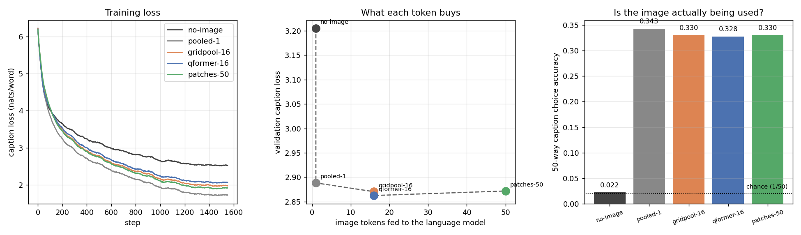
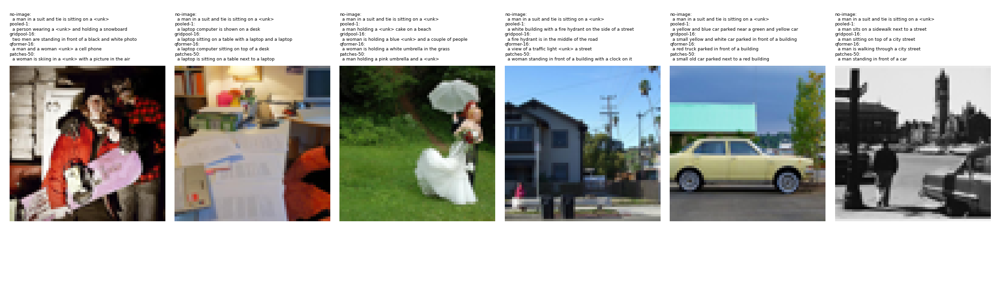

# Implement Q-Former

## Key Insight

Building a small [Q-Former](/shared/glossary/#q-former) by hand demystifies how a sprawling image gets squeezed into a *fixed* handful of tokens a language model can read. You create 16 learned *query* vectors and let them [cross-attend](/shared/glossary/#cross-attention) to a [frozen](/shared/glossary/#frozen) image encoder's patch features, so each query walks away with one compact summary of what it cares about — 16 notes instead of a whole gallery tour. Training it on [COCO](/shared/glossary/#coco) captions (predict the caption from those 16 image tokens) teaches the queries to capture caption-relevant content, and the choice of 16 over, say, 256 is the whole point: the image becomes a *constant*, small number of tokens regardless of resolution, which is what keeps feeding images to an [LLM](/shared/glossary/#llm) affordable.

## What a Q-Former is, in one picture

```
frozen CLIP ViT-B/32
        │
        ▼
  50 patch tokens × 768        ◄── the image, in full
        │
        │   cross-attention: the queries ask, the patches answer
        ▼
  16 LEARNED query vectors ──► 16 output tokens × 256
        │
        ▼
  fed to the language model as the first 16 positions of the sentence
```

The queries are ordinary `nn.Parameter`s. **They do not depend on the image at all** — the same 16 vectors are used for every picture. Each one is a *standing question* ("is there a person?", "what is the background like?") asked of every image, and what it carries away is the answer. That is why the output length is always 16 no matter how many patch tokens went in, and why doubling the input resolution costs the language model nothing.

> **"Wait — the image encoder already produced a summary vector. Why add a whole module to make another one?"** CLIP's [CLS token](/shared/glossary/#cls-token) *is* a summary, but it was trained for a different job: matching a whole image against a whole caption in [contrastive](/shared/glossary/#contrastive-learning) training. It is optimised to be *discriminative* — to separate this photo from a million others — not to be *informative enough to write a sentence from*. The Q-Former's queries are trained on the actual downstream objective (produce the caption), so they can keep whatever the generator needs and drop what only mattered for matching. That is the gap it is supposed to fill. Whether it *does* fill it, at our scale, is the experiment below — and the answer is not the one the pitch predicts.

> **Why "Q-Former"?** Q for *query*, Former from *transFORMER*. It is a transformer whose input sequence is a set of learned queries rather than the data. [BLIP-2](/shared/glossary/#blip-2) introduced it as the bridge between a frozen image encoder and a frozen LLM — the only trainable thing in a system where both ends are locked.

## The setup

- **Image side:** real frozen [CLIP](/shared/glossary/#clip) ViT-B/32 over 3,000 real COCO photos, encoded once and cached. 50 tokens per image (1 CLS + a 7×7 grid of patches), 768 numbers each.
- **Text side:** a small 4-layer, 256-wide causal caption model over a 1,793-word vocabulary. Same `caption_lib.py` project [19](../19-gated-cross-attention/README.md) uses.
- **Trained:** the bridge and the caption model. **Frozen:** CLIP.
- 1,600 steps at batch 64, identical for every condition.

Five ways to hand the same frozen image to the same caption model:

| condition | tokens | what it does |
|---|---|---|
| `no-image` | 1 | **the floor** — one learned token that never looks at the image |
| `pooled-1` | 1 | CLIP's own CLS vector, projected |
| `gridpool-16` | 16 | average the 7×7 patch grid down to 4×4 |
| `qformer-16` | 16 | 16 **learned** queries, two cross-attention blocks |
| `patches-50` | 50 | every patch token, [LLaVA](/shared/glossary/#llava)-style, no compression |

> **Why `gridpool-16` exists.** It is the control that gives `qformer-16`'s number a meaning. Both spend exactly 16 [prefix tokens](/shared/glossary/#prefix-tokens); one compresses by *averaging*, the other by *learning*. Any gap between them is what the 2.5M learned parameters bought. Without it, a good Q-Former score would only tell you "16 tokens is enough", not "learned queries beat a dumb pool".

> **Why `no-image` exists.** Without a floor, a tie between the other four could mean either "extra tokens do not help" or "the whole measurement is blind to images". This condition tells the two apart, and it is the single most important row in the table below.

## Result 1: the metric works



| condition | tokens | val loss | [perplexity](/shared/glossary/#perplexity) | 50-way caption choice |
|---|---|---|---|---|
| `no-image` | 1 | 3.205 | 24.7 | **0.022** |
| `pooled-1` | 1 | 2.888 | 18.0 | 0.343 |
| `gridpool-16` | 16 | 2.870 | 17.6 | 0.330 |
| `qformer-16` | 16 | **2.863** | **17.5** | 0.328 |
| `patches-50` | 50 | 2.872 | 17.7 | 0.330 |

The 50-way caption choice is a multiple-choice test: given the image, score the true caption against 49 captions belonging to other images and see whether the right one wins. **Chance is exactly 1/50 = 0.02.**

The blind model scores **0.022** — chance, to the decimal. Every model that can see the image scores **0.33–0.34, about fifteen times chance**, and cuts 0.32 nats off the caption loss. So the image is unambiguously being used and the measurement can unambiguously see it.

> **Why a multiple-choice score at all, when we already have the loss?** Because "2.888 versus 2.863 nats" is unreadable — you cannot tell from those two numbers whether the difference is large, small, or noise. Turning the same model into a 50-way test gives a scale with a known floor (0.02) and a known ceiling (1.00), which makes "0.33" interpretable at a glance.

## Result 2: after the first token, nothing helps

Now read the same table again, ignoring the blind row. Going from **1 token to 50 tokens — fifty times the image bandwidth — moves the validation loss by 0.016 nats and the caption choice by 1.3 points, in the wrong direction.**

- `pooled-1` (1 token) is the **best** on caption choice: 0.343.
- `qformer-16` is the best on loss: 2.863, which is 0.025 nats below `pooled-1`.
- `patches-50`, with 50× the tokens, is not better than either.

The middle panel above says it visually: a cliff from `no-image` down to `pooled-1`, then a flat line. Given a 400-image validation set, the standard error on a 0.33 accuracy is about ±0.024, so **all four image conditions are tied within noise on both metrics.**

And the learned queries bought nothing over the dumb pool. `qformer-16` (2.863) versus `gridpool-16` (2.870) is a 0.007-nat gap for **2.5M extra parameters** — the Q-Former's bridge is 2.70M parameters against 0.20M for a plain linear projection, a 13.7× increase for no measurable return.

> **Reading this honestly: it is a statement about *this* setup, not about Q-Formers.** The claim "16 learned queries beat a pooled vector" has preconditions, and naming them is more useful than the tie itself:
>
> 1. **The caption must actually need the detail.** COCO captions are short and generic — "a laptop computer sitting on top of a desk". Almost all of that is predictable from *which objects are present*, which a single CLIP CLS vector already encodes well. Nothing in the target sentence requires knowing that the laptop is on the left. Where extra tokens earn their keep is OCR, counting, spatial relations and fine attributes — none of which appear here.
> 2. **The generator must have the capacity to exploit it.** Our caption model has 4 layers and 256 dimensions and is fed 2,600 images. With so little data it can barely learn English, let alone learn to consult 50 image tokens. BLIP-2 paired its Q-Former with a multi-billion-parameter LLM.
> 3. **The Q-Former's real recipe has two stages.** BLIP-2 pretrains the queries with image–text contrastive, matching and generation objectives *before* connecting them to an LLM. We ran one stage. Skipping the first is a real difference and could easily be where the missing gain went.
>
> **What the experiment does establish** is the direction the field actually moved: LLaVA replaced the whole Q-Former with a linear projection and lost nothing on general captioning, and here even LLaVA's 50 tokens are more than the task needs. When your task is caption-shaped, spend the token budget elsewhere.

## Result 3: what the captions actually look like



The same six validation images, described by each condition:

| condition | image 2 (a laptop on a desk) | image 4 (a street scene) |
|---|---|---|
| `pooled-1` | *a laptop computer is shown on a desk* | *a white building with a fire hydrant on the side of a street* |
| `gridpool-16` | *a laptop sitting on a table with a laptop and a laptop* | *a fire hydrant is in the middle of the road* |
| `qformer-16` | *a laptop computer sitting on top of a desk* | *a view of a traffic light `<unk>` a street* |
| `patches-50` | *a laptop is sitting on a table next to a laptop* | *a man holding a pink umbrella and a `<unk>`* |

All of them identify the laptop. None is obviously better. `gridpool-16` and `patches-50` both fall into a repetition loop ("a laptop and a laptop") — a small-language-model pathology, not an image-bandwidth one. This is the tie made concrete: the bottleneck is the writer, not the eyes.

## Result 4: tokens cost time, linearly

| condition | tokens | ms/step | vs `pooled-1` |
|---|---|---|---|
| `no-image` | 1 | 140 | — |
| `pooled-1` | 1 | 289 | 1.00× |
| `gridpool-16` | 16 | 361 | 1.25× |
| `qformer-16` | 16 | 367 | 1.27× |
| `patches-50` | 50 | 408 | 1.41× |

Even on a 24-token caption, 50 image tokens cost 41% more per step than 1. The reason is the same [self-attention](/shared/glossary/#self-attention) quadratic as everywhere else: the sequence is `prefix + caption`, so 50 + 24 = 74 positions against 1 + 24 = 25, and 74² / 25² ≈ 8.8 in the attention term. **This is why the question "how many tokens is an image worth?" is a real engineering question and not pedantry** — with a 2,000-token conversation and eight images, the difference between 16 and 256 tokens per image is the difference between a system that fits in context and one that does not.

Note also that `qformer-16` costs essentially the same per step as `gridpool-16` (367 vs 361 ms). The Q-Former's own compute is negligible; what you pay for is the *output length*, which is why choosing a small number of queries is the whole design.

## What's in this directory

| file | what it is |
|---|---|
| `caption_lib.py` | COCO download + frozen-CLIP caching, the word tokenizer, and the caption LM. **Project [19](../19-gated-cross-attention/README.md) imports this file** |
| `run.py` | the `QFormer`, the four bridges, and the stages `train` / `plot` |
| `outputs/qformer.csv` | every number in the tables |
| `outputs/qformer.png` | loss curves, loss vs token count, and the 50-way caption-choice bars |
| `outputs/captions.png` | six validation images with each condition's greedy caption |
| `outputs/samples.json` | those captions as text |

## How to run

```bash
python3 run.py --stage train   # all five conditions, ~9 min once the cache exists
python3 run.py --stage plot
```

The first run downloads 3,000 COCO images and encodes them with CLIP (~5 min, cached in the gitignored `data/`). `--only qformer-16` runs one condition.

## Takeaways

1. **Always include a blind control.** `no-image` scored exactly chance (0.022 against 1/50 = 0.02) and 0.32 nats worse on loss. Without that row, the tie among the other four would be indistinguishable from a broken benchmark.
2. **One pooled CLIP vector carried nearly everything this task needed.** Fifty times more image tokens moved the loss by 0.016 nats and the caption-choice accuracy not at all. The first token is worth an enormous amount; tokens 2 through 50 were worth nothing measurable here.
3. **The learned queries did not beat the dumb pool.** `qformer-16` 2.863 vs `gridpool-16` 2.870 — a 0.007-nat gap for 13.7× the bridge parameters. At this scale, adaptive-average-pooling a 7×7 grid to 4×4 is just as good.
4. **State the precondition, not just the result.** Extra image tokens pay off when the target text *requires* detail the summary vector drops — OCR, counting, spatial relations, fine attributes — and when the generator is big enough to use it. Short generic COCO captions plus a 4-layer LM satisfy neither.
5. **Token count is a real cost, and it is superlinear.** 50 image tokens cost 41% more per step than 1 on a 24-word caption, because attention scores every pair. On long conversations with several images this is the dominant term.
6. **A Q-Former's cost is its output length, not its own compute.** It ran within 2% of the average-pool at the same token budget. Choosing *how many queries* is the entire design decision.
7. **This is the [BLIP-2](/shared/glossary/#blip-2) → LLaVA simplification, reproduced.** The field replaced the Q-Former with a linear layer and lost nothing on general captioning. Our measurement says the same thing, and project [15](../15-concat-vs-cross-attn/README.md)'s projector-beats-cross-attention result says it a third time.
