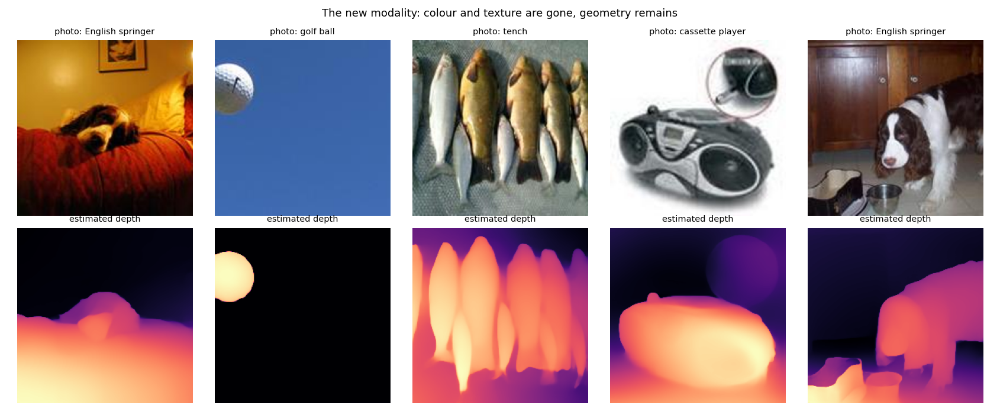
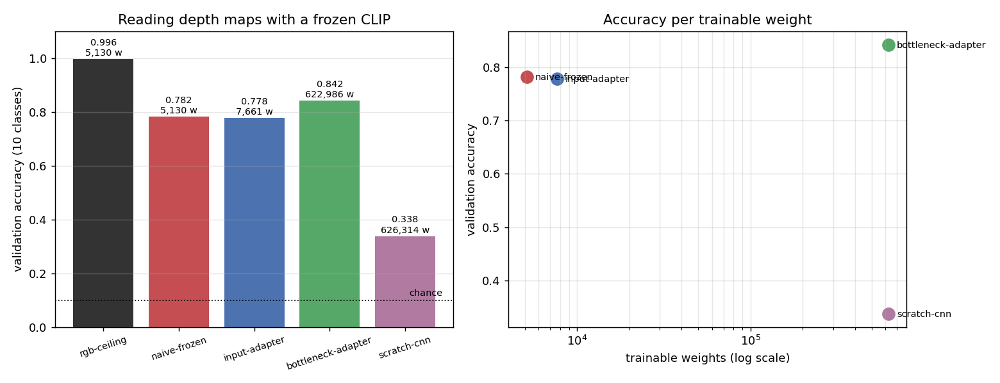

# Adapter for a New Modality

## Key Insight

This project shows how cheaply you can teach an existing model a brand-new sense: bolt a small [adapter](/shared/glossary/#adapter) onto a [frozen](/shared/glossary/#frozen) [CLIP](/shared/glossary/#clip) image encoder so it can read [depth maps](/shared/glossary/#depth-map) — grayscale images of how far away each pixel is — even though CLIP never trained on them. Only the adapter's handful of [weights](/shared/glossary/#weights) learn; CLIP's millions stay put, so you reuse all its hard-won visual knowledge instead of paying to retrain it, and you protect that knowledge from being overwritten by your small depth dataset. The takeaway is that adding a [modality](/shared/glossary/#modality) need not mean a new model — a tiny trainable bridge into a frozen backbone is often enough, the same money-saving idea behind [LoRA](/shared/glossary/#lora).

## The new modality



A depth map is a grayscale picture where **brightness means distance, not colour**. Look at the second column: a golf ball against a blue sky becomes a bright disc on a black field. All the colour and texture are gone; what survives is shape and layout.

Where these come from: a real [monocular depth estimator](/shared/glossary/#monocular-depth-estimation) (Depth-Anything-V2-Small) run once over 1,500 real photographs from [Imagenette](/shared/glossary/#imagenette), the 10-class ImageNet subset. "Monocular" means *one eye* — the model infers distance from a single image, as opposed to stereo vision which compares two views the way your two eyes do.

> **These are *estimated* depth maps, not laser measurements, and that is worth saying out loud.** A monocular estimator can be confidently wrong. But for our purpose it does the job honestly: it produces genuine geometry read off a real scene, and it discards colour and texture completely, which is what makes it a different modality rather than a filtered photograph. Note the estimator was itself trained on photographs, so a little semantic knowledge may leak into the output — a caveat to remember before treating any number below as a pure geometry result.

## The five conditions

| condition | what it is | what trains |
|---|---|---|
| `rgb-ceiling` | frozen CLIP on the **original photo** | classifier only |
| `naive-frozen` | frozen CLIP on the depth map, repeated to 3 channels, **no adapter** | classifier only |
| `input-adapter` | a small conv stem *in front of* frozen CLIP | stem + classifier |
| `bottleneck-adapter` | Houlsby adapters *inside* all 12 CLIP blocks | adapters + classifier |
| `scratch-cnn` | a small CNN on depth, no pretraining at all | everything |

> **Why `naive-frozen` is the condition that matters most.** It is tempting to compare an adapter only against "no pretraining" and declare victory. But the real question a practitioner faces is: *does this adapter earn its keep over just shoving the new input into the frozen model unchanged?* Without this row you cannot answer it, and — as the results show — the answer is sometimes no.

> **How the depth map is fed to a model expecting three colour channels.** It is repeated into all three, so red = green = blue = distance, and then normalised with the *average* of CLIP's three per-channel statistics, so a mid-grey depth map lands where a mid-grey photo would. A frozen backbone behaves oddly on inputs outside the range it was trained on, and this is the cheapest way to stay inside it.

> **Why the bottleneck adapter squeezes 768 numbers down to 32 first.** A full 768×768 layer would be more expressive but the entire point is to add as few weights as possible: down-then-up through 32 costs 2 × 768 × 32 ≈ 49k weights per block instead of 590k. The bet — which is what [PEFT](/shared/glossary/#peft) rests on — is that a narrow path is enough to *steer* a strong [backbone](/shared/glossary/#backbone), even though it could never rebuild one.

> **Both adapters start as exact no-ops** ([zero initialisation](/shared/glossary/#zero-initialization)). The input adapter's last conv and the bottleneck's up-projection are initialised to zero, so at step 0 the input adapter reproduces `naive-frozen` byte for byte and the bottleneck adapter reproduces frozen CLIP. Every point of improvement afterwards is attributable to the adapter rather than to a lucky random initialisation. Project [19](../19-gated-cross-attention/README.md) does the same with a tanh gate; [ControlNet](/shared/glossary/#controlnet)'s zero-convolutions and LoRA's zeroed B matrix are the same idea again.

> **How adapters get inserted into a model whose source we did not write.** PyTorch's `register_forward_hook` lets you intercept a module's output and replace it. Twelve hooks, twelve adapters, and CLIP's own code is never subclassed, copied or edited.

**One measurement decision that changes the answer.** Every condition is finally scored the same way: extract features, then fit a converged linear probe. The first time we ran this, the no-adapter baseline got a 600-step probe on cached features while the adapters' classifiers only saw the ~190 joint training steps — and `input-adapter` came out at 0.742, apparently *worse* than doing nothing. With the same read-out for everyone it scores 0.778. **Three and a half of those points were a slow classifier head, not a bad adapter.** The `joint head` column below preserves both numbers.

## Results



| condition | trainable weights | **accuracy (probe)** | accuracy (joint head) |
|---|---|---|---|
| `rgb-ceiling` | 5,130 | **0.996** | — |
| `naive-frozen` | 5,130 | 0.782 | — |
| `input-adapter` | 7,661 | 0.778 | 0.742 |
| **`bottleneck-adapter`** | 622,986 | **0.842** | 0.844 |
| `scratch-cnn` | 626,314 | 0.338 | 0.338 |

Chance is 0.100 (10 balanced classes).

### 1. Frozen CLIP reads depth maps with no adaptation at all

`naive-frozen` gets **0.782**. No adapter, no fine-tuning — repeat one channel three times, run frozen CLIP, fit a linear probe on the output. Nearly eight times chance, on an input format CLIP has never seen.

This is the most surprising number here and it deserves an explanation rather than a shrug. A depth map preserves **object silhouettes and scene layout**, and a great deal of what CLIP learned is silhouette-shaped: a dog outline is a dog outline whether it is rendered in fur or in distance. CLIP also saw plenty of grayscale, high-contrast and stylised images among its 400M web pairs, so a monochrome image is not itself alien. **A "new modality" that shares structure with the old one is much less new than it sounds.**

The practical version: **before you build an adapter, measure the no-adapter baseline.** It is one forward pass and it sets the bar everything else has to clear.

### 2. Transfer beats capacity, by a mile

`scratch-cnn` has **122× more trainable weights** than `naive-frozen` (626,314 vs 5,130) and scores **0.338 against 0.782**. It sees the same 1,000 training images and it is a perfectly reasonable architecture.

The frozen model wins because it is not learning to see — it already knows how. It is only learning ten weights-per-class worth of "which of the things I recognise is this". The CNN has to discover edges, textures and shapes from 1,000 examples, which is nowhere near enough. This is the [transfer-learning](/shared/glossary/#transfer-learning) argument stated as a controlled experiment: **at small data volumes, borrowed representation is worth more than trainable capacity, even when the borrowed representation is being used off-label.**

### 3. Honest inversion: the input adapter bought nothing

`input-adapter` scores **0.778** against `naive-frozen`'s **0.782**. Within noise on 500 validation images (standard error ≈ ±0.018), it is a tie — for 2,531 extra weights and **10× the training time** (428 s vs 40 s).

Why the front-end adapter fails while the in-block one works:

- A conv stem can only **re-render the input**. Whatever it produces still has to be parsed by a CLIP that expects photographs. And the naive version — copy the channel — already lands in a place CLIP handles well, so there is very little for the stem to improve. It starts as a no-op and largely stays one.
- CLIP's own first layer is a 32×32 patch [embedding](/shared/glossary/#embedding) — a linear map. Putting a small conv net in front of a linear map mostly gives you a slightly different linear map. Little new expressive power, and the earliest layer is the worst place to spend it.

The lesson generalises past this experiment: **an adapter at the input can only change what the backbone sees; an adapter inside can change how it thinks.** When the input format is already close to something the backbone handles, the second is where the value is.

### 4. Adapters inside the blocks are where the gain is

`bottleneck-adapter` reaches **0.842**, +6.0 points over the no-adapter baseline, using 622,986 trainable weights — the adapters themselves are 617,856 of those, **0.7% of CLIP's 88M**, and CLIP itself never moves.

Twelve small down-up modules, one per block, each free to nudge the representation as it flows. That is enough to shift a photograph-shaped model toward depth maps in six [epochs](/shared/glossary/#epoch) on 1,000 images.

Note the cost profile: it is **121× more trainable weights than the naive baseline for 6 points**, and it needs backpropagation through the whole frozen encoder (342 s here). It is cheap in *storage* and *forgetting risk*, not in compute. Backprop still traverses every frozen layer — freezing saves the optimizer state and the gradients for the weights, not the backward pass itself.

### 5. What depth actually costs you

`rgb-ceiling` scores **0.996** against depth's best of **0.842**. Fifteen points is the price of throwing away colour and texture on this task, and it is a real loss, not an artefact: telling a tench from an English springer is much easier when you can see that one is a silver fish and the other a brown-and-white dog. In depth they are both mid-sized blobs.

**Depth is a complement, not a substitute.** The reason to add it is the things it does better than a photograph — occlusion, scale, free space, the layout of a room — not the things a photograph already nails.

## What's in this directory

| file | what it is |
|---|---|
| `run.py` | data building (Imagenette + depth estimation), the three adapter designs, stages `data` / `train` / `plot` |
| `outputs/adapters.csv` | accuracy, joint-head accuracy, trainable weights and wall-clock per condition |
| `outputs/adapters.png` | the accuracy bars and accuracy-per-trainable-weight |
| `outputs/modality.png` | five photos above their estimated depth maps |

## How to run

```bash
python3 run.py --stage data    # Imagenette + depth estimation, ~4 min, cached
python3 run.py --stage train   # all five conditions, ~15 min
python3 run.py --stage plot
```

`--only bottleneck-adapter` runs a single condition — useful, because the two adapter conditions are most of the runtime (they backpropagate through all of CLIP). Cached depth maps and features live in the gitignored `data/`.

## Takeaways

1. **Measure the no-adapter baseline first.** Frozen CLIP read depth maps at 0.782 — 7.8× chance — with nothing but channel replication. If you skip this row you will attribute that 0.782 to whatever you build next.
2. **A "new modality" that shares structure with the old one is barely new.** Depth maps keep silhouettes and layout, and a great deal of what CLIP knows is silhouette-shaped. Expect a much harder time with a modality that shares nothing, such as raw audio or tabular data.
3. **Borrowed representation beat 122× more trainable capacity.** `scratch-cnn` had 626k trainable weights and scored 0.338; the frozen encoder with 5k scored 0.782. On 1,000 images this is not close.
4. **Honest inversion: the input adapter was worth nothing** (0.778 vs 0.782, at 10× the training time). A conv stem in front of a frozen encoder can only re-render the input, and the naive rendering was already fine.
5. **Adapters inside the blocks are where the gain lives:** +6.0 points, at 0.7% of CLIP's parameters, with the backbone untouched. Change how the model *thinks*, not what it *sees*.
6. **Adapters save memory and forgetting risk, not compute.** The bottleneck run took 342 s because the backward pass still traverses every frozen layer. Freezing shrinks the optimizer state and the weight gradients, not the graph.
7. **Give every condition the same read-out or you will measure the wrong thing.** Our first pass scored the baseline with a converged probe and the adapters with an under-trained joint head, which cost `input-adapter` 3.6 points and would have supported a stronger — and wrong — conclusion.
8. **Depth is not a cheaper photograph.** 0.842 against the RGB ceiling's 0.996. Add a modality for what it uniquely provides, and check what it costs before assuming it is free.
