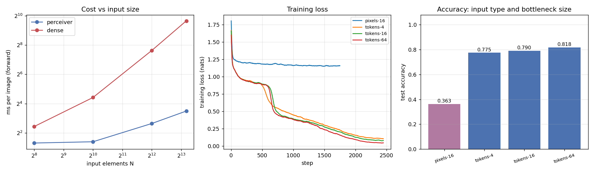

# Perceiver IO

## Key Insight

Implementing [Perceiver IO](/shared/glossary/#perceiver-io) on a small toy task makes its core trick concrete: instead of letting every input element attend to every other — which would explode for a large image or long audio clip — you keep a *small fixed set* of learned latent vectors and let only those [cross-attend](/shared/glossary/#cross-attention) to the giant input, squeezing it into the small set once and then doing all the heavy work among just the latents. The "IO" half adds a matching read-out step: a set of learned *query* vectors cross-attends to the processed latents to produce an output of whatever shape the task needs. The payoff you can feel in code is that the compute now scales with the size of your *latent committee*, not with how big the input was — and because nothing assumes a grid or a sequence, the very same architecture works across [modalities](/shared/glossary/#modality), which is exactly the idea the [Q-Former](/shared/glossary/#q-former) borrows to distill an image for a language model.

## The three parts, and where the names come from

```
                 ┌──────────── the input, ANY size N ────────────┐
                 │  4,096 pixels / 16 tokens / audio samples...  │
                 └───────────────────┬──────────────────────────-┘
                                     │  cross-attention (queries = latents)
                          ENCODE     ▼
                 ┌──── latent array: L vectors, FIXED ────┐
                 │        (we use L = 4, 16 or 64)        │
                 └───────────────────┬────────────────────┘
                                     │  6 self-attention layers, among latents only
                          PROCESS    ▼
                 ┌──── processed latents, still L ────────┐
                 └───────────────────┬────────────────────┘
                                     │  cross-attention (queries = whatever you want out)
                          DECODE     ▼
                 ┌──── one output per query ──────────────┐
                 │   here: 5 questions -> 5 answers       │
                 └────────────────────────────────────────┘
```

- **"Perceiver"** — the model *perceives* raw sensory input of any kind without a hand-built front end for each one. No convolution for images, no 1D stack for audio: everything arrives as a bag of elements.
- **"IO"** — the original Perceiver could only produce a single classification vector. Perceiver **IO** added the third stage, so the *output* is as flexible as the input: you supply one query per thing you want predicted. Input *and* Output, hence IO.
- **"[latent array](/shared/glossary/#latent-array)"** — "latent" just means hidden/internal, and "array" because it is a fixed-size block of L vectors. Think of it as a **notebook with a fixed number of pages**: whether you are summarising a postcard or an encyclopedia, you take the same number of notes, and all your later thinking is done from the notes rather than from the source.

> **Isn't the encode step just a bottleneck that throws information away?** Yes — deliberately. That is the trade being made. A plain Transformer keeps everything and pays N² for the privilege; Perceiver decides up front how much it is willing to remember and pays N × L. The interesting question is not "does it lose information" (it does) but "how much do you lose per unit of compute saved", which is exactly what the latent sweep below measures.

## The task

Project [15](../15-concat-vs-cross-attn/README.md)'s shapes-[VQA](/shared/glossary/#vqa-visual-question-answering) task, imported unchanged from its `vqa_lib.py`, so the two projects' numbers sit on the same scale. A 64×64 image holds 5 coloured shapes on a 4×4 grid, and each scene comes with five questions — property, position, two nearest-neighbour relations, and counting.

Here it is fed to the model **two very different ways**:

| input | N | what each element carries |
|---|---|---|
| `pixels` | **4,096** | its RGB colour plus a [Fourier code](/shared/glossary/#fourier-features) of its (y, x) position |
| `tokens` | **16** | project 15's frozen encoder's patch tokens |

and answered with **five output queries — the five questions' text [embeddings](/shared/glossary/#embedding) — so all five answers come out of a single forward pass over the image.** That is the "IO" half doing real work: with a normal classifier you would run the image through the model five times.

> **Why every pixel needs a Fourier code of where it is.** The model sees an unordered *set*, so nothing tells it which pixel is which — position must travel *inside* each element, as a feature. And why sines and cosines at doubling frequencies rather than just the two raw numbers (y, x)? Because a raw coordinate is a very slow-changing signal: "0.51" and "0.53" look almost identical to a network, so it has to work hard to treat them as different places. The frequency ladder gives coarse-to-fine *digits* of the position — the lowest band says which half of the image, the highest says which individual pixel. Six bands give 26 numbers per pixel. This is the same construction as a Transformer's sinusoidal [positional embedding](/shared/glossary/#positional-embedding), and the same reason NeRF applies it to 3D points.

## Result 1: the cost curve, which is the whole point

Forward-pass cost per image, Perceiver (16 latents) against a plain [self-attention](/shared/glossary/#self-attention) Transformer of the same depth and width over the same N elements:

| N (input elements) | Perceiver | dense Transformer | dense / Perceiver |
|---|---|---|---|
| 256 (16×16) | 2.5 ms | 5.4 ms | 2.2× |
| 1,024 (32×32) | 2.6 ms | 21.3 ms | 8.1× |
| 4,096 (64×64) | 6.2 ms | 198.0 ms | **32×** |
| 9,216 (96×96) | 11.2 ms | 801.3 ms | **71×** |

Read the growth rates rather than the raw numbers. Going from N = 4,096 to N = 9,216 multiplies the input by 2.25. The dense model's cost multiplies by **4.05**, close to 2.25² = 5.06 — that is the O(N²) of self-attention, where every element is scored against every other. The Perceiver's cost multiplies by **1.80**, close to 2.25 itself — O(N × L), because each of the 16 latents looks at each input once and nothing else is ever compared pairwise.

At N = 256 the advantage is only 2.2×, because at that size the fixed costs (the input projection, the six self-attention layers among latents) dominate. **The bottleneck architecture is not free — it earns its keep only when N is large.** That is worth stating because it tells you when *not* to reach for it.



## Result 2: permutation invariance, checked exactly

Shuffle the N input elements with a fixed random permutation, keeping each element's own features intact, and re-run:

| run | accuracy | accuracy, inputs shuffled | max &#124;Δ logit&#124; |
|---|---|---|---|
| pixels-16 | 0.3634 | 0.3634 | 1.9e-06 |
| tokens-4 | 0.7746 | 0.7746 | 9.1e-06 |
| tokens-16 | 0.7898 | 0.7898 | 7.2e-06 |
| tokens-64 | 0.8184 | 0.8184 | 8.1e-06 |

Identical accuracy to four decimal places, and the logits differ by about a millionth — which is floating-point summation noise, not a real difference (adding the same numbers in a different order gives a slightly different answer in finite precision).

> **Why this is a *test*, not a party trick.** The whole architecture rests on the claim that position lives in the features and the slot index means nothing. If some accidental order-dependence had crept in — a positional embedding added to the input array, a reshape that assumed a grid — this check would catch it immediately, and nothing else would. It costs one extra forward pass. Note that a [CNN](/shared/glossary/#cnn) would be destroyed by this shuffle, and plain self-attention *is* [permutation-invariant](/shared/glossary/#permutation-invariance) too, which is precisely why Transformers have to add positional embeddings to make order matter at all.

## Result 3: raw pixels did not work, and that is the honest headline

| run | input | latents | accuracy | ms/step |
|---|---|---|---|---|
| **pixels-16** | 4,096 raw pixels | 16 | **0.363** | 490 |
| tokens-4 | 16 frozen patch tokens | 4 | 0.775 | 147 |
| tokens-16 | 16 frozen patch tokens | 16 | 0.790 | 211 |
| tokens-64 | 16 frozen patch tokens | 64 | **0.818** | 530 |

The raw-pixel run reached 0.363 after 1,800 steps. That number is almost exactly what a model scores when it has learned *only which answers are legal for which question* and nothing about the picture — per-question it sits at 0.36 / 0.49 / 0.33 / 0.26 / 0.38 against majority-class floors of 0.34 / 0.50 / 0.34 / 0.18 / 0.38. Look at the blue curve in the middle panel above: it flattens at 1.16 nats and stops.

**This is not a bug, it is the price of the generality.** The Perceiver was handed 4,096 elements with no hint that neighbouring pixels are related, that colour is local, or that a shape is a contiguous blob. A [ViT](/shared/glossary/#vit) is *told* all of that by its patch grid; a [CNN](/shared/glossary/#cnn) is told even more. Perceiver has to learn it from data, and learning it takes far more data and compute than a ten-minute CPU budget provides. The original paper trained on ImageNet with hundreds of GPU-hours — and even there it matched, rather than beat, a comparable ViT.

> **The plain-language version of "trading [inductive bias](/shared/glossary/#inductive-bias) for generality".** An inductive bias is a built-in assumption about the data. "Nearby pixels belong together" is an assumption a convolution makes for free, before seeing a single example. Perceiver refuses to make it, which is what lets the same code eat audio and text — but refusing means the assumption has to be *learned*, and learned assumptions cost examples. If you only ever process images, the free assumption is a bargain and you should take it. Perceiver is for when you cannot, or when N is so large that a grid model would not fit anyway.

The `tokens` runs are the control that proves the architecture itself is fine: identical model, identical training loop, fed 16 structured tokens instead of 4,096 raw ones, and it reaches 0.775–0.818. In fact `tokens-64` at **0.818 beats project 15's best fusion module (the projector, 0.780)** — though not on equal terms, since the Perceiver has six self-attention layers to project 15's two, which is exactly the extra relational capacity the harder questions want.

## Result 4: the bottleneck size buys exactly one thing

| latents | accuracy | Q0 property | Q1 position | Q2 rel-shape | **Q3 rel-colour** | Q4 counting | ms/step |
|---|---|---|---|---|---|---|---|
| *majority class* | | *0.341* | *0.501* | *0.338* | *0.179* | *0.377* | |
| 4 | 0.775 | 0.986 | 0.964 | 0.529 | **0.410** | 0.984 | 147 |
| 16 | 0.790 | 0.998 | 0.995 | 0.522 | **0.444** | 0.990 | 211 |
| 64 | 0.818 | 0.998 | 0.996 | 0.503 | **0.603** | 0.992 | 530 |

Four latents already do almost everything. Q0, Q1 and Q4 are at 0.96–0.99 with a notebook of just **four pages** summarising a scene containing five objects — and 16× more latents adds at most 3 points to any of them.

The one column that moves is **Q3, "what colour is the object nearest the red one": 0.410 → 0.444 → 0.603.** That is the hardest question in the set (its majority-class floor is the lowest, 0.179, because there are six possible colours) and the only one that needs several objects' identities *and* positions held simultaneously while distances are compared. That is the job four latents cannot fit and 64 can.

**The rule this gives you:** grow the latent array when the task needs many facts held at once, not when the *input* is big. Input size is handled by the cross-attention; only *how much must be remembered simultaneously* is handled by L. And the cost is real — 64 latents is 3.6× the step time of 4 for 4.3 points of accuracy.

This is also the direct link to project [16](../16-implement-q-former/README.md): a [Q-Former](/shared/glossary/#q-former)'s 16 learned queries are this same latent array, specialised to images and to feeding a language model. "How many queries should a Q-Former have?" is the question this table answers in miniature.

## What's in this directory

| file | what it is |
|---|---|
| `run.py` | the whole project: `PerceiverIO`, the dense control, stages `scaling` / `train` / `plot`. The task comes from project [15](../15-concat-vs-cross-attn/README.md)'s `vqa_lib.py` via `sys.path` |
| `outputs/scaling.csv` | forward-pass cost vs N for both architectures |
| `outputs/perceiver.csv` | accuracy, per-question accuracy, timings and the permutation check |
| `outputs/perceiver.png` | the cost curve, the loss curves and the accuracy bars |

## How to run

```bash
python3 run.py --stage scaling   # cost vs input size, ~1 min
python3 run.py --stage train     # all four runs, ~9 min
python3 run.py --stage plot
```

`--only tokens-64` runs a single configuration. The `tokens` runs need project [15](../15-concat-vs-cross-attn/README.md)'s cached features, so run its `--stage vision` first.

## Takeaways

1. **The cost claim is real and it is measurable in four lines of timing code.** Multiplying the input by 2.25 multiplied the dense Transformer's cost by 4.05 (quadratic) and the Perceiver's by 1.80 (linear). At 9,216 elements that is a 71× gap.
2. **The gap only opens when N is large.** At 256 elements Perceiver was just 2.2× faster, because the fixed cost of the latent stack dominates. Do not reach for a bottleneck architecture on short inputs.
3. **Permutation invariance is a one-line correctness test, and you should run it.** Shuffled inputs gave identical accuracy to four decimals and logits differing by 1e-06. Any accidental reliance on input order would have shown up instantly.
4. **Query-driven outputs are genuinely useful, not just elegant.** Five questions answered in one forward pass over the image, because the decode step takes one query per desired output. Without it you would run the encoder five times.
5. **Raw pixels honestly failed at this budget: 0.363, essentially the answer-set floor.** Removing every assumption about images means those assumptions have to be learned, and that costs data we did not have. The same model on 16 structured tokens reached 0.818.
6. **The latent count buys memory capacity, not input capacity.** 4 latents already solved property, position and counting to 0.96+. Only the hardest relational question improved with more (0.410 → 0.603 from 4 to 64 latents), and it cost 3.6× the step time.
7. **A Q-Former is a Perceiver's latent array wearing a different hat.** The "how many queries?" question in project [16](../16-implement-q-former/README.md) is the same question as "how many latents?" here, with the same answer shape: enough to hold what must be held at once.
