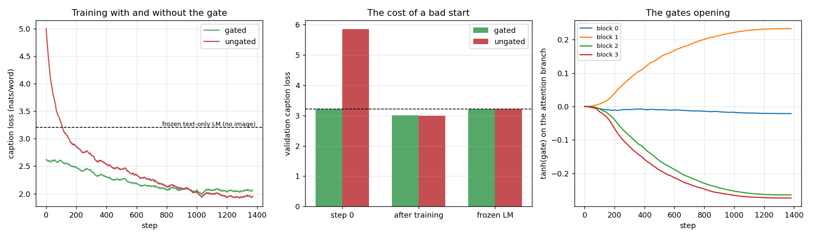

# Gated Cross-Attention

## Key Insight

This project rebuilds [Flamingo](/shared/glossary/#flamingo)'s key mechanism: new [cross-attention](/shared/glossary/#cross-attention) layers inserted between the [frozen](/shared/glossary/#frozen) [LLM](/shared/glossary/#llm)'s blocks, each one [gated](/shared/glossary/#gated) by a learned multiplier that starts at exactly zero. The verification step is the whole lesson — at initialization the gate contributes *nothing*, so the model's output must be bit-for-bit identical to the original text-only LLM; only as training opens the gate does image information begin to flow in. That "start as the unmodified model, then blend the new capability in gradually" design is why you can add a [modality](/shared/glossary/#modality) to a strong pretrained network without breaking the behavior it already has, and confirming the identity at init is the cheapest way to catch a wiring bug before a long training run.

## The problem being solved

You have a language model that already writes decent English. You want it to look at pictures. The obvious move — fine-tune it on image–caption data — risks destroying the language ability you paid for ([catastrophic forgetting](/shared/glossary/#catastrophic-forgetting)).

Flamingo's answer has two halves, and the second is the clever one:

1. **Freeze the language model completely.** Not "use a low learning rate" — freeze. Then forgetting is impossible by construction, not by careful tuning.
2. **Insert new cross-attention layers between its blocks, each multiplied by `tanh(g)` with `g` initialised at 0.**

Since `tanh(0) = 0`, the new branch contributes exactly nothing at step 0 and the enlarged model *is* the original model. Training opens the gates gradually.

```
                        frozen block 0
                              ▲
                    ┌─────────┴──────────┐
                    │  x + tanh(g)·attn  │  ◄── gated cross-attention (NEW, trainable)
                    └─────────┬──────────┘         keys/values = image tokens
                              ▲
                        frozen block 1
                              ▲
                    ┌─────────┴──────────┐
                    │  x + tanh(g)·attn  │  ◄── one per block
                    └─────────┬──────────┘
                              ▲
                          ... etc
```

> **"Isn't a frozen text-only LM already fine? Why add anything?"** Yes — for text. It writes fluent captions, but it has never seen the picture, so it writes *plausible* captions rather than *correct* ones. It is a good prior over English and a useless describer of any specific photo. The gated layers are the only path by which pixels can influence a single one of its predictions. That is the gap they fill, and it is exactly measurable: our frozen text-only LM scores 3.211 nats per word, and the same LM with its gates opened scores 3.011.

> **Why `tanh(g)` and not just `g`?** A bare scalar starting at 0 would also give the identity, so the identity is not the reason. Three properties are: it is bounded in (−1, 1), so the new branch can never overpower the frozen stream it is being added to; its derivative is largest exactly at 0, so a shut gate opens fastest; and it is smooth, so the gate cannot flip sign abruptly the way an unconstrained multiplier can. Flamingo puts one gate on the attention branch and a second on the feed-forward branch that follows it; we do the same.

> **How the new layers attach without touching a line of the frozen model.** The language model's `forward` accepts an optional list of `hooks`, one per block, applied to the hidden states just before that block runs. Each hook is a gated cross-attention layer. The frozen weights are never subclassed, copied or edited — the [PEFT](/shared/glossary/#peft) pattern in one line. (Project [17](../17-adapter-for-a-new-modality/README.md) does the same job with PyTorch's `register_forward_hook` on a model whose source we did not write.)

## The setup

- **Frozen model:** a 4-layer, 256-wide causal caption [language model](/shared/glossary/#autoregressive-model) (3.62M [parameters](/shared/glossary/#parameters)) trained for 1,400 steps on 2,600 COCO captions, **text only, never shown an image**. It shares `caption_lib.py` with project [16](../16-implement-q-former/README.md).
- **Image side:** the same cached frozen [CLIP](/shared/glossary/#clip) ViT-B/32 patch tokens project 16 uses — 50 tokens of 768 numbers per image.
- **New weights:** four gated cross-attention layers, 4.21M parameters, the only thing trained.
- Both variants get identical data, seed, schedule and 1,400 steps. The only difference is whether `tanh(g)` is used or replaced by a constant 1.

## Result 1: the identity check, and it is exact

| comparison | max &#124;Δ logit&#124; vs the frozen text-only LM |
|---|---|
| **gated model at initialisation** | **0.000000** |
| the same model after nudging *one* gate to 0.05 | 4.63 |
| the same architecture with the gate removed | 13.90 |

Not "small". **Exactly zero**, because `0.0 × anything` is `0.0` in floating-point arithmetic, so the addition `x + 0.0 * attn` returns `x` bit for bit.

That exactness is what makes it a *test* rather than a sanity impression. A near-zero difference would be consistent with several bugs — a stray bias, a LayerNorm applied on the main path, an off-by-one in the hook order. Zero is consistent with only one thing: the new branch is genuinely disconnected. And the second row shows the test has teeth: moving a single gate from 0 to 0.05 already shifts logits by 4.63, so the check is not passing because the layers do nothing in general.

**Run this before any long training run.** It costs one forward pass and it catches the class of wiring bug that otherwise shows up as "training is mysteriously slow to start".

## Result 2: what the gate is actually worth



| variant | val loss at step 0 | val loss after training | [perplexity](/shared/glossary/#perplexity) |
|---|---|---|---|
| frozen text-only LM (no image at all) | — | 3.211 | 24.8 |
| **gated** | **3.211** | 3.011 | 20.3 |
| ungated | **5.852** | **3.001** | 20.1 |

Two things here, and the second is not what the Key Insight above predicts.

**The gate does exactly what it promises at the start.** The gated model's validation loss at step 0 is 3.211 — *identical to the frozen LM's*, to four decimals, because it *is* the frozen LM. The ungated model starts at 5.852: injecting a randomly-initialised cross-attention branch into a trained network costs **2.64 nats per word**, which is the model going from "reasonable English" to "much worse than the text-only baseline it was built from". Look at the red curve in the left panel: it spends its first ~120 steps just climbing back to where the green one began.

**And then they finish level — with the ungated one a hair ahead (3.001 vs 3.011).** That 0.010-nat gap is smaller than run-to-run noise; the honest statement is that they tie.

> **So was the gate pointless?** No — but it buys a different thing than "a better final model", and it is worth being precise about which. What it buys is a **safe start**: the guarantee that adding the module cannot make the system worse, at any moment, including moments where you stop early or the run crashes. At our scale the frozen LM is small and the training is short and clean, so the ungated model has time to repair the damage it did to itself. Two things change that calculus in the real setting:
>
> - **Scale.** Flamingo bolted these layers onto a 70B Chinchilla. "Spend the first N steps repairing self-inflicted damage" is cheap when N steps cost minutes and expensive when they cost GPU-months.
> - **What is being damaged.** Our frozen model only has to write captions, and the caption loss is the thing we measure — so the damage and the recovery are both visible in one number. Flamingo's frozen model has to *keep being a general-purpose LLM* while learning vision. Nothing in the vision loss would tell you if the initial shock had knocked out its arithmetic or its instruction-following, and by the time you noticed, the frozen weights would be — well, still frozen and fine. That is the real protection: the frozen weights never move either way. The gate protects the *activations* flowing through them.
>
> The measured version of the claim, then: **the gate guarantees a monotone start, and it is cheap insurance rather than a free accuracy win.** Anyone who tells you gating improves the final score should be asked for the ablation.

## Result 3: the gates open, unevenly

The rightmost panel tracks `tanh(g)` on each block's attention branch over training:

| block | final `tanh(g)` |
|---|---|
| 0 | **−0.021** |
| 1 | +0.233 |
| 2 | −0.264 |
| 3 | −0.274 |

Blocks 1–3 open steadily to about ±0.25 and flatten. **Block 0 never opens** — it ends at −0.021, essentially still shut after 1,400 steps.

That is a real and sensible finding rather than a fluke: the first block operates on raw word embeddings, before the model has built any context to condition. There is very little useful to say about a picture at that depth. Image information is worth injecting once the text stream has something to attach it to. Flamingo reported the same qualitative pattern, and it is a practical hint: **if you are counting parameters, the cross-attention layer at the very bottom is the first one to cut.**

The sign of a gate is meaningless on its own — negating `tanh(g)` and negating the layer's output projection give the same function — so read the *magnitude*. What matters is that three of four grew from a hard zero to a stable non-zero value, smoothly, without any of the spikes an unbounded multiplier would allow.

## An honest note on the parameter budget

Our four cross-attention layers hold **4.21M trainable parameters against 3.62M frozen ones** — the "small addition" is 116% of the model it is bolted onto. Real Flamingo adds roughly 10% to a 70B model. Ours is out of proportion because the frozen LM is tiny and the image side is 768-wide, so the key/value projections alone are large.

Read the result accordingly: this project demonstrates that the *mechanism* is correct and that the gate does what it claims at initialisation. It does **not** demonstrate that gated cross-attention is parameter-efficient at this scale, because at this scale it plainly is not.

## What's in this directory

| file | what it is |
|---|---|
| `run.py` | `GatedCrossAttention`, `FlamingoLM`, and the stages `lm` / `gate` / `plot`. Data and the caption LM come from project [16](../16-implement-q-former/README.md)'s `caption_lib.py` via `sys.path` |
| `outputs/identity.json` | the three numbers of the identity check |
| `outputs/gating.csv` | start and final validation loss for both variants, plus parameter counts |
| `outputs/gates.npz` | `tanh(g)` for every block every 20 steps |
| `outputs/gating.png` | loss curves, the cost of a bad start, and the gates opening |
| `outputs/text_lm.json` | the frozen text-only LM's validation loss — the no-image floor |

## How to run

```bash
python3 run.py --stage lm      # train the text-only LM we then freeze (~3 min)
python3 run.py --stage gate    # identity check + gated vs ungated (~10 min)
python3 run.py --stage plot
```

`--variants gated` runs one arm. Needs project [16](../16-implement-q-former/README.md)'s cached CLIP features (built automatically on first use). The frozen LM checkpoint is cached in the gitignored `checkpoints/`.

## Takeaways

1. **The identity at initialisation is exact, not approximate: 0.000000.** `tanh(0) = 0` and `0.0 × anything = 0.0`, so `x + 0.0 · attn(x)` returns `x` bit for bit. Anything other than a hard zero means a wiring bug.
2. **Make the check adversarial or it proves nothing.** Nudging one gate to 0.05 moved logits by 4.63, and removing the gate entirely moved them by 13.90. Those two rows are what turn "it passed" into "it passed *because* the branch is off".
3. **The measured cost of a random branch is 2.64 nats per word.** The ungated model starts at 5.852 against the frozen model's 3.211 — worse than having no image path at all — and spends its first ~120 steps repairing itself.
4. **Honest inversion: the gate did not produce a better final model.** Gated 3.011 vs ungated 3.001 — a tie within noise. Gating buys a *monotone start*, which is insurance, not accuracy. That distinction gets more valuable as the frozen model gets bigger and as the things it must not forget get further from what you are measuring.
5. **Freezing, not gating, is what prevents forgetting.** The frozen weights cannot move in either arm. The gate protects the activations passing through them during the first few hundred steps.
6. **Gates open unevenly, and the bottom one barely opens at all.** Block 0 ended at −0.021 while blocks 1–3 reached ±0.25. Image information is worth injecting where the text stream already has context to attach it to.
7. **Watch the parameter ratio.** 4.21M new against 3.62M frozen here. "Add a few small layers" is a description of the intent, not a guarantee — check it against your own dimensions before claiming parameter efficiency.
