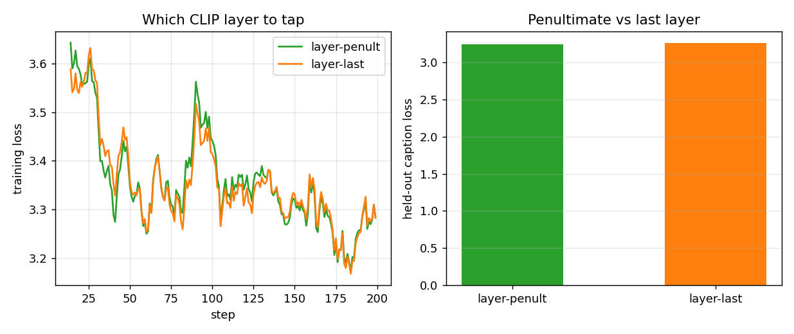
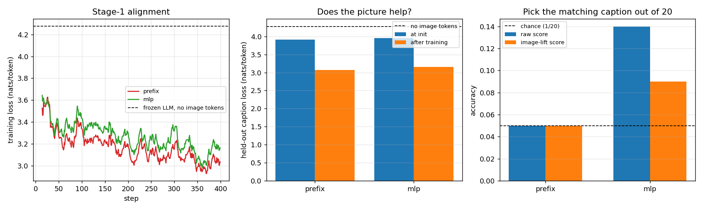
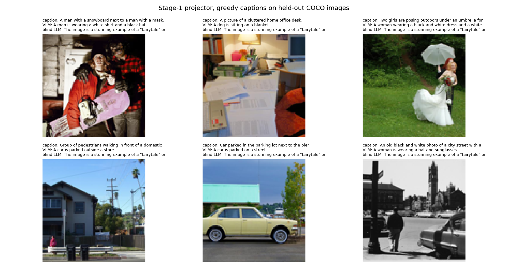

# LLaVA from Scratch

## Key Insight

This project rebuilds the [LLaVA](/shared/glossary/#llava) recipe by hand: bolt a [frozen](/shared/glossary/#frozen) [CLIP](/shared/glossary/#clip)-[ViT](/shared/glossary/#vit) image encoder onto a frozen 1–3B-parameter [LLM](/shared/glossary/#llm) using nothing but a small [projector](/shared/glossary/#projector) — a single linear layer or two-layer [MLP](/shared/glossary/#mlp) — that rewrites each image patch's feature vector into the LLM's word-[embedding](/shared/glossary/#embedding) space. A small 1–3B LLM is the deliberate pick over a larger one: it is fluent enough to caption yet light enough to train on a single GPU, and because both big networks stay frozen, the *only* weights learning are that thin bridge. That is why [stage-1 alignment](/shared/glossary/#alignment-multimodal) on [COCO](/shared/glossary/#coco) captions is cheap and stable — you are just teaching the projector to aim image features at the right words, not retraining a [VLM](/shared/glossary/#vlm) end to end.

## What runs here, and what we shrank

Everything in this project is real except the *size*. The vision tower is the real CLIP ViT-B/32, the language model is a real pretrained, instruction-tuned LLM (`HuggingFaceTB/SmolLM2-135M-Instruct`) with its real [chat template](/shared/glossary/#chat-template), and the captions are real COCO captions.

| piece | LLaVA-1.5 | here | why the change |
|---|---|---|---|
| vision encoder | CLIP ViT-L/14 at 336px → 576 [image tokens](/shared/glossary/#token-visualaudio) | CLIP ViT-B/32 at 224px → **49** tokens | L/14 costs 570 ms per image on this CPU, B/32 costs 28 ms |
| language model | Vicuna-7B or 13B | **SmolLM2-135M-Instruct** | 135M fits a CPU, and it is still a real pretrained instruct model |
| projector | 2-layer MLP | same (0.78M [parameters](/shared/glossary/#parameters)) | this is the part we are studying, so it is unchanged |
| stage-1 data | 558,000 image–caption pairs | 2,600 images × 5 captions, **3,200 pairs seen** | a ten-minute CPU budget |
| hardware | 8× A100 for hours | 12 CPU threads for ~7 minutes | — |

The 170× cut in *data* is the one that changes conclusions, and this README flags it wherever it matters. Everything else is a size knob.

## The forward pass, in one picture

The whole model is three boxes and one splice:

```
  image ──► frozen CLIP ViT-B/32 ──► 49 patch vectors (768 numbers each)
                                            │
                                            ▼
                                     projector   (TRAINED: 0.78M params)
                                            │
                                            ▼   49 vectors of 576 numbers
  "<|im_start|>user\n <image>x49 \nDescribe the image.<|im_end|>\n<|im_start|>assistant\n"
   └──────────────── tokenized by SmolLM2's own tokenizer ────────────────┘
                                            │
              the 49 image slots are overwritten by the projected vectors
                                            ▼
                        frozen SmolLM2-135M  ──►  "a man riding a wave on a surfboard"
```

The sequence the LLM actually sees is 69 positions long: 4 tokens of chat scaffolding, **49 image tokens**, 7 tokens of instruction, 3 more of scaffolding, and the caption. Only the caption positions are scored.

> **"If we overwrite the `<image>` token anyway, why add it to the [vocabulary](/shared/glossary/#vocabulary) at all?"** Because it keeps the prompt an ordinary *string*, so the model's own tokenizer and chat template build the sequence exactly as they do for text — and the token marks *where* the picture goes, which matters because a VLM can place images anywhere in a conversation. Its [embedding](/shared/glossary/#embedding) row is genuinely never read: we replace those positions with projected image features before the first layer runs. What the token really is, is a **placeholder with a known id**, so the test `ids == image_id` hands us the exact positions to write into (one `masked_scatter` call). Real LLaVA does the same. We repeat the placeholder 49 times so the id sequence and the vector sequence line up one-to-one, instead of needing a second bookkeeping array to remember how far the image stretches.

> **"The LLM already has an embedding table that turns things into 576-dimensional vectors. Why does the projector exist?"** Two separate problems, and only the first is about size. **(1) Width:** CLIP emits 768 numbers, SmolLM2 reads 576 — they do not fit. **(2) Coordinate system:** even at equal width they would not fit, because the two networks were trained separately, so "dimension 7" means unrelated things in each. And the embedding table only knows how to convert *token ids* into vectors; it has no entry for "this photo". The projector is the only piece that learns the change of basis from CLIP's space into the space the frozen LLM already understands — which is exactly why it is the one thing we train.

> **"[CLIP](/shared/glossary/#clip) already has a text encoder. Why bolt on a language model at all?"** CLIP's text tower is trained to *score* whether a caption matches an image: it maps a whole sentence to one vector for comparison. It cannot write. It has no [autoregressive](/shared/glossary/#autoregressive-model) decoder — no machinery for emitting token 1, then token 2 conditioned on token 1. So the two text models play different roles: CLIP's is a frozen *matcher* (that is what Phase 3's projects used it for), and SmolLM2 is a *generator* whose grammar and world knowledge we borrow. The moment you want sentences out, you need a decoder.

> **"Why is the loss computed only on the answer?"** The prompt is *given* at test time — the model never has to predict it. Scoring it would spend capacity on reproducing boilerplate ("Describe the image.") that arrives for free, and it would grade the image tokens on predicting the instruction that follows them, which is a meaningless target. This is [loss masking](/shared/glossary/#loss-masking): labels are `-100` (ignored) everywhere except the caption. Project [21](../21-visual-instruction-tuning/README.md) gives masking a second, sharper role.

## One implementation detail that decides whether anything trains

The projector's output is rescaled so its numbers are the same *size* as the LLM's own word embeddings — we measure that once and get 0.130 per number for SmolLM2-135M.

This sounds cosmetic and is not. A frozen network's [layer norms](/shared/glossary/#layer-normalization), attention scales and learned biases were all tuned for inputs of a particular magnitude. Hand it vectors ten times larger and every layer downstream sees an out-of-distribution input; the projector then spends its first few hundred steps fixing a *scale* problem instead of learning meaning. One line — `out * (target_size / actual_size)` — removes the problem for free. The [LayerNorm](/shared/glossary/#layer-normalization) on the input side does the mirror job for CLIP features, which are large and off-centre.

> **Why not just let the projector learn the right scale?** It can, and eventually it does. The point is that it should not have to: every step spent shrinking its own output is a step not spent on the mapping we actually want, and on a 400-step budget those steps are a large share of the budget.

## Which CLIP layer to tap, and why it is not the last one

LLaVA does not read CLIP's final layer. It reads the **second-to-last** one, and we cache both taps so the choice can be measured instead of assumed.

The reason is the one Phase 4's Q-Former note makes: CLIP's last layer was shaped by the [contrastive](/shared/glossary/#contrastive-learning) objective, whose whole job is to produce *one* vector that tells this image apart from a million others. Detail that does not help discrimination gets thrown away there. One layer earlier, the patch vectors still describe local content rather than serving the global summary.



Same projector, same 200 steps, same seed; only the CLIP layer we read changes:

| CLIP layer tapped | held-out caption loss | picks the right caption out of 20 (raw / image-lift) |
|---|---|---|
| **penultimate** (LLaVA's choice) | **3.2358** | **0.08 / 0.13** |
| last | 3.2541 | 0.06 / 0.05 |

The textbook choice wins on all three numbers — and every one of those gaps is **inside the noise** at this scale (0.018 nats on the loss; ±0.04 standard error on 100 retrieval images). The honest summary is: *we reproduced the direction and cannot confirm the size.* At 3,000 images and 200 steps, which layer you tap is not what is limiting this model.

Report it that way. A tempting alternative — quoting "penultimate is better, 3.2358 vs 3.2541" without the error bar — would be technically true and practically misleading, and this is precisely the kind of small architectural difference that gets copied between papers on the strength of one under-powered run.

## The two controls, and why the second one matters more

A number like "the caption loss reached 3.0 nats" means nothing on its own. Two baselines make it readable.

1. **The frozen LLM with no image tokens at all.** SmolLM2 already knows what English captions sound like; ask it to "Describe the image." with no image and it produces fluent, generic sentences. That is the *language prior* floor: **4.277 [nats](/shared/glossary/#nat) per token**.

2. **A learned [soft prompt](/shared/glossary/#prompt-tuning) of the same length.** This is the control that matters. Identical machinery — 49 vectors spliced into the identical positions, trained on the identical captions with the identical schedule — except the 49 vectors are *the same for every image*. It cannot see anything, so whatever it learns is pure format: captions are short, lower-case, usually start with "a", and mention people and streets.

> **"Isn't the no-image floor enough? Why build a second control?"** Because the floor and the treatment differ in *two* ways at once: the image is present, **and** something got trained. A soft prompt separates them — it gets the training but not the image. Here it turns out to close most of the raw loss gap by itself, so a "the loss fell from 4.28!" headline would have been badly misleading. Telling "learned the answer format" apart from "learned to look" is the entire reason this arm exists.

## Result: the loss says one thing, the retrieval test says another



Both arms: 400 steps, batch 8, learning rate 3e-3, cosine decay — so 3,200 image–caption pairs seen, identical for both.

| arm | trainable [parameters](/shared/glossary/#parameters) | held-out caption loss | picks the right caption out of 20 |
|---|---|---|---|
| frozen LLM, no image tokens | 0 | 4.277 | — |
| **`prefix`** (49 learned vectors, no image) | 29,760 | **3.071** | **0.050 = [chance](/shared/glossary/#chance-level)** |
| **`mlp`** (real CLIP features) | 776,832 | 3.150 | **0.140** |

Read those two rows together, because separately each one is misleading.

**The blind control wins on loss.** A soft prompt that never sees a pixel reaches 3.071 nats; the real VLM reaches 3.150. If the caption loss were the headline, this project's conclusion would be "images make captioning worse" — which is nonsense, and the retrieval column shows why. Most of a COCO caption's cost is *English*: article, verb tense, "a … on a …" shape, typical objects. That is [learnable](/shared/glossary/#prompt-tuning) from the target text alone, and 49 free vectors optimising one constant answer learn it *faster* than a projector that must serve 3,000 different images with a single shared map.

**Only the contrast test sees the image.** Asked to pick a held-out image's own caption out of 20 candidates, the soft prompt scores exactly 0.050 — chance, and it cannot be anything else, since it gives every image identical tokens and therefore identical scores for all 20 candidates. The projector scores **0.140, 2.8× chance**, after 3,200 pairs. That gap *is* the grounding, and it is invisible in the loss column.

> **Why did the "image-lift" version of the retrieval score (0.090) come out *lower* than the raw one (0.140)?** The lift score subtracts each caption's no-image cost, to cancel "this sentence is just common English". But specificity cuts both ways: a caption like "a red double-decker bus on a narrow street" is both *unlikely a priori* and *highly informative*, so subtracting its prior penalises exactly the captions the image helps most. The correction is a reasonable idea that measurably does not pay here — worth knowing before you build an evaluation around it.

### The captions themselves



Six held-out images, greedy decoding, no cherry-picking (they are the first six of the validation split). The pattern is exactly what 3,200 pairs buys:

| true caption | our VLM says | the same LLM with no image |
|---|---|---|
| Car parked in the parking lot next to the pier | *A car is parked on a street.* | *The image is a stunning example of a "fairyta…* |
| Two girls are posing outdoors under an umbrella | *A woman wearing a black and white dress and a white hat is w…* | *The image is a stunning example of a "fairyta…* |
| A picture of a cluttered home office desk | *A dog is sitting on a blanket.* | *The image is a stunning example of a "fairyta…* |

Three things to notice. The VLM has learned the **register** — short, present-tense, "A car is parked…" — which is the soft prompt's whole trick and most of the loss drop. It gets the **main subject** right some of the time (car, woman) and inverts it other times (a desk is not a dog). And the blind LLM emits the *same sentence for every image*, which is the most direct illustration available of what "the projector is the only path from pixels to words" means: cut that path and the output stops depending on the input at all.

This is a 170× data reduction, and the captions are what a 170× data reduction looks like. LLaVA's stage 1 is 558k pairs for a reason.

## What's in this directory

| file | what it is |
|---|---|
| `vlm_lib.py` | **the shared Phase-5 stack**: COCO download + frozen-CLIP cache, `load_llm`, `Projector` (linear / mlp2 / pool / qformer / prefix), `TinyVLM` (the splice, the masked loss, KV-cached greedy decoding), and `align_train`. Projects [21](../21-visual-instruction-tuning/README.md), [22](../22-dynamic-resolution/README.md), [23](../23-grounding-head/README.md), [24](../24-compare-projectors/README.md) and [25](../25-inference-optimization/README.md) all import it |
| `run.py` | the stages `data` / `align` / `layer` / `samples` / `plot` |
| `outputs/align.json` | final metrics for both arms (loss, retrieval, parameters, ms/step). Its `ms_per_step` was measured while another job shared this CPU — project [24](../24-compare-projectors/README.md) reports clean per-step times for the same arm |
| `outputs/align_curves.csv` | training loss at every step, per arm |
| `outputs/floor.json` | the frozen LLM's caption loss with no image tokens |
| `outputs/layer.json` | penultimate vs last CLIP layer |
| `outputs/samples.json` | greedy captions, VLM and blind, for six held-out images |
| `outputs/align.png`, `outputs/layer.png`, `outputs/samples.png` | the figures above |

## How to run

```bash
python3 run.py --stage data                 # 3,000 COCO images + CLIP cache (~3 min, once)
python3 run.py --stage align --arms mlp     # stage-1 alignment (~9 min)
python3 run.py --stage align --arms prefix  # the soft-prompt control (~9 min)
python3 run.py --stage layer                # penultimate vs last CLIP layer (~8 min)
python3 run.py --stage plot
```

`--stage align` with both arms runs them back to back. The cache lives in the gitignored `data/` (510 MB for two CLIP taps) and the trained projectors in `checkpoints/` — project [21](../21-visual-instruction-tuning/README.md) loads `proj_mlp.pt` from there, exactly as the real recipe starts stage 2 from stage 1.

## Takeaways

1. **A VLM is three boxes and a splice.** Frozen CLIP → projector → frozen LLM, with the projected vectors written into the positions a placeholder token marks. 0.78M trainable weights against 135M frozen ones (0.6%).
2. **The projector is not a resize.** It is a change of coordinate systems; the width mismatch is the easy half. Nothing in the LLM's embedding table has an entry for "this photo".
3. **Honest inversion: the blind control beat the real model on caption loss (3.071 vs 3.150) and scored exactly [chance](/shared/glossary/#chance-level) on retrieval (0.050 vs 0.140).** Caption loss mostly measures whether you have learned to *write like the dataset*; grounding only shows up in a metric that makes images compete. If you take one thing from this project, take this.
4. **Build the control that gets the training but not the signal.** "No image at all" is not enough, because it differs from the treatment in two ways. A learned [soft prompt](/shared/glossary/#prompt-tuning) of the same length differs in exactly one.
5. **Match the projector's output scale to the LLM's embeddings.** Frozen layer norms and attention scales were tuned for inputs of a particular size; one rescaling line stops the projector from wasting its budget on fixing volume instead of meaning.
6. **Tap CLIP's second-to-last layer, not its last** — but our measurement of it (3.2358 vs 3.2541) is inside the noise, so we reproduced the direction and not the size. Quote error bars on small architectural differences or do not quote them.
7. **3,200 pairs gets you the register and half the subject.** The model writes convincing COCO-ese and names the main object some of the time. That gap between "sounds right" and "is right" is the data axis the [Key Insight](#key-insight) of project [21](../21-visual-instruction-tuning/README.md) is about — and the reason the guide says to budget 70% of your effort for data.
