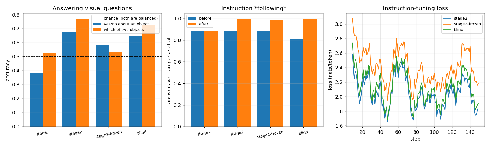

# Visual Instruction Tuning

## Key Insight

After [stage-1 alignment](/shared/glossary/#alignment-multimodal) teaches the [projector](/shared/glossary/#projector) to feed images into the [LLM](/shared/glossary/#llm), this stage does the second half of the [LLaVA](/shared/glossary/#llava) recipe: [instruction tuning](/shared/glossary/#instruction-tuning) on the LLaVA-Instruct dataset, whose conversational (image, question, answer) triples were themselves written by a strong language model prompted with image annotations. The lesson is that the jump in capability comes from *data, not architecture* — the exact same frozen-encoder, tiny-projector model suddenly follows open-ended visual instructions purely because it now trains on dialogues instead of short captions. Evaluating on a few [VQA (Visual Question Answering)](/shared/glossary/#vqa-visual-question-answering) benchmarks closes the loop: a question pins the model to one specific detail it must actually read off the image, so it measures whether instruction tuning produced real [grounding](/shared/glossary/#grounding) or just chattier guessing.

## Stage 2, in one sentence

Nothing about the architecture changes from project [20](../20-llava-from-scratch/README.md). What changes is the data — captions become questions — and what is allowed to move.

```
stage 1 (project 20)                     stage 2 (this project)
────────────────────                     ──────────────────────
freeze  CLIP                             freeze  CLIP
freeze  LLM                              TRAIN   LLM          ◄── new
TRAIN   projector                        TRAIN   projector (continues from stage 1)
data    "Describe the image." → caption  data    a question → a short answer
```

> **"Stage 1 already trained on image–caption pairs. Why does asking questions change anything?"** Because a caption and an answer are different jobs. A caption is *whatever the picture is mostly about*, so a model can score well by describing the biggest object and ignoring the rest. A question names one thing and demands a verdict about *that* thing — `"Is there a dog in the image?"` cannot be answered by saying what is most salient. Two consequences follow: the format changes (a two-word answer, not a sentence), and the *supervision* changes (the model is now graded on details it would otherwise be free to skip). LLaVA's paper is essentially the observation that this second change is where the capability comes from.

## Our instruction data, and the honest gap to LLaVA-Instruct

LLaVA-Instruct was written by GPT-4, which was shown human annotations (captions plus [bounding boxes](/shared/glossary/#bounding-box)) and asked to invent conversations. We have no annotator budget, so a rule writes ours from the same five COCO captions per image, in three shapes:

| kind | question | answer |
|---|---|---|
| `describe` | `"Describe the image."` | one of the five captions |
| `presence` | `"Is there a dog in the image? Answer yes or no."` | `Yes` / `No`, balanced 50/50 |
| `choice` | `"Which is in the image, a bus or a giraffe?"` | the object that is present |

Objects come from 64 concept groups (`person` covers *man, woman, child, guy…*), and a group counts as present if **any** of its words appears in **any** of the five captions.

> **"Why group the words at all?"** Without grouping, a photo captioned "a man riding a wave" contains no `person`, so the label for `"Is there a person?"` would be *No* — confidently wrong. Synonym grouping removes the largest and most systematic source of [label noise](/shared/glossary/#label-noise) here for about twenty lines of code.

Two limits are worth stating plainly, because they cap every number below:

1. **Our questions cannot test reasoning.** GPT-4 wrote multi-turn dialogues with explanations and counterfactuals; a rule cannot. So this project measures whether instruction tuning fixes *format compliance and object grounding* — the floor of the capability, not the ceiling.
2. **"No" really means "not mentioned by five humans".** If a kitchen photo has a chair nobody described, our label says there is no chair. That noise pushes measured accuracy down and can never push it up, so the true grounding ability is a little better than the numbers here.

## The four arms, and what each one isolates

| arm | projector | LLM | image | what it answers |
|---|---|---|---|---|
| `stage1` | from project 20 | frozen | real | how far does stage-1 alignment alone get? |
| `stage2` | trained on | **trained** | real | the real LLaVA-1.5 recipe |
| `stage2-frozen` | trained on | frozen | real | is unfreezing the LLM what matters? |
| `blind` | a learned [soft prompt](/shared/glossary/#prompt-tuning) | **trained** | **none** | how much can be answered without looking? |

> **"Why is a `blind` arm the most important row?"** Because most of these questions can be guessed. `"Is there a person in the image?"` is *Yes* for a large fraction of COCO, and `"Which is in the image, a street or a zebra?"` is answerable from what tends to be photographed. A model that never sees a pixel will therefore score well above 50%, and only the *distance* between `stage2` and `blind` measures looking. This arm keeps everything else identical — same questions, same steps, same 49 prompt slots — with the slots filled by image-independent learned vectors, so nothing but the picture differs.

> **"Doesn't unfreezing the 135M LLM risk wrecking it?"** Yes, and that is why the learning rate for that arm is 20× smaller than the projector-only arms use (1e-4 vs 2e-3). A pretrained network's weights are already in a good place; large steps on them are [catastrophic forgetting](/shared/glossary/#catastrophic-forgetting) waiting to happen, while the projector starts from nothing and needs big steps. Different roles, different step sizes — the same reasoning behind every "freeze the backbone, train the head, then fine-tune gently" recipe.

## Result 1: instruction tuning works, and most of the win is not vision



150 steps, batch 8, identical data for every arm. Evaluation is 589 yes/no questions and 273 two-way choices from 400 held-out images, scored by [exact match](/shared/glossary/#exact-match) on greedy output.

| arm | yes/no | which-of-two | parseable answers | caption loss |
|---|---|---|---|---|
| `stage1` — no instruction data at all | **0.382** | 0.524 | 0.885 | 3.187 |
| `stage2-frozen` — projector only | 0.582 | 0.531 | 0.983 | 3.293 |
| **`blind`** — LLM trained, **no image** | **0.649** | **0.729** | 1.000 | 3.155 |
| **`stage2`** — the full recipe | **0.679** | **0.773** | 0.994 | 3.044 |
| chance | 0.500 | 0.500 | — | — |

**The stage-1 model is worse than a coin flip on yes/no (0.382).** It is not confused about the picture; it is answering a different question than the one asked. Trained only on captions, its instinct is to *describe*, so it produces text that our parser reads as the wrong verdict — the 0.885 parse rate is the visible edge of the same problem. This is the clearest possible demonstration of what [instruction tuning](/shared/glossary/#instruction-tuning) buys before any capability question: the model already had the knowledge, and could not put it in the requested shape.

**And then the blind control gets 0.649 and 0.729.** A model that never sees a pixel — its 49 image slots hold the same learned vectors for every image — lands within a few points of the full recipe. Read the two rows together and the honest arithmetic is:

| what moved the score | yes/no | which-of-two |
|---|---|---|
| chance → blind (format + language priors) | +0.149 | +0.229 |
| blind → sighted (**actually looking**) | **+0.030** | **+0.044** |

With 589 and 273 questions, the standard error on a difference of proportions is about 0.028 and 0.037, so those last two numbers are roughly **1.1 and 1.2 standard errors** — visible, in the right direction, and *not* something we can call a reliable win. The measured contribution of vision, at this data scale, is "probably small and positive".

> **Is that a failure of the model or of the benchmark?** Both, and the benchmark half is the more useful lesson. `"Is there a person in the image?"` is *Yes* for a large share of COCO; `"Which is in the image, a street or a zebra?"` has an obvious answer to anyone who knows what people photograph. A language model with no eyes can farm those regularities, which is exactly why real [VQA](/shared/glossary/#vqa-visual-question-answering) benchmarks went through a decade of redesign — VQA v2 was built by pairing every question with two images that give *opposite* answers, precisely to delete the prior our blind arm is exploiting. **Any multimodal evaluation without a blind baseline is reporting the prior plus the model and calling it the model.** (Phase 9 of the guide is where that fight is fought properly.)

## Result 2: unfreezing the LLM is what mattered, not the projector

`stage2-frozen` trains the same projector on the same instructions with the LLM frozen: yes/no 0.582 against the full recipe's 0.679, and which-of-two 0.531 — barely above chance. Two things follow.

**The projector cannot teach the LLM a new output format.** It controls 49 input vectors; it cannot reach the behaviour "when asked a yes/no question, answer with one word". That behaviour lives in the LLM's weights, which is why stage 2 unfreezes them. This is the sharp difference from project [20](../20-llava-from-scratch/README.md), where the frozen LLM was perfectly capable of the required format (captions) all along.

**Training the projector on instruction data made captioning worse** — 3.293 against the 3.187 it started from. Our mix is mostly one- and two-word answers, so the projector's 0.78M parameters get pulled toward "produce whatever helps say Yes", and the caption ability it was aligned for in stage 1 degrades. That is [catastrophic forgetting](/shared/glossary/#catastrophic-forgetting) in miniature, in the *one* component small enough for us to watch it happen, and it is the reason real recipes keep a share of caption data in the stage-2 mix (ours keeps 25%, evidently not enough).

## Result 3: what the two failure modes look like

The first eight held-out answers of each arm are saved verbatim in `outputs/arms.json`. Two patterns:

| question (gold) | `stage1` says | `stage2` says |
|---|---|---|
| Is there a person in the image? (*Yes*) | `Yes.` | `Yes` |
| Is there a street in the image? (*No*) | `There is a street in the` | `Yes` |
| Is there water in the image? (*No*) | `Yes.` | `Yes` |

`stage1`'s errors come in two flavours: sometimes it *starts describing* instead of answering (`There is a street in the` — cut off by the token budget, and unparseable, which is what the 0.885 parse rate counts), and sometimes it answers the shape correctly but always says `Yes`. Note that the second row's answer is *also* how the picture's caption would begin — the model is doing what it was trained to do in project 20.

`stage2` fixes the shape completely (0.994 parseable) and keeps a milder version of the same bias — it still says `Yes` more often than it should. That residual bias is the same phenomenon as the blind arm's 0.649: when looking is hard and guessing is cheap, a model guesses. Fixing *that* needs either balanced data that punishes the guess or enough visual training for looking to be the easier path.

Nothing about the architecture changed between those two columns. The image tokens, the projector, the frozen CLIP, the 135M LLM: identical. Only the training data changed, from captions to questions — which is the sentence the [Key Insight](#key-insight) opens with, now with numbers attached.

## What's in this directory

| file | what it is |
|---|---|
| `run.py` | the rule-based instruction builder, the answer parsers, and the stages `data` / `train` / `plot`. The model, the CLIP cache and the stage-1 projector all come from project [20](../20-llava-from-scratch/README.md) |
| `outputs/dataset.json` | how many examples of each kind, and the yes/no balance |
| `outputs/examples.json` | twelve training examples verbatim |
| `outputs/arms.json` | before/after metrics for every arm (accuracy per question kind, format validity, caption loss, sample answers) |
| `outputs/curves.csv` | training loss per arm |
| `outputs/instruction.png` | accuracy, format compliance, and loss curves |

## How to run

```bash
# project 20 first: its CLIP cache and its stage-1 projector are the starting point
python3 ../20-llava-from-scratch/run.py --stage data
python3 ../20-llava-from-scratch/run.py --stage align --arms mlp

python3 run.py --stage data                            # build the instruction set (seconds)
python3 run.py --stage train --arms stage1 stage2      # the recipe (~9 min)
python3 run.py --stage train --arms stage2-frozen blind  # the two controls (~8 min)
python3 run.py --stage plot
```

## Takeaways

1. **Instruction tuning is a data change, not an architecture change.** Same frozen CLIP, same projector, same 135M LLM; captions become questions and yes/no accuracy goes 0.382 → 0.679, parseable answers 0.885 → 0.994.
2. **A caption-trained VLM can score *below chance* on yes/no questions.** 0.382 is not ignorance, it is a model answering the question it was trained on instead of the one it was asked.
3. **Honest inversion: the blind control captured about 85% of the gain** (0.649 / 0.729 against 0.679 / 0.773). The measured value of *looking* was +3.0 and +4.4 points — about 1.2 standard errors, which is not a claim we can stand behind at this scale.
4. **Therefore: never report a VQA number without a blind baseline.** The gap between them is the only part that is about vision. This is why VQA v2 pairs every question with images that give opposite answers.
5. **Unfreezing the LLM is what moved the needle** (0.679 vs the projector-only 0.582, and 0.773 vs 0.531 on the two-way choice). The projector controls 49 input vectors; it cannot install a new output format.
6. **Watch what stage 2 costs you.** Training the projector on a mostly-short-answer mix made the caption loss *worse* (3.187 → 3.293). Real recipes keep caption data mixed in for exactly this reason; our 25% was not enough.
7. **Rule-written instructions test the recipe, not the frontier.** They reproduce the format flip and the grounding measurement honestly, and they cannot produce the reasoning dialogues GPT-4 wrote for LLaVA-Instruct. Know which of the two claims your data supports.
