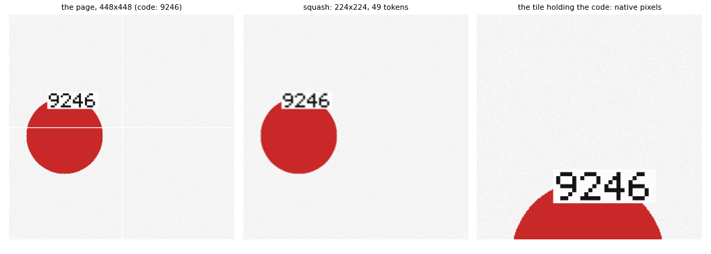
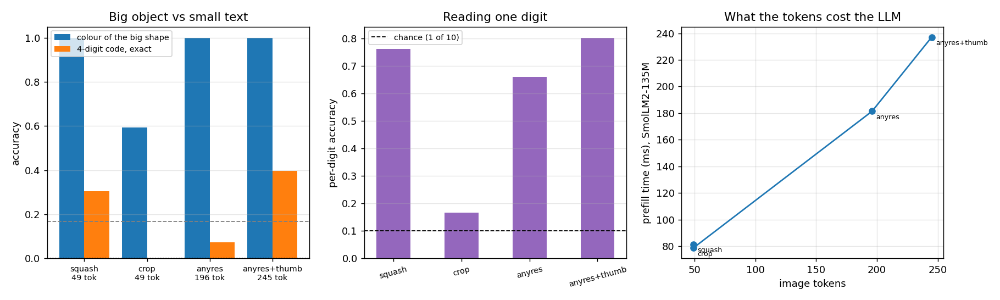

# Dynamic Resolution

## Key Insight

A plain [VLM](/shared/glossary/#vlm) squashes every image down to one fixed square (e.g. 336×336), which throws away the fine print in a document or a dense chart; [AnyRes](/shared/glossary/#anyres) fixes this by tiling the picture at its native aspect ratio into several sub-images, encoding each tile separately, and handing all of their [image tokens](/shared/glossary/#token-visualaudio) to the LLM. Because more tiles means more tokens means more detail preserved, this is exactly the change that lifts [OCR (Optical Character Recognition)](/shared/glossary/#ocr-optical-character-recognition)-heavy benchmarks — tasks where the answer hides in small text the squashed-down image literally cannot resolve. The trade-off to verify is cost: each extra tile adds [image tokens](/shared/glossary/#token-visualaudio) the LLM must process, so AnyRes buys accuracy on detail-dense images at the price of a longer, slower sequence.

## Why a fixed 224×224 square is a real problem

A [ViT](/shared/glossary/#vit) does not accept "an image". It accepts exactly the grid it was trained on — for CLIP ViT-B/32 that is 224×224 pixels cut into 7×7 [patches](/shared/glossary/#patch) of 32×32. Anything bigger has to be resized down first, and resizing is *destructive in a specific way*: it does not blur everything equally, it blurs everything *by the same factor*. A shape 200 pixels wide survives being halved; a digit 20 pixels tall does not.

That asymmetry is the whole project, so the test set is built to expose it. Each "page" is 448×448 and holds two things:

- a **big coloured shape** (circle, square or triangle, radius 55–85 px) — the easy question, `"what colour is the shape?"`
- a **small 4-digit code** printed with a hand-coded 5×7 bitmap font at 4 px per dot, so each digit is 20×28 px — the hard question, `"what is the code?"`



At native resolution one digit is roughly the size of one CLIP patch, which is about as small as a frozen CLIP can still resolve. Squash the page to 224 and each digit becomes 10×14 px — two digits now share a single patch, and the patch vector has to describe both. Nothing about the model changed; the *information* is gone before the model starts.

> **"Why not just use a bigger ViT input, or upscale the whole page to 448 and feed that?"** Because the ViT's [positional embeddings](/shared/glossary/#positional-embedding) and its whole pretraining assume a 7×7 grid. You *can* interpolate them to a bigger grid (that is what [NaViT](/shared/glossary/#navit)-style native-resolution encoders do properly, and what "position-embedding interpolation" does crudely), but then you are running the encoder off-distribution, and the cost grows quadratically with the token count. AnyRes takes the other route: leave the encoder exactly as trained and call it several times. It is the cheap, boring, effective option — which is why almost every 2024–2025 open VLM shipped it.

## The four ways to look at one page

Every condition below feeds the *same frozen CLIP* — only the pixels handed to it change.

| condition | what CLIP sees | [image tokens](/shared/glossary/#token-visualaudio) |
|---|---|---|
| `squash` | the whole 448 page resized to 224 | 49 |
| `crop` | one native-resolution 224×224 quadrant | 49 |
| `anyres` | all four native quadrants, encoded separately | 196 |
| `anyres+thumb` | the four quadrants **plus** the squashed whole page | 245 |

> **"`crop` and `squash` both cost 49 tokens. Isn't one of them redundant?"** They are the two different ways to lose information, and separating them is what makes the result interpretable. `squash` keeps *all* of the page at *quarter* detail; `crop` keeps *one quarter* of the page at *full* detail. If `anyres` beats `squash`, a sceptic can still say "you just gave it sharper pixels somewhere"; `crop` answers that, because it has equally sharp pixels and still cannot see three quarters of the page. The code sits in a random quadrant, so a naive guess is that `crop` reads it about 1 time in 4 — the measured answer below is more interesting than that.

> **"Why does AnyRes add a downscaled copy of the whole image on top of the tiles?"** Because a tile has no idea it is a tile. Cut a photo into quarters and each quarter loses the global layout — "the dog is on the left of the sofa" is not visible in either half alone. The thumbnail restores that global view for 49 extra tokens, so real AnyRes implementations (LLaVA-1.6, InternVL) almost always include one. Our `anyres` vs `anyres+thumb` pair measures whether it earns its tokens on *this* task, where the answers are local by construction.

## Picking the grid: the actual AnyRes rule

Tiling only helps if the tiling matches the picture. `select_grid(w, h)` in `run.py` implements LLaVA-1.6's actual rule. For every allowed grid (1×1, 1×2, 2×1, 2×2, 1×3 … up to 6 tiles): scale the image to fit inside it, count how many of the image's *own* pixels survive — capped at the number it started with, because upscaling invents no detail — and how much of the grid is left as padding. Keep the grid with the most surviving pixels, breaking ties by least padding.

| image | grid chosen | tiles | tokens (tiles + thumbnail) |
|---|---|---|---|
| 448×448 (our page) | **2×2** | 4 | 245 |
| 672×224 (wide receipt) | **3×1** | 3 | 196 |
| 224×672 (tall screenshot) | **1×3** | 3 | 196 |
| 896×224 (very wide) | **4×1** | 4 | 245 |
| 336×448 | 2×2 | 4 | 245 |
| 224×224 (already small) | **1×1** | 1 | 98 |

Two details in that table are the whole rule. A 224×224 image gets **1×1** — the chooser refuses to blow a small picture up into four tiles, because upscaled pixels carry no new detail, only cost. And shape decides orientation: the same three-tile budget goes 3×1 for a wide image and 1×3 for a tall one. The token count is `(tiles + 1) × 49` because of the thumbnail, which is why AnyRes is usually described as costing "a few hundred to a couple of thousand tokens per image".

## The read-out: why the 135M LLM sits this one out

The question here is *what survives the encoder*, so the experiment attaches a small trainable read-out to the projected image tokens instead of the frozen LLM: six learned queries ([cross-attending](/shared/glossary/#cross-attention) to the image tokens, two blocks, 192-wide) with one classification head each — colour, shape, and the four digits.

> **"Projects 20 and 21 built a real VLM. Why swap the language model out here?"** Two reasons, and the second is the important one. **Cost:** a 245-token prompt through a 30-layer LLM costs about 2.5 s per training step on this CPU, so comparing four conditions would take an hour and a half instead of eight minutes. **Confounding:** if the LLM failed to read the code, we could not tell whether the tiles lacked the information or the frozen LLM could not route it. A small read-out trained per condition removes that ambiguity — every condition gets identical read-out capacity, so any difference is the *tokens*. The LLM side is measured separately, in the cost table below and in project [25](../25-inference-optimization/README.md); this is the same "hold everything else fixed" discipline project [15](../15-concat-vs-cross-attn/README.md) used to compare fusion modules. What we lose is the ability to say "and then the VLM answers in words" — that claim belongs to projects 20, 21 and 23.

Six queries with six heads is, structurally, a [Q-Former](/shared/glossary/#q-former) with classifiers bolted on instead of a language model — the same architecture project [16](../16-implement-q-former/README.md) built, reused here as a measuring instrument.

## Result 1: the easy question is untouched, the hard one moves



1,600 pages (300 held out), 1,000 steps, identical read-out and schedule for every condition.

| condition | [image tokens](/shared/glossary/#token-visualaudio) | colour of the big shape | one digit | all four digits |
|---|---|---|---|---|
| `squash` | 49 | **1.000** | 0.761 | 0.303 |
| `crop` | 49 | 0.593 | 0.167 | 0.000 |
| `anyres` | 196 | **1.000** | 0.659 | 0.073 |
| **`anyres+thumb`** | 245 | **1.000** | **0.802** | **0.397** |
| chance | — | 0.167 | 0.100 | 0.0001 |

**The colour question is saturated at 1.000 in every condition that can see the whole page.** A shape 110–170 px across survives being shrunk to a quarter of its size, so the extra 196 tokens buy *exactly nothing* on it. This is the half of the result people forget: AnyRes is not "more resolution is better", it is "more resolution matters for small things". A benchmark made of big-object questions will show tiling to be pure overhead — which is why the papers that introduced it reported [OCR](/shared/glossary/#ocr-optical-character-recognition) and chart benchmarks, not object recognition.

**The code question moves, and by less than you might expect.** `squash` already reads 76% of individual digits: a 10×14-pixel glyph is small but not gone, and the read-out can partly guess from context. Adding the native tiles takes per-digit accuracy to 0.802 and — because getting all four right is the product of four chances — **exact-code accuracy from 0.303 to 0.397**. Small per-digit gains compound: +4 points per digit becomes +9 points on the whole code.

**`crop` is the control working exactly as intended, and then some.** Equally sharp pixels, one quarter of the page: colour drops to 0.593 (the shape is often outside the crop) and the code is *never* fully read — 0.000 exact, 0.167 per digit, barely above the 0.100 chance floor. So the mechanism behind AnyRes is not "somewhere in the input there are sharp pixels"; it is *coverage at full resolution*.

> **Why 0.000 and not 0.25?** The code is in the visible quadrant a quarter of the time, so a fair guess is that `crop` reads a quarter of the codes. The per-quadrant breakdown in `outputs/readout.json` says otherwise: **0.000 in all four quadrants**, including the one it can actually see. The reason is a training effect, not a measurement one. For three quarters of its training pages the answer is not present in the input at all, so the target is pure noise — and a model cannot learn "read the digits" from a signal that is unlearnable 75% of the time. It gives up on digits entirely rather than learning them for the quarter it could. **Missing inputs do not degrade a skill in proportion; they can delete it.** That is a general lesson about training data, and it is why a real AnyRes pipeline covers the whole image rather than betting on a lucky crop.

## Result 2: the honest surprise — tiles alone are worse than squashing

`anyres` (four native tiles, 196 tokens) reads **0.073** of the codes. `squash` (one downscaled view, 49 tokens) reads **0.303**. Four times the tokens, four times the pixel detail, and it loses by 23 points.

Adding the thumbnail back — the *same* view `squash` uses — takes it to 0.397, above both.

> **How can removing information (the thumbnail) hurt more than removing resolution (the tiles)?** Because the information is there but not *findable*. In `anyres` the code sits in one of four tiles, and the read-out's six queries have to work out which tile before they can read anything; nothing in the input says where to look, and 1,300 training pages is not enough to learn a reliable search. The squashed view provides that pointer: a blurry dark smudge in the top-left is unmistakably "the text is here", and once a query is looking at the right place the sharp tile tokens finish the job. Global context is not a nice-to-have next to the tiles — it is what makes the tiles addressable.
>
> This is not a quirk of our read-out. It is the reason essentially every AnyRes implementation ships the thumbnail, and it is worth knowing *why* rather than copying it: **tiles carry detail, the thumbnail carries the map.** Give a model tiles alone and you have handed it a jigsaw with no picture on the box.

Two honest caveats. `anyres+thumb` is a superset of both other conditions, so the fair reading of the table is *the thumbnail is the load-bearing view, and the tiles add +9 points of exact-code accuracy on top of it*. And our tiles never cut a glyph in half, because the renderer keeps each code inside one quadrant; real tiling has no such courtesy, which is one more reason real implementations overlap tiles or add the global view.

## What the extra tokens cost the real LLM

The read-out above is deliberately tiny, so it hides the true price of tiling. This measures it on the actual 135M-parameter VLM from project [20](../20-llava-from-scratch/README.md): the time to [prefill](/shared/glossary/#prefill) one image plus a short question, and the [KV cache](/shared/glossary/#kv-cache) those image tokens occupy.

| condition | image tokens | sequence | prefill | KV cache | code read |
|---|---|---|---|---|---|
| `squash` | 49 | 69 | **81 ms** | 2.2 MB | 0.303 |
| `anyres` | 196 | 216 | 181 ms | 8.6 MB | 0.073 |
| `anyres+thumb` | 245 | 265 | **237 ms** | 10.8 MB | **0.397** |

So the +9.4 points of exact-code accuracy cost **2.9× the prefill time and 4.9× the cache**. Both scale linearly in tokens here (the sequences are short enough that attention's quadratic term is not yet dominant), and CLIP itself must also run five times instead of once — 5 × 28 ms of encoding that the table above does not include.

That ratio is the entire engineering argument, and it is why every VLM has a token-budget knob: you pay the tiling cost on *every* image, including the ones with no small text in them, while the benefit only lands on the detail-dense minority. Projects [24](../24-compare-projectors/README.md) and [25](../25-inference-optimization/README.md) take that trade-off apart from the other side — how many tokens an image needs, and what tokens cost when you are serving.

> **"Couldn't we just decide per image?"** Yes, and that is where the field went: pick the grid from the image's own shape (the table above), cap the tile count, and pool tokens down after encoding. Qwen2-VL goes further and lets the *encoder* take native resolutions ([NaViT](/shared/glossary/#navit)-style) so nothing is tiled at all. The knob is real and worth tuning; the mistake is assuming more tokens are free.

## What's in this directory

| file | what it is |
|---|---|
| `run.py` | the page renderer (including the 5×7 bitmap font), `select_grid`, the `ReadOut` module, and the stages `data` / `train` / `cost` / `plot`. Frozen CLIP and the LLM come from project [20](../20-llava-from-scratch/README.md)'s `vlm_lib.py` via `sys.path` |
| `outputs/readout.json` | accuracy per condition (colour, shape, per-digit, exact code, and per-quadrant breakdown) |
| `outputs/curves.csv` | training loss per condition |
| `outputs/cost.json` | image tokens, prefill time and KV size per condition on the real 135M LLM, plus the grid table |
| `outputs/anyres.png` | the accuracy and cost figure |
| `outputs/page.png` | one page, its squashed version, and the tile holding the code |

## How to run

```bash
python3 run.py --stage data     # render 1,600 pages, encode 5 views each (~5 min, once)
python3 run.py --stage train    # all four conditions (~8 min)
python3 run.py --stage cost     # what the tokens cost the real LLM (~1 min)
python3 run.py --stage plot
```

`--conds anyres squash` runs a subset. The rendered pages and their CLIP features live in the gitignored `data/` (~600 MB: 1,600 pages × 5 views × 49 tokens).

## Takeaways

1. **Tiling helps small things and does nothing for big ones.** Colour of the big shape: 1.000 in every full-page condition. Four-digit code: 0.303 → 0.397. Choose your benchmark accordingly, or AnyRes will look like pure overhead.
2. **Per-digit gains compound.** +4 points per digit (0.761 → 0.802) became +9 points on the full four-digit code, because getting all four right multiplies four chances together.
3. **Honest surprise: native tiles *without* the global thumbnail were far worse than plain squashing** (0.073 vs 0.303). Detail you cannot locate is not usable detail. The thumbnail is the map; the tiles are the magnifying glass.
4. **The `crop` control scored 0.000 in every quadrant, including the visible one.** When the answer is absent from 75% of training inputs, the model does not learn the skill for the remaining 25% — it abandons it. Coverage is not a nice-to-have.
5. **The grid rule is "most original pixels, then least padding".** It gives 3×1 to a wide receipt, 1×3 to a tall screenshot, and 1×1 to an image that is already small — refusing to upscale is part of the algorithm, not an omission.
6. **The price is real and paid on every image:** 2.9× prefill, 4.9× KV cache, 5× the CLIP passes, for a benefit that only lands on detail-dense pictures. That asymmetry is why token budgets are tuned per deployment.
7. **A question the tokens cannot answer stays unanswered.** No amount of tiling helps if the glyph is smaller than a patch at native resolution; at that point you need a bigger encoder input, not more tiles.
