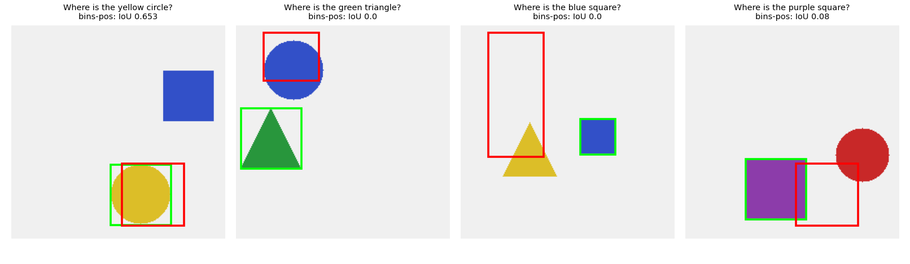
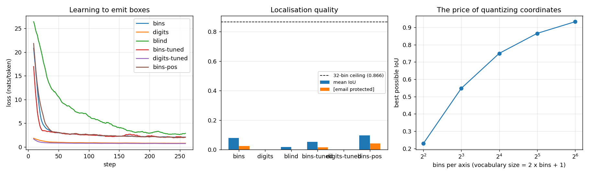

# Grounding Head

## Key Insight

[Grounding](/shared/glossary/#grounding) means making a [VLM](/shared/glossary/#vlm) point at *where* something is, not just say *that* it is there; this project adds it the simplest possible way — extend the model's [vocabulary](/shared/glossary/#vocabulary) with [special tokens](/shared/glossary/#special-tokens) like `<box>` plus a small set of tokens that stand for quantized coordinates, so a bounding box becomes just a few extra tokens the model emits inside its normal text stream. The elegance is that no new architecture or loss is needed: predicting "the cat is at `<box>` 0.1 0.2 0.4 0.6" is the very same [next-token prediction](/shared/glossary/#next-token-prediction) the [LLM](/shared/glossary/#llm) already performs, so it learns spatial output for free with the objective it was built around. Coordinates are quantized into a fixed grid of bins (rather than predicting raw floats) precisely so each one collapses to a single discrete token the existing vocabulary can hold.

## The task

Each 224×224 scene holds two shapes of different colours and different kinds. The question names one of them — `"Where is the red circle?"` — and the answer is that shape's [bounding box](/shared/glossary/#bounding-box). The model must therefore do two things at once: *find* both objects, and *pick* the one the words describe.

The image side is the same frozen CLIP ViT-B/32 as project [20](../20-llava-from-scratch/README.md): 49 patch tokens on a 7×7 grid, so each token covers a 32×32-pixel cell. That grid is the model's entire spatial vocabulary — a shape 40 px across touches four or six cells, and everything the model can ever say about position has to be rebuilt from *which* tokens saw the shape.



## Two ways to write a box, and one control

| arm | how the answer is written | answer length | what is trained besides the [projector](/shared/glossary/#projector) |
|---|---|---|---|
| `bins` | [coordinate tokens](/shared/glossary/#coordinate-tokens): `<box>` `<x03>` `<y11>` `<x09>` `<y17>` | 5 tokens + end | 65 new rows (65 × 576 = 37,440) |
| `digits` | ordinary text: `0.12 0.30 0.44 0.61` | 19 tokens + end | nothing |
| `blind` | the `bins` format with the image emptied out | 5 tokens + end | 65 new rows |
| `bins-tuned` | as `bins` | 5 tokens + end | + the last 8 LLM blocks (29.1M) |
| `digits-tuned` | as `digits` | 19 tokens + end | + the last 8 LLM blocks (29.1M) |
| `bins-pos` | as `bins` | 5 tokens + end | + one learned vector per patch slot (28k) |

The last three arms were added *after* the first three produced the result below; the [Two failures](#result-2-the-format-is-learned-the-mapping-is-not) section explains what each of them was testing.

> **"Why invent new tokens when the model can already write digits?"** This is a real historical fork, and both branches shipped: Pix2Seq and OFA used dedicated coordinate bins, while Qwen-VL writes the numbers out as plain text. Dedicated tokens buy two things. **Length:** one token per coordinate instead of four or five (`0`, `.`, `1`, `2`) — and every extra token is both decode time and another chance to slip. **A clean output space:** `<x03>` cannot be confused with the *number* three inside a sentence, and the 32 x-tokens form an ordered family the model can learn a geometry over. What they cost is training signal: a brand-new token starts life as a random vector, while `0.12` is written in symbols the LLM has already read billions of times. The `digits` arm exists to find out which effect wins at this data scale.

> **"Why quantize at all? Why not have the model output a float?"** Because a [language model](/shared/glossary/#llm) has no mechanism for emitting a number. Its output layer produces one score per vocabulary entry and picks an entry — it is a chooser, not a measurer. You *can* bolt a regression head on the side (predict four floats, train with mean-squared error), and object detectors do exactly that, but then grounding stops being part of the language stream: it needs its own head, its own loss, its own weight against the text loss, and it can no longer appear *inside* a sentence. Quantizing turns "where" into "which token" and keeps one objective for everything.

> **"Why does a `blind` arm matter — surely a model with no image scores zero?"** No, and that is exactly why it is here. Boxes are not spread uniformly: our shapes are 36–68 px wide and never touch the border, so a model that ignores the image and always emits the *average* box already overlaps the truth a fair amount. Without this arm that overlap would read as grounding. (Phase 4 made the same point five times over: the control is the headline.)

## The grounding head, in two halves

We never touch the frozen LLM. The 65 new tokens live in one `(65, 576)` matrix that gets used twice:

```
   input side                                     output side
   ──────────                                     ───────────
   an <x03> in the prompt  ─┐               ┌──  logits over 49,153 real words  (frozen head)
                            ├── same rows ──┤
   becomes this row's       ─┘               └──  logits over 65 new tokens = h @ rows.T
   576-number vector                                        (TRAINED)
```

Using one matrix in both directions is [weight tying](/shared/glossary/#weight-tying) — the trick the base model already uses for its own 49,152 words. The full output is the frozen head's logits concatenated with the 65 new ones, so at every position the model may emit a real word *or* a coordinate token. That makes "did it produce a parseable box at all?" a measured number instead of an assumption.

Trainable weights: the [projector](/shared/glossary/#projector) (0.78M) plus those 37k rows. The 135M-parameter LLM never moves.

> **"Isn't this just `resize_token_embeddings`?"** It is the same thing, written out in the open. The library call grows the embedding matrix and the output head by 65 rows and hands you a bigger model; keeping the new rows in their own parameter makes two things visible instead of hidden — that *only* those rows and the projector receive gradient, and that the input-side and output-side use the very same numbers.

## The ceiling this design puts on itself

Quantizing coordinates means the model can never be exactly right. With 32 bins per axis every edge snaps to a multiple of 1/31 of the image — about 7 pixels. Scoring the ground-truth box against its own quantized version measures that cost directly, with no model involved:

| bins per axis | vocabulary added | best possible IoU |
|---|---|---|
| 4 | 9 tokens | 0.229 |
| 8 | 17 tokens | 0.548 |
| 16 | 33 tokens | 0.750 |
| **32** (our choice) | **65 tokens** | **0.866** |
| 64 | 129 tokens | 0.933 |

Four bins per axis makes a perfect model score 0.229 — *worse than many real detectors* — purely because it cannot express the answer. This is the trade the vocabulary size controls: more bins raise the ceiling, and each one is a new token with its own embedding to learn from your data. Real systems use 1,000 bins (ceiling ≈ 0.999) because they have millions of boxes to learn them from; we use 32 because we have 2,300 scenes. **Everything below should be read against 0.866, not against 1.0.**

## Result 1: dedicated tokens are learned instantly; plain digits never are



260 steps, batch 8, 2,300 training scenes, 120 held-out questions.

| arm | mean [IoU](/shared/glossary/#iou) | [email protected] | [email protected] | answers that parse as a box |
|---|---|---|---|---|
| `blind` (no image) | 0.017 | 0.000 | 0.025 | 0.425 |
| `bins` | 0.080 | 0.025 | 0.117 | **1.000** |
| `bins-tuned` (+8 LLM blocks) | 0.054 | 0.017 | 0.092 | **1.000** |
| **`bins-pos`** (+patch positions) | **0.097** | **0.042** | **0.158** | **1.000** |
| `digits` | 0.000 | 0.000 | 0.000 | **0.000** |
| `digits-tuned` (+8 LLM blocks) | 0.000 | 0.000 | 0.000 | **0.000** |
| 32-bin ceiling | 0.866 | — | — | — |

**Every coordinate-token arm emits a well-formed box 100% of the time, from early in training. Neither text arm ever produced one.** That is the sharpest contrast in the table and it has a mechanical explanation: the 65 coordinate rows are the *only* output rows receiving gradient, so the cheapest thing the model can do is put its probability mass there — the format is learned almost for free. Writing `0.12 0.30 0.44 0.61` instead requires re-shaping the frozen model's existing preferences over digits, decimal points and spaces, and 2,000 examples is not enough to do it.

> **So dedicated tokens are simply better?** At *this* budget, decisively — one is at 1.000 format validity and the other at 0.000. At Qwen-VL's budget the text format works fine and saves you a vocabulary change. The transferable lesson is *why*: **a new token is easy to learn precisely because it is new** (nothing competes for those rows), while re-purposing existing tokens means fighting a prior built from trillions of tokens. That is the same reason [special tokens](/shared/glossary/#special-tokens) are used for chat roles instead of the word "user".

## Result 2: the format is learned, the mapping is not

Now the honest part. The best arm reaches **0.097 IoU against a 0.866 ceiling**. The boxes are the right *size* and shape — look at what the model actually says:

| question | true box | `bins` predicts |
|---|---|---|
| Where is the yellow circle? | `0.464 0.652 0.746 0.933` | `0.677 0.355 0.903 0.581` |
| Where is the green triangle? | `0.022 0.388 0.304 0.670` | `0.129 0.032 0.387 0.323` |
| Where is the purple square? | `0.281 0.625 0.562 0.906` | `0.677 0.355 0.903 0.581` |

Every prediction is a plausible box of roughly the right dimensions (≈0.25 wide, matching the shapes), and the first and third are *identical* for two different questions. The model has learned **the distribution of boxes in the dataset** and not **which box goes with which question**. Its 5× advantage over the `blind` control (0.080 vs 0.017) says a little image information is getting through; the distance to 0.866 says almost none of it is.

Two ablations narrow down where it breaks:

- **`bins-tuned`: unfreezing the last 8 LLM blocks made it *worse*** (0.054). More trainable weights, 29.1M against 814k, and a lower score — the extra capacity fits the box prior faster rather than finding the mapping. So this is not the same bottleneck project [21](../21-visual-instruction-tuning/README.md) hit, where unfreezing the LLM was exactly what was missing.
- **`bins-pos`: giving every patch slot a learned "I am cell (r, c)" vector helped** — 0.097 and [email protected] 0.158, the best of the six. Note this is about 1.2 standard errors over plain `bins` on 120 questions, so read it as a hint, not a result. The idea behind it is solid, though: the [projector](/shared/glossary/#projector) applies the *same* map to every patch, so nothing in an image token says where in the picture it came from. Position exists only as the token's place in the sequence, and converting "the 23rd image token" into `<x09> <y15>` is something the frozen model must infer from scratch.

> **Why is this so much harder than the caption task in project [20](../20-llava-from-scratch/README.md)?** Captioning needs *what*: the model can average across all 49 image tokens and still say "a dog on a beach". Grounding needs *which one*, then *where that one is*. The second step has no shortcut — it is a lookup from a token's position in a sequence to a symbol the model has never used before, and it must be learned entirely inside 814k trainable parameters. Phase 4's project [15](../15-concat-vs-cross-attn/README.md) found the same asymmetry from the other direction: its positional question was the one only early fusion could answer, and its nearest-neighbour questions defeated every fusion module.

> **What would actually fix it?** In order of expected effect: (1) **more data** — real grounding VLMs train on millions of annotated boxes, and Molmo's whole contribution was a *dataset*; (2) an image encoder fine-tuned for localisation instead of a [contrastive](/shared/glossary/#contrastive-learning) one, since CLIP was trained to say what an image contains, not where; (3) a finer patch grid — our 7×7 CLIP tokens are 32-pixel cells, so a shape 40 px wide is barely 1.5 cells across. We did not do any of these because each breaks the ten-minute budget, and saying so is more useful than quietly reporting the 0.097 as a success.

## Data preparation, and how ours differs from the real recipe

To teach a model this spatial mapping, the training data must be formatted to match standard [instruction tuning](/shared/glossary/#instruction-tuning) structures:

1. **Normalization**: convert absolute pixel coordinates into relative coordinates between `0.0` and `1.0`, so the same answer text works at any image size.
2. **Quantization**: map these continuous floats into discrete bins (we use 32 per axis; production systems often use 1,000) so they align with the newly added coordinate tokens in the [vocabulary](/shared/glossary/#vocabulary).
   * *Example:* `[x1: 0.15, y1: 0.25, x2: 0.45, y2: 0.65]` becomes the discrete sequence `<box> <x05> <y07> <x14> <y20>`.
3. **Formatting**: wrap the quantized coordinates in a standard conversational structure so the model learns to emit them in response to a question:
   ```json
   {
     "image": "cat_photo_001.jpg",
     "conversations": [
       { "role": "user", "content": "Where is the cat in this image?" },
       { "role": "assistant", "content": "The cat is located at <box> 0.15 0.25 0.45 0.65." }
     ]
   }
   ```

Ours is the same pipeline with two simplifications worth naming. The answer is *only* the box, with no surrounding sentence, which removes the separate job of learning where in a sentence a box belongs. And our boxes are exact by construction because we render the shapes ourselves, whereas real grounding data carries human box noise of a few pixels — a form of [label noise](/shared/glossary/#label-noise) that lowers every reported IoU.

## How frontier models handle grounding

Modern frontier models streamline this process by moving away from glued-together components (frozen encoder + projector) toward [Native Multimodal](/shared/glossary/#native-multimodal) architectures:

* **Training (native multimodal):** images and text are processed into a shared embedding space from the start. The model is instruction-tuned to predict coordinate tokens alongside normal text using standard [next-token prediction](/shared/glossary/#next-token-prediction), learning to relate visual features to spatial tokens without architectural add-ons.
* **Inference pipeline:**
  * **[Prefill](/shared/glossary/#prefill):** the model ingests the user's text and the entire sequence of image tokens at once, computing the visual context and storing it in the [KV cache](/shared/glossary/#kv-cache).
  * **[Decode](/shared/glossary/#decode):** the model generates the response one token at a time ("The cat is located at..."). When it reaches the spatial tokens it attends back over the cached image tokens. [Greedy decoding](/shared/glossary/#greedy-decoding) is the norm for coordinates, since sampling one adds positional error for no gain.
* **Beyond boxes:** Molmo's [pointing](/shared/glossary/#pointing) supervision replaces the four-number box with a single (x, y) point — faster to annotate, two tokens instead of four, and a better fit for questions like "which button do I press?".

## What's in this directory

| file | what it is |
|---|---|
| `run.py` | the scene renderer, the coordinate-token codec, `GroundingVLM` (the two-halves head), and the stages `data` / `train` / `plot`. Frozen CLIP, the LLM and the projector come from project [20](../20-llava-from-scratch/README.md)'s `vlm_lib.py` via `sys.path` |
| `outputs/ground.json` | IoU, [email protected], [email protected], format-valid rate, parameters and ms/step per arm, plus four example predictions |
| `outputs/ceiling.json` | the best possible IoU at 4, 8, 16, 32 and 64 bins |
| `outputs/curves.csv` | training loss per arm |
| `outputs/grounding.png` | loss curves, IoU per arm, and the quantization ceiling |
| `outputs/boxes.png` | predicted (red) vs true (green) boxes on held-out scenes |

## How to run

```bash
python3 run.py --stage data                             # 2,600 scenes + CLIP cache (~2 min, once)
python3 run.py --stage train --arms bins bins-pos       # the grounding head (~9 min)
python3 run.py --stage train --arms digits blind        # the alternative and the control (~7 min)
python3 run.py --stage train --arms bins-tuned digits-tuned   # with 8 LLM blocks unfrozen (~11 min)
python3 run.py --stage plot
```

`--unfreeze N` overrides how many LLM blocks an arm trains. The rendered scenes and their CLIP features live in the gitignored `data/` (~190 MB).

## Takeaways

1. **The mechanism is real and costs nothing to install.** Extend the vocabulary by 65 rows, tie them across input and output, and a box becomes 5 ordinary tokens under the ordinary [next-token](/shared/glossary/#next-token-prediction) loss. No new head, no new objective, no architecture change.
2. **Dedicated coordinate tokens hit 1.000 format validity; plain-text digits hit 0.000.** A brand-new token is easy to learn *because* nothing competes for it; re-shaping a pretrained model's preference over digits and decimal points is a much bigger ask at 2,000 examples.
3. **Quantization sets a hard ceiling before the model does anything.** 32 bins per axis → 0.866 IoU maximum; 4 bins → 0.229. Choose bins for the precision you need and the data you have to learn them from.
4. **Honest negative result: we learned the format and the box *prior*, not the mapping.** Best arm 0.097 IoU against the 0.866 ceiling, with two different questions on the same image getting identical boxes. It beats the blind control 5× (0.080 vs 0.017), so some image information flows — nothing like enough.
5. **More trainable weights made it worse.** Unfreezing 8 LLM blocks (29.1M parameters) dropped IoU to 0.054: extra capacity fit the prior faster instead of finding the mapping. Contrast project [21](../21-visual-instruction-tuning/README.md), where unfreezing was exactly the missing ingredient — "train more of the model" is not a general fix.
6. **Giving patches an explicit position is the right idea, and we could not prove it.** `bins-pos` scored best (0.097, [email protected] 0.158) at 1.2 standard errors over `bins` — a hint. The reasoning stands regardless: a projector applies one map to every patch, so an image token carries no "where I came from" unless you put it there.
7. **Grounding is a data problem before it is an architecture problem.** Molmo's headline contribution was a pointing *dataset*; real grounding models see millions of boxes. A 260-step run on 2,300 synthetic scenes can demonstrate the interface and cannot demonstrate the capability — and being explicit about which of the two you have measured is the point.
