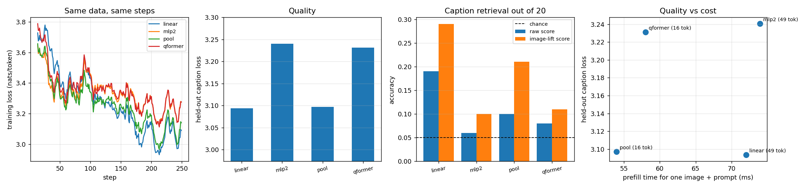

# Compare Projectors

## Key Insight

The [projector](/shared/glossary/#projector) is the only trained bridge in a [LLaVA](/shared/glossary/#llava)-style [VLM](/shared/glossary/#vlm), and this project races three choices for it on one downstream task: a single linear layer, a two-layer [MLP](/shared/glossary/#mlp), and a [Q-Former](/shared/glossary/#q-former). The real axis of comparison is detail-preservation versus token budget and speed: a linear or MLP projector keeps one token per image patch (maximum detail, but many tokens for the LLM to chew through), while a Q-Former distills the whole image into a small fixed set of learned query tokens (far fewer tokens and a faster LLM, at the cost of a tighter information bottleneck). Reporting quality *and* speed side by side makes the lesson land: there is no universal winner — the right projector depends on whether your task needs every patch or can survive a compressed summary.

## The four bridges

Same frozen CLIP ViT-B/32, same frozen SmolLM2-135M, same COCO captions, same steps, same seed. The only thing that changes is what sits between them.

| bridge | what it does | out tokens | shipped in |
|---|---|---|---|
| `linear` | one matrix per patch: 768 → 576 | 49 | LLaVA 1.0 |
| `mlp2` | two matrices with a [GELU](/shared/glossary/#gelu) between them | 49 | LLaVA 1.5 |
| `pool` | average the 7×7 patch grid down to 4×4, then `mlp2` | **16** | Qwen2-VL's patch merger |
| `qformer` | 16 learned queries that [cross-attend](/shared/glossary/#cross-attention) to the patches, twice | **16** | BLIP-2 |

The first two keep one token per [patch](/shared/glossary/#patch); the last two compress to 16. That split — not the choice of matrix — is what the experiment is really about.

> **"A [Q-Former](/shared/glossary/#q-former) and average-pooling both output 16 tokens. Isn't pooling just a worse Q-Former?"** That is the hypothesis worth testing, and it is not obviously true. Pooling is *fixed*: it averages four neighbours whether or not they belong together, so a boundary between a face and a wall gets smeared. A Q-Former is *learned and content-dependent*: each query decides for itself which patches to read, so query 3 can specialise in "whatever is in the middle" regardless of which patches that is. In exchange the Q-Former costs 13× the parameters, adds its own [attention](/shared/glossary/#self-attention) blocks to every forward pass, and has to learn its queries from scratch. Pooling costs nothing and cannot be got wrong. When a free method matches a learned one, that is the news — the field's move from BLIP-2's Q-Former to LLaVA's projector was exactly this discovery, and project [16](../16-implement-q-former/README.md) found the same tie on a from-scratch caption model.

> **"Why does `mlp2` exist if `linear` already changes the coordinate system?"** A single matrix can only rotate, scale and shear — every output is a fixed linear mixture of CLIP's 768 numbers. If the relationship between "what CLIP encoded" and "what the LLM's embedding space wants" is bent at all (say, a feature that should matter only when another is present), no matrix can express it. Two matrices with a nonlinearity between them can. LLaVA-1.5 changed exactly this one thing versus LLaVA-1.0 and reported a real gain — at scale. Whether it shows at 3,000 images is a separate question, and this project measures it instead of assuming.

## How they are scored

Two numbers per bridge, because they answer different questions:

- **Held-out caption loss** ([nats](/shared/glossary/#nat) per token) — how well the model predicts the *right* caption for a held-out image.
- **Caption retrieval out of 20** — for each held-out image, score all 20 candidate captions and check whether its own comes out cheapest. [Chance](/shared/glossary/#chance-level) is 0.05. Loss can be dragged around by generic fluency; retrieval only rewards distinguishing *this* image from 19 others, which is the thing a projector is supposed to enable.

And two costs, measured on the real LLM at inference: **prefill** time for one image plus prompt, and **KV-cache** size, since both scale with the token count the bridge emits.

## Result: quality barely separates them, cost does



250 steps, batch 8, learning rate 3e-3, seed 0, the same 2,600 COCO images — 2,000 image–caption pairs seen by each bridge.

| bridge | tokens | [parameters](/shared/glossary/#parameters) | held-out caption loss | retrieval (raw) | retrieval (image-lift) | ms/step |
|---|---|---|---|---|---|---|
| **`linear`** | 49 | **444.5k** | **3.094** | **0.190** | **0.290** | 1163 |
| `mlp2` | 49 | 776.8k | 3.241 | 0.060 | 0.100 | 1096 |
| `pool` | **16** | 776.8k | 3.097 | 0.100 | 0.210 | **698** |
| `qformer` | **16** | 5,774.8k | 3.231 | 0.080 | 0.110 | **647** |
| chance | — | — | — | 0.050 | 0.050 | — |

**Read the error bars before the ranking.** Retrieval is scored on 100 held-out images, so its standard error is about ±0.04; the caption loss is a 200-image average. That is enough to separate any of these bridges from chance, and *not* enough to crown a winner among neighbours from one seed. What the table supports:

- **All four bridges land in a narrow band** (loss 3.09–3.24) after identical training. The guide's claim that "the projector is trivial" survives contact with measurement: swapping the bridge moves the score less than doubling the training data would.
- **The single linear layer is at least as good as everything else**, at 57% of the MLP's parameters and 8% of the Q-Former's. Its 0.190 raw retrieval against `mlp2`'s 0.060 is about 2.3 standard errors — suggestive, single-seed, and pointing the *opposite* way to LLaVA-1.5's upgrade from linear to MLP.

> **Why would the extra layer *hurt*?** LLaVA-1.5's MLP gain was measured on 558k pairs; we have 2,000. A two-layer MLP has more to fit and a harder optimisation landscape, and with 250 steps the simpler map simply converges further. This is the standard small-data pattern, and it is a warning about copying architecture choices across scales: **the reason a component helps is usually a claim about the data budget it was tuned at.** At our budget, "one matrix" is not a simplification you tolerate — it is the better model.

> **What about the [Q-Former](/shared/glossary/#q-former)?** 5.8M parameters, 13× the linear bridge, and it finishes in the same band (3.231 / 0.080). Meanwhile plain 4×4 average [pooling](/shared/glossary/#pooling) — zero learned parameters in the compression step — reaches 3.097 / 0.100 with the *same* 16-token budget. So at this scale the learned queries buy nothing over an average. That is the third independent time this guide has measured it: project [16](../16-implement-q-former/README.md) found a four-way tie on captioning, project [15](../15-concat-vs-cross-attn/README.md) found a plain projector beating cross-attention, and here the Q-Former's 13× parameters do not move the score. It is exactly the BLIP-2 → LLaVA simplification, reproduced.

**The token budget is the axis that separates the arms reliably.** 16-token bridges train at 647–698 ms/step against 1,096–1,163 for the 49-token ones — a **1.7× speed-up** — for at most a couple of points of retrieval, well inside the noise. Under an equal *wall-clock* budget rather than equal steps, the 16-token bridges would get about 1.7× more updates, which at this data scale is worth more than anything in the quality column.

## What each bridge costs at inference

Measured on the real 135M LLM, one image plus a short prompt, machine otherwise idle:

| bridge | image tokens | projector itself | [prefill](/shared/glossary/#prefill) (image + prompt) | [KV cache](/shared/glossary/#kv-cache) per image |
|---|---|---|---|---|
| `linear` | 49 | 0.31 ms | 72.0 ms | 2.2 MB |
| `mlp2` | 49 | 0.32 ms | 74.0 ms | 2.2 MB |
| `pool` | 16 | 0.48 ms | **53.9 ms** | **0.7 MB** |
| `qformer` | 16 | **2.37 ms** | 58.0 ms | **0.7 MB** |

Three things worth naming:

1. **The projector's own cost is a rounding error** — 0.3 ms against a 72 ms prefill. Even the Q-Former's 2.4 ms is 3% of the request. Choosing a bridge on its parameter count is choosing on the wrong axis.
2. **What the bridge actually controls is the token count**, and that is where the money is: 16 tokens instead of 49 cuts prefill by 25% and the KV cache by **3×**. The cache figure compounds — it is per image, per request, held for the whole conversation.
3. **`pool` and `qformer` cost the same at the LLM** because they emit the same number of tokens; they differ only in the 1.9 ms it takes to produce them. Given equal quality, the free one wins.

> **"Then why does anyone use a Q-Former?"** BLIP-2 introduced it to bridge a *frozen* image encoder and a *frozen* LLM with a two-stage pretraining recipe on 129M images, where the queries also carry a text-conditioned pretraining objective we are not running. Its selling point was never "better than an average at 16 tokens"; it was "a fixed, small, learnable interface at large scale". At 2,000 pairs, none of that machinery has anything to learn from — so what we are measuring is the honest small-scale answer, not a refutation of BLIP-2.

## What's in this directory

| file | what it is |
|---|---|
| `run.py` | the stages `train` / `cost` / `plot`. Every bridge, the data and the training loop come from project [20](../20-llava-from-scratch/README.md)'s `vlm_lib.py` via `sys.path` — this project is a sweep over its `Projector` kinds, so nothing about the setup can differ between arms |
| `outputs/projectors.json` | per-bridge loss, retrieval, parameter count, ms/step |
| `outputs/curves.csv` | training loss per bridge |
| `outputs/cost.json` | image tokens, projector time, prefill time and KV size per bridge |
| `outputs/projectors.png` | curves, quality, retrieval, and quality-vs-cost |

## How to run

```bash
# needs project 20's CLIP cache
python3 ../20-llava-from-scratch/run.py --stage data

python3 run.py --stage train --kinds linear mlp2     # 49-token bridges (~9 min)
python3 run.py --stage train --kinds pool qformer    # 16-token bridges (~7 min)
python3 run.py --stage cost                          # inference cost (~1 min)
python3 run.py --stage plot
```

## Takeaways

1. **All four bridges finish in a narrow band** (caption loss 3.09–3.24 after identical training). The projector is the cheapest part of a VLM to get right and the least likely to be your bottleneck.
2. **The one-matrix bridge was not beaten** — 3.094 loss and 0.190 retrieval at 444k parameters. LLaVA-1.5's linear → MLP upgrade was measured at 558k pairs; at 2,000 pairs the extra layer cost more than it returned.
3. **A learned [Q-Former](/shared/glossary/#q-former) did not beat free average [pooling](/shared/glossary/#pooling) at the same 16-token budget** (0.080 vs 0.100 retrieval, 3.231 vs 3.097 loss), at 7.4× the projector time and 13× the parameters. Third independent confirmation in this guide of the BLIP-2 → LLaVA simplification.
4. **Report error bars or report nothing.** With 100 retrieval images the standard error is ±0.04; several "rankings" in the table are noise, and saying so is part of the result.
5. **The real decision variable is the token count, not the architecture.** 16 tokens instead of 49: 1.7× faster training steps, 25% faster prefill, 3× smaller KV cache — for a quality difference inside the noise.
6. **The projector's own runtime is negligible** (0.3–2.4 ms against a 72 ms prefill). Optimise the number of tokens it emits, not the arithmetic inside it.
7. **Every claim here is a claim about 2,000 pairs.** The direction of the linear-vs-MLP result flips at scale, which is exactly why the interesting question is never "which projector is best" but "which projector is best *at my data budget*".
