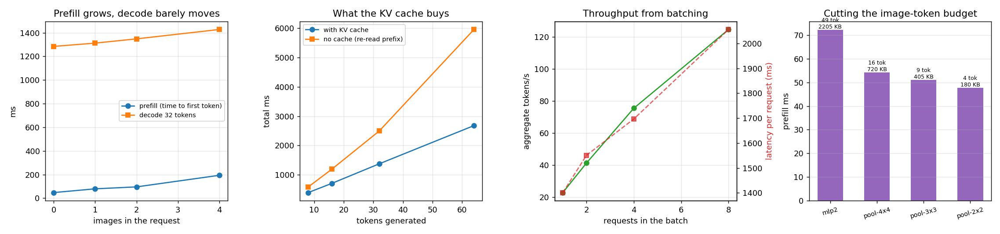

# Inference Optimization

## Key Insight

A trained [VLM](/shared/glossary/#vlm) is only useful if it can serve answers fast, so this project takes an open VLM and runs it on a production engine like [vLLM](/shared/glossary/#vllm) or [sglang](/shared/glossary/#sglang), then measures [throughput](/shared/glossary/#throughput) (tokens per second) as the number of images per request grows. Image count is the knob that matters because every image expands into many [image tokens](/shared/glossary/#token-visualaudio) that all live in the [KV cache](/shared/glossary/#kv-cache) and must be attended to — so more images means a longer sequence, more memory, and lower throughput, the multimodal twist on the usual long-context squeeze. The full serving toolkit (continuous batching, paged attention, quantization) is owned by the [Inference Systems](/guides/inference-systems/) guide; here the goal is just to *feel* how the image-token budget trades against speed.

## What this project actually runs, and why

vLLM and SGLang are GPU engines; neither is installed on this CPU-only machine, and neither would tell you much if it were — a CPU cannot show the memory-bandwidth effects those engines are built around. So instead of driving an engine, this project **measures the quantities the engines optimise**, on the same real 135M-parameter VLM the rest of Phase 5 uses:

| what a real engine does | what we measure here |
|---|---|
| [PagedAttention](/shared/glossary/#pagedattention) — store the [KV cache](/shared/glossary/#kv-cache) in fixed pages so it never fragments | the *size* of that cache: bytes per token, MB per image, and how many images fit in 10 GB |
| [Continuous batching](/shared/glossary/#continuous-batching) — never let the GPU idle between requests | how [throughput](/shared/glossary/#throughput) and per-request [latency](/shared/glossary/#latency) trade off as the batch grows |
| [Prefix caching](/shared/glossary/#prefix-cache) — reuse the KV of a shared prompt prefix | the same idea applied to an *image*: prefill it once, answer five questions |
| chunked prefill — stop a long [prefill](/shared/glossary/#prefill) from blocking [decode](/shared/glossary/#decode) | why prefill is the thing that needs protecting: it is where image tokens land |

> **"If the engine is what makes serving fast, isn't measuring it by hand pointless?"** The engines are implementations of a few facts about the workload, and the facts are what transfer. Every number below is a property of the *model and the request shape*, not of our code: bytes of cache per token is arithmetic from the config; prefill growing with image count is arithmetic from the sequence length; prefix reuse saving exactly the image's prefill is a consequence of attention being causal. Learn the shape of the problem here, and vLLM's flags stop looking like magic. What we cannot show on a CPU is the absolute speed, so no number below should be read as "this is how fast a VLM is".

## The one formula worth memorising

Every token you put in the prompt leaves a permanent trace in memory: its key vector and its value vector, in every layer.

```
KV bytes per token = 2 (K and V) x layers x kv-heads x head-dim x bytes-per-number
```

For SmolLM2-135M (30 layers, 3 [KV heads](/shared/glossary/#gqa), head dim 64, float32): 2 × 30 × 3 × 64 × 4 = **46,080 bytes ≈ 45 KB per token**. One image at 49 tokens therefore costs about 2.2 MB of cache — for a 135M model.

That is small. Here is the same arithmetic for models people actually serve:

| model | KV per token | tokens per image | **cache per image** | images that fit in 10 GB |
|---|---|---|---|---|
| SmolLM2-135M (this project, float32) | 45 KB | 49 | **2.3 MB** | 4,429 |
| LLaVA-1.5-7B (float16) | 512 KB | 576 | **302 MB** | **33** |
| Qwen2-VL-7B at ~1 megapixel (float16) | 56 KB | 1,280 | **73 MB** | 136 |

**A single image in LLaVA-1.5-7B occupies 302 MB of KV cache** — roughly what 600 words of text would cost. Thirty-three such images fill 10 GB of GPU memory, and that is *before* the model weights. This is the reason multimodal serving is a memory problem before it is a compute problem, and the reason every serving system has a knob for image tokens.

> **Why is Qwen2-VL's per-token cost 9× smaller than LLaVA's despite being the newer, bigger-context model?** [GQA](/shared/glossary/#gqa). LLaVA-1.5 inherits Llama-2's 32 key/value heads; Qwen2-VL uses 4, sharing each key/value head across several query heads. Same idea as [MQA](/shared/glossary/#mqa), and it is worth noticing that the architecture choice which halves your cache is *not* in the vision half of the model at all. Qwen2-VL still ends up needing 73 MB per image, because it spends 1,280 tokens on one — the token budget gives back what GQA saves.

## Result 1: prefill grows with images, decode barely notices



One request, 32 generated tokens, machine idle. Each image is 49 tokens.

| images | image tokens | prompt length | [prefill](/shared/glossary/#prefill) ([TTFT](/shared/glossary/#ttft)) | [decode](/shared/glossary/#decode) per token | end-to-end tokens/s |
|---|---|---|---|---|---|
| 0 | 0 | 13 | 47.3 ms | 40.14 ms | 24.0 |
| 1 | 49 | 63 | 79.1 ms | 41.01 ms | 23.0 |
| 2 | 98 | 112 | 95.6 ms | 42.13 ms | 22.2 |
| 4 | 196 | 210 | **193.7 ms** | 44.62 ms | 19.7 |

**Prefill is where images land: 47 ms → 194 ms, roughly 4× for four images.** Decode moves by 11% over the same range (40.1 → 44.6 ms/token), because each new token attends over a longer cache but still does the same amount of weight arithmetic.

That asymmetry is the single most useful fact in this project:

- **Prefill is proportional to the tokens you put in.** Images are hundreds of tokens each, so images are a prefill problem.
- **Decode is proportional to the tokens you take out**, and almost independent of the prompt — one pass through 135M weights per token, whatever it is reading.

So a VLM request is "one expensive gulp, then a long slow drip". Serving engines separate those two phases for exactly this reason: chunked prefill stops a 4-image gulp from stalling everyone else's drip, and the two phases are sometimes even run on different machines.

> **Why does the end-to-end rate fall from 24.0 to 19.7 tokens/s if decode barely changed?** Because end-to-end divides *all* the time by the tokens produced, and the extra 147 ms of prefill is spread over only 32 output tokens. Ask for 500 tokens and the same prefill difference nearly vanishes from the average. Which number you quote is a choice about which workload you care about: chat with short answers is dominated by prefill, document generation by decode.

## Result 2: what the KV cache is worth

One image, one prompt, varying output length, with and without the [KV cache](/shared/glossary/#kv-cache):

| tokens generated | with cache | no cache | speed-up |
|---|---|---|---|
| 8 | 398 ms | 589 ms | 1.48× |
| 16 | 713 ms | 1,196 ms | 1.68× |
| 32 | 1,377 ms | 2,494 ms | 1.81× |
| 64 | 2,678 ms | 5,950 ms | **2.22×** |

**The speed-up grows with output length, and that growth is the whole point.** Without a cache, generating token *n* re-reads the entire prefix, so total work grows with the *square* of the output; with one, each step reads only the stored keys and values and total work grows linearly. At 64 tokens the gap is already 2.2×; at 512 it would be far larger.

The reason the ratio is "only" 2.2× here rather than the tens of times a GPU would show: on a CPU with a 63-token prompt, re-reading the prefix is cheap compared with the fixed cost of pushing activations through 30 layers. The *shape* of the curve is the transferable part — one line bending upward, one straight.

## Result 3: one image, five questions — reuse the image's KV

Five questions about the same picture, 8 tokens each. The naive way re-sends the image every turn; the reuse way prefills the image once and branches a copy of that cache per question.

| | naive | image-KV reuse |
|---|---|---|
| [TTFT](/shared/glossary/#ttft), averaged over 5 turns | 73.7 ms | **56.4 ms** (**1.31×** faster) |
| total for the conversation | 2,197 ms | 2,154 ms (1.02×) |
| cost of copying the cache | — | 4.6 ms per turn |

**TTFT improves by 31%; total time barely moves.** Both numbers are correct and they answer different questions. Prefix reuse deletes exactly one thing — re-encoding the image — which is most of the prefill and none of the decode. Our answers are 8 tokens (≈320 ms of decode), so a 17 ms saving disappears into them.

The lesson is not "prefix caching is overrated", it is **know which part of the bill you are cutting**. Scale the image up to LLaVA-1.5's 576 tokens and a real multi-turn conversation, and the saved prefill becomes the dominant term. This is why [vLLM](/shared/glossary/#vllm) turns [prefix caching](/shared/glossary/#prefix-cache) on by default and why it matters most for chat over documents and images.

> **One honest gap between our version and a real engine.** We `deepcopy` the cache, which physically copies every stored key and value: 4.6 ms and 2.3 MB per turn here, and 302 MB per turn for a 7B model — completely impractical. Real engines store the cache in fixed-size pages ([PagedAttention](/shared/glossary/#pagedattention)) and let several requests *share* the pages of a common prefix, copying only a page that gets written to. So the mechanism we measured is right and the implementation is the toy version; the copy time is the price of not having paged memory.

## Result 4: batching trades latency for throughput

Identical requests, one image each, 32 tokens out:

| batch | latency per request | aggregate tokens/s | KV cache |
|---|---|---|---|
| 1 | 1,401 ms | 22.8 | 2.3 MB |
| 2 | 1,551 ms | 41.3 | 4.5 MB |
| 4 | 1,697 ms | 75.4 | 9.0 MB |
| 8 | **2,056 ms** | **124.5** | 18.1 MB |

Eight requests at once produce **5.5× the throughput** while each individual user waits **1.47× longer**. Nothing was optimised to achieve that — it is what happens when the same weight matrices are reused for eight rows instead of one, so the expensive part (reading 135M parameters from memory) is amortised.

This is the trade every serving system is built around, and it is why the two headline metrics of an inference engine pull against each other. [Continuous batching](/shared/glossary/#continuous-batching) is the refinement: instead of waiting for a batch to fill and finishing it together, requests join and leave the running batch every step, so a short request is not held hostage by a long one. Our fixed batch shows the payoff; an engine shows the payoff without the queueing cost.

## Result 5: the multimodal lever — spend fewer tokens per image

The multimodal-specific knob: how many tokens one image is worth. Same model, same prompt, only the [projector](/shared/glossary/#projector)'s output length changes.

| bridge | image tokens | TTFT | decode per token | KV per image |
|---|---|---|---|---|
| `mlp2` (one token per patch) | 49 | 72.2 ms | 40.4 ms | 2,205 KB |
| `pool` 4×4 | 16 | 54.2 ms | 40.2 ms | 720 KB |
| `pool` 3×3 | 9 | 50.9 ms | 41.0 ms | 405 KB |
| `pool` 2×2 | 4 | **47.6 ms** | 41.1 ms | **180 KB** |

Cutting 49 tokens to 16 removes 25% of the prefill and **two thirds of the cache**; cutting to 4 removes 34% and 92%. Decode does not care at all (40–41 ms/token throughout) — at these lengths the cache is far too small for reading it to matter.

Put beside project [24](../24-compare-projectors/README.md), which measured *quality* for the same bridges and found 16 tokens within noise of 49, this is the cheapest optimisation available to a VLM: **halve the token budget before you touch anything else.** It is also the one an inference engine cannot do for you — vLLM can page your cache, but only your model can decide to make it smaller.

## What's in this directory

| file | what it is |
|---|---|
| `run.py` | the stages `images` / `cache` / `prefix` / `batch` / `budget` / `scale` / `plot`, or `all`. The VLM itself comes from project [20](../20-llava-from-scratch/README.md)'s `vlm_lib.py` via `sys.path` |
| `outputs/images.json` | prefill, decode and tokens/sec at 0, 1, 2, 4 images |
| `outputs/cache.json` | with-cache vs no-cache decoding at four output lengths |
| `outputs/prefix.json` | the five-question conversation, naive vs image-KV reuse |
| `outputs/batch.json` | latency and aggregate throughput per batch size |
| `outputs/budget.json` | prefill and cache size at 49, 16, 9 and 4 image tokens |
| `outputs/scale.json` | the KV arithmetic for this model and for two real 7B VLMs |
| `outputs/serving.png` | the four panels above |

## How to run

```bash
python3 run.py --stage all      # every measurement plus the figure (~6 min)
python3 run.py --stage images   # or one at a time
```

No training and no dataset: the timings do not depend on the projector's weights, only on the shapes, so this project runs standalone on a fresh clone (it will download SmolLM2-135M once, ~270 MB). Run it on an otherwise idle machine — every number here is a timing, and a busy CPU quietly halves them.

## Takeaways

1. **Images are a prefill problem.** Four images took TTFT from 47 ms to 194 ms while per-token decode moved 11%. Prefill scales with what you put in; decode with what you take out.
2. **Memorise the KV formula**: `2 × layers × kv-heads × head-dim × bytes`. It explains 45 KB/token here, 512 KB/token in LLaVA-1.5-7B, and therefore **302 MB of cache for one image** — 33 images to fill 10 GB.
3. **[GQA](/shared/glossary/#gqa) is a multimodal decision.** Qwen2-VL's 4 KV heads make each token 9× cheaper than LLaVA-1.5's 32 — then it spends 1,280 tokens per image and gives most of it back.
4. **The KV cache turns quadratic decoding into linear**, and the measured advantage grows with output length: 1.48× at 8 tokens, 2.22× at 64.
5. **Reusing one image's cache across five questions cut TTFT by 31% and total time by 2%.** Both are true; quote the one that matches your workload. Prefix caching cuts prefill, and prefill is only the first sip of a long answer.
6. **Batching 8 requests: 5.5× throughput for 1.47× latency.** That single trade is the reason serving engines exist, and continuous batching is the version that does not make short requests wait.
7. **The cheapest optimisation is the one in your own model:** fewer image tokens. 49 → 16 costs nothing measurable in quality (project [24](../24-compare-projectors/README.md)) and returns 25% of prefill and 3× of cache.
