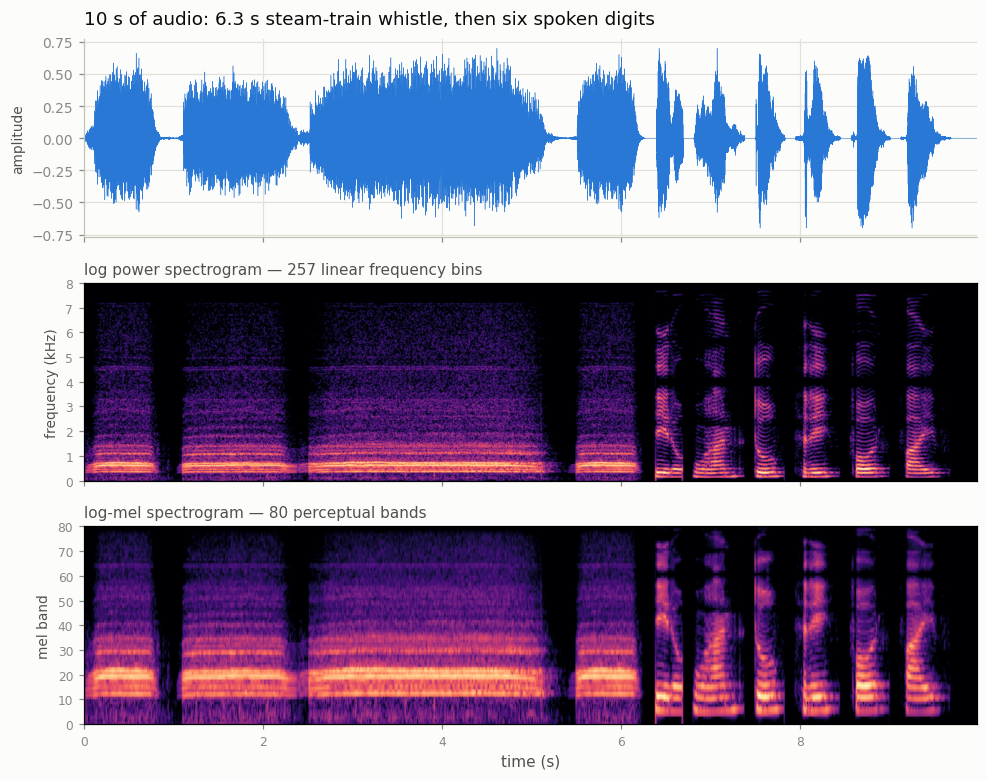
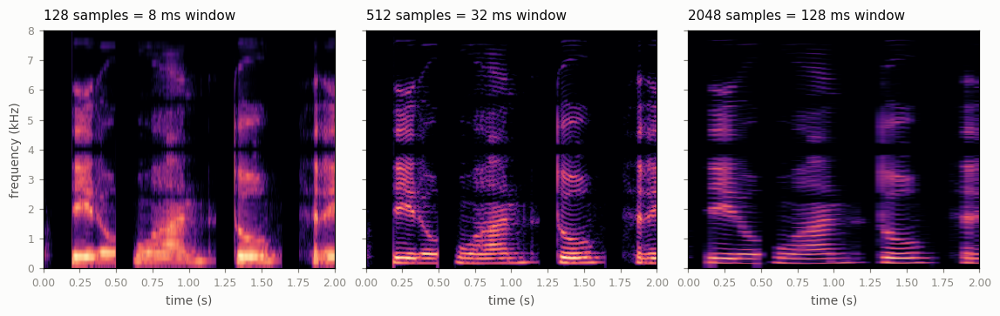
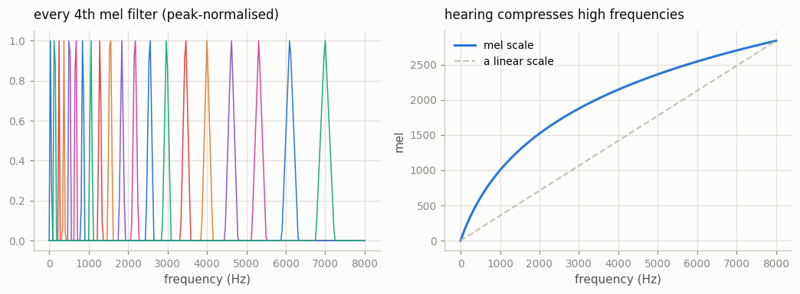
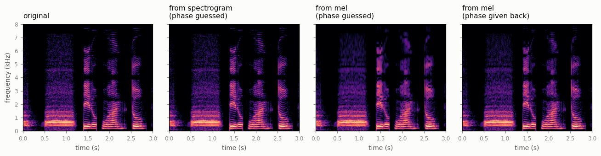

# Mel Spectrogram From Scratch

## Key Insight

Libraries like `torchaudio` hand you a [mel spectrogram](/shared/glossary/#mel-spectrogram) in a single call, but rebuilding one by hand — windowing the raw waveform, running a [Short-Time Fourier Transform](/shared/glossary/#stft), then applying a [mel filterbank](/shared/glossary/#filterbank) — shows there is no magic inside. That [filterbank](/shared/glossary/#filterbank) is just a fixed matrix of [triangular weights](/shared/glossary/#triangular-weights), so the famous "perceptual" step is one matrix multiply that folds the [STFT](/shared/glossary/#stft)'s many evenly-spaced frequency rows down into a handful of [mel bands](/shared/glossary/#mel-bands) spaced the way human hearing is. Doing it from scratch on a 10-second clip turns the everyday habit of treating audio as an image into something you understand rather than trust.

## What this project builds

Phase 2's project [06](../06-mel-spectrogram-pipeline/README.md) already built a *working* audio front end and trained a classifier on it — but it called `torch.stft` for the hard part. This project goes one level down and writes that part out, then does something project 06 could not: it runs the pipeline **backwards** and turns the picture back into sound, because the fastest way to see what a representation threw away is to try to rebuild the audio from it and listen.

> **"Project 06 already made mel spectrograms. Isn't this the same thing twice?"** No — they answer different questions. Project 06 asked *"does this front end work?"* and measured accuracy. This project asks *"what is inside it, and what does it destroy?"* Nothing here is trained; every number is a verification or a measurement of information loss. The two projects share the same [FSDD](/shared/glossary/#fsdd-free-spoken-digit-dataset) audio loader on purpose, so nothing about the data changes between them.

Five things run:

| stage | what it answers |
|---|---|
| `verify` | is our hand-written transform *really* the same one the libraries compute? |
| `picture` | what does 10 seconds of real audio look like at each step? |
| `bank` | what does the mel [filterbank](/shared/glossary/#filterbank) actually look like, band by band? |
| `window` | why is there no window length that is simply "best"? |
| `invert` | how much sound survives each step — as `.wav` files you can play |

No `torchaudio`, no `librosa`, no `scipy` — none of them are installed in this environment, which turned out to be a feature.

## The pipeline, one step at a time

```
waveform            160,000 numbers   10 s x 16,000 samples per second
   │  cut into overlapping 512-sample frames, each multiplied by a Hann window
frames              1,247 x 512
   │  one Discrete Fourier Transform per frame  (a matrix multiply)
complex spectrum    1,247 x 257 complex   = magnitude AND phase
   │  square the magnitude (phase is thrown away here)
power spectrogram   1,247 x 257
   │  multiply by the 80 x 257 mel filterbank  (one matrix multiply)
mel spectrogram     1,247 x 80
   │  log
log-mel             1,247 x 80  ->  feed to a CNN or Transformer
```



The clip is 6.3 seconds of a real steam-train whistle followed by six spoken digits. You can read both textures straight off the middle panel: the whistle is a stack of evenly spaced horizontal lines (a tone plus its harmonics) on a bed of broadband steam hiss, and the speech is a set of thick moving bands — the [formants](/shared/glossary/#formant) that make one vowel sound different from another.

Two details worth noticing, because both are visible rather than asserted:

- **The speech has a hard ceiling around 4 kHz.** The digit recordings were captured at 8,000 samples per second, and a signal sampled at rate *R* can only carry frequencies below *R*/2 — the [Nyquist frequency](/shared/glossary/#nyquist-frequency), named after Harry Nyquist, who proved the limit at Bell Labs in 1928. There is simply nothing above 4 kHz to draw.
- **The bottom panel is a squashed version of the middle one**, and the squashing is uneven: the lowest 1 kHz of the middle panel gets about a third of the mel axis, while the 4–8 kHz octave is compressed into a handful of rows.

## Part 1 — is it the real thing?

It is easy to write something spectrogram-*shaped* and never notice it is wrong. So every hand-written piece is checked against a library that computes the same quantity a different way.

| check | what it compares | result |
|---|---|---|
| our [DFT](/shared/glossary/#fourier-transform) matrix vs `numpy.fft.rfft` | slow matrix multiply vs the Fast Fourier Transform | max difference **2.8e-12** |
| our [STFT](/shared/glossary/#stft) vs `torch.stft` | framing + windowing + transform, end to end | relative difference **2.3e-14** |
| Parseval's theorem | energy counted in samples vs counted in frequencies | relative error **1.6e-16** |
| [overlap-add](/shared/glossary/#overlap-add) inverse vs the original waveform | our inverse STFT undoing our STFT | max difference **2.2e-16** |

Those are floating-point round-off, not agreement "to a good approximation". The last row is worth pausing on: our inverse rebuilds the input *exactly*, which is what makes it a fair place to modify a spectrogram and listen to the consequence — any damage you then hear is damage you caused, not damage the code did.

> **Why is the DFT "just a matrix"?** The [Fourier transform](/shared/glossary/#fourier-transform) asks one question per output: *how much of this particular wave is in my signal?* Row *k* of the matrix is a wave that completes exactly *k* cycles across the frame, and the answer is the dot product of that row with the frame. Stack the rows and the whole transform is one matrix multiply. The **Fast** Fourier Transform is not a different answer — it is the same answer computed by reusing shared sub-results, and our timing shows what that reuse buys: **21 ms vs 0.55 ms** for 200 frames, a **39× speedup**, on a 512-point transform.

> **Why does a 512-point transform give 257 numbers and not 512?** Because the input is real. For a real signal, output bin *n−k* is always the mirror image of bin *k* (its complex conjugate), so the second half carries no new information and gets dropped. That is what the "r" in `rfft` means: *real* input, half the output.

## Part 2 — the two decisions inside the front end

### Decision one: how long is a "short time"?

A plain Fourier transform of the whole 10 seconds would answer "which frequencies are in this recording" and lose *when* completely — a whistle at second 2 and a whistle at second 8 give the identical answer. Chopping the signal into short frames first is what puts time back, and it is why the transform is called **Short-Time** Fourier Transform.

But the frame length is a genuine trade-off, not a tuning detail:



| window | time resolution | frequency resolution | what you can see |
|---|---|---|---|
| 128 samples = **8 ms** | 2 ms per column | 125 Hz per row | sharp attacks, smeared pitch |
| 512 samples = **32 ms** | 8 ms per column | 31 Hz per row | both, roughly |
| 2048 samples = **128 ms** | 32 ms per column | 7.8 Hz per row | crisp harmonic lines, smeared timing |

Read the picture left to right: at 8 ms the moments where each digit starts are knife-sharp but the horizontal harmonic lines have dissolved into blur; at 128 ms the harmonics are razor-thin stripes but the word boundaries have smeared into vertical mush. **You cannot have both.** A short window sees a short slice of the wave, and a short slice simply does not contain enough cycles to pin down a frequency precisely. Speech pipelines land on 25–32 ms because that is roughly the time a vowel holds still.

> **"Why multiply each frame by a window function at all?"** Cutting 512 samples out of a continuous recording leaves two hard edges, and the DFT reads a hard edge as a click — energy smeared across *every* frequency row, which is called [spectral leakage](/shared/glossary/#spectral-leakage). The [Hann window](/shared/glossary/#hann-window) (one raised cosine hump, 0 at both ends) tapers the edges away, so a pure tone shows up as one sharp line instead of a line plus a haze. It is named after Julius von Hann, an Austrian meteorologist who used the same smoothing shape on weather series long before anyone applied it to sound.

### Decision two: how many mel bands, and why triangles?



The recipe is three lines: put 82 points evenly along the **mel** axis, convert them back to Hz, and give band *j* a triangle rising from point *j* to *j*+1 and falling to *j*+2. Neighbouring triangles overlap by half, so no frequency falls into a gap, and each row is scaled to unit area so a wide high band does not simply report a bigger number than a narrow low one at equal loudness.

"Mel" is short for **melody**. The scale was built in the 1930s by asking listeners to adjust a tone until it sounded "twice as high" as another; 1000 mel was pinned to 1000 Hz as the anchor. The right panel shows the consequence: below ~500 Hz mel and Hz agree, and above it hearing compresses hard. The step from 200 to 300 Hz is obvious to anyone; the step from 7000 to 7100 Hz is inaudible — same 100 Hz, completely different perceptual size.

> **Why triangles instead of simple on/off boxes?** With hard boxes, a tone drifting slightly in pitch would jump abruptly from one band to the next, so a tiny pitch change would produce a large feature change. Overlapping triangles hand the energy over gradually, which keeps the features stable under small pitch changes — the same reason interpolation beats rounding.

**A measurement worth carrying into your own designs.** At 16 kHz with a 512-point transform, the frequency rows are 31.25 Hz apart, and the mel bands are not:

| band | centre | width | FFT rows it effectively averages |
|---|---|---|---|
| 0 | 42 Hz | 46 Hz | **1.5** |
| 20 | 674 Hz | 85 Hz | **2.0** |
| 40 | 1,842 Hz | 156 Hz | 3.8 |
| 60 | 4,002 Hz | 289 Hz | 6.9 |
| 79 | 7,736 Hz | 519 Hz | 12.5 |

**21 of the 80 bands average fewer than two rows.** Down there the "filterbank" is not filtering anything — it is copying single FFT rows and calling them bands. That is the mechanism behind project [06](../06-mel-spectrogram-pipeline/README.md)'s surprising result, where **8 mel bands beat 80** on spoken-digit classification: the extra bands were not extra information, they were the same information written out more times, and the fine detail they did add encoded *who* was speaking rather than *what* was said.

## Part 3 — what does the front end throw away?

This is the part project 06 could not do. Take three seconds of the clip, run it forward to each representation, then rebuild a waveform from that representation alone and compare.



Rebuilding needs two different repairs, and separating them is the whole experiment:

1. **Phase is missing.** Squaring the magnitude throws away *when within its cycle* each wave peaks. [Griffin-Lim](/shared/glossary/#griffin-lim) (Daniel Griffin and Jae Lim, MIT, 1984) guesses it back by bouncing between two facts that must both hold: the magnitudes are the ones we were given, *and* overlapping frames share samples so their phases cannot disagree. Start from random phase, rebuild a waveform, re-analyse it, keep the new phase, restore the true magnitudes, repeat — 48 times here.
2. **Frequency detail is missing.** The filterbank is 80 rows by 257 columns: it maps 257 numbers to 80 and cannot be undone. The [pseudo-inverse](/shared/glossary/#pseudo-inverse) returns the smallest 257-vector consistent with the 80 we kept — the best guess available, and audibly blurrier.

| rebuilt from | what was missing | log-spectral distance | listen |
|---|---|---|---|
| the [STFT](/shared/glossary/#stft) magnitude | phase only | **5.6 dB** | `outputs/recon_from_stft.wav` |
| 80 mel bands, phase given back | frequency detail only | **7.2 dB** | `outputs/recon_from_mel_true_phase.wav` |
| 80 mel bands, phase guessed | both | **9.8 dB** | `outputs/recon_from_mel.wav` |
| — | — | 0 dB (reference) | `outputs/recon_original.wav` |

*(Log-spectral distance compares two clips cell by cell in the time-frequency plane, in [decibels](/shared/glossary/#decibel-db) — one tenth of a bel, named after Alexander Graham Bell. Comparing waveforms sample by sample would be useless here: shift a waveform by one sample and it sounds identical while the sample-wise error explodes.)*

**The non-obvious result: the mel step costs more than the phase step.** Discarding *all* phase costs 5.6 dB; keeping all the phase but collapsing 257 frequency rows to 80 costs 7.2 dB — and this is measured with a magnitude-only metric, which by construction cannot even see phase damage directly. Both numbers are larger than the "essentially free" reputation the front end enjoys. The reason nobody minds is that the discarded information is mostly *not* what a classifier needs, which is a claim about the task, not about the audio.

> **"If we are going to rebuild sound anyway, why is anyone still using Griffin-Lim?"** Mostly they are not. Modern text-to-speech predicts a mel spectrogram and then runs a trained neural [vocoder](/shared/glossary/#vocoder) (HiFi-GAN, WaveNet) to turn it into a waveform. A vocoder does not guess phase from consistency rules; it has *learned* what real speech waveforms look like, so it can invent detail the mel spectrogram never carried. Griffin-Lim is here because it needs no training and makes the loss audible — it is a measuring instrument, not a recommendation.

### One more thing the numbers say

| representation | numbers per second of audio |
|---|---|
| waveform | 16,000 |
| STFT magnitude | **32,125** |
| mel spectrogram | 10,000 |

**The STFT is not a compression — it doubles the data.** With a hop of a quarter of the window, every sample is covered by four overlapping frames. What the STFT buys is not size but *structure*: frequency content becomes an axis you can look along, which is what makes a convolution over a spectrogram meaningful. Only the mel step actually shrinks anything, and it shrinks the *frequency* axis by 3.2× while leaving the time axis alone.

## What's in this directory

| file | what it is |
|---|---|
| `spectro.py` | the whole front end and its inverse: DFT matrix, framing, [Hann window](/shared/glossary/#hann-window), STFT, overlap-add inverse STFT, mel scale, filterbank, Griffin-Lim, plus the resampler and the audio loader. Project [28](../28-encodec-tour/README.md) imports it for spectrogram comparisons |
| `run.py` | the stages `verify` / `picture` / `bank` / `window` / `invert` |
| `outputs/verify.json` | every correctness check above |
| `outputs/speed.json` | naive DFT vs FFT timing |
| `outputs/bank.json`, `outputs/window.json`, `outputs/shapes.json` | the filterbank, window and size tables |
| `outputs/invert.json` | the reconstruction distances |
| `outputs/*.png` | the four figures above |
| `outputs/recon_*.wav` | the reconstructions — play them, that is the point |

The 10-second demo clip and the FSDD download live in the gitignored `data/`; both are rebuilt automatically on first run.

## How to run

```bash
python3 run.py --stage all        # everything, about one minute
python3 run.py --stage invert     # just the reconstructions
```

## Takeaways

1. **The audio front end is two matrix multiplies with a squaring in between.** One matrix is the [Fourier transform](/shared/glossary/#fourier-transform), the other is the [mel filterbank](/shared/glossary/#filterbank). Everything else — framing, windowing, the log — is a handful of lines.
2. **Check your transform against a library, once.** Four independent checks agreed to 1e-12 or better here. Something that merely *looks* like a spectrogram will train a model that merely *looks* like it works.
3. **The window length is a real trade-off, not a hyperparameter to tune away.** Short windows locate events in time, long windows locate them in frequency, and no length gives both. 25–32 ms is the speech convention because that is how long a vowel holds still.
4. **21 of 80 mel bands averaged fewer than two FFT rows.** Below about 700 Hz our "filterbank" was copying rows, not filtering — which is exactly why project [06](../06-mel-spectrogram-pipeline/README.md) found 8 bands beating 80. Check how many FFT rows each band really averages before adding bands.
5. **Collapsing 257 frequency rows into 80 costs more (7.2 dB) than discarding phase entirely (5.6 dB).** The front end is lossy in a way its reputation hides; it survives because the loss falls mostly on things classifiers do not use.
6. **The STFT doubles the data before the mel step shrinks it.** "Turning audio into an image" is a change of *structure* first and a compression second.
