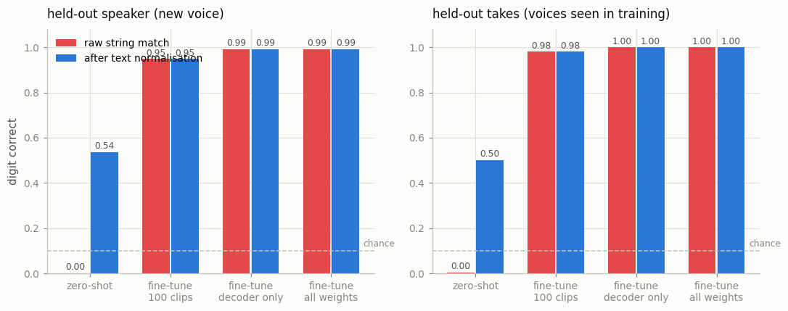
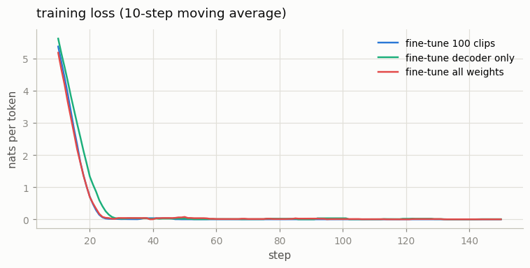

# Whisper Fine-Tune

## Key Insight

[Whisper](/shared/glossary/#whisper) is a strong general-purpose [ASR (Automatic Speech Recognition)](/shared/glossary/#asr-automatic-speech-recognition) model, but it was trained mostly on common languages and clean web audio, so it stumbles on a rare dialect, a heavy accent, or domain jargon like medical terms. [Fine-tuning](/shared/glossary/#fine-tuning) the small Whisper checkpoint on a few hours of in-domain (audio, transcript) pairs nudges its [mel-spectrogram](/shared/glossary/#mel-spectrogram)-to-text mapping toward that target without paying for the original 680,000-hour training run. The payoff is largest exactly where the base model is weakest — [low-resource languages](/shared/glossary/#low-resource-language), the ones with little training audio online. In plain terms: where Whisper already hears English clearly, a few extra hours barely move it, but where it has heard almost none of a language, those same hours fill a big gap. It is like an hour of tutoring — give it to a straight-A student and their grade hardly budges; give it to a student who is failing and it lifts them a lot, because they had the most room to improve.

## The domain we picked, and why it is a fair stand-in

We do not have a low-resource language on this machine, so we use a low-resource **domain** instead: the [Free Spoken Digit Dataset](/shared/glossary/#fsdd-free-spoken-digit-dataset) — 3,000 recordings of six people saying one digit each, captured at 8 kHz.

Three things make it genuinely out of distribution for Whisper, which is what matters:

| property | Whisper's training data | our data |
|---|---|---|
| utterance | full sentences with context | **one word, no context** |
| bandwidth | 16 kHz web/broadcast audio | **8 kHz**, nothing above 4 kHz |
| length | ~30 s segments | **0.5 s** inside 30 s of padding |

> **"Isn't 'say a digit' trivially easy? Whisper obviously knows the word 'seven'."** It does — and that is exactly what makes the result interesting. The model is not missing vocabulary; it is missing the *setting*. Whisper's decoder is a language model trained to continue plausible sentences, and with half a second of band-limited audio and no context it falls back on that prior. Watch what it does below.

Everything is real except the size: real `openai/whisper-tiny` (37.8M [parameters](/shared/glossary/#parameters)), real recordings, real greedy decoding. Whisper-small would be 6× larger and does not fit a ten-minute CPU budget; nothing in the recipe changes.

## The split that keeps the answer honest

Six speakers, and one of them (`yweweler`) is never trained on by any arm. That gives two test sets which answer different questions:

- **held-out takes** — the same five voices, recordings the model never saw. *Did it learn the task?*
- **held-out speaker** — every recording of the sixth voice. *Did it learn the task, or did it learn these five voices?*

A plain random split cannot tell those apart, because it puts other recordings of the *same person saying the same digit* on both sides — the model can score well by recognising a voice rather than a word.

## Before training: the score depends on how you score

This is the part most tutorials skip, and it changes the headline number by half.

Zero-shot Whisper on the unheard speaker, 250 clips, scored three ways:

| scoring rule | accuracy |
|---|---|
| the output string equals the reference exactly | **0.000** |
| after [text normalisation](/shared/glossary/#text-normalization) (lower-case, drop punctuation, digits → words) | **0.536** |

Zero out of 250 — and the model is not broken at all. Here is what it actually said:

| the digit spoken | Whisper says |
|---|---|
| three | `" Three."` |
| two | `" Two."` |
| nine | `" Nine."` |
| eight | `" 8"` |
| four | `" Poor."` |
| seven | `" Kevin."` |

The first three are **right** and scored wrong: a capital letter and a full stop. The fourth is right in a different notation. Only the last two are genuine mistakes — and look at *what kind* of mistakes they are: "four" → "Poor.", "seven" → "Kevin." Those are not random; they rhyme. That is a language model choosing a word that sounds like what it heard *and* looks like something a person would say in a sentence. Whisper is not deaf here. It is guessing in the wrong genre.

> **"Then why is text normalisation not cheating?"** Because it is applied to *every* arm equally, including the ones we want to look good. Cheating would be normalising only the fine-tuned model's output. Whisper's own paper normalises before scoring for exactly this reason: without it, the [word error rate](/shared/glossary/#word-error-rate-wer) measures your formatting conventions as much as the model's hearing. The lesson to carry away: **before you claim fine-tuning fixed your model, check how much of the gap was punctuation.** Here it was 54 points of it.

## The three fine-tuned arms

All arms: 150 steps, batch 4, learning rate 3e-5 with a warm-up and cosine decay, [AdamW](/shared/glossary/#adamw), gradient clipping at 1.0. That is 600 clips seen — **under five minutes of speech**, since each recording is about half a second long.

| arm | what trains | pool of clips | trainable [parameters](/shared/glossary/#parameters) | s/step |
|---|---|---|---|---|
| `full` | everything | 2,250 | 37.8M | 2.40 |
| `decoder` | decoder only, [encoder frozen](/shared/glossary/#frozen) | 2,250 | 29.6M | **1.05** |
| `small` | everything | **100** (≈ 45 seconds of speech) | 37.8M | 2.39 |



| arm | held-out speaker (raw / normalised) | held-out takes (raw / normalised) |
|---|---|---|
| zero-shot | 0.000 / 0.536 | 0.004 / 0.500 |
| `small` (100 clips) | 0.948 / 0.948 | 0.980 / 0.980 |
| `decoder` (encoder frozen) | **0.992 / 0.992** | **1.000 / 1.000** |
| `full` | **0.992 / 0.992** | **1.000 / 1.000** |

Four things fall out of that table, and only the first is the one people expect.

**1. Fine-tuning worked, but the size of the win depends on the scoring rule.** Raw exact match went 0.000 → 0.992, which reads like a 99-point improvement. The honest number is the normalised one: **0.536 → 0.992, a 46-point gain.** The other 46 points were the model learning to write "seven" instead of "Seven." — real, useful, and not what "it learned to hear our domain" means.

**2. Freezing the encoder costs nothing and saves 56% of the time.** `decoder` matches `full` to three decimals at 1.05 s/step instead of 2.40. So the fix was not in the ears. Whisper's encoder already represented these clips well enough; what needed changing was the decoder's prior about what a half-second clip can contain. That is the same story the "Poor./Kevin." errors told, now measured.

> This is also the practical recipe when your data is small: **train the smallest part that could possibly be wrong.** Fewer trainable weights means less to overfit, less memory, and a faster loop. If the encoder had been the problem — say, a microphone or language whose *sounds* Whisper has never encoded — the `decoder` arm would have flattened out well below `full`, and that gap is the diagnostic.

**3. Under a minute of labelled audio gets you most of the way.** The `small` arm saw 100 clips and reached 0.948 on a voice it never heard. The remaining 4.4 points cost 22× more data. This is the "low-resource" shape in miniature: the first few minutes of in-domain data are worth far more than the next hour, because they are correcting a *systematic* mismatch (register, formatting, bandwidth) rather than teaching acoustics from scratch.

**4. It transferred to a new voice.** 0.992 on a speaker no arm ever trained on, versus 1.000 on the voices it did — a 0.8-point drop. With five training voices, the model learned the *task*, not the *people*. Do not assume this: with one training voice it would not hold, and the held-out-speaker split is the only thing that would have told you.



The loss curves show why 150 steps is enough — all three arms are essentially converged by step 40 (about 160 clips). A 10-word vocabulary is a small thing to learn; a real language or domain would need far more, and the flat tail here is a sign the *task* is easy, not that fine-tuning is.

## Two implementation details that decide the runtime

**Whisper always pads to 30 seconds.** Its encoder has exactly 1,500 positions and its convolutional front end expects 3,000 mel frames, so a 0.5-second digit fills about 25 positions and 1,475 hold padded silence. Every training step pays for all of them. That single design choice, not the model size, is why this fine-tune costs 2.4 s/step on a CPU. You *can* slice the positional table down to the frames you use, but then the zero-shot arm would be running in a regime the pretrained model has never seen and the before/after comparison would be meaningless — so we pay the padding.

**The decoder targets must carry the same prefix tokens generation uses.** Whisper's decoder input begins with control tokens like `<|startoftranscript|>`, `<|en|>`, `<|transcribe|>`, `<|notimestamps|>`. If you build training labels without setting those, the model is trained to produce a sequence that starts differently from the one `generate()` forces at test time, and the fine-tune quietly degrades. `processor.tokenizer.set_prefix_tokens(...)` is the one line that keeps them consistent.

## What's in this directory

| file | what it is |
|---|---|
| `run.py` | the whole project: `probe` / `train` / `eval` / `plot`, plus the split and the normaliser |
| `outputs/zeroshot.json` | zero-shot scores and the raw transcripts above |
| `outputs/eval.json` | every arm on both splits, all three scoring rules |
| `outputs/train_*.json` | loss curve, wall-clock and trainable-parameter count per arm |
| `outputs/accuracy.png`, `outputs/curves.png` | the two figures |

Audio comes from project [06](../06-mel-spectrogram-pipeline/README.md)'s FSDD download (gitignored, re-fetched automatically). Fine-tuned weights land in `checkpoints/` (gitignored, 150 MB each).

## How to run

```bash
python3 run.py --stage probe                    # zero-shot, both splits (~2 min)
python3 run.py --stage train --arm full         # ~6 min
python3 run.py --stage eval  --arm full         # ~2 min
python3 run.py --stage train --arm decoder      # ~3 min
python3 run.py --stage eval  --arm decoder
python3 run.py --stage train --arm small        # ~6 min
python3 run.py --stage eval  --arm small
python3 run.py --stage eval  --arm zeroshot     # zero-shot in the same table
python3 run.py --stage plot
```

## Takeaways

1. **Score with [text normalisation](/shared/glossary/#text-normalization), applied equally to every arm.** Zero-shot Whisper scored 0.000 raw and 0.536 normalised on identical outputs. Half of the apparent "fine-tuning win" was punctuation.
2. **Look at the errors, not just the rate.** "four" → "Poor.", "seven" → "Kevin." are a language model guessing in the wrong genre, not a model that cannot hear. That diagnosis is what predicted the next result.
3. **Freezing the encoder ([frozen](/shared/glossary/#frozen), no gradients) matched full fine-tuning exactly (0.992 / 1.000) at 44% of the cost.** When the mismatch is about *output convention* rather than *acoustics*, only the decoder needs to move — and if freezing it hurts, that gap tells you the ears were the problem.
4. **100 clips — about 45 seconds of speech — reached 0.948 on an unheard voice.** The first few minutes of in-domain data are worth far more than the next hour. That is the low-resource curve, and it is why fine-tuning is the right tool where a base model is weakest.
5. **Hold out a whole speaker, not random clips.** A random split lets a model score by recognising voices. Ours transferred (0.992 vs 1.000), but only the speaker-held-out split could show that.
6. **The padding is the bill.** Whisper's fixed 30-second input, not its parameter count, is what makes fine-tuning it slow on short clips.
